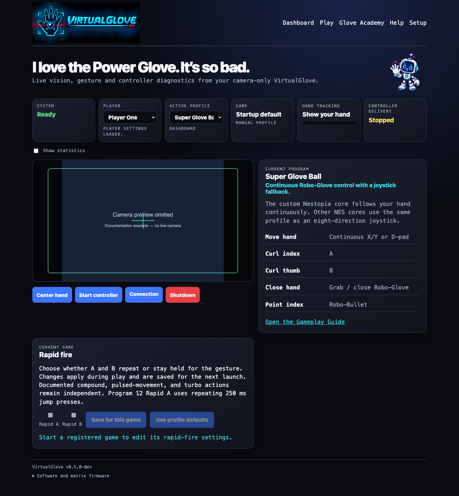

<p align="center">
  
</p>

# VirtualGlove

**Move your hand. Play the game.** VirtualGlove turns hand movement and gestures into RetroArch controls using an ordinary USB camera and a controller built on the Arduino UNO Q. Wear a plain glove or use your bare hand; no sensors or electronics need to be attached to it.

Move to steer. Curl fingers for buttons. Roll, push, pull, grab, throw, and punch. The camera picture stays on the controller, while authenticated input travels to your game console. Pixel Pal guides practice and setup.

## What you can do

- Play supported NES games with Programs 1–14 and A–I, including game-specific gesture mappings and rapid-fire exceptions.
- Use FCEUmm joystick mode, or the separate Nestopia (VirtualGlove) core for Super Glove Ball’s native movement and glove actions.
- Learn all 16 movement and gesture lessons with Pixel Pal in **Glove Academy** before sending input to a game.
- Save each player’s hand centre, movement reach, gesture sensitivity, camera choices, and Academy progress.
- Use **Play** for a camera-controlled Rock Paper Scissors practice game without a console session.
- Keep physical controls alongside hand input. During a routed launch, hand input waits until the hand has returned to neutral so a menu gesture does not become the first game action.



VirtualGlove `v0.6.0` is the current stable release. This README describes the current development checkout. The commands below install the **latest published stable release**, which may have an earlier setup or pairing interface. For a release candidate, use its exact versioned installer and the guide packaged with it; `releases/latest` does not select prereleases. The same installer command is used for a first install and an upgrade.

## What you need

- A provisioned Arduino UNO Q with Arduino App Lab, a UVC USB camera, and a powered USB hub.
- A supported game system: RetroPie, Recalbox 10.x, Batocera 38 or newer, or LaunchBox on 64-bit Windows with 64-bit RetroArch.
- A physical gamepad already configured on the game system, and your own legally obtained games. No ROMs or BIOS files are included.
- Both devices on the same trusted local network, with internet access during installation.

Start with [Build Your Own](docs/BUILD_YOUR_OWN.md) if you are choosing hardware.

## Install or upgrade

Close any game before installing. Keep the backup location printed by the installer until you have checked your setup afterward. The [Installation Guide](docs/INSTALL_README.md) covers each platform's questions, checks, and recovery steps.

### Controller

In a terminal on the controller, signed in as `arduino`:

```sh
cd /home/arduino
curl -fLO https://github.com/mathan416/VirtualGlove/releases/latest/download/install-uno-q.sh && bash install-uno-q.sh
```

The installer prints the controller's `.local` and IP addresses. The first shared Matrix build can take several minutes. For the current development version, Controller Router owns the entry page and display; the VirtualGlove site is on port **8100**.

### RetroPie

In its terminal as the normal RetroPie user, with EmulationStation and games closed:

```sh
cd "$HOME"
curl -fLO https://github.com/mathan416/VirtualGlove/releases/latest/download/install-retropie.sh && bash install-retropie.sh
```

### Recalbox 10.x

In its terminal as `root`:

```sh
cd /recalbox/share/system
curl -fLO https://github.com/mathan416/VirtualGlove/releases/latest/download/install-recalbox.sh && bash install-recalbox.sh
```

### Batocera 38 or newer

In its terminal as `root`:

```sh
cd /userdata/system
curl -fLO https://github.com/mathan416/VirtualGlove/releases/latest/download/install-batocera.sh && bash install-batocera.sh
```

### LaunchBox on Windows

Install 64-bit Python and 64-bit RetroArch with FCEUmm first. Download `VirtualGlove-LaunchBox.zip` from the latest release and follow the [Installation Guide's LaunchBox steps](docs/INSTALL_README.md). Its managed RetroPad runs beside physical XInput and the keyboard; the shared Linux Controller Router setup described below does not replace LaunchBox's input path.

## Connect and play

In the current development version, Controller Router comes with VirtualGlove. Open the controller address printed by the installer. With VirtualGlove alone it opens the app; with R.O.B. Vision too, **Apps** lets you choose. Both app services stay available. Starting a registered game selects its app automatically, even when no browser is open.

Pair the console once by choosing **Pair console** from Apps. The console installer opens a short connection window and prints a one-time code. Router's secure Setup page verifies the console and asks for a confirmation code shown on the Matrix display. It provisions separate private credentials for installed apps, so adding R.O.B. Vision later does not require a second pairing. See the [Controller Router Pairing Guide](controller_router_portal/python/guides/Controller-Router-Pairing-Guide.pdf). LaunchBox follows its platform-specific pairing instructions in the Installation Guide.

Use **Players and Systems** to put a physical pad on Player 1 and choose which Libretro systems use Router. New Router configurations enable NES; upgrades keep saved choices. **My existing setup** preserves a system's usual controls. Configure a physical pad's buttons in EmulationStation before assigning its player in Router. On RetroPie, VirtualGlove's separate gamepad path remains an option; Recalbox and Batocera use merged players for routed games.

In VirtualGlove **Setup**, centre your hand and check the camera. **Glove Academy** teaches the gestures without sending accidental game input. Registered games select their profile automatically. FCEUmm supplies joystick-mode NES controls; the separately named **Nestopia (VirtualGlove)** path gives Super Glove Ball its native movements and actions. A physical controller remains available for menus and exit controls. See [Game and Gesture Guide](docs/GAMEPLAY_GUIDE.md) and [Input Modes](docs/INPUT_MODES.md).

## Help and guides

| To do this | Read this |
| --- | --- |
| Install, pair, update, or recover | [Installation Guide](docs/INSTALL_README.md) |
| Learn gestures and game controls | [Game and Gesture Guide](docs/GAMEPLAY_GUIDE.md) |
| Choose players or keep a system's controls | [Controller Router Guide](docs/CONTROLLER_ROUTER.md) |
| Choose and tune a camera | [Camera Guide](docs/CAMERA_GUIDE.md) |
| Recognise Matrix display cues | [Matrix Display Guide](docs/MATRIX_GUIDE.md) |
| Fix a symptom | [Troubleshooting](docs/TROUBLESHOOTING.md) |
| Print a case | [Enclosure Guide](docs/ENCLOSURE_GUIDE.md) |
| Understand the design | [Architecture](docs/ARCHITECTURE.md) and [Engineering Journey](docs/ENGINEERING_JOURNEY.md) |

The controller serves user guides, technical references, and PDFs from **Help**. Printable editions are also in [output/pdf](output/pdf/). The [public website](website/UPLOAD_README.txt) is maintained in this repository.

## How it works


1. The camera delivers its newest frame to the controller.
2. Hand tracking recognises palm, wrist, and finger landmarks.
3. The selected profile turns movements and gestures into game controls.
4. The controller sends authenticated state to its paired game system.
5. The console publishes the appropriate RetroArch or native glove input.

Controller Router keeps physical player assignments stable for routed games and grants one app's input at a time. If a wireless pad sleeps and wakes, Router reconnects that source to its saved player. If Router itself restarts during a game, exit and relaunch after it is ready. See its [User Guide](controller_router_portal/python/guides/Controller-Router-User-Guide.pdf) and [Technical Reference](docs/ARCHITECTURE.md).

## Contribute and license

Issues, careful test reports, and contributions are welcome. Read the [Contributing Guide](docs/CONTRIBUTING.md), [Changelog](docs/CHANGELOG.md), and [Third-Party Notices](THIRD_PARTY_NOTICES.md). VirtualGlove is maintained by **Iain Bennett** under the [MIT License](LICENSE); the modified Nestopia core is separate GPLv2 software. Nintendo, NES, Power Glove, and named games belong to their respective owners.
