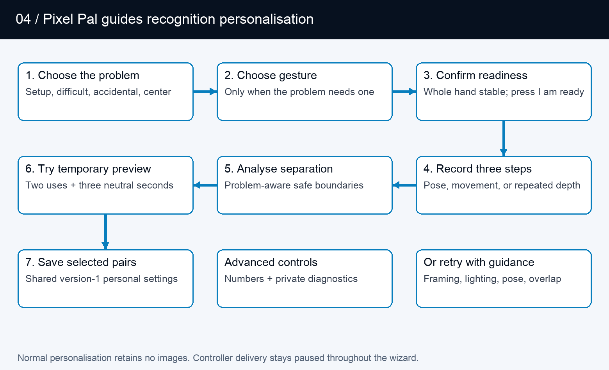

# VirtualGlove architecture

A camera-to-controller system for the **VirtualGlove Controller (Arduino
UNO Q)** and RetroPie.

This guide describes the current implementation reviewed on September 10, 2026.
It is a map of production responsibilities, data flows, interfaces, and failure
behavior—not a chronology of experiments. The decisions and discarded paths
that led here are recorded in the [Engineering Journey](ENGINEERING_JOURNEY.md).
Supported replay, tracing, and measurement commands are documented separately
in the [Engineering Toolkit](ENGINEERING_TOOLKIT.md); release and deployment
maintenance remains in the complete Git checkout.

## Read this first

VirtualGlove observes a hand on the VirtualGlove Controller, turns its measurements into
controller states, and sends those states to a virtual gamepad on RetroPie.
The browser configures and explains that process; it is not required in the
per-frame gameplay path. The VirtualGlove Controller microcontroller drives the status matrix;
Linux performs hand tracking and gesture recognition.

There are four independent questions: which game profile is selected, whether
the camera is running, whether the player has armed controller delivery, and whether
a valid registered-game or manual context currently permits packets. Glove Academy can
open the camera while the selected profile is **Gestures off**. Glove Academy and Tune
both pause game input. A healthy web page does not by itself establish that the
camera, receiver, or game is working.

| Read about | Section |
| --- | --- |
| Machines and processes | [System boundaries](#system-boundaries) |
| A movement reaching a game | [Camera-to-controller flow](#camera-to-controller-flow) |
| Camera tests in the full path | [Measurement boundaries](#measurement-boundaries) |
| Boot, Glove Academy, and Tune | [Runtime modes](#runtime-modes) |
| Personal sensitivity | [Recognition and tuning](#recognition-and-tuning) |
| Game launches and settings | [Profile and configuration flows](#profile-and-configuration-flows) |
| Network and failure handling | [Interfaces and recovery](#interfaces-and-recovery) |
| Firmware and application updates | [Build and deployment](#build-and-deployment) |
| Where to change the code | [Implementation map](#implementation-map) |

## System boundaries

| Boundary | Responsibilities | Does not own |
| --- | --- | --- |
| Browser | Dashboard, Play, Glove Academy, Tune, Setup, Games, Help; live feedback and user commands | Authoritative per-frame recognition or gamepad output |
| VirtualGlove Controller Linux application | Web server, vision-worker supervision, camera tracking, calibration, thresholds, profile mapping, network sender | RetroArch button consumption |
| VirtualGlove Controller microcontroller | Arduino sketch, Router Bridge commands, LED matrix animations and pairing display | Camera inference or personal thresholds |
| RetroPie services | Receive controller packets, expose a virtual gamepad, signal game launches, serve paired game-registry edits | Camera processing |
| RetroArch and game | Consume virtual-gamepad input using emulator and game mappings | Glove Academy/Tune feedback |

App Lab starts `python/main.py` in the main application container. This
supervisor runs the website and starts an isolated Python 3.12 vision worker
with the sole packaged MediaPipe 0.10.35 ARM64 wheel. There is no installed
0.10.18 fallback or runtime selector. It polls worker status, updates the matrix,
and retries a worker that stops. The worker's internal HTTP interface is on
loopback port 8089; the public website is on 8088, with secure Setup on 8443.

The supervisor passes the private `data/device.json` path to the worker using
`--device-config`; the token itself is absent from process arguments. Device
configuration mutations are serialized and atomically replace private files.
Setup content and browser actions live in `setup_web.py`, separate from HTTP routes.
Start/Stop intent has a single pending slot and serialized delivery attempts;
the supervisor retries transient failures until the worker handler acknowledges
acceptance. A newer explicit request supersedes pending intent. This mechanism
does not buffer camera frames or controller state, and acknowledgement does not
prove emulator consumption. Receiver socket timeout and last-valid-packet
expiry both publish neutral native state and release the virtual gamepad.

Two app-owned support containers provide the profile-control UDP relay and
local-hostname resolution. The profile relay publishes port 55356 and forwards
packets to the main service without interpreting or authenticating them.
The resolver connects application requests to host Avahi through private Unix
sockets. These functions are kept separate from camera inference.

## Camera-to-controller flow

1. The camera layer opens a UVC capture source. The compatible path uses OpenCV.
   An opt-in direct V4L2 reader can instead dequeue the newest 640×480 MJPEG
   driver buffer and its timestamp, with automatic OpenCV fallback. A dedicated
   capture thread publishes only the newest frame; older unprocessed frames are
   superseded rather than queued.
2. MediaPipe Hands 0.10.35 runs its complete graph with four XNNPACK CPU
   threads. The graph first uses its palm detector, then the landmark model
   produces 21 hand points and normally continues from the prior hand region.
   The production landmark-tracking gate is 0.35 and the palm-detection gate is
   0.45. Palm detection runs again when landmark tracking cannot continue. The
   tracker validates finite, non-collapsed palm geometry and produces a
   `HandObservation` using the selected frame's capture timestamp. MediaPipe's
   score is labelled as handedness certainty rather than position confidence.

3. The gesture engine compares that observation with the saved neutral calibration and effective thresholds. Directions are relative to the calibrated palm; apparent hand-size change supplies forward/backward movement.

4. Shared activation/release states and held menu poses feed the selected
   Programs 1–14, Programs A–I, or game-specific profile mapping. Numeric
   mappings can replace positional movement with depth, wrist, finger-tread,
   compound, or intentionally neutral output. Per-game rapid
   A/B exceptions arrive with the authenticated game lease. The result is a
   `ControllerState`, including buttons, D-pad, axes, finger values, events,
   sequence, and tracking/calibration metadata.

   Program 2 also derives transient centering feedback, Program 13 leaves the
   camera D-pad neutral for the merged physical controller, and Program 14
   closes vision and neutralizes all VirtualGlove output. These are mapping and
   lifecycle decisions; none rewrites player calibration or recognition tuning.
   The [Gameplay Guide](GAMEPLAY_GUIDE.md#program-cards-1-14) documents every
   numeric Program's gesture priority, compound-action release rule, and indexed
   game assignment.

5. The worker sends the state only if controller delivery is armed, a live
   registered-game lease or intentional manual Dashboard context exists, and neither
   practice nor tuning is active.

6. The sender establishes a receiver-issued challenge, then sends bounded HMAC-SHA256 controller datagrams over UDP 55355. Packets contain session and sequence identifiers, never the shared token.

7. The receiver checks the message HMAC, live challenge, peer, and increasing
   sequence. For Super Glove Ball it publishes native state before updating the
   unrelated virtual gamepad; other profiles preserve virtual-gamepad behavior.
   It creates the real virtual controller when the first accepted packet arrives.

8. Linux `uinput` exposes the virtual gamepad to RetroArch, which applies its configured input mapping before the game consumes it.

One-second maintenance challenges provide receiver liveness. After three seconds
without an authenticated reply—or immediately when the saved hostname has no
usable address—the sender broadcasts only a signed hello to fresh physical-link
broadcast addresses supplied by the host sampler. A valid challenge identifies
the paired receiver's current IP; controller state remains unicast and
newest-sample-only.

### Connection cadence, safety, and load

The recurring network work is intentionally split between the time-critical
controller path and slower recovery or status paths. None of the background
checks waits inside MediaPipe inference. An established sender publishes the
newest controller state before it performs handshake maintenance.

| Activity | Normal cadence | Failure or recovery boundary | Gameplay effect and representative load |
| --- | --- | --- | --- |
| Controller state, Controller to RetroPie UDP 55355 | Every fresh inference result, normally 15-30 Hz | RetroPie neutralizes gamepad and native state after 250 ms without a valid packet | Time-critical path. A representative signed state is about 610 bytes, or about 18 KiB/s at 30 Hz. The timeout adds no normal-play delay. |
| Signed controller handshake, UDP 55355 | Every 250 ms until challenged; every 1 second after establishment | Three seconds without an authenticated reply starts paired-console discovery; discovery repeats every 2 seconds until a valid challenge arrives | Runs after the current state when established. A representative signed hello is about 212 bytes; no controller state is broadcast or replayed. |
| Registered-game profile renewal, RetroPie to Controller UDP 55356 | Every 2 seconds while RetroArch and the session marker remain active | Each renewal carries a 6-second lease. A request may try up to three 0.4-second acknowledgement waits, outside game launch. If the saved destination fails, a signed discovery request finds and briefly caches the paired Controller's current address. | Keeps the correct ROM/core mapping active and lets the Controller recover after a restart or DHCP change. A representative renewal is about 365 bytes every 2 seconds. |
| Setup console check, Controller to RetroPie TCP 55358 | Visible Setup polls every 5 seconds; the Controller starts at most one real probe every 10 seconds | A result becomes stale after 30 seconds; destination or key changes invalidate it immediately | Status only. It does not confirm that an emulator consumed input and does not run in the inference path. |
| Physical-link sampler, Controller host | Every 5 seconds | Its small record expires after 15 seconds | Supplies Wi-Fi/Ethernet status and safe directed-broadcast addresses. It does not scan networks, send controller data, or affect inference. |

These defaults make normal traffic small: controller states account for almost
all of it, at roughly 18 KiB/s at 30 Hz, while handshake and profile maintenance
add well under 1 KiB/s in steady play. A state packet is never held for a
heartbeat. The 250 ms receiver timeout is a stale-input safety limit, the
one-second handshake is receiver-restart detection, and the two-second profile
renewal is game-context ownership; they solve different problems and should not
be added together as movement latency.

With an unchanged address, a restarted receiver normally re-establishes its
challenge on the next one-second maintenance exchange. With a DHCP address
change or failed `.local` resolution, authenticated discovery begins after about
three seconds; a lost discovery exchange can add the two-second retry interval.
The next registered-game renewal can restore game context within two seconds,
followed by the existing one-second initialization guard. These are recovery
windows after a failure, not steady-state input delay.

Native Super Glove Ball performs MediaPipe landmark recognition synchronously.
The Dashboard retains the normal hand skeleton and landmark annotation. Each
fresh, geometry-valid palm observation is clamped to player reach and passed
directly through **Latest coordinate** during continuous tracking. The live path
does not queue, predict, extrapolate, or filter inside the emulator core. The
former optical-flow experiment is retained only in Git history
and the former bounded speed curve remains in historical test tooling; neither
is routed by the supervisor nor exposed as a live configuration.

Native coordinates use each player's calibrated center and optional asymmetric
comfortable-reach spans. A missed observation shorter than
`native_xy_loss_hold_ms` (180 ms by default) holds only the last X/Y position;
buttons, fingers, depth, roll, and digital directions release on the first
missed native observation without inheriting the X/Y hold.

Final sustained attribution measured ordinary landmark continuation near 37 ms
median and palm detection/reacquisition near 105 ms median. Two-buffer direct
V4L2 diagnostics sustained approximately 30 camera dequeues per second, with
MJPEG decode near 5.4 ms median and post-graph work near 2.9 ms median. Inference
run-queue wait was negligible. These figures establish the palm detector as the
remaining CPU latency tail; they do not justify another smoothing layer, frame
queue, or speculative parallel tracker. OpenCV with thread isolation remains
the live-tested production reader, and its saved one-buffer request remains
independent of the direct-reader diagnostic.
After that brief gap, Latest immediately accepts a strongly aligned forward
measurement. One contradictory or unusually distant non-forward result instead
holds the last reliable point until the next fresh measurement confirms the
location. The guard never invents a forward coordinate or smooths normal motion.
Longer tracking loss or stale input neutralizes the native sample and clears the
coordinate history. Digital FCEUmm directions instead classify every fresh hand
position in a 3×3 grid anchored to the saved calibrated neutral palm position. The center square releases
all positional directions, its four side regions produce cardinals, and its four
corner regions produce diagonals. Setup's **Joystick dead zone** saves the square's
chosen full-frame width and height per player. Its effective size is at least
1.5 times the saved calibrated palm size. The full square translates inward at
camera edges rather than clipping; live hand size and neutral jitter do not change it.
It does not alter native reach, finger gestures, or game mappings. Re-centering clears
saved reach spans because they belong to the old center.

The worker sends authenticated controller state immediately after recognition.
Its tuning configuration and pause gates are captured before inference, so no
tuning or Dashboard lock sits between completed inference and UDP transmission.
For established sessions, the gameplay state precedes periodic handshake
maintenance; reply decoding is bounded per frame. UI-visible control transitions
are then submitted immediately to a separate latest-only publisher. When the
browser's **Show statistics** preference is enabled, routine derived gesture and
controller detail refreshes at about 10 Hz and rolling percentile summaries at
2 Hz; hidden statistics do not incur that work. Browser video is
submitted at most five times per second and only while a stream consumer is
connected. MediaPipe always uses the same fused frame preparation whether the
preview is open or closed. A separate single-slot worker mirrors the display
copy, draws normalized landmarks, downsizes
the gameplay preview to 320×240, performs JPEG encoding, and discards a
superseded preview instead of delaying gameplay. Detailed joint and landmark
diagnostics follow that preview cadence; finger geometry itself is calculated
once for recognition. Controller sending occurs before optional preview work,
so the browser refresh rate is not the controller state update rate. Optional
Dashboard statistics are off by default and browser-local; when disabled, the
page does not read, render, retain, or request detailed controller and event
fields. Capture
age, inference cadence, skipped frames, preview cost, and send time expose the
local stages; none alone is an end-to-end camera-to-game latency measurement.

The shipped graph runs on the UNO Q CPU. OpenGL/OpenCL, MediaPipe Tasks GPU,
MNN/Vulkan, and ncnn comparisons did not beat this complete CPU graph while
preserving recognition behavior, so they remain engineering research rather
than selectable gameplay runtimes. The model graph is the connected palm-
detection and landmark-computation pipeline; it is broader than either neural
network alone. Research details and promotion gates are consolidated in
[Engineering Journey](ENGINEERING_JOURNEY.md).

Optional manual exposure and gain are applied through the Direct V4L2 stream's
existing file descriptor after the camera advertises compatible controls. This
avoids a second camera opener racing the capture worker. Requested and read-back
values, supported ranges, fallback, and error state are published separately.
Closing the stream restores automatic exposure; the saved preference remains
available for the next vision session.

### Shared front end and emulator paths

The camera, newest-frame capture, MediaPipe model, calibration, and gesture
recognition are shared. The split occurs on RetroPie after an authenticated
packet is accepted. FCEUmm receives ordinary directions and buttons through the
Linux virtual gamepad. Super Glove Ball's custom Nestopia core instead reads the
newest 64-byte native state and assembles the ten-byte Power Glove packet used
by the ROM. Both finish in the emulator, game logic, RetroArch video path, and
physical display. Dashboard preview and optional statistics branch from the
Controller worker and never sit between recognition and delivery.

### Measurement boundaries

The camera experiments measure only the beginning of this chain. A valid V4L2
driver timestamp can describe driver-to-userspace dequeue time, while an OpenCV
read-completion timestamp begins later and cannot reveal exposure or upstream
camera buffering. Capture age and inference time describe the Controller;
receiver publication and core consumption use the RetroPie's clock. Only one
high-frame-rate recording containing both the real hand and the game display
measures the complete visible response without synchronizing those computers.

The tests deliberately retain these boundaries. A faster camera dequeue does
not prove faster recognition, a successful UDP send does not prove receiver or
game consumption, and a headless ROM response excludes RetroArch presentation
and display delay. The benchmark guide records which part of this diagram each
experiment actually covered.

The read-only `scripts/measure-vision-status.py` collector deduplicates observed
inference timestamps and capture sequences. Public status is cached by the
supervisor, so even frequent polling observes only a subset of results. The
collector separates changing profiles, preview state, and delivery conditions;
it does not average overlapping rolling percentiles. Camera exposure, network
reception, receiver processing, native core pickup, and physical display delay
require separate evidence. See the [live baseline procedure](direction-response-benchmark.md#collect-a-live-status-baseline).

The current transport is ordinary gamepad emulation. Bad Street Brawler maps
Glove Zap to a 180 ms simultaneous Left + Right pulse on each push activation;
its FCEUmm game-specific options allow that combination. The receiver already
transports both directions. This action does not require native glove packets. Preserved finger and
analogue values do not establish native original-Power-Glove support in the
emulator. That remains a separate integration concern.

## Runtime modes

The worker keeps a lightweight control loop alive while vision is idle.
Libraries can preload in the background without opening the camera. Selecting
an active profile or opening Glove Academy requests camera/tracker initialization.
Slow opens, reads, and cleanup run asynchronously so control requests remain
responsive. The website reports startup and recovery rather than treating an
empty first frame as completed initialization.

| Mode | Vision profile and camera | Controller delivery | Matrix |
| --- | --- | --- | --- |
| Gestures off | Camera closed; selected profile off | No gameplay states | VirtualGlove attract animation |
| Program 14 - physical controller only | Camera closed; selected profile remains Program 14 | No VirtualGlove gameplay states; merged physical Player 1 joypad remains available | Steady **14** profile display |
| Active profile | Selected game profile; camera requested | Only when armed and a game/manual context is active | Ready/tracking status and profile display |
| Glove Academy learning | General practice profile; camera requested | Paused | Scanning L |
| Tune gestures | Practice with selected tuning scope and preview | Paused, including after a game-launch request | Scanning T |

Glove Academy preserves the selected game profile while using a mapping-independent
practice profile for its sixteen lessons, including **Glove Zap**, **Pull Back**,
both wrist rolls, close hand, and menu guard. Progress is saved for each player;
completing all sixteen lessons earns the Glove Master award.
Browser leases support multiple Glove Academy tabs; the last lease ending restores the
selected vision mode. Leases expire after six seconds without refresh. Dashboard
also clears abandoned practice sessions. Glove Academy learning restores its prior
controller intent; Tune requires an explicit start from Dashboard when finished.

The browser downloads a backup for only the selected player, usually to its
Downloads folder. Restore reads that chosen file and updates the selected
player after review. The Controller keeps all players in one
`data/gesture-tuning.json` store; portable downloads are separate copies and
exclude lesson progress. See [backup locations](CONFIGURATION_REFERENCE.md#where-player-settings-and-backup-files-live).

Tune has a single owning session. Exiting or losing that session discards its
recordings and preview, but saved values remain. A game launch can change the
selected profile during Tune without allowing game input to escape the delivery
gate. Profile/mode transitions release old controls and refresh sender sessions
where required so old state does not carry into a new mapping.

The L and T render through the same sketch function: a dim letter, bright scan
line, and trailing glow. Eight frames advance every 160 milliseconds. The sketch
also handles other status, profile, and pairing indications; matrix activity is
feedback about state, not evidence of successful game delivery.

## Recognition and tuning

Finger curls use the strongest measured joint bend. The four fingers include
the base knuckle; the thumb uses its two outer joints. The tracker prefers
MediaPipe world landmarks, with an image-coordinate fallback. Recognition is
threshold-based; personal setup does not retrain the MediaPipe model.

A held action has two cutoffs. Crossing **Activation** starts it; returning below
the lower **Release** value stops it. This avoids flicker near one cutoff.
Finger controls, direction/roll states, Glove Zap, Pull Back, and movement-based
mappings use these states. Profile-specific pulses and toggles still determine
what the game receives. An indicator remaining active is therefore not a promise
of a continuously held game button.

V-sign and thumbs-up also require the correct extended/curled fingers and the
deliberate debounce (0.50 seconds for Start and 0.15 seconds for Select), then issue a short menu
pulse. Live pose feedback uses the same finger checks. Personal pairs supply the
closed-finger activation and extended-finger release boundaries; untouched
fingers use the existing menu defaults. A confirmed lesson can remain complete
after its brief controller pulse has ended.

Directions, curls, rolls, and Closed Hand are evaluated from every fresh
inference result without an additional confirmation timer. Depth actions are
motion-confirmed: Glove Zap and Pull Back need two consecutive beyond-threshold
observations and at least 0.10 normalized palm-scale movement in the correct
direction within 250 ms. Reversal, calibration, profile transition, or tracking
loss discards an unfinished candidate. Confirmed actions retain their existing
hysteresis and profile-specific output semantics.

| Tuning scope | First recording | Middle recording | Final recording |
| --- | --- | --- | --- |
| Set up a new hand | Comfortable open hand | Gentle fist, thumb curled outside fingers | Comfortable open hand |
| Finger/menu pose | Comfortable open hand | Selected gesture held steadily | Comfortable open hand |
| Glove Zap | Open hand at starting distance | Three pushes and returns | Return to starting distance |
| Pull Back | Open hand at starting distance | Three pull-backs and returns | Return to starting distance |
| Direction or wrist roll | Starting position and wrist angle | Selected movement held steadily | Return to starting position and angle |

Pose, direction, and roll recordings last two seconds; the repeated depth-motion
step lasts six. Recording is enabled after a calibrated, geometry-valid hand
has remained completely inside the image for one second. A user-controlled
two-second countdown precedes every sample.

Each step needs at least twelve accepted samples. The manager accepts calibrated,
geometry-valid detected hands, rejects repeated frames and
non-finite measurements, and caps samples per recording. Tracking gaps contribute
no samples; too few samples require a retry. Neutral calibration changes invalidate
recordings and previews.

For each adjusted component, analysis compares the 95th percentile of both
open/rest phases with the performed phase. It requires a gap of at least 0.08.
Standard setup places activation/release at 65%/30% of the gap; difficult and
accidental paths use 55%/30% and 75%/40%. Repeated depth motion uses its upper
quartile so returns to neutral are not misread as failed movement.

Hand setup observes both states for all five fingers. Individual gesture tuning
can run without it. Fingers extended throughout retain their existing settings;
extended-only samples cannot establish a curled boundary. Automatic suggestions
now check all required fingers against the candidate configuration using the
same pose checks as recognition. At least 90% of accepted samples must match the
complete pose simultaneously. The opening and release phases must also show all
selected fingers extended in at least 90% of samples. A failure names the finger
and phase; no suggestion is retained. Strong curls cannot compensate for fingers
that should be extended. Thumbs-up checks a straight thumb and four curled
fingers; it does not impose an upward screen direction. Manual threshold edits
validate range and scope, not recorded pose quality. Live testing is still needed.

The candidate is temporary until the same recognition path observes two complete
activation/release cycles and three neutral seconds. Only then can the wizard
atomically merge selected pairs into the active player’s version-6 record. Positional
movement is not a gesture-tuning channel: one per-player center-box scalar drives a
stateless 3×3 classification, and calibration jitter may enlarge its effective size.
Raw gesture controls remain
inside Advanced. Normal personalization retains no camera recording. The separate
diagnostic path deletes its temporary AVI after producing an aggregate-only report.

## Profile and configuration flows

Effective settings are resolved component by component: shipped shared recognition defaults,
then the active player’s saved overrides, then temporary Tune preview. The gesture engine
receives the resulting configuration during frame processing, so saved values
also apply when controlling a game. Adjusting a finger changes other gestures
that use that finger; it does not change the button assignments in a game profile.

| Data | Owner and lifetime | Purpose |
| --- | --- | --- |
| `config/profiles.json` | Shipped project source | One shared set of recognition parameters; profiles remain output mappings |
| `data/gesture-tuning.json` | VirtualGlove Controller, persistent | Version-4 player presets, per-player calibration, sensitivity, Academy progress, and required-center flag; versions 1–3 migrate with a backup |
| `data/calibration.json` | VirtualGlove Controller, private persistent | Neutral palm position, apparent scale, wrist angle, and positional jitter for the installed camera and player |
| `data/device.json` | VirtualGlove Controller, private persistent settings | Destination, selected settings, pairing-related configuration |
| Tuning samples, preview, leases | Worker memory only | Temporary measurement and ownership state |
| `config/games.json` | Shipped default registry | Exact ROM-name mappings copied to the RetroPie installation |
| RetroPie registry and launcher settings | RetroPie, persistent | Active game-to-profile mappings and UNO destination |
| `data/models/hand_landmarker.task` | VirtualGlove Controller, verified cache | Reusable pretrained hand-landmark model |

Neutral calibration is distinct from hand setup. It accepts 24 detected hand
observations with finite, non-collapsed landmark geometry, centers position, depth, and roll,
records 95th-percentile X/Y jitter, and lets movement thresholds rise only
when needed to remain safely above that noise; hand setup establishes finger thresholds. The app reuses valid neutral
calibration across Glove Academy, profile changes, camera reconnects, and worker restarts.
Recalibrate after moving the camera or changing playing position. Ordinary
updates preserve `data/` rather than replacing it with example configuration.
The portable release baseline is `config/profiles.json`; raw neutral coordinates
are deliberately machine- and player-local.

At game launch, the RetroPie hook looks up the exact ROM basename. For a registered
game it records a user-owned session marker, starts a detached monitor, and waits for
RetroArch to exist before sending input context. The monitor sends a signed profile
renewal every two seconds to UNO UDP 55356 while both RetroArch and the marker remain
active. It inspects the running RetroArch command line and includes the recognized
libretro core in each renewal rather than trusting only the runcommand argument. Each
renewal carries a bounded six-second lease. The app-owned relay forwards
the bytes to the worker; the worker authenticates them and treats repeated renewals
as lease refreshes rather than profile transitions. The acknowledgement travels back
through the relay. The relay has no shared token and cannot declare a profile applied.

If RetroPie's saved Controller address is stale or cannot be resolved, the profile
sender broadcasts a signed, ROM-free discovery request to the physical IPv4 LANs.
The Controller returns a signed, request-matched discovery acknowledgement. RetroPie
then sends the actual profile renewal by unicast and caches that authenticated address
for 30 seconds. The cache is bounded and process-local; it neither changes
`launcher.json` nor replaces pairing. A wrong key, malformed reply, or unrelated
Controller cannot claim the session. This is the reverse-direction counterpart to
the Controller's authenticated discovery of RetroPie on UDP 55355.

The first live renewal changes profile once and starts a one-second initialization
guard. A VirtualGlove Controller application restart can therefore rediscover an already-running
registered game from the next renewal without exposing the runcommand menu to hand
input. Game-end hooks, RetroArch termination, marker replacement, unknown games, and
lease expiry request or produce neutral/off state. The player's armed/stopped choice
is stored separately: Stop remains sticky, while armed alone never authorizes output.
Manual Dashboard profile selection provides an explicit testing context without
pretending that a registered game is running. Unsupported or unregistered games do
not gain a mapping merely because their filenames resemble a registered title.

The worker selects native input only for the exact combination of the
`super_glove_ball` profile and the reported `lr-nestopia-powerglove` core. The
same ROM in FCEUmm, another core, or an unknown core uses joystick output. A
reported core change is a profile transition even when the ROM profile is
unchanged, so all retained recognition and controller state is cleared before
the new output path becomes active. Worker status reports both `emulator` and
the derived `input_mode`.

Setup's Games editor uses a separate path: browser to UNO web API, then the paired
UNO proxy to the RetroPie Games service on TCP 55358. Challenge/HMAC exchanges
protect registry operations; revision checks prevent stale edits and atomic
replacement preserves a previous valid copy. Saving a registry mapping affects
the next launch; it does not rewrite the running game's mapping immediately.

### Optional native Super Glove Ball path

The supported FCEUmm path consumes the same virtual gamepad as every other game.
For native Super Glove Ball input, the authenticated RetroPie receiver also publishes a
versioned, fixed-size latest-sample record in `/run/virtualglove/native-state`.
The separately built `lr-nestopia-powerglove` core maps that file read-only,
copies at most one coherent current sample per emulated frame, and adds no queue
or smoothing. Invalid, stale, uncalibrated, lost, or wrong-profile samples leave
the emulated glove neutral.

Exact-ROM traces now confirm the ten-byte packet boundary, MSB-first reads,
native Start, continuous X/Y, signed Z, and open/fist/index packet response. Live
full-game play confirms the resulting grab/throw, index-fire, and
fist-plus-forward Power Punch actions. A matched same-ROM test confirms
that FCEUmm requests only ordinary joypad input while both cores visibly respond
to all four directions by frame 3. Stale, uncalibrated, lost, and
wrong-profile samples produce a neutral packet. The shared layer publishes its
five-finger closed-hand and index-point decisions explicitly so the core does
not reconstruct compound poses from partial finger data. All confirmed Super
Glove Ball actions are mapped. The raw roll byte and unobserved button codes
remain neutral because the exact ROM has shown no separate action for them;
guessing values could create unintended input. Stock Nestopia remains untouched; the custom core
is enabled only through a Super Glove Ball per-ROM emulator choice after it is
built locally from pinned GPLv2 source and verified on the cabinet. The ordinary
release carries the patch and build recipe, not a compiled core. See the
[native compatibility record](super-glove-ball-native.md).

The optional project-owned `lr-powerglove-dot` core reads the same guarded
native-state record but does not emulate a Power Glove packet or load a ROM. A
fixed Ports launcher holds a renewable `super_glove_ball`/`lr-powerglove-dot`
profile lease while the calibration display is open. The Controller therefore
uses the production native X/Y path while the display isolates center, reach,
edge clamping, tracking loss, and recovery from game logic.

## Interfaces and recovery

Setup's four status markers share the matrix's cached app, console-service,
authenticated-response, and independent Networking checks. The read-only
`/api/connection-status` endpoint requests bounded background refreshes; no
network probe runs on the capture or controller-send path. Unknown or expired
results are shown in grey. Reachability and authentication do not establish
emulator consumption. See [Setup status](CONFIGURATION_REFERENCE.md#independent-networking-status).

Player operations pass through the bounded same-origin `/api/players` endpoint
into the worker. Its tuning lock owns one atomic player/settings/progress file.
Generations reject stale writes. Each player retains a saved calibration;
selection automatically applies the selected player’s saved center through the durable restore path, with output paused; players without a saved center require centering. Version-4
portable backups include the center-box size, personal and effective gesture sensitivity,
source software identity, name, and the player's neutral reference. They exclude credentials and
Academy progress. Older portable formats are rejected without mutation. A
version-6 player store journals confirmed calibration
reuse; the worker writes `calibration.json` before clearing the pending reference
and centering gate. Output remains paused until Start controller. The journal
resumes after crashes. Older internal stores are reported as unsupported and are
not overwritten. Progress writes occur on lesson transitions, not frames.

Hostname resolution for controller sends runs in one background thread with a
single cached address. No controller states are retained by that thread. Missing
or expired addresses cause the current send to be skipped; later calls use their
own newest state. Host physical Wi-Fi/Ethernet link health is sampled independently by an unprivileged
systemd timer, which publishes a small expiring JSON record for the supervisor
and fourth Off-mode matrix pixel. Console reachability remains a separate probe.

Build metadata records the source commit and candidate. A generated sketch
fingerprint is compiled into firmware and read through Router Bridge in the
supervisor, independently of the expected packaged value. Missing readback stays
unavailable; this introduces no firmware RPC in the vision worker's frame path.

| Interface | Direction | Contract |
| --- | --- | --- |
| HTTP 8088 | Browser to VirtualGlove Controller | Pages, live status/video, ordinary settings and commands |
| HTTPS 8443 | Browser to VirtualGlove Controller | Secure Setup and pairing workflow |
| HTTP 8089, loopback | Supervisor/web proxy to worker | Internal status, frame and control requests |
| UDP 55355 | VirtualGlove Controller to RetroPie | Signed controller states, session, challenge, and sequence; handshake replies return to the sender socket |
| UDP 55356 | RetroPie to UNO relay to worker | Signed profile requests and acknowledgements |
| `/run/virtualglove/native-state` | Authenticated RetroPie receiver to native cores | Read-only, guarded latest sample for Super Glove Ball or the calibration display |
| TCP 55357 | Pairing participants | Temporary one-time-code pairing service |
| TCP 55358 | VirtualGlove Controller to RetroPie | Paired game-registry service |
| Private Unix sockets | App resolver to host Avahi | Local hostname resolution |
| Router Bridge RPC | Linux supervisor to microcontroller | Matrix status/profile/pairing commands |

The LAN remains a trust boundary. Controller version 2 uses its own domain-separated HMAC-SHA256 and receiver-issued challenges. It does not encrypt input. Version 1 is neither accepted nor emitted. Do not describe all links as equivalent secure channels. Pairing and registry exchange have their
own protections; browser mutations use the existing request-header and Origin
checks. See the [Security policy](SECURITY.md) for the full trust model.

| Failure or transition | Implemented response | Interpretation |
| --- | --- | --- |
| Hand tracking lost | Engine clears held states after its loss delay | Stops stale recognized actions; camera recovery is separate |
| Controller packets stop | Receiver releases controls on socket timeout, default 250 ms | A receive timeout, not a measured end-to-end acknowledgement |
| Hostname or UDP send failure | Sender reports error and throttles retries | Vision and local practice can continue |
| Camera open/read failure | Worker reports starting/error and retries asynchronously; a sustained failure requests one classified recovery even when USB enumeration remains present. A capability-confirmed hub cycles only the enrolled camera port. Whole-hub fallback is refused when that hub carries networking. | The USB action and camera recovery are separate states. Recovery is confirmed only after the restarted worker receives a frame; `lsusb` alone does not prove the stream is usable. |
| Worker exits | Supervisor reports failure and retries | Temporary in-memory Tune state is lost |
| Tune browser disappears | Six-second lease expires | Preview and recordings discarded; saved pairs retained |
| Calibration changes | Current Tune recordings/preview invalidated | Record new measurements against the new reference |
| Shutdown requested | Web action writes fixed request; host systemd helper requests halt | The tested VirtualGlove Controller can restart; not proof that power is safe to remove |

A successful UDP send means the local networking call succeeded. It does not
prove the receiver applied a state or the game accepted it. Diagnose in stages:
hand detected, measured values, recognized/held action, delivery gate, sender
error, receiver/gamepad state, then emulator/game mapping.

Setup reports the configured console name separately from the active authenticated
input address. Its downloadable version-1 `virtualglove-system-report` is deliberately
allowlisted rather than a dump of internal state. It includes software/firmware
identity, camera reader and rate, controller/profile state, and connection-check
results. It excludes frames, pairing keys, player/calibration data, ROM names, and
network addresses.

## Build and deployment

The versioned `install-uno-q.sh` and `install-retropie.sh` entry points download
matching packages and call the shared host installer. The UNO route uses App
Lab CLI to build/upload the sketch and start the app; it installs both startup
and fixed-purpose shutdown/camera-recovery helpers. The RetroPie route installs the receiver and launch
integration, then checks emulator and registered-game configuration.

There are two deployable parts. Python, website, documentation, assets, and
service support run on Linux. The **Arduino sketch** is the microcontroller source
code; its compiled and installed version is the **matrix firmware**. That firmware
drives the LED matrix and handles Router Bridge commands.
The Wi-Fi deployment script synchronizes Linux application files and recreates
containers; it does not upload matrix firmware. A documentation-only sync can serve new
Markdown and PDFs without restarting the application, provided Python route
registration has not changed.

The Arduino sketch currently depends on the Arduino Zephyr platform **1.0.0**
for `arduino:zephyr:unoq`. Zephyr is the current platform dependency, rather than
the name of the VirtualGlove component. The build configuration also pins:

- Arduino_RouterBridge **0.4.3**
- Arduino_RPClite **0.3.0**
- ArxContainer **0.7.0**
- ArxTypeTraits **0.3.2**
- DebugLog **0.8.4**
- MsgPack **0.4.2**

The verified platform supplies Arduino_LED_Matrix **0.1.3**. Retain the complete project
`sketch/sketch.yaml` when synchronizing with App Lab.

Installing that platform makes build tools available. Compile-only validation
builds against it but does not flash hardware. App Lab **Run**, or its supported
app-restart command, compiles the Arduino sketch and uploads the matrix firmware. Back up the installed source
and firmware cache, verify compilation, upload, then check application health,
bridge response, physical matrix appearance, and actual controls. Keep private
settings intact. Detailed commands are in the [Installation Guide](CONFIGURATION_REFERENCE.md#build-and-install-matrix-firmware).

Documentation has an editable Markdown source, generated diagrams, built-in Help
rendering, and a PDF edition. `scripts/build-architecture-diagrams.py` regenerates
these nine figures. `scripts/build-docs-pdf.py` generates the PDF set. The Help
and package allowlists explicitly include this architecture guide. The local
quick reference remains excluded from public deployment.

## Implementation map

Paths below are relative to the project root. This map identifies responsibility;
it does not claim every path has been independently security-audited.

| Responsibility | Start reading here |
| --- | --- |
| Supervisor, worker launch, matrix ownership | `python/main.py` |
| Camera lifecycle and frame-to-send loop | `src/powerglove_vision/vision_app.py`, `realtime.py` |
| Capture selection, Kiyo controls, and landmark measurements | `src/powerglove_vision/camera.py`, `kiyo_camera.py`, `tracker.py` |
| Current native X/Y implementation and diagnostics | `gesture.py`, `realtime.py` |
| Observation/state data objects | `src/powerglove_vision/model.py` |
| Calibration, thresholds, held gestures, mappings | `src/powerglove_vision/gesture.py` |
| Recording, suggestions, previews, persistence | `src/powerglove_vision/tuning.py` |
| Public HTTP routing and worker proxy | `src/powerglove_vision/control_server.py` |
| Shared page shell and maintained browser modules | `web_common.py`, `dashboard_web.py`, `academy_web.py`, `games_web.py`, `tuning_web.py`, `setup_web.py`, `player_web.py` |
| Worker requests, status, practice leases | `src/powerglove_vision/debug_server.py` |
| Controller packets and virtual gamepad | `src/powerglove_vision/transport.py`, `controller_protocol.py`, `receiver.py` |
| Profile requests, launch hooks, UDP relay | `src/powerglove_vision/profile_control.py`, `retropie_hook.py`, `scripts/profile-relay.py` |
| Paired Games editing | `src/powerglove_vision/game_registry.py` |
| Pairing and hostname resolution | `src/powerglove_vision/pairing.py`, `python/ssh_pair.py`, `src/powerglove_vision/resolver.py` |
| Matrix translation and firmware | `src/powerglove_vision/matrix.py`, `sketch/sketch.ino` |
| App services and installation | `app.yaml`, `bricks/local/`, `scripts/setup-machine.py` |
| Help and printable guides | `src/powerglove_vision/help_content.py`, `scripts/build-docs-pdf.py` |

## Validation boundaries

Automated tests establish data contracts, safety behavior, configuration
persistence, and deterministic input handling. Hardware checks establish camera,
matrix, bridge, receiver, and emulator integration. Live gameplay establishes
that recognized movement and gestures remain usable as one end-to-end system.
No one category substitutes for the others.

Before releasing recognition changes, exercise optional hand setup and individual
tuning without setup; V-sign and thumbs-up with different curl ranges; incorrect
extended fingers; incomplete releases; tracking loss; insufficient/overlapping
samples; calibration changes; preview expiry; persistence; and reset. Confirm
that feedback agrees with recognition and output remains paused throughout
Glove Academy/Tune. Complete live camera and gameplay tests before describing a reduced
recording count as validated for other users.

### Matrix during startup

The Arduino sketch shows an hourglass before its blocking Router Bridge setup.
A dedicated display task owns subsequent framebuffer writes and keeps startup
feedback moving independently of Linux and Python initialization. The main
sketch task registers the bridge endpoints; those endpoints update requested
status/profile values, and the display task renders them. If the display-task
stack allocation fails, the first hourglass stays visible during setup and the
normal sketch loop takes over rendering afterward. This task currently uses the
Zephyr API supplied by the Arduino sketch platform.

Python requests loading before importing the web controls, then forwards normal
worker status. The hourglass indicates activity, not measured completion. It
does not replace the protected system boot display. The optional host user
service `virtualglove-early-start.service` releases the installed sketch earlier
using the loader release flag, after checking the selected app and sketch
samples. It never resets, halts, or flashes the sketch. This brings the existing
hourglass forward while App Lab continues starting. Failure falls back to normal
App Lab startup; the cold-boot trial was confirmed on the physical board.

### Idle display preferences

The supervisor passes the persisted `matrix_attract` setting to the sketch through
`set_virtualglove_attract(mode, connections)`. Only `PG_GESTURES_IDLE` consumes it;
there is no global brightness change. In Off mode a bounded background probe
checks TCP reachability and authenticates the existing RetroPie Games service.
The supervisor publishes cached indicator bits; capture, recognition, transport,
T/L displays, and game-state paths are unchanged.

## Signed controller session lifecycle

After either supported pairing method installs the shared token, the Controller
sends a new signed hello to UDP 55355 and requires a matching receiver challenge
before reporting success. This verifies that RetroPie is running the receiver
and accepts the token just written. It does not arm controller delivery or prove
that RetroArch, an emulator, or a game consumed input.

The nonblocking sender emits a signed hello with random session and request identifiers. RetroPie replies with a fresh random 128-bit challenge; only a signed reply matching the sender's current request, session, and configured receiver port is accepted. On Linux, receiver replies preserve the destination address and receiving interface using IP_PKTINFO, so Ethernet/Wi-Fi multihoming works through container NAT. The sender also permits a different source address when HMAC, request, session, and port match. A valid state activates that challenge. Activation invalidates every older active and pending challenge; subsequent states require increasing sequence numbers. A replayed hello can obtain a new challenge but cannot supply an authenticated state for it. Receiver restarts discard all challenges, so recorded traffic from a previous process cannot activate input.

At most eight pending handshakes are retained, for three seconds each. No input state is retained while negotiating. Hellos repeat every 250 milliseconds before the first challenge, then once per second to recover a receiver restart. The sender reads at most eight replies per update without blocking and sends only that update's state. Periodic handshake traffic does not reset the receiver's input-release deadline. Both native-state publication and uinput remain behind the same accepted-state check; the core and recognition paths are unchanged.

Dashboard, Academy, Games, personalization, Play, and Setup each import their
maintained page from the owning module. The unused compatibility re-export and
duplicate worker homepage have been removed.

For a guided symptom check, see [Troubleshooting by symptom](TROUBLESHOOTING.md).
