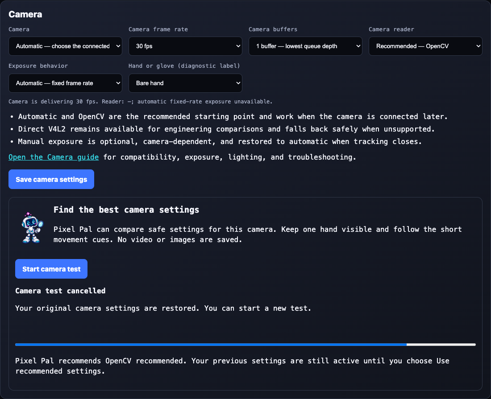
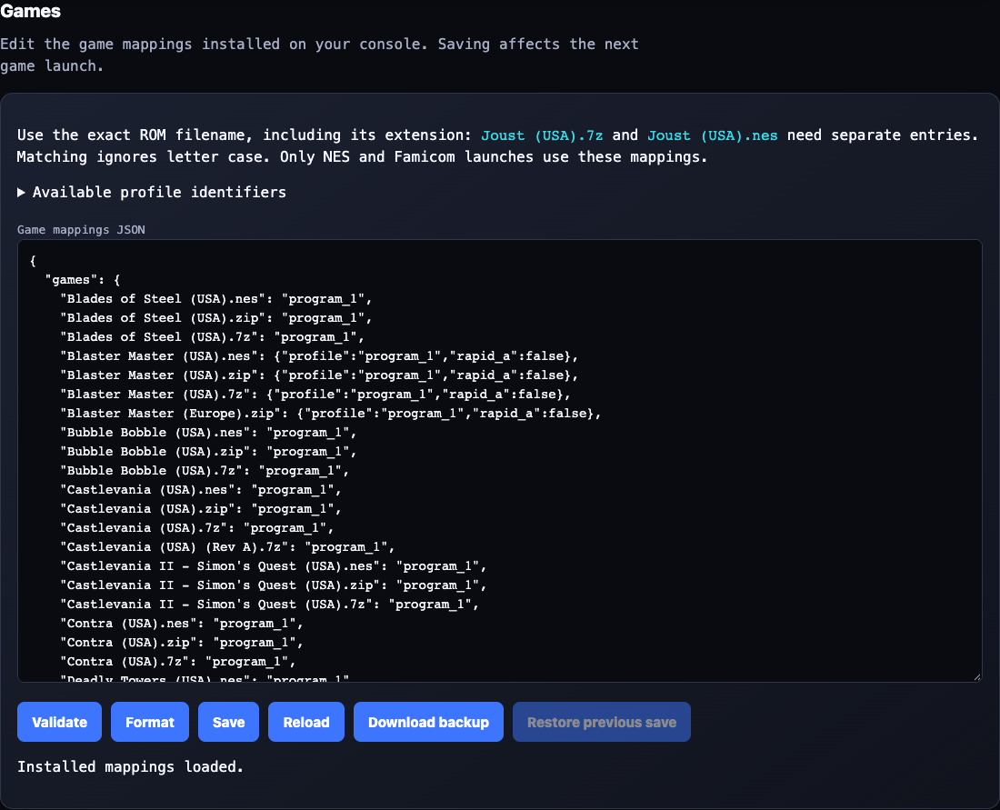
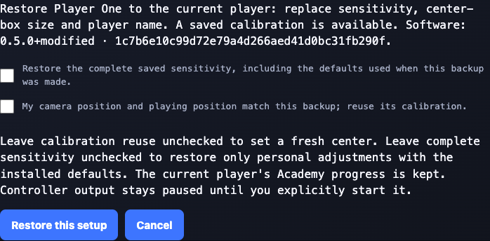
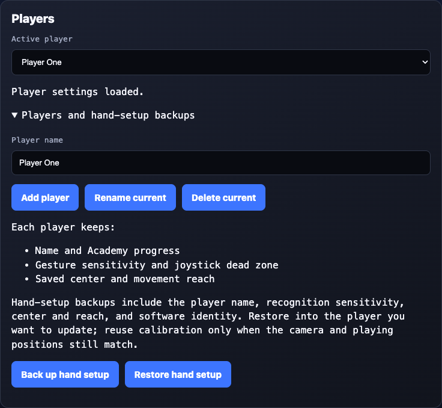
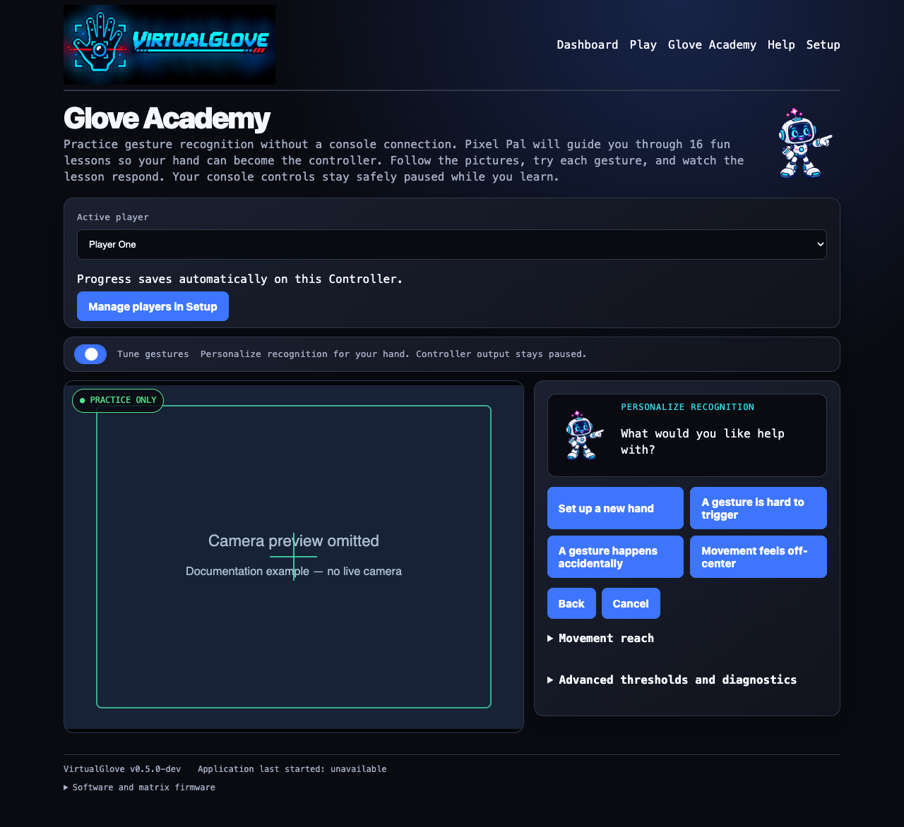

# Configuration Reference

Use this reference to find a setting, change a game mapping, tune a gesture,
or look up a command. Each section identifies the active file and explains
what its values mean.

Use the [installation guide](INSTALL_README.md) for the initial deployment and
pairing procedure. Return here when you need to change a host, camera, game,
gesture threshold, or network setting.

In this guide, **VirtualGlove Controller** means the Arduino UNO Q running
the camera, recognition, dashboard, and controller-sending software. Hardware-
specific commands and filenames retain `uno-q` where that literal name is required.

> **KEEP THE TOKEN PRIVATE**  VirtualGlove uses one shared token to
> authenticate controller packets and profile changes. Never paste it into an
> issue, screenshot, command line, public backup, or Git commit.

## Where configuration lives

VirtualGlove runs on a Controller and one console. A repository template is not always the
file the running system reads.

| Location | What it controls | Preferred way to change it |
| --- | --- | --- |
| VirtualGlove Controller Setup page | Console platform and address, controller port, startup profile, camera, and pairing token | Browser Setup page |
| VirtualGlove Controller application files | Gesture sensitivity and advanced runtime defaults | Edit only when tuning is required |
| RetroPie `/etc/virtualglove/` | VirtualGlove Controller address, per-game profile selection, and receiver token | Protected files on RetroPie |
| Recalbox `/recalbox/share/system/virtualglove/data/` | Controller address, game registry, receiver token, and versioned Controller Router assignments | Installer or persistent Recalbox share |
| Batocera `/userdata/system/virtualglove/data/` | Controller address, game registry, receiver token, and versioned Controller Router assignments | Installer or persistent Batocera user data |
| LaunchBox `%LOCALAPPDATA%\VirtualGlove\data\` | VirtualGlove Controller address, exact-ROM profiles, RetroArch paths, and receiver token | Current Windows user |

The examples under the repository's `config/` directory are installation
templates. Editing them does not change an already installed system. The active
copies are identified in each section below.

In commands and examples, replace these placeholders:

| Placeholder | Replace with |
| --- | --- |
| `UNO-Q-NAME.local` | Your VirtualGlove Controller hostname or reserved IP address |
| `CONSOLE-NAME.local` | Your RetroPie, Recalbox, Batocera, or LaunchBox hostname or reserved IP address |
| `/home/arduino/ArduinoApps/virtualglove` | Required directory for the supported VirtualGlove Controller installer and host helpers; do not substitute a different path |

## Find the setting or command you need

| Task | Section |
| --- | --- |
| Install and pair both machines | [Installation Guide](INSTALL_README.md) |
| Change the camera or startup profile | [VirtualGlove Controller settings](#virtualglove-controller-settings) |
| Repair pairing or token permissions | [Pairing and token management](#pairing-and-token-management) |
| Change the VirtualGlove Controller destination on the console | [Console connection settings](#console-connection-settings) |
| Make a game select a profile | [Register games and select profiles](#register-games-and-select-profiles) |
| Adjust gesture sensitivity | [Tune gesture sensitivity](#tune-gesture-sensitivity) |
| Install or check engineering tools | [Engineering Toolkit command reference](#engineering-toolkit-command-reference) |
| Understand an option or command | [Command-line reference](#command-line-reference) |

## VirtualGlove Controller settings

Open the ordinary Setup page at:

```text
http://UNO-Q-NAME.local:8088/setup
```

Pairing uses the secure Setup page instead:

```text
https://UNO-Q-NAME.local:8443/setup
```

Each Controller creates a persistent private local certificate authority and
uses it to sign the website certificate for its stable `.local` name. Select
**Trust this Controller** on secure Setup to download only the
public authority certificate. After the one-time trust step on a phone or
computer, that device can open secure Setup without a privacy warning. The
authority private key never leaves the Controller. During pairing, continue to
compare the current website-certificate fingerprint with the identifier shown
on the physical matrix before entering the one-time PIN.

### Joystick dead-zone camera test

In **Setup → Joystick dead zone**, the chosen percentage is the nominal width
and height of the center region as a fraction of the full camera frame. The box
is anchored to the neutral palm center saved by **Center hand** and never follows
the live hand. Its effective width and height are at least 1.5 times the saved
calibrated palm size. If that full square would cross a camera edge, VirtualGlove
translates it inward rather than clipping or shrinking it. The remaining space
on each axis becomes the directional side and corner regions. The allowed slider
range is 10–100%. Resting jitter and live hand-size changes do not move or resize
the box. Native Super Glove Ball X/Y calibration, noise filtering, and reach
remain separate and unchanged.

The **Turn on camera** and **Center hand** buttons follow **Use standard size**
in the slider's controls row. The panel starts off with its camera hidden.
**Center hand** becomes available only after this panel owns an active practice
lease and its preview is live. Centering keeps controller output paused, samples
the selected player's relaxed hand, and redraws the grid from the newly saved
center and hand size without discarding an unsaved slider preview. The mirrored stream
shows a label-free 3×3 grid. Moving the slider immediately redraws the lines,
highlight, and direction pills from the live palm position without another
request. This is an **unsaved preview**: gameplay changes only after **Save dead
zone**. Turning the camera off and on retains the draft; changing players
discards it. After saving, feedback waits for the worker's saved bounds before
returning to its authoritative D-pad directions.

Gameplay positional directions use the same absolute palm coordinates and
saved-center bounds. Exact boundaries count as center. Tracking loss and
menu/start/select suppression clear preview directions and highlights; missing
calibration or a stopped camera or owned lease hides the grid. The camera
toggle never saves settings. Existing player dead-zone numbers and all other
player/calibration data are retained; those numbers now denote frame fractions.

The Joystick dead-zone card appears directly below **Players** in Setup. The
panel owns a unique existing Academy practice lease, renewed every two
seconds. Practice pauses controller delivery and starts tracking. Its image and
directions become active only after its own lease is acknowledged and status
reports active practice vision.

Practice `/status` includes a read-only `joystick_grid` only while valid active
calibration is available. `anchor` is the saved neutral palm position, `center`
is the possibly edge-translated box center, `half_size` is the saved effective
half-size, and `minimum_size` is the 1.5-hand floor needed to derive an exact
draft preview. Coordinates match the mirrored preview and are not flipped again.
The field is omitted outside practice,
during centering, or while a required/failed calibration is pending. It is never
persisted. Player snapshots retain the chosen `deadzone`, report the possibly
enlarged `effective_deadzone`, `hand_size_minimum`, and `hand_size_protected`,
and retain `jitter_protected: false` for compatibility.

The practice response includes `session_active` as well as aggregate
`practice_mode`, so another tab cannot stand in for this
panel's lease. A reset/rejected lease stops this panel's test; network or stream
failures clear feedback and retry safely.

**Turn off camera** removes the image source, hides the view, clears directions,
and releases only this panel's lease. Leaving the page also releases it. If a
release cannot be confirmed, the panel reports that fact and retries; abandoned
leases expire after six seconds. Another practice tab can keep the shared camera
running. Existing controller behavior resumes only as the practice mechanism
allows; this panel never sends a controller-start request.

### Connection Doctor

In **Setup → Pair this Controller**, select **Check connection** for a checklist
and suggested next steps. Save platform, address, port, or startup-profile edits first.
The Doctor never saves settings, pairs devices, starts controller output, or
changes player/calibration data. Existing save and pair controls remain explicit actions.

The checks use the existing address-resolution endpoint, cached console checks
(no older than 30 seconds), and the tracker status API. A reachable Games service
is separate from the UDP controller receiver. An authenticated Games response
confirms that service accepts the saved pairing key; a locally saved key alone
is insufficient. A reported receiver handshake and packet send do not acknowledge
individual input delivery. When output is inactive, the receiver check is **Not
verified**, rather than a connection failure.

For an active registered game, the Doctor compares the reported profile,
emulator, and input mode using the current native-mode rules. This is a runtime
consistency check, not inspection of installed core files or proof that the ROM
matches its registry entry. The current protocol does not report virtual-gamepad
creation, native-state consumption, or game-side input receipt. Those checks
remain **Not verified** and require testing on the selected console; the Doctor does not send
input or create a virtual controller to test them.

**Download connection report** exports only fixed checklist labels, results,
and a timestamp. It excludes addresses, raw API responses, error details,
credentials, pairing tokens, device configuration, player data, calibration, and
hand measurements. Results are a snapshot; edits or a save/pair action on the
page invalidate them. Run the check again after changing the console or game.

### Settings shown in the browser

Setup groups **Controller status**, **Players**, **Matrix attract mode**,
**Connection and startup**, **Pair this Controller**, **Camera**,
**Trust this Controller**, **Joystick dead zone**, **Games**, and
**Show statistics**. Receiver port is under **Advanced connection**. The
connection settings appear immediately before the secure pairing wizard. Camera selection, rate, reader, exposure, and diagnostic hand label
are in their own action-first Camera section. The concise
[Camera guide](CAMERA_GUIDE.md) explains compatibility, lighting, and recovery.
A saved destination and pairing key are not proof that the selected console has
received that key. **Check console address**
verifies name resolution only.

A failed initial load offers **Reload saved settings**; connection fields remain
disabled until loading succeeds. Failed actions can be retried. Start/Stop and
pairing refreshes retain unsaved connection edits. HTTP 202 from `/api/controller`
means the latest request is saved but still awaiting worker delivery. The
supervisor retries it; another explicit request supersedes it. This is separate
from camera frames and controller packets, which remain newest-state-only.


| Setting | Default | Meaning and recommendation |
| --- | --- | --- |
| Console platform | Empty (not configured) | Choose RetroPie, Recalbox, Batocera, or LaunchBox before entering and saving the address. Pairing remains unavailable until both fields are saved. An upgraded installation with an existing address and token can continue operating, but must identify its platform before it can pair again. |
| Console hostname or IP | Empty (not configured) | Set the selected console's `.local` hostname or a reserved LAN address and pair through Connection before starting controls. Glove Academy and local settings work without a destination. Existing saved destinations are preserved. |
| Receiver UDP port | `55355` | VirtualGlove Controller to console controller-state port. Leave it at the default unless both ends are changed. |
| Startup game profile | `off` | Fresh installations keep gestures and the camera off until the user selects a profile or launches a registered game. Existing saved startup profiles are preserved during upgrades. |
| Hand or glove (diagnostic label) | `none` | `none`, `white`, or `black`. In the current release this is an informational diagnostic label; it does not change MediaPipe tracking. |
| Camera | Automatic | Setup lists the currently discovered usable cameras. Prefer **Automatic — choose the connected camera**; choose a named camera only when more than one is attached or automatic selection is wrong. A saved disconnected camera remains visible as unavailable, and the list refreshes while Setup is open. |
| Camera frame rate | Automatic | Tries 30 fps first, then accepts the camera driver's usable rate if necessary. Explicit 30- and 60-fps requests are available for comparison and fall back safely when unsupported. The live negotiated rate appears below the setting while tracking is active. |
| Camera buffers | `1` | Selects one or two driver capture buffers. One minimizes queue depth; two may improve delivery continuity on some cameras. The latest-frame owner still discards superseded frames. Pixel Pal's camera test compares supported choices. |
| Camera reader | Recommended — OpenCV | The portable, gameplay-validated capture path. **Engineering comparison — Direct V4L2** is an opt-in Linux 64-bit, 640×480 MJPEG experiment that drains to the newest driver buffer and falls back to OpenCV if its requirements are not met. |
| Exposure behavior | Automatic — no camera changes | Leave cameras untouched by default. **Low latency — standard UVC** keeps automatic exposure and requests fixed frame rate only when those controls are advertised. **Razer Kiyo Pro — tested low latency** adds the Kiyo's volatile HDR-off request. **Manual exposure and gain** is available with Direct V4L2 after capability and range checks. |



Selecting **Save connection** or **Save camera settings** validates
the complete configuration, writes it atomically with private permissions, and
restarts the vision worker using the saved calibration.
Recalibrate only if you have moved the camera, changed your playing position,
or notice unwanted movement while your hand is at rest.

Setup pairing uses the saved console platform and address, with one active step at a time:
choose a method, confirm the Controller certificate and matrix approval PIN,
then provide the selected console's one-time code or SSH credentials. The page
shows only the command for that platform and supplies its normal SSH username
(`pi` for RetroPie, `root` for Recalbox and Batocera). LaunchBox uses
one-time-code pairing and never accepts SSH password pairing. Unsaved settings block
pairing. The existing two-minute authorization window and server attempt limits
remain authoritative; changing the console or method is disabled during the
active window. The console verifies that the selected platform matches its
installed operating system before changing its token. Expiry clears secrets and
offers fresh confirmation. A failed submitted request also requires confirmation
again. Password entry is disabled until the certificate comparison and six-digit
PIN step is complete. Ordinary HTTP shows only a link to secure Setup. Start/Stop
and shutdown remain on Dashboard.
See the [pairing walkthrough](INSTALL_README.md#4-pair-the-devices).

The Controller authority is stable across ordinary upgrades and website-leaf
renewals. The leaf is renewed before expiry and regenerated if the Controller
hostname changes. The release installer offers a Controller name only on first
installation, recommends `virtualglove`, and preserves that choice on every
upgrade. Because a renamed leaf is signed by the same authority, an intentional
later hostname change does not replace the trusted authority—but saved links
and the RetroPie destination must use the new name. Trust must be installed once
on each browser device. Do not distribute or copy
`data/tls/controller-ca-key.pem`; it is a private Controller identity. The
download route returns only `controller-ca-cert.pem`, only over HTTPS, as a DER
`.cer` file.

When a submitted pairing attempt finishes, the matrix releases the approval PIN and resumes its normal display. When idle, the glove animation follows your On, Dim, or Off attract setting; active game and status displays still take priority.

The Dashboard profile selector changes only the current active profile. It does
not rewrite `device.json` or change the Setup page's startup profile. RetroPie
may replace a Dashboard selection when a game starts or ends.

**Show statistics** is a browser-local Dashboard preference, also available at
the bottom of Setup. It is off by default and is stored in browser local storage,
not `device.json`. When disabled, the Dashboard still polls basic state needed
for controls and connection feedback but does not read, render, or retain the
optional controller, axes, finger, performance, and recent-event fields.
The worker publishes UI-visible control transitions immediately. While statistics are
shown, routine detailed feedback is refreshed at about 10 Hz and replaces any
older pending Dashboard work in a one-item worker queue. Expensive rolling
percentiles are refreshed at 2 Hz. With statistics hidden, those calculations
are not performed; camera tracking and controller transmission are unchanged.
Preview mirroring, annotation, resizing, and JPEG encoding run on the preview
worker and do not select a different MediaPipe frame-preparation path. Tuning
state is captured before inference, so browser status reads cannot hold a tuning
lock between completed inference and the signed controller send.

### Comfortable movement range

Native X/Y can map a player's comfortable left, right, up, and down positions to
the screen edges. It changes sensitivity and physical travel, not processing
time. Gesture thresholds, D-pad behavior, depth, and Latest-coordinate movement
stay unchanged.

The four optional `calibration.neutral` fields `reach_left`, `reach_right`,
`reach_up`, and `reach_down` are normalized image distances from the saved center.
All four zero (or omitted in older backups) use the original camera-boundary
mapping. Otherwise all four must be finite numbers at least `0.05` and fit inside
the image around that center. Player presets and version-4 VirtualGlove hand-setup backups
preserve them. New reach-bearing backups require reach-aware software on import.
**Center hand preserves valid reach spans** because neutral centering and
comfortable travel are separate adjustments. If a new center would place an
existing endpoint outside the camera image, the software safely returns to the
full-field mapping. Review reach after moving the camera or changing playing
position. Never reuse another camera setup's spans as universal defaults.

For normal adjustment, open **Glove Academy → Tune gestures → Movement reach**.
The four fields load the active player's exact saved spans, and the read-only
summary shows the resulting width, height, and aspect ratio. Smaller values need
less hand travel. **Save reach values** replaces only these four calibration
fields. **Restore full camera field** writes four zeros after confirmation and
does not alter center, scale, roll, jitter, thresholds, or Academy progress.
Controller output remains paused while Tune gestures is open.

The operator helper `scripts/calibrate-reach.py` runs inside the Controller
container, using the worker's Python environment and loopback APIs. After normal
player centering, run these as separate commands, cueing the player before each:

```sh
python scripts/calibrate-reach.py begin
python scripts/calibrate-reach.py center
python scripts/calibrate-reach.py left
python scripts/calibrate-reach.py right
python scripts/calibrate-reach.py up
python scripts/calibrate-reach.py down
python scripts/calibrate-reach.py apply
```

`begin` saves a private complete backup under `data/backups/reach-*/`, persistently
pauses delivery, and leases practice mode. Hold a relaxed palm at center for
`center`, then a steady, comfortable endpoint for each three-second directional
step. The helper samples raw palm positions and requires at least 12 independent
reliable observations, at least 80% reliable observations, and a stable hold away
from the image boundary. Failed holds can be repeated. Do not launch a game,
change players, or enter gesture tuning during the session.

`apply` uses the existing generation-checked player restore path. `cancel` restores
the original complete hand setup. Both leave output paused for verification;
restart delivery explicitly when ready. A pending restore or player change stops
the helper rather than applying to a different player; the saved backup remains
available in Setup → Players. Only numeric calibration data is stored, not images.

Worker status exposes raw `palm_position` (`x` and `y`, or `null` when undetected)
for this calibration. Its coordinates follow the configured mirror convention.
The helper accepts synchronous practice observations only.

### Native X/Y movement

The Controller always uses each newest completed MediaPipe palm observation as
the native X/Y source. **Latest coordinate** publishes the newest mapped
MediaPipe coordinate without temporal smoothing during continuous tracking.
There is no movement-mode control on the Dashboard.

The live path validates landmark geometry and clamps the selected point to the
active player's reach rectangle before mapping. Movement beyond an edge stays
pinned to that edge and cannot build hidden off-screen state. The selected
frame's capture timestamp drives freshness; inference-start time is not
substituted for it. The production anchor remains the five-point average
of wrist and four knuckles so existing centers and reach spans remain valid.

MediaPipe still supplies fingers, depth, roll, and gestures; FCEUmm directions
and every game mapping are unchanged.
Worker status reports `native_xy_source` as `mediapipe` while the native path is
active or `inactive` otherwise. The abandoned optical-flow implementation and
its unused compatibility settings have been removed; Git history retains the
experiment. Supported native replay and latency tools remain available.

When MediaPipe misses the hand briefly, the engine holds the last native X/Y for
up to `native_xy_loss_hold_ms` (180 ms by default) to bridge roughly one extra
inference result during an extreme sweep. Buttons, fingers, Z, roll, and D-pad
release on the first missed native observation and do not inherit the X/Y hold.
Continued loss, stale data, calibration changes,
or profile changes neutralize native X/Y and clear retained coordinate history.
On recovery, Latest normally accepts the first fresh coordinate. If established
motion is followed by one contradictory result, or the new point is unusually
distant without being strongly aligned forward, it holds the last reliable X/Y
for one fresh result. The next measurement is authoritative. This guard never
predicts a position, modifies continuous tracking, or delays strongly aligned
forward recovery.

### Selected camera and inference settings

The current baseline uses the complete 640×480 MJPEG image, four MediaPipe
inference threads, a `0.35` tracking-confidence threshold, a `2.25` next-frame
hand search area, and Automatic camera
rate. Automatic tries 30 fps first because live play felt smoother and more
attached to the hand than the 60-fps request, then reopens the camera without a
forced rate if it cannot produce frames. Setup can explicitly request 30 or 60
fps for comparison and reports the negotiated rate while tracking is active.
An unsupported explicit rate also falls back to the driver's usable choice.

The capture and exposure choices are mostly independent. `camera_backend` is
`opencv` or `direct-v4l2`; `camera_exposure` is `auto`, `low-latency`,
`kiyo-low-latency`, or `manual`. Manual mode requires Direct V4L2 because its
controls are applied to the already-streaming camera descriptor; it never opens
a competing second camera connection. `camera_manual_exposure` and
`camera_manual_gain` store the requested whole-number values. Direct V4L2
requires Linux's 64-bit V4L2 ABI and an already
negotiated 640×480 MJPEG stream. It exposes the camera sequence and monotonic
driver timestamp when the driver supplies them. Any initialization or format
failure is reported as `capture_backend_fallback`, then the camera is reopened
through OpenCV. No game, gesture, reach, or calibration setting is changed.

Every exposure mode first queries the standard V4L2 controls. Unsupported or
disabled controls are never written. Low-latency mode leaves exposure automatic
while disabling exposure auto-priority so long exposures cannot silently reduce
frame cadence. The Kiyo mode additionally verifies USB identity before sending
the existing HDR-off request. Manual mode requires both exposure and gain
controls, validates the camera's advertised minimum, maximum, and step, switches
exposure to manual, and reads back the applied values. If the request is
unsupported, the worker reports an explicit automatic fallback; if a partial
write cannot be safely restored, startup fails instead of leaving an unknown
camera state. Closing vision restores automatic exposure. These changes are
volatile and do not rewrite settings inside the camera.

Automatic remains the portable default. In the September 8 matched live test,
this project's Razer Kiyo Pro at manual exposure `78` and gain `96` had slightly
better detection continuity than automatic exposure, with indistinguishable
latency. Those values are a saved setting for that Controller, not a universal
camera preset. Other cameras should begin on Automatic and use Manual only after
checking the reported supported range and live hand image.

The earlier Kiyo Pro capture experiment used two buffers and a volatile HDR-off
command while requesting 60 fps. It remains useful historical evidence, but it
is not the general default. See the camera-delivery work in the
[Engineering Journey](ENGINEERING_JOURNEY.md#milestone-8-refine-camera-delivery-and-resilience-9-10-september-2026).

The general default remains one buffer and no vendor control command. The HDR option
checks USB identity `1532:0e05`, sends only the volatile HDR-off command, and sets
and verifies automatic exposure with dynamic frame rate disabled. It does not
save settings onboard. Other camera models are left untouched. Control failure
is reported as `camera_control_error`; capture may continue, but that run must not
be treated as a verified candidate. `camera_hdr_off_command_sent` confirms the
command was accepted, not a readback of the sensor's HDR state. Buffer metadata
reports requested/accepted values separately from real frame-delivery measurements.

Remove these two settings (or set buffers to `1` and HDR-off to `false`) and restart
to restore the original software capture policy. The application does not issue
an HDR-on command on rollback; power-cycle the camera to reload its saved settings.
Camera configuration is separate from player calibration and reach backups.

### Vision startup and timing

Camera capture uses the complete 640×480 field of view. Automatic rate prefers
30 fps with safe driver fallback. A dedicated
capture thread continuously drains the camera and retains only its newest frame,
so inference skips superseded images instead of building an input queue. The
deployed worker explicitly selects **MediaPipe Hands 0.10.35**, whose stable
command identifier is `legacy`, and lets each of its two inference stages use up
to four CPU threads (`--inference-threads 4`). Matched live testing promoted four
threads for the VirtualGlove Controller; the saved setting remains explicit
so a future platform can be re-measured rather than assuming the same result.
The release installer carries only the validated 0.10.35 runtime. Historical
0.10.18 results remain benchmark evidence, not a selectable installed path.
**MediaPipe Tasks Video (experimental)** remains available under the stable
`tasks-video` identifier for controlled comparison.

Camera-preview drawing and JPEG encoding run only while a browser is actively
watching the Dashboard or Glove Academy stream. JPEG encoding runs on a separate
latest-preview worker and is allowed to drop superseded preview jobs rather than
delay another controller sample. During gameplay, normalized landmark drawing
and JPEG encoding use a 320×240 copy after inference; Academy and tuning retain
the full-size preview. Closing those pages avoids even that optional work. When a preview is open, submissions are limited to 5 fps
(`--preview-fps 5`).

The full MediaPipe graph remains the production setting. The configuration-only
`lean-image` experiment requests only image landmarks from the same MediaPipe
Hands graph, omitting handedness and world-landmark output streams. It does not
replace the hand model or reduce the 21 landmarks calculated for recognition.
An output-paused Controller comparison improved median inference only from about
43.9 ms to 43.2 ms and worsened p95 sample age from about 108.5 ms to 114.6 ms.
That result did not pass the promotion gate, so `full` remains the supported
default. Retain `lean-image` only for repeatable comparisons on future runtimes
or hardware.

The worker preloads OpenCV and MediaPipe on its background vision thread as
soon as its control server is available. Preloading imports the libraries;
it does not open the camera, create a hand tracker, or process images. The
website and profile controls remain responsive while imports run. A failed
preload is logged; a later activation retries loading and reports any error.

If **Gestures off — no active profile** is selected at startup, the camera stays closed until you
select an active profile or open Glove Academy. An active startup profile requests
capture automatically after preloading. The player's explicit controller choice is
restored as **armed** or **stopped**, but an armed worker does not transmit until a
live registered game session or intentional manual Dashboard profile exists.
Gestures off affects only VirtualGlove-generated input. Recalbox/Batocera's
merged physical source and LaunchBox's physical XInput controller remain
available; LaunchBox's loopback RetroPad becomes neutral and its real keyboard
fallback remains available. Generic RetroPie follows its separate gamepad assignments. **Program
14 — Physical controller only** has the same neutral camera/output behavior while deliberately retaining
the numbered profile and authenticated registered-game session.

Activation waits for any unfinished preload, verifies the saved model, opens
and configures the camera, waits for a usable frame, and creates the tracker.
Dashboard, Play, and Glove Academy show **Starting camera and gesture tracking** until vision
is active. The elapsed time covers startup work, not only the physical camera.
**Center hand** stays disabled until initialization finishes.

Switching between active profiles reuses the camera and tracker. **Gestures off**
releases both, while imported libraries remain in memory. An application restart,
including a worker restart after saving Setup settings, starts preloading again.

<!-- PAGEBREAK -->

Measurements on the cabinet's VirtualGlove Controller with a Razer Kiyo Pro on September 4, 2026:

| Measurement | Observed time |
| --- | --- |
| First activation after reboot, before background preloading | 7.67 seconds |
| OpenCV background preload after a later reboot | 0.94 seconds |
| MediaPipe background preload after that reboot | 5.94 seconds |
| First activation after that preload completed | 1.21 seconds |

These were separate reboot tests on this cabinet, not guaranteed timings. The
change moves library loading earlier; it does not eliminate that work. Selecting
a profile immediately after application startup can still wait for preloading.
An earlier reported 13-14 second delay was not reproduced in the instrumented tests.

To inspect startup stages on the VirtualGlove Controller:

```sh
docker logs --since 10m virtualglove-main-1 2>&1 | grep 'Vision startup:'
```

The default installation uses this container name; use `docker ps` to find it
if your App Lab installation uses another name. Logs include background import
times, model verification/recovery, camera discovery/open/settings, the first
camera frame, tracker construction, first inference, and time to active worker
status. Preparation and activation totals include earlier stages; do not add
them to the individual durations. Dashboard polling adds a small delay before
it displays the new status. Compare entries from the same activation.

If the camera is unavailable, check `lsusb` and `/dev/v4l/by-id/` on the VirtualGlove Controller.
The built-in `qcom-venus-encoder` and `qcom-venus-decoder` video nodes are not
webcams. A camera missing from the USB device list is below MediaPipe and OpenCV;
preloading cannot resolve that condition. The installed host helper waits for a
sustained outage before making one guarded reset of the camera's last observed
parent connection. It disables autosuspend whenever the single UVC camera is
present. A `uhubctl`-reported switchable hub receives an exact per-port power
cycle; otherwise an identity-checked whole-hub driver rebind is used only when
the hub does not carry networking. USB
enumeration is only an intermediate result. The supervisor confirms recovery
only when the restarted worker reads a frame. If that one attempt does not
restore streaming, check the powered hub, cable, and camera connection.

### Glove Academy, calibration, and live readings

Open **Glove Academy** at `/learn` to practise gestures, calibrate your resting
position, or personalize recognition. The matrix shows **L** for lessons and
**T** for tuning.

Glove Academy starts the camera even when **Gestures off** is selected and uses a
mapping-independent practice profile. It pauses controller delivery and restores the selected profile
when you leave. With several Glove Academy tabs open, practice remains active until the
last tab closes or its lease expires. A six-second lease timeout handles an
unexpected browser close. Loading Dashboard also clears a stale session;
reload Glove Academy if you want to begin practice again.

The sixteen lessons cover hand visibility and neutral position, movement,
finger curls, Start and Select, forward and backward gestures, wrist roll,
closed hand, and Menu Guard. Choose your player before practising; lesson
progress is saved for that player across restarts. Complete every lesson to earn
**Glove Master**; skipped lessons must be revisited. The award replaces the
completed lesson in the same card. **Start again** clears the selected player's
lesson progress and award, while retaining their hand settings and calibration.

For hand shapes and illustrations, use the [Gameplay Guide's gesture reference](GAMEPLAY_GUIDE.md#your-gesture-reference).
Its game cards explain what each gesture does in a selected profile. Academy
practice indicators do not change those mappings.

#### Recognition readings and calibration controls

| Reading or control | Meaning |
| --- | --- |
| Finger curl | Glove Academy shows values from 0 to 1; Dashboard uses a compact 0-to-3 display. Default ordinary curl actions engage at 0.50 and release below 0.35; saved personal pairs override these values. |
| V sign | Without personal adjustments, index and middle curl must be below 0.28; ring and little curl must exceed 0.42. Hold steadily for 0.50 seconds to send Start. A non-V pose must then remain visible for 0.30 seconds before Start can rearm. |
| Thumbs-up | Without personal adjustments, thumb curl must be below 0.32 and all four finger curls above 0.42. Hold for 0.15 seconds to send Select. |
| Live hand measurements | Shows curl values, thresholds, enlarged landmarks, and forward or backward movement relative to the calibrated hand size. |
| Center hand | Replaces the saved resting reference. The button turns red while sampling, then blue with a brief completion message. |

#### Tracking and timing diagnostics

These fields describe recognition and the local processing path. They do not
measure the complete delay from physical hand movement to the displayed game.

| Diagnostic field | Meaning |
| --- | --- |
| `tracker_backend` | Stable command identifier: `legacy` means **MediaPipe Hands**; `tasks-video` means **MediaPipe Tasks Video (experimental)**. |
| `capture_age_ms` | Time from completion of the newest camera read to the beginning of inference. This is a freshness diagnostic, not the camera exposure timestamp. |
| `capture_interval_ms`, `capture_skipped_total` | Spacing between processed camera frames and the cumulative number intentionally superseded by newer frames. |
| `inference_ms`, `inference_interval_ms`, and `inference_hz` | Per-frame tracking calculation, spacing between recognition passes, and its reciprocal rate. |
| `sample_age_ms` | Time from completion of the newest camera read through inference and the local UDP send attempt. This is the primary VirtualGlove Controller software-stage gameplay measurement. |
| `controller_transition_age_ms` | `sample_age_ms` recorded only when a successfully transmitted gameplay-visible controller state changes. Native X/Y changes are included. |
| `performance` | Rolling latest, p50, p95, and maximum values over the most recent 300 valid samples for capture age, processed-frame spacing, inference, inference spacing, send time, complete sample age, and changed-control age. |
| `preview_encode_ms`, `preview_dropped` | Background JPEG cost and previews discarded to protect controller responsiveness. |
| `send_ms` | Local controller-state send time. None of these readings alone measures the full delay from physical motion to the displayed game frame. |

#### How recognition and calibration behave

Finger recognition uses the strongest joint bend, including the base knuckle;
a middle-knuckle bend alone can qualify. Thumb recognition uses the stronger
of its two outer joints. MediaPipe 3D world landmarks are preferred. The fallback
uses normalized depth with image aspect-ratio correction; palm movement still
uses image coordinates. The legacy Arduino landmark bridge keeps its 2D
interpretation because its depth units differ.

Glove Academy and gameplay share held finger and movement states. Glove Zap and Pull Back
need two consecutive beyond-threshold observations plus 0.10 normalized
palm-scale movement in the intended direction within 250 ms. Once confirmed,
they remain recognized until movement falls below their respective release thresholds, and a confirmed menu pose
still satisfies its lesson after the short controller pulse ends. The browser
preview is capped at 5 fps; status updates follow each tracking calculation.

Menu Guard requires curled thumb and ring finger with index, middle, and pinky
extended. It suppresses D-pad movement, A, B, Start, and Select, but does not freeze
native Super Glove Ball's continuous hand position. Use **Stop controller** when
you need to reposition without sending controls.

The app reuses its saved resting reference across Glove Academy, gameplay, profile
changes, and restarts. It calibrates automatically only when that reference is
missing or invalid. Use **Center hand** after moving the camera or changing your
playing position. Keep your palm near the resting position when practising
finger curls so unintended movement does not obscure the finger readings.
See [Saved neutral-hand calibration](#saved-neutral-hand-calibration) for storage
and recovery details.

#### Controller delivery and game sessions

**Start controller** and **Stop controller** set a persistent player choice. Start
arms delivery; Stop remains sticky until explicitly changed. Armed is distinct from
sending: output also requires either a live registered RetroPie game session or an
intentional manual Dashboard profile. The RetroPie hook waits until RetroArch is
actually running, then renews a bounded session every two seconds. The VirtualGlove Controller accepts
each renewal for six seconds and uses a short one-second initialization guard before
the first gameplay packet. This avoids operating the runcommand menu while allowing
an armed controller to resume automatically if the VirtualGlove Controller application restarts during
play. Game exit, RetroArch termination, an unregistered launch, or lease expiry sends
a neutral/off request. None of these events silently changes a sticky Stop choice.

The Dashboard separates **Controller delivery** from **Game session**. “Armed -
waiting for game” means the user's Start choice is retained but no packets are being
sent. “Registered game active” identifies a renewable launch session; “Manual
profile” identifies an intentional Dashboard testing context.

### Active VirtualGlove Controller device file

The Setup page maintains this private file inside the application:

```text
/home/arduino/ArduinoApps/virtualglove/data/device.json
```

A typical device configuration file contains the following fields:

```json
{
  "receiver": "RETROPIE-NAME.local",
  "port": 55355,
  "token": "private-random-value-created-by-the-application",
  "profile": "off",
  "glove_color": "none",
  "camera": "auto",
  "camera_fps": "auto",
  "camera_buffers": 1,
  "camera_backend": "opencv",
  "capture_isolation": "thread",
  "inference_threads": 4,
  "tracking_confidence": 0.35,
  "detection_confidence": 0.45,
  "tracking_roi_scale": 2.25,
  "matrix_attract": "on"
}
```

`camera_fps` is `auto`, `30`, or `60`; Automatic prefers 30 and then accepts a
usable driver rate. `camera_buffers` is `1` or `2`; invalid values are rejected
instead of silently changing the capture policy. Production `inference_threads`
accepts 1, 2, or 4. The 0.4.2
baseline retains four threads, `tracking_confidence` 0.35,
`detection_confidence` 0.45, and `tracking_roi_scale` 2.25. Tracking confidence
decides whether the previous landmark region remains usable; detection confidence
is the gate applied when the palm detector must find or reacquire a hand. These
are tested engineering defaults rather than ordinary player controls.
Direction-aware fast-sweep search is always active in the production MediaPipe
path. It applies the measured gentle next-frame search translation without
changing reach, gestures, mappings, or Latest-coordinate output. It has no
device-file switch. Latest coordinate is the only live native X/Y behavior.

Setup's **Find the best camera settings** wizard temporarily compares the
current configuration with capability-supported combinations. Its crash-safe
restore marker contains the exact private pre-test configuration and is mode
`0600`; it is removed after restoration. Accepted recommendations are also
recorded under `camera_profiles`, keyed by a one-way physical-camera identity.
The browser receives only the camera label, USB vendor/product identifiers,
whether a serial was available, and the hashed key—not the serial itself. No
frames, images, or video are retained by this test. During an active measurement,
Setup opens the ordinary mirrored landmark stream with centre and camera-edge
guides. It disconnects that optional stream between candidates and when the
test completes, stops, or needs recovery.

`capture_isolation` is `thread` by default and is the gameplay-validated path.
The opt-in `process` engineering comparison works with OpenCV and Direct V4L2;
it moves camera ownership, decoding, and the single latest-frame slot outside
the MediaPipe worker. It adds no frame queue. A failed isolated startup falls
back to the proven threaded OpenCV path with its reason in status. Process
isolation remains configuration-only because matched live play did not improve
on the thread path.

`matrix_attract` accepts `on` (default), `dim` (animation limited to levels 1–2),
or `off` (four faint app/console/paired-console/Networking indicators). Change it using
**Setup → Matrix attract mode**. This writes the private device configuration
without restarting vision or changing controller state. Existing files that omit
it retain the original animation. The separate guarded `POST /api/attract`
accepts `{"mode":"on"}`, `dim`, or `off`, with JSON content type and the
same-origin `X-VirtualGlove-Action: attract` header. Connection indicators use the
existing authenticated Games service in a background thread; see the
[Matrix guide](MATRIX_GUIDE.md#attract-brightness-and-connection-pixels) for their
meaning and refresh interval. Updated matrix firmware is required.

Use the Setup page for routine changes. If you must edit the JSON directly,
stop the application first, keep the token unchanged, validate the file, and
restore mode `0600`. JSON does not allow comments or trailing commas.

```sh
python3 -m json.tool data/device.json >/dev/null
chmod 0600 data/device.json
```

Deleting `device.json` causes VirtualGlove to create a new token and
first-run defaults. You must then pair RetroPie again.

### Camera selection

`auto` searches stable `/dev/v4l/by-id/` capture-device links first, ignores
known codec-only video nodes, and then considers ordinary `/dev/video*` capture
devices. This is the most reliable choice when USB enumeration changes after a
reboot.

Choose a named camera from Setup only for troubleshooting or when more than one
camera is connected. The saved value remains the device's numeric V4L2 index for
compatibility, but ordinary users do not need to type or discover that number.
Linux may assign a different number after hardware is reconnected. Keep the camera on a powered USB hub when the VirtualGlove Controller cannot supply
stable power by itself.

### Supported startup profiles

The valid startup profile identifiers are:

```text
off
bad_street_brawler
super_glove_ball
program_1  program_2  program_3  program_4  program_5  program_6  program_7
program_8  program_9  program_10 program_11 program_12 program_13 program_14
program_a  program_b  program_c  program_d  program_e
program_f  program_g  program_h  program_i
```

The startup profile does not assign a profile to a ROM. Per-game selection is
controlled by the game registry on the selected console.

## Pairing and token management

Both machines must hold the same token:

| Machine | Active private file |
| --- | --- |
| VirtualGlove Controller | Application `data/device.json`, in the `token` field |
| RetroPie | `/etc/virtualglove/token` |
| Recalbox | `/recalbox/share/system/virtualglove/data/token` |
| Batocera | `/userdata/system/virtualglove/data/token` |

Use one-time-code pairing whenever possible:

```sh
sudo /opt/virtualglove/bin/virtualglove-pair
```

On Recalbox use:

```sh
sh /recalbox/share/system/virtualglove/recalbox/virtualglove-service pair
```

On Batocera use:

```sh
/userdata/system/services/VirtualGlove pair
```

Leave the matching command running on the console, then complete pairing at
`https://UNO-Q-NAME.local:8443/setup`. The code is single use and expires after
five minutes. Setup shows only the command matching the saved platform. Password
pairing is also available when the console accepts SSH password login; use
`pi` on a standard RetroPie installation and `root` on Recalbox or Batocera.
The password is used for one encrypted operation and is not stored. Both methods
reject a platform mismatch before replacing the console token.

The RetroPie token must contain at least 16 characters and should remain owned
by `root`, readable by the `input` group, and inaccessible to other users:

```sh
sudo chown root:input /etc/virtualglove/token
sudo chmod 0640 /etc/virtualglove/token
```

### Recover without browser pairing

Use this fallback only when neither browser pairing method works. Both machines
must already have the software installed.

1. In App Lab, open the active application's private `data/device.json` and locate its `token` value.
2. On the console, open the token file in its private data location listed at the start of this guide. Replace the contents with that same value on one line, without quotation marks. Do not enter it as a shell command.
3. Restore the restrictive ownership and permissions required by that platform, then restart its VirtualGlove receiver.
4. Test controller delivery from Dashboard. Clear the token from your clipboard and close the private file afterward.

Manual token copying is an emergency Linux-console recovery path. LaunchBox
should be repaired with its one-time-code pairing command instead.

Do not transfer a pairing token through a command-line argument; process listings
and shell history can expose it.

## Console connection settings

The active launcher file is `/etc/virtualglove/launcher.json` on RetroPie,
`/recalbox/share/system/virtualglove/data/launcher.json` on Recalbox, and
`/userdata/system/virtualglove/data/launcher.json` on Batocera. LaunchBox uses
`%LOCALAPPDATA%\VirtualGlove\data\launcher.json` and also records its RetroArch
and core paths.

It tells that console's game lifecycle integration where to send profile
changes when a game starts or exits.

```json
{
  "uno_q": "UNO-Q-NAME.local",
  "port": 55356,
  "token_file": "/etc/virtualglove/token",
  "registry": "/etc/virtualglove/games.json",
  "timeout": 0.4
}
```

| Field | Meaning |
| --- | --- |
| `uno_q` | VirtualGlove Controller hostname or reserved address reachable from the console. |
| `port` | Console-to-Controller profile-control port. This is `55356`, not the controller-state port. |
| `token_file` | Protected shared-token file. Keep the token out of this JSON file. |
| `registry` | Active ROM-to-profile mapping. |
| `timeout` | Seconds to wait for each acknowledgement. The hook retries up to three times and never prevents a game from launching. |

After RetroArch starts, the detached session monitor detects the core from the
running process and includes its normalized name in every authenticated profile
renewal. The Controller derives `input_mode` from that observed core: only
`super_glove_ball` with `lr-nestopia-powerglove` is `native`; FCEUmm, another
core, or an unknown value is `joystick`. Changing cores clears retained output
before the new mode is accepted. Dashboard and worker status expose both the
reported `emulator` and resulting `input_mode` for troubleshooting.

Validate changes before launching a game:

```sh
python3 -m json.tool /etc/virtualglove/launcher.json >/dev/null
```

Use a `.local` hostname when multicast DNS is reliable on your LAN. A reserved
DHCP address is a useful fallback. Do not use an address that may later be
assigned to another device.

## Register games and select profiles

### Edit mappings in Games



Games is a section of **Setup**, below pairing; it is not a separate navigation tab.

1. Open **Setup → Games** in the VirtualGlove Controller website. Both machines must be online and paired. The page reads the registry used by the selected platform's installed launch integration.
2. Select **Download backup** to keep a copy of the last verified installed registry on your computer.
3. Edit the JSON, adding the exact ROM filename and a supported profile identifier inside `games`. Expand **Available profile identifiers** for the choices. Preserve your existing entries.
4. Select **Validate**. It checks JSON syntax, supported profiles, and duplicate filenames, including names that differ only by letter case. **Format** tidies the JSON without saving it.
5. Select **Save**. Wait for confirmation that RetroPie saved the file and the VirtualGlove Controller read it back successfully.
6. Launch or restart the game and confirm its profile on Dashboard.

Saving does not change the current game's profile. **Restore previous save** swaps
in the last valid version. **Reload** discards your draft after confirmation. If
another editor changed the installed registry, saving is refused; download or copy
your draft before reloading. Connection failures leave the draft in the browser.
Leaving or refreshing the page can discard unsaved work.

The Games section needs the current platform's VirtualGlove Games service. If
it reports an unavailable service, update that console installation, check
pairing, and ensure TCP `55358` is reachable from the VirtualGlove Controller.
Games does not require an SSH password after pairing.

### Registry format

The active game registry is `/etc/virtualglove/games.json` on RetroPie,
`/recalbox/share/system/virtualglove/data/games.json` on Recalbox,
`/userdata/system/virtualglove/data/games.json` on Batocera, and
`%LOCALAPPDATA%\VirtualGlove\data\games.json` on LaunchBox.

VirtualGlove matches the exact ROM basename, including its extension,
without regard to letter case. Directory names are ignored. Automatic profile
selection applies to NES launches reported by each supported platform
integration. RetroPie also accepts `famicom`; unsupported systems turn gesture
control off.

After adding a ROM, refresh the frontend library and register its exact filename
if it is not already present. Recalbox and Batocera rescan registered native
Super Glove Ball filenames when their VirtualGlove service starts. LaunchBox's
wrapper checks the registry on every launch. RetroPie retains its explicit
per-ROM runcommand core selection. See [Add NES ROMs after VirtualGlove is
installed](INSTALL_README.md#add-nes-roms-after-virtualglove-is-installed).

LaunchBox stores `input_route: "network-retropad"` and a randomly selected
`retroarch_remote_port` from `49152` through `65535` in its private
`launcher.json`. The ordinary-game append configuration enables Network
RetroPad for Player 1 on that port; the native Super Glove Ball configuration
explicitly disables it. The sender always targets `127.0.0.1`, and the installer
maintains a program- and port-scoped inbound firewall block for LocalSubnet.
These values are installer-owned; rerun the installer rather than editing them.

```json
{
  "games": {
    "Bad Street Brawler (USA).nes": "bad_street_brawler",
    "Super Glove Ball (USA).zip": "super_glove_ball",
    "Joust (USA).nes": "program_b",
    "Blaster Master (USA).nes": {
      "profile": "program_1",
      "rapid_a": false
    }
  }
}
```

Add the exact filename shown in EmulationStation. Zipped and 7-Zip copies need
their own entries because `.nes`, `.zip`, and `.7z` are different basenames.
The legacy string form remains valid. The structured form accepts exactly one
valid `profile` plus optional Boolean `rapid_a` and `rapid_b` switches. Unknown
fields and non-Boolean switch values invalidate the registry.
The launch hook carries these switches in every authenticated game-session
renewal. Read-only `/status` reports the applied values as
`rapid_fire.a` and `rapid_fire.b`, their profile defaults, and whether each
value was overridden; none of these values changes player data. Dashboard can
edit Rapid A and Rapid B for the currently running registered game. It uses the
same revision-checked registry service and preserves every other mapping. After
the save is verified, the Controller applies the switches to the running game
without restarting it. This temporary live override is bound to that exact
authenticated game session; it cannot spill into another game and is discarded
on exit, session expiry, or a new launch. The saved registry values remain the
source for future launches.

Profile defaults follow only rapid or pulsed actions explicitly identified in
the individual Mattel program descriptions. Program 7 defaults to Rapid A;
Program B defaults to Rapid A; Program H defaults to Rapid A and B; and Bad
Street Brawler defaults to Rapid B. All other profiles default both switches
off. Documented compound and pulsed-direction actions remain independent of
these A/B switches. Program 14, Gestures off, and native Super Glove Ball do not
offer Dashboard rapid-fire controls.

Mattel's *Power Glove Instructions*, page 14, documents a separate hardware
power-on rule: both rapid-fire switches initially turn on. That page also says
not every program has rapid fire and points to the individual descriptions.
VirtualGlove intentionally follows the active profile's documented button
behavior instead of emulating the blanket hardware power-on state.

Here, `rapid_a` and `rapid_b` control only repetition of the corresponding NES
button while its gesture remains active. They do not modify profile-owned fast
turns, pulsed steering, turbo movement, simultaneous-button combinations, or
other compound actions.

<!-- PAGEBREAK -->

Upgrades preserve structured registry entries, including explicit `rapid_a` and
`rapid_b` values. A preserved value continues to override the corrected profile
default. **Use profile defaults** on Dashboard converts that game back to its
string profile entry, removing only the two rapid-fire overrides while retaining
the profile and all player configuration.

| Included game | Profile |
| --- | --- |
| Bad Street Brawler | `bad_street_brawler` |
| Super Glove Ball | `super_glove_ball` |
| Joust | `program_b` |
| Gyruss | `program_c` |
| Defender II | `program_e` |
| Sesame Street 1-2-3 | `program_f` |
| Gun Smoke | `program_g` |
| Knight Rider | `program_i` |

The numeric portion of the shipped registry is:

| Profile | Mattel-indexed titles | Structured rapid-fire entries |
| --- | --- | --- |
| `program_1` | Blades of Steel; Blaster Master; Bubble Bobble; Castlevania; Castlevania II: Simon's Quest; Contra; Deadly Towers; Donkey Kong Classics; Double Dribble; Gauntlet; Gradius; Jackal; Kid Icarus; Kung-Fu Heroes; Metal Gear; Metroid; Mickey Mousecapade; Operation Wolf; Platoon; Racket Attack; Rampage; RoboWarrior; Rygar; Seicross; Star Force; Superman; Xenophobe; Zelda II: The Adventure of Link | Blaster Master: `rapid_a=false`; Double Dribble and Racket Attack: `rapid_a=false`, `rapid_b=false` |
| `program_2` | No indexed title; centering-practice alternative | None |
| `program_3` | Ice Hockey; Top Gun | Ice Hockey: `rapid_b=false` |
| `program_4` | Iron Tank | None |
| `program_5` | Alpha Mission; Life Force; Xevious; 1943: The Battle of Midway | Alpha Mission: `rapid_a=false` |
| `program_6` | Double Dragon | None |
| `program_7` | Mike Tyson's Punch-Out!! | None |
| `program_8` | Baseball; Bases Loaded; R.B.I. Baseball | None |
| `program_9` | Rad Racer | No rapid fire by profile default |
| `program_10` | R.C. Pro-Am | None |
| `program_11` | No indexed title; sustained fast-turn alternative | None |
| `program_12` | Super Mario Bros. | Held A by default; if `rapid_a=true`, repeat 250 ms A holds separated by the standard short rapid-fire gap |
| `program_13` | No indexed title; gesture A/B with physical-controller movement | None |
| `program_14` | Anticipation; temporary manual menu/password entry | Output is neutral; camera is stopped |

Every listed title has explicit `.nes`, `.zip`, and `.7z` filenames; known
region, revision, punctuation, and `Robo Warrior` variants are additional exact
aliases rather than fuzzy matching. The [Gameplay Guide's numeric Program
cards](GAMEPLAY_GUIDE.md#program-cards-1-14) are the authoritative
gesture-to-controller reference.

Programs A, D, and H are fully implemented profiles rather than omitted games:
`program_a` is a pinball control scheme, `program_d` reverses all four directions
for challenge or accessibility use, and `program_h` provides general-purpose
movement with pulsed buttons. They deliberately have no default ROM assignment.
Any appropriate NES or Famicom ROM can use one of the profiles after you add its
exact basename to the `games` object. Every profile value must be one of the
supported identifiers; an unknown value invalidates the registry.

```sh
sudo python3 -m json.tool /etc/virtualglove/games.json >/dev/null
```

Test profile communication independently of a game:

```sh
sudo /opt/virtualglove/bin/virtualglove-profile \
  --uno-q UNO-Q-NAME.local \
  --token-file /etc/virtualglove/token \
  --profile program_b
```

Use `--profile off` to stop gesture output. A successful request prints an
acknowledgement and starts the matrix glove attract animation. In this healthy
idle state the camera and MediaPipe tracker are closed, while the website and
authenticated profile listener remain available.

### Check a queued profile change

The launch helper reports **profile queued** when the VirtualGlove Controller has authenticated
and queued the request. Dashboard shows the applied profile and ROM name once
the worker processes it. Camera startup can take longer than the acknowledgement;
an acknowledgement does not mean that the camera is ready or that controller
delivery is enabled.

App Lab's `local:profile_control` brick publishes UDP `55356` through a small
relay to the worker. The relay holds no pairing token and forwards signed
packets unchanged. Both this brick and `local:avahi_resolver` must be present
in `app.yaml`, so the services return when App Lab regenerates its containers.
The setup and Wi-Fi update helpers also add their includes to existing Compose
configuration. On the VirtualGlove Controller, check the published port with:

```sh
docker port virtualglove-profile-relay-1 55356/udp
```

Expect a host binding for port `55356`. If it is missing, update the application
and rerun VirtualGlove Controller setup. On RetroPie, compare the game's actual filename, including
`.nes`, `.zip`, or `.7z`, with `/etc/virtualglove/games.json`. These are separate
exact entries. Updating the template does not overwrite an installed registry;
add missing names while preserving your custom mappings.

## Players, Academy progress, and hand-setup backups

The player selectors on Dashboard, Glove Academy, and Setup select the active player on this Controller,
across browsers and game profiles. Up to twelve players with names of 1–32
characters can be stored. **Add player** copies current sensitivity, starts fresh
lesson progress, and selects the new player. Rename/delete controls are under
**Setup → Players → Players and hand-setup backups**; at least one player is retained.

Completed lessons, the current lesson, and Glove Master persist across refreshes
and restarts. Skips do not count; **Start again** resets the active player's
progress. Other tabs notice switches/resets, and stale writes cannot undo a
reset or update another player. Saving errors pause lesson recognition until
saved state is available again.

Switching players, adding/deleting the active player, and restoring settings
pause controller output. Each player keeps a separate saved calibration. Selecting a player immediately loads their sensitivity, progress, and saved center.
Use **Center hand** after moving the camera or changing playing position. A new player has
no saved center and needs centering once. Saved centers apply through the durable restore path;
output stays paused until you explicitly start it. Finish tuning and turn
**Tune gestures** off before changing players or restoring settings.

### Where player settings and backup files live

All players are saved automatically on the VirtualGlove Controller in
`/home/arduino/ArduinoApps/virtualglove/data/gesture-tuning.json`. This single
store holds each player's sensitivity, calibration, and Academy progress; there
is no separate automatic file for each player. The active working calibration
is also mirrored in `data/calibration.json` in the same application directory.
Use Glove Academy to manage these settings.

Choose each player in turn and select **Back up hand setup** to download a
separate file named for that player, such as
`alex-virtualglove-hand-setup.json`. Your browser saves it on the computer, phone,
or tablet you are using, usually in **Downloads** or the folder you choose. To restore, select
the player you want to update, choose **Restore hand setup**, and pick that
player's saved file from your device. Review it before confirming; restore
updates the selected player, rather than adding a new one.

The downloaded file is a portable copy, separate from the Controller's live
player store. Exporting does not create a second backup file on RetroPie or the
Controller. The browser controls the download folder and may add a number to
repeated filenames. Keep a clearly named copy for every player you want to recover.

### Backup contents and restore choices

**Back up hand setup** downloads `<player>-virtualglove-hand-setup.json` with format
`virtualglove-hand-setup` and version `4`. Older PowerGlove backup formats are
rejected without changing the selected player. Fields are `name`, personal `thresholds`,
`joystick_deadzone`, `calibration`, `effective_thresholds`, and `source` (`version`, `commit`). Empty
personal thresholds mean no personal overrides. Effective thresholds contain
all nine gesture activation/release pairs, including the supplied defaults in use.
They let a later restore retain those sensitivity values when defaults change.
Game mappings, recognition algorithms, and all other software behavior are not
frozen by a hand backup.

Calibration contains version `2` and `neutral` values: `palm_x`, `palm_y`,
`palm_scale`, `roll`, `noise_x`, and `noise_y`. It comes from this player's saved
reference, including while a selected player’s saved center is being applied.
It is `null` if this player has no saved reference. The app does not assume that
a stored center still matches the present physical setup.

**Restore hand setup** opens a review before any changes. It replaces the active
player's name and sensitivity while keeping Academy progress. Check **Restore
the complete saved sensitivity** to use `effective_thresholds`; leave it unchecked
to restore personal adjustments with the installed defaults. Independently,
check **My camera position and playing position match this backup** to reuse
calibration. Otherwise set a fresh center. Controls stay paused until Start.

Version 4 is the only supported portable backup format. Older formats are
rejected with an unsupported-version message and their source file is never
changed. Cancel closes the review without changes.



Backups exclude pairing tokens, Wi-Fi credentials, device addresses, images,
landmarks, and Academy progress. Unknown fields, non-finite/out-of-range values,
device configuration files, and files larger than 8 KB are rejected. The API
requires boolean `reuse_calibration: true` for backup calibration reuse and
`use_effective_thresholds: true` for complete sensitivity restoration.

`data/gesture-tuning.json` version 7 stores `version`, `active`, `generation`,
`players`, and nullable `calibration_restore`. Each player has `name`,
`thresholds`, one `joystick_deadzone`, `progress` (`course`, `completed`, `lesson`),
`needs_center`, and nullable `calibration`. Course version 1 uses sixteen zero-based lesson indices.
Generations reject stale writes after switches/restores/resets. The active
working reference is mirrored in `data/calibration.json`; individual references
are kept in the player store. Migration associates an existing valid reference
only with the currently centered player, not with every preset.

Confirmed reuse atomically stores a pending calibration while keeping output
gated. The worker writes the active calibration, then clears the pending reference
and centering gate. An interrupted restore resumes after restart; a failed write
leaves output paused. Switching players cancels an unapplied reference. Export
waits until a pending restore finishes.

Version 6 records load without losing names, calibration, dead-zone settings,
sensitivity, or Academy progress; the retired ready-guide progress is discarded.
Files use mode `0600` and survive upgrades. Older apps cannot read version 7;
stop the app and restore a private store backup when deliberately rolling back.

`POST /api/players` supports `read`, `progress`, `reset_progress`, `create`,
`select`, `rename`, `delete`, `export`, `restore`, and `reuse_calibration`.
Non-read requests include `player` and `generation`. Saved-player reuse also
requires `confirmed: true`. JSON bodies are limited to 8192 bytes and require
`X-VirtualGlove-Action: players` and the same origin checks as tuning. Names and
progress are available on the trusted LAN; presets are not login accounts.



## Tune gesture sensitivity

Use **Glove Academy → Tune gestures** to personalize recognition. You do not need to edit
`config/profiles.json`; it is the release-owned shared baseline. Updates back up
and replace it. Personal adjustments belong in `data/gesture-tuning.json`, which
remains untouched.

1. Choose **Set up a new hand**, **A gesture is hard to trigger**, **A gesture happens accidentally**, or **Movement feels off-center**.
2. Choose the gesture when asked. Off-center movement instead shows the saved center and an explicit **Center hand** action.
3. Keep the complete hand visible with valid palm geometry for one second. Select **I'm ready** and wait through the two-second countdown. The displayed MediaPipe score is handedness certainty, not a position-quality requirement.
4. Follow the three recordings. Ordinary poses and movement steps last two seconds. Glove Zap and Pull Back use a six-second middle step containing three motions and returns.
5. Analyze the recording and try the temporary preview twice. Return to neutral after each use and remain neutral for three seconds.
6. Save when the guided test passes. Only selected components are merged into the active player’s hand settings.



The reference screenshot deliberately excludes the live camera area. Pixel Pal
presents one instruction and primary action at a time. **Movement reach** is a
separate collapsed section for the four per-player spans and saves only those
values. The numerical table and diagnostic capture are collapsed under
**Advanced thresholds and diagnostics**. The matrix
shows a scanning **T** while tuning and a matching scanning **L** in ordinary practice.

Activation is the point where a non-positional gesture begins; release is the lower point where
it stops. Separate values prevent rapid on/off flickering. Wrist steering, push,
pull-back, fingers, and braking use these held states; game-specific button assignments
and pulses still apply. Positional directions instead use Setup's single square center
box and are not gesture-personalization channels. Compound gestures share component thresholds, so
changing a finger also affects other gestures that use it. Suggested menu-pose
adjustments tune the closed fingers; already extended fingers retain their existing
settings from hand setup or existing personal/default values. Button assignments and menu hold timing
remain unchanged.

Hand setup learns open and curled thresholds for all five fingers. Individual tuning can be used without setup; it only learns new thresholds for fingers observed both open and curled. Fingers extended throughout retain hand-setup thresholds or existing settings. Feedback uses the same V-sign and thumbs-up checks as recognition. Hand setup reset restores all five finger components; individual reset restores only the selected components. Difficult gestures place activation 55% into the measured rest-to-action gap; accidental gestures use 75% activation and 40% release. Standard setup retains 65% activation and 30% release. Every path rejects a gap below 0.08.

Only the active player’s adjusted components override all game profiles. Untuned components retain
the shared supplied values. Personal adjustments are saved atomically in
`data/gesture-tuning.json` and survive application restarts and normal updates.
Normal personalization saves no images or recordings. Stored player files must
use the version-6 format introduced with VirtualGlove 0.4.1 and retained by
0.4.2; older files are
reported as unsupported and are not overwritten.

Each pair must contain finite numbers with `0 <= off < on`. Finger and pull
activation cannot exceed `1`; wrist rotation cannot exceed `2`; push
cannot exceed `4`. These are normalized measurements, not distances in centimetres.

Tuning pauses controller delivery. A game launch may update the selected game but
cannot interrupt tuning or send game input. Leaving Tune discards its preview;
a disconnected browser's session expires after six seconds. Return to Dashboard
and explicitly start controller delivery when ready to play. **Recalibrate neutral**
changes the resting reference separately and invalidates any current recordings.

### Private Academy diagnostic capture

The Advanced diagnostic is separate from personalization. Eight user-paced cues
exercise neutral, directions, A/B, menu poses, rolls, depth motion, Menu Guard,
and tracking recovery using the deployed **MediaPipe Hands** backend.
The VirtualGlove Controller records a temporary local AVI only while a cue is active. Completion
produces an aggregate JSON report containing detection continuity, confidence,
latency, hand brightness, and recognized state names. It contains no frames or
per-frame landmarks. The AVI is deleted immediately after analysis or cancellation;
an abandoned capture is deleted after 30 minutes. No network upload occurs.

### Supplied shared recognition defaults

The following fields describe the shipped `config/profiles.json`. They remain
useful for understanding the defaults; personal tuning is managed through Glove Academy.

### Threshold fields

| Field | What it measures | Effect of lowering the value |
| --- | --- | --- |
| `joystick_deadzone` | Chosen width and height of the saved-center region as a fraction of the full camera frame (0.10–1.00); effective size is at least 1.5 calibrated hands | Positional directions begin closer to the saved center unless the hand-size floor applies |
| `coordinate_edge_margin` | Camera margin excluded from native X/Y travel | Native travel reaches its edge closer to the camera boundary |
| `coordinate_smoothing_min` | Minimum weight assigned to the newest native coordinate | Small native movements respond more immediately but may show more jitter |
| `coordinate_smoothing_max` | Maximum newest-coordinate weight during deliberate travel | Large native movements catch up less quickly |
| `coordinate_motion_boost` | How quickly movement raises the coordinate weight toward its maximum | Native travel receives less immediate acceleration |
| `motion_noise_multiplier` | Multiplier applied to measured per-player resting jitter for native X/Y | Less resting motion is suppressed |
| `motion_noise_floor` | Minimum native X/Y noise floor in normalized camera units | Smaller camera fluctuations can move the native hand |
| `motion_noise_exit_ratio` | Hysteresis boundary for leaving the native X/Y noise floor | Intentional movement exits the resting region sooner |
| `motion_slow_follow` | Newest-coordinate weight immediately beyond the native noise floor at the configured follow-reference interval | Slow native movement is more damped |
| `motion_full_speed` | Calibrated reach spans per second at which native X/Y becomes one-to-one | Full-speed following begins at a slower hand speed |
| `motion_follow_reference_ms` | Interval at which `motion_slow_follow` is interpreted; 100 ms matches the proven Controller's MediaPipe cadence | The same weight is applied over a shorter interval, increasing damping at a given observation cadence |
| `curl_on` | Normalized finger curl, where `0` is straight and `1` is tightly curled | Curl actions activate with less bend |
| `curl_off` | Curl amount at which an active curl releases | Curl stays active until the finger is straighter |
| `roll_on` | Wrist rotation from the centred angle | Roll actions activate with less rotation |
| `roll_off` | Rotation at which active roll releases | Roll stays active closer to neutral |
| `push_on` | Relative increase in apparent hand size from center | Push actions activate with less forward movement |
| `push_off` | Depth change at which an active push releases | Push stays active closer to the centred depth |
| `depth_confirm_frames` | Consecutive beyond-threshold observations required for Glove Zap or Pull Back | Fewer observations accept shorter changes but reduce spike rejection |
| `depth_motion_window_ms` | Window in which the required depth travel must occur | A longer interval accepts slower depth motion |
| `depth_motion_delta` | Minimum normalized palm-scale travel toward or away from the camera | Smaller apparent-size changes can qualify as depth actions |
| `pulse_hz` | Repetition rate for profiles that pulse an action | Repeated actions become slower |
| `loss_release_ms` | Tracking-loss delay before all controls release | Controls release sooner after the hand disappears |
| `native_xy_loss_hold_ms` | Maximum time native X/Y alone retains its last visible position through a brief miss | Extreme sweeps can show a neutral-position interruption sooner |

For each non-positional gesture, keep the `_off` value lower than its `_on` value. The gap is
hysteresis: it prevents a value near the activation point from rapidly turning
on and off. A very large gap can make the control feel sticky.

The supplied shared recognition defaults are:

```json
{
  "joystick_deadzone": 0.60,
  "coordinate_edge_margin": 0.08,
  "coordinate_smoothing_min": 0.70,
  "coordinate_smoothing_max": 1.00,
  "coordinate_motion_boost": 4.00,
  "motion_noise_multiplier": 1.25,
  "motion_noise_floor": 0.003,
  "motion_noise_exit_ratio": 1.50,
  "motion_slow_follow": 0.55,
  "motion_full_speed": 2.50,
  "motion_follow_reference_ms": 100.0,
  "curl_on": 0.50,
  "curl_off": 0.35,
  "roll_on": 0.58,
  "roll_off": 0.40,
  "push_on": 0.34,
  "push_off": 0.18,
  "depth_confirm_frames": 2,
  "depth_motion_window_ms": 250,
  "depth_motion_delta": 0.10,
  "pulse_hz": 7.0,
  "loss_release_ms": 120,
  "native_xy_loss_hold_ms": 180
}
```

The `recognition` object applies to every game profile. FCEUmm positional movement
uses a stateless 3×3 grid around the calibrated center. Positions inside or exactly
on the square produce no positional D-pad bits; side regions produce cardinals and
corner regions produce diagonals. Neutral calibration records ordinary X/Y jitter
and can safely enlarge the effective square beyond the player's chosen value. Setup
shows both values when this protection is active. Programs 1–14, Programs A–I,
and dedicated game profiles only decide how shared recognition states map to
controller output.

Native stabilization treats a saturated `1.0` calibration jitter measurement as
unusable. It keeps that calibration's center, scale, and wrist values but uses
the small fixed native noise floor, avoiding a large dead zone followed by a
jump. A normal measured jitter value continues to raise the native noise floor.

When adjusting numeric values in Tune, change one pair at a time in steps of approximately `0.02` to `0.05`, then test
from the same camera position. Useful adjustments include:

- Recalibrate first if directional movement requires too much travel or moves at rest,
  then adjust **Setup → Joystick dead zone** rather than gesture thresholds.
- Raise an `_on` value when an action triggers unintentionally.
- Increase `pulse_hz` when a repeating action is too slow.
- Keep `loss_release_ms` short enough to release safely but long enough to tolerate a few missed camera frames.

Saved personal tuning applies without reopening the camera and across every profile.
The saved neutral calibration is reused; recalibrate only if your physical setup has changed or
your resting hand position produces unwanted movement. Gesture-to-button assignments are implemented by each profile in
the application; threshold changes adjust sensitivity but do not remap buttons.

## Signed controller transport and upgrades

Controller traffic uses `virtualglove-vision/2` on UDP `55355`. Domain-separated HMAC-SHA256 covers each entire canonical JSON message, including its kind, session, request/challenge, and input fields. The shared token stays in the existing private configuration files. Messages are authenticated, not encrypted; the trusted-LAN requirements still apply.

A signed hello obtains a receiver-issued challenge before input can be accepted. Session identifiers, request identifiers, and challenges are random 128-bit hex values. The first valid state activates the challenge and retires all earlier challenges; each later state needs an increasing sequence. Receiver restarts require a fresh challenge and do not depend on synchronized clocks. Pending handshakes are limited to eight and expire after three seconds. Datagrams remain bounded to 4096 bytes; duplicate JSON fields, malformed controls, wrong signatures, and retired or replayed input are rejected before uinput/native-state publication.

The sender never queues input during negotiation. It retries hello after 250 milliseconds until established, then every second so a restarted receiver can issue a fresh challenge. Replies return from UDP `55355` to the sender's ephemeral UDP socket. On Linux the receiver uses IP_PKTINFO to reply from the address/interface contacted, preserving container NAT routing when Ethernet and Wi-Fi share a subnet. As an additional compatibility measure, the sender requires the configured source port plus a valid HMAC, session, and fresh request identifier rather than an identical source IP. The sender processes at most eight replies per update without waiting. A successful UDP send is not an acknowledgement of emulator consumption. Handshake/rejected traffic cannot postpone the 250-millisecond release deadline.

### Upgrade both computers together

1. Select **Stop controller** and back up both installations and private settings.
2. Update the selected console and the VirtualGlove Controller from the same development commit or compatible release. The receiver rejects retired input protocols, and the sender does not downgrade; mixed versions pause controller delivery.
3. Restart both applications, confirm matching software identities, then select **Start controller**. Verify neutral/release behavior and actual game input. Profile changes also establish a fresh controller session.
4. If you must roll back, stop controls and restore both matching application versions. Preserve device settings, calibration/player files, and the paired token; do not restore a mismatched sender/receiver combination.

Existing pairing credentials and native emulator files need no format migration.
VirtualGlove 0.4.2 is the oldest supported in-place upgrade to 0.5.0. Update both machines
together. The Controller package carries
and flashes the matching checksum-verified Matrix firmware; do not skip that
installer stage or mix it with an older Controller/receiver build. Native
emulator cores do not require a rebuild solely for this migration.

## RetroPie receiver and virtual controller

The receiver verifies authenticated UDP packets and creates a Linux `uinput`
gamepad named `VirtualGlove`. Its installed service is:

```text
/etc/systemd/system/virtualglove-receiver.service
```

The supplied service listens on all local interfaces at UDP port `55355`, reads
`/etc/virtualglove/token`, and releases held controls when a socket receive times out after 250 milliseconds.
The receiver measures its release deadline from the last valid packet; rejected traffic cannot postpone release. Both the virtual gamepad and native state are neutralized on timeout. If you change the controller port in VirtualGlove Controller Setup, add
the same `--port` value to the service's `ExecStart`, then reload and restart:

```sh
sudo systemctl daemon-reload
sudo systemctl restart virtualglove-receiver.service
```

The companion `virtualglove-receiver.timer` starts the receiver 45 seconds after
boot. This lets EmulationStation finish its initial controller scan first. Keep
the timer enabled and the service itself disabled for boot activation. Starting
the receiver too early can cause frontend pauses and conflicts with other USB
devices, such as a BitPixel display.

```sh
systemctl is-enabled virtualglove-receiver.timer
systemctl is-enabled virtualglove-receiver.service
sudo systemctl status virtualglove-receiver.service
sudo journalctl -u virtualglove-receiver.service -n 100 --no-pager
```

The virtual gamepad appears only after the first authenticated controller
packet. On the VirtualGlove Controller, select **Start controller** and show a centred hand before
deciding that the device is missing.

### RetroArch autoconfiguration

Install the supplied mapping at:

```text
/opt/retropie/configs/all/retroarch/autoconfig/VirtualGlove.cfg
```

It matches the virtual device name plus vendor and product IDs `1:1`, uses the
`udev` input driver, and maps D-pad directions, A, B, Start, Select, and four
axes to a standard RetroPad. It does not configure an I-PAC, 8BitDo controller,
or any other physical controller.

The optional development-cabinet integration is maintained separately under
`retropie/arcade-cabinet-merger/`. It adds two `Arcade Merged Player`
autoconfigurations and a cabinet-specific service without changing this
standard `VirtualGlove.cfg`. The development cabinet has migrated to Controller
Router; this older integration remains the tested rollback and mapping
reference. Do not apply its I-PAC button numbers or device names to another
cabinet until that hardware's Linux events and hotkeys have been confirmed.

If RetroArch has a hand-written override for this device, remove or reconcile
that override before diagnosing the supplied autoconfiguration.

## VirtualGlove Controller privileged host helpers

The standard installation includes the host shutdown helper so Dashboard and
Setup can halt Linux cleanly. It consists of two systemd units and one
boot-time readiness rule:

| Repository file | Installed path | Purpose |
| --- | --- | --- |
| `uno-q/virtualglove-system-shutdown.path` | `/etc/systemd/system/virtualglove-system-shutdown.path` | Watches for one fixed shutdown request in the application's private data directory |
| `uno-q/virtualglove-system-shutdown.service` | `/etc/systemd/system/virtualglove-system-shutdown.service` | Removes that request and asks systemd to halt Linux cleanly |
| `uno-q/virtualglove-system-shutdown.conf` | `/etc/tmpfiles.d/virtualglove-system-shutdown.conf` | Recreates the unprivileged readiness marker at boot or after application replacement |

The standard installer adds `virtualglove-camera-recovery.path`, its fixed-purpose
service, `/usr/local/libexec/virtualglove-camera-recovery`, the Debian `uhubctl`
package, and a tmpfiles rule.
Installation does not require a camera. If exactly one UVC camera is connected,
the helper records it and its nearest external parent hub immediately; otherwise
enrollment is deferred until vision first sees the camera successfully. The
root-owned `/etc/virtualglove-camera-recovery.json` allowlist stores the observed
camera identity plus the hub identity, physical USB path, and direct camera port.
Version-1 enrollment files without a port remain valid and use the whole-hub
fallback until the next healthy sighting upgrades them. A later healthy
sighting updates the association automatically if the camera has moved.

During an outage the unprivileged application can request only the helper's
fixed operation. It validates the stored hub path and identity first. When
`uhubctl` lists the exact hub as per-port switchable, the helper cycles only the
enrolled camera port; it never uses `--force`. If capability probing or cycling
fails, it rebinds the allowlisted whole hub only when that hub does not also
carry a network interface. Ethernet below the hub makes recovery fail safely
instead of disconnecting the Controller. It then requires the same camera
and hub identities to enumerate and sets their power policies to `on`. The host
result means only that this USB action completed; the supervisor declares
recovery only after its restarted worker receives a frame. It never guesses
among hubs. A
root-owned 60-second cooldown and the application's one-request-per-outage rule
prevent reset loops. A permitted whole-hub reset can briefly interrupt other
non-network devices attached to it. Before the first successful camera sighting,
there is deliberately no reset target; reconnect or power-cycle the camera once
to let automatic enrollment complete.

Install all host helpers with `scripts/install-uno-q-shutdown-helper.sh`, or
install/repair only camera recovery with
`scripts/install-uno-q-camera-recovery-helper.sh`. The standard installer also
creates the private `data/.shutdown-enabled` marker that allows the web UI to
offer the action and `data/.camera-recovery-enabled` for camera recovery. The
tmpfiles rules restore both markers at boot. The
application cannot use this mechanism to execute an arbitrary privileged
command; it can only create the two fixed request files.

Do not change the request path in only one component. The web application, path
unit, service, and marker must continue to agree. After installation, confirm
that `virtualglove-system-shutdown.path` and `virtualglove-camera-recovery.path` are
enabled and active.

## Network ports and trust boundary

Keep VirtualGlove on a trusted home or cabinet LAN. Do not forward these
ports through a router or expose them directly to the Internet.

| Port | Direction | Purpose |
| --- | --- | --- |
| UDP `55355` | VirtualGlove Controller to console | Authenticated live controller state |
| UDP `55356` | Console to VirtualGlove Controller | Authenticated game-profile requests and acknowledgements |
| TCP `8088` | Browser to VirtualGlove Controller | Dashboard, Play, Help, Glove Academy, and ordinary Setup UI, including Games |
| TCP `8443` | Browser to VirtualGlove Controller | TLS Setup and pairing workflow |
| TCP `55358` | VirtualGlove Controller to console | Paired game registry reads, saves, and restoration |
| TCP `55357` | VirtualGlove Controller to console | Temporary one-time-code pairing helper |

The two UDP ports serve different purposes despite their similar numbers. The
`port` in VirtualGlove Controller `device.json` is normally `55355`; the `port` in RetroPie
`launcher.json` is normally `55356`.

The ordinary dashboard is reachable by other devices on the LAN. Pairing and
shutdown require additional protections, but the project assumes that the LAN
itself is trusted. Review [SECURITY.md](SECURITY.md) before using a shared,
guest, school, or public network.

## VirtualGlove Controller matrix artwork

The built-in display is a 13-by-8 monochrome blue LED matrix with eight
brightness levels. Treat it as a very small dot-matrix display in the spirit of
a pinball DMD or monochrome BitPixel display, rather than as a miniature screen.
The sketch encodes status, pairing, profile identifiers, and the gestures-idle
VirtualGlove attract sequence. Glove Academy and Tune share a dim letter, bright scan line,
and trailing glow: eight frames at 160 milliseconds each (a 1.28-second cycle).

Matrix artwork should use broad motion, recognizable silhouettes, and strong
separation between the subject and its brightest effect. A moving spark needs a
dim body underneath it, a medium halo, and a full-bright core. Pulses should
emphasize an outline instead of illuminating every pixel at maximum brightness,
which erases the shape on the physical display. Transitional objects need to
cross several columns and remain visible for more than one frame; isolated
one-pixel changes are easily lost to persistence and viewing angle.

Always judge animation timing and grayscale on the physical VirtualGlove Controller. A source
grid or browser mock-up is useful for finding malformed frames, but it cannot
reproduce LED bloom, exposure, or perceived persistence. A short video covering
several complete loops is the preferred review artifact for later refinements.

## Files most users should not edit

| File or directory | Purpose |
| --- | --- |
| `app.yaml` | Arduino App Lab application metadata and exposed ports |
| `sketch/sketch.yaml` | VirtualGlove Controller sketch platform and pinned Arduino library dependencies |
| `pyproject.toml` | Python package metadata, supported interpreter range, and optional dependencies |
| `python/worker-wheels/` | Sole validated MediaPipe 0.10.35 ARM64 runtime supplied by the App Lab installation ZIP |
| `data/models/hand_landmarker.task` | Checksum-verified cached model, installed from the bundle when vision is first activated |
| `data/uv-cache/` and `data/uv-python/` | Generated private worker runtime and package cache |
| `data/tls/controller-ca-cert.pem` | Public per-Controller authority offered by secure Setup for optional local trust |
| `data/tls/controller-ca-key.pem` | Private authority key; mode `0600`, never downloadable, and never copyable between Controllers |
| `data/tls/pairing-cert.pem` and `pairing-key.pem` | Automatically renewed HTTPS website leaf and its private key |
| `data/controller-hostname` | Installer-managed host identity shared read-only in application data so the containerized HTTPS server never uses a transient container name |
| `.cache/app-compose.yaml` | App Lab generated container configuration |
| `data/.shutdown-enabled` | Readiness marker installed by the fixed-purpose shutdown helper included in standard setup |
| `data/.camera-recovery-enabled` | Readiness marker for the fixed-purpose host USB-camera recovery helper |
| `data/camera-recovery-request` | Ephemeral one-shot request consumed by the root-owned camera recovery service |
| `output/pdf/` | Generated PDF editions; public editions are served by Help, while the cabinet quick reference remains private |

Changing manifests can prevent App Lab from starting the application. Generated
files and private runtime caches should not be committed or added to an App
Lab installation ZIP. The installation ZIP is built as:

```text
output/app-lab/VirtualGlove-Uno-Q.zip
```

The installation ZIP includes the verified model at `models/hand_landmarker.task`, its Apache 2.0 license, and third-party notices. It excludes private `data/`,
caches, tests, Git metadata, and the cabinet-specific quick-reference PDF. It
includes only the allowlisted public PDF editions used by Help. It also excludes
engineering-only replay, protocol-trace, benchmark, GPU experiment, soak-test,
and documentation-build drivers. The end-user support tools retained in the
ordinary package are `calibrate-reach.py`, `measure-dot-input.py`,
`measure-vision-status.py`, camera recovery and installation helpers, emulator
configuration helpers, and the calibration-dot core source and launcher.

`scripts/package-inventory.py` defines this boundary. The UNO Q development
deployment passes `--include-engineering` to `scripts/application-payload.py`,
and a RetroPie installation run directly from a development checkout sees the
same complete source tree. This preserves the full repository toolset on the
project test systems. Ordinary App Lab and RetroPie release archives omit it.
`scripts/build-engineering-tools-package.py` creates a separate, version-matched
source archive containing the research tools, shared Python modules, native
source, configuration examples, licenses, and no ROMs, recordings, credentials,
device data, cached models, or compiled cores.

When an active profile first needs vision, the application installs the bundled Google Hand Landmarker model into its private cache and verifies its SHA-256 checksum. A download is attempted only if the bundle is absent.
The model stays unopened while **Gestures off** is selected.

### Automated quality and package verification

Maintainers use `.github/workflows/quality.yml` for pull requests, pushes to
`main` and `dev`, and manual runs. The workflow tests the project on supported Python versions, checks Python and
shell syntax, validates JSON, audits source and documentation, rebuilds and
inspects the PDF set, and verifies the App Lab installation ZIP. The workflow has
read-only repository permissions and uses no deployment credentials.

Ordinary installers do not need to edit this workflow. If you fork the project,
keep live VirtualGlove Controller credentials and cabinet deployment out of hosted CI; deployment
should remain an explicit action from a trusted machine.

## Back up and update safely

Back up custom configuration before replacing an installation:

| Item | Why it matters |
| --- | --- |
| VirtualGlove Controller `data/calibration.json` | Preserves your neutral hand position, size, and wrist angle; recalibrate if the physical setup changes |
| VirtualGlove Controller `data/device.json` | Contains device settings and the private token |
| VirtualGlove Controller `config/profiles.json` | Release-owned shared defaults; updates back up and replace this file |
| VirtualGlove Controller `data/gesture-tuning.json` | Contains saved personal gesture sensitivity values and is preserved |
| RetroPie `/etc/virtualglove/games.json` | Contains local ROM mappings |
| RetroPie `/etc/virtualglove/launcher.json` | Contains local host and path settings |
| RetroPie `/etc/virtualglove/token` | Contains the matching private token |
| RetroArch `VirtualGlove.cfg` | Contains any deliberate local mapping changes |

Store token-bearing backups privately with restricted permissions. The supplied
Wi-Fi deployment script preserves the VirtualGlove Controller `data/` directory. The App Lab
installation ZIP never contains your token or private model cache; it includes the unmodified public model.

After an update, confirm that the active files under `/etc/virtualglove/` still
contain your local hostnames and ROM names. VirtualGlove 0.4.2 preserves those
current settings but does not import a pre-0.4.1 `/etc/powerglove` directory.
Unsupported older data remains untouched for manual recovery. Updating
repository templates by themselves does not migrate active configuration.

## Troubleshooting by symptom

| Symptom | Configuration checks |
| --- | --- |
| Dashboard works but no virtual controller appears | Start the controller, show a centred hand, verify the receiver service and shared token, then check UDP `55355`. |
| Controller appears but a game uses the wrong gestures | Confirm the system is `nes` or `famicom` and the exact ROM basename exists in `/etc/virtualglove/games.json`. |
| Game launches slowly while VirtualGlove Controller is offline | Confirm `timeout` remains near `0.4`; the hook retries but must never block game launch indefinitely. |
| Profile command is not acknowledged | Check the VirtualGlove Controller name, UDP `55356`, pairing token, and the VirtualGlove Controller application status. |
| Gestures off shows a blinking X | Update VirtualGlove; Gestures off should show the glove attract animation and must not open the camera. |
| Camera disappears after reboot | Check `lsusb` and `/dev/v4l/by-id/`, reconnect the camera or hub if absent, and keep Camera set to **Automatic** unless selecting a specific listed device. See [startup diagnostics](#vision-startup-and-timing). |
| First activation is slow | Allow background preloading to finish and inspect the startup stage logs before attributing the delay to the camera. |
| Movement triggers too late | Recalibrate neutral first and verify the hand is steady; then reduce the selected player's **Joystick dead zone** center-box size. |
| Direction remains stuck | Recalibrate neutral, return inside the Setup center box, and verify tracking-loss release. Adjust **Joystick dead zone** if the resting box is too small. |
| Pairing suddenly fails | Run the pairing flow again so both devices receive the same current key. |
| EmulationStation pauses or another USB device behaves unexpectedly at boot | Verify receiver startup is controlled by the 45-second timer and the service is not independently enabled at boot. |

## Configuration file catalog

| Repository file | Active or installed copy | Used by |
| --- | --- | --- |
| `config/device.example.json` | VirtualGlove Controller application `data/device.json` | Vision supervisor and Setup UI |
| `config/profiles.json` | VirtualGlove Controller application `config/profiles.json` | Gesture engine |
| `config/games.json` | RetroPie `/etc/virtualglove/games.json` | Launch hook and profile selector |
| `config/launcher.example.json` | RetroPie `/etc/virtualglove/launcher.json` | RetroPie launch and exit hooks |
| `retropie/retroarch/VirtualGlove.cfg` | RetroArch autoconfig directory | RetroArch input system |
| `retropie/virtualglove-receiver.service` | `/etc/systemd/system/` | Privileged virtual-controller receiver |
| `retropie/virtualglove-games.service` | `/etc/systemd/system/` | Paired Games editor service on RetroPie |
| `data/gesture-tuning.json` (runtime only) | VirtualGlove Controller application `data/gesture-tuning.json` | Player sensitivity, per-player calibration, and Academy progress |
| `retropie/virtualglove-receiver.timer` | `/etc/systemd/system/` | Delayed boot activation |
| `uno-q/virtualglove-system-shutdown.path` | `/etc/systemd/system/` | Fixed shutdown request watcher |
| `uno-q/virtualglove-system-shutdown.service` | `/etc/systemd/system/` | Fixed clean-shutdown action |
| `uno-q/virtualglove-system-shutdown.conf` | `/etc/tmpfiles.d/` | Boot-time shutdown readiness marker |
| `uno-q/virtualglove-camera-recovery.path` | `/etc/systemd/system/` | Watches the fixed camera-recovery request |
| `uno-q/virtualglove-camera-recovery.service` | `/etc/systemd/system/` | Runs the bounded camera recovery action |
| `uno-q/virtualglove-camera-recovery.py` | `/usr/local/libexec/virtualglove-camera-recovery` | Enrolls one UVC camera; cycles its exact port on a capability-confirmed hub or uses a non-networking, identity-checked whole-hub fallback |
| `uno-q/virtualglove-camera-recovery.conf` | `/etc/tmpfiles.d/` | Boot-time camera-recovery readiness marker |
| Runtime camera allowlist | `/etc/virtualglove-camera-recovery.json` | Root-owned camera identity plus last successfully observed hub path, identity, and direct camera port |
| `.github/workflows/quality.yml` | GitHub Actions | Automated tests and release verification |
| `app.yaml` | VirtualGlove Controller application root | App Lab |
| `sketch/sketch.yaml` | VirtualGlove Controller application sketch directory | Arduino build system |
| `pyproject.toml` | Repository or deployed application root | Python packaging and tests |

When a change goes wrong, restore the last known-good active file rather than
copying every repository template over the installation. Validate JSON, restart
only the affected service or application, and test packet delivery before
changing controller mappings.

## Local hostname resolution inside App Lab

UNO host setup limits Avahi to detected physical network interfaces, excluding
Docker bridges and virtual Ethernet devices. On the test cabinet this prevented
the conflict rename to `ArduIain-2.local` seen during app restarts, and restored
automatic game-profile heartbeat delivery. The helper
`sudo python3 scripts/configure-uno-q-avahi.py` preserves the original config as
`/etc/avahi/avahi-daemon.conf.virtualglove-backup`; restart `avahi-daemon` after
running it manually. Rerun it if replacing a USB Ethernet adapter changes the
interface name. It does not change your hostname, addresses, or network links.

If the console name fails, use **Check console address** in Connection, then follow
[hostname troubleshooting](CONFIGURATION_REFERENCE.md#faq-what-if-the-console-name-cannot-be-resolved).
A router-reserved IPv4 address is a fallback, not a setup requirement.

Both machine installers install `avahi-daemon` and `libnss-mdns` and enable Avahi at boot. The VirtualGlove Controller host dependency supports native hostname lookups; it does not replace the app-owned resolver used inside the container. Setup check mode verifies the dependency and Avahi service, and the VirtualGlove Controller check tests the configured destination inside the app.

The app-owned `local:avahi_resolver` brick survives App Lab container regeneration.
It mounts `/run/avahi-daemon` read-only in a separate unprivileged service and
exposes only IPv4 `.local` queries through `data/.avahi-resolver.sock`. It has
no network interface or published port. The app prefers this private socket;
the direct host socket remains a compatibility fallback. Both sockets are
runtime files, not configuration to back up or distribute.

Gameplay and pairing use this resolver. Controller-state sends use a background
address refresher: one lookup at a time, refreshed every five seconds and retried
after two seconds on failure. The send path only reads its cached address. It
drops that frame when no address is ready; it does not queue states for later.
A last successful address expires after ten seconds if refresh stops succeeding.
Literal IPv4 addresses need no background lookup. Pairing and administrative
requests still resolve synchronously outside the movement loop. Resolver answers
expire after five seconds, so DHCP changes do not require editing an address. Ordinary DNS names
use the system resolver. Generic container `getent` is not the app's mDNS test;
use Connection's hostname test or the setup command's check mode.

The host network sampler also publishes fresh directed-broadcast addresses for
connected physical Wi-Fi and Ethernet links; it excludes loopback, Docker
bridges, virtual interfaces, disconnected links, and addresses older than 15
seconds. The sender's one-second signed challenge maintenance doubles as a
liveness check. After three seconds without a valid receiver reply, or while no
configured address is available, it sends only the signed hello on those local
broadcasts every two seconds. A request-matched HMAC challenge from the holder
of the existing pairing key becomes the current unicast destination. No input
state is broadcast or queued, and no configuration or pairing key is rewritten.
The limited broadcast address is used only when fresh host link metadata is not
available.

Address recovery is bidirectional. If the RetroPie launch hook cannot reach its
saved Controller destination, it sends a signed `discover` request containing no
ROM or profile on each physical IPv4 broadcast address. Only a signed,
request-matched `discover_ack` made with the pairing key is accepted. The actual
profile command then travels by unicast, and the authenticated source address is
cached in memory for 30 seconds. The cache is limited to 16 destinations, expires
automatically, and never rewrites `/etc/virtualglove/launcher.json`. A Controller or
RetroPie reboot simply begins a fresh authenticated exchange.

The default timing values are deliberate and serve separate purposes. The
250-millisecond receiver timeout releases stale controls; it does not delay a
healthy packet. One-second handshake maintenance detects a restarted receiver,
the three-second liveness boundary starts address discovery, and two-second
profile renewals preserve the active game under a six-second lease. See
[Connection cadence, safety, and load](ARCHITECTURE.md#connection-cadence-safety-and-load)
for the complete timing, recovery, and representative traffic table. Do not
increase these values merely to reduce network traffic: their steady-state load
is already negligible beside camera processing, and longer safety/recovery
windows would make failures slower to clear.

## Independent Networking status

The fourth Setup marker and Off-mode pixel report the Controller's physical
Wi-Fi or Ethernet link, including Ethernet through a USB dock. The host sampler
reads carrier state under `/sys/class/net`; physical Ethernet must have a device
entry and Ethernet type. It ignores loopback, Docker bridges, and virtual veth
interfaces. Any connected relevant interface makes the result connected. All
observed relevant links down means disconnected; missing or unreadable evidence
means unavailable unless another relevant link is confirmed up.

This is link health, not an IP-address, Internet, routing, or game-delivery test.
The other three markers show app, console-service, and authenticated-response
status. Green means confirmed, red disconnected/not confirmed, grey unknown.
Tracking, controller output, and saved console appear below the markers.

The existing `virtualglove-wifi-status.timer` runs every five seconds and invokes
`virtualglove-wifi-status.service`. The unprivileged helper publishes
`data/wifi-status.json` with version 2, `observed_at`, wireless-only `state`,
aggregate `networking`, and a bounded list of physical-link subnet broadcast
addresses. Version-1 reports, the literal filenames, and the old wireless field
remain readable for upgrade compatibility. No credentials, interface names,
SSIDs, or host unicast addresses are recorded. Reports expire after fifteen seconds; malformed,
missing, or future-dated data is unavailable. An older report without
`networking` can confirm connected Wi-Fi, but disconnected Wi-Fi cannot rule out
Ethernet and therefore yields unknown aggregate status.

The read-only `/api/connection-status` endpoint shares the matrix cache. Visible
Setup pages poll without overlap every five seconds with a 3.5-second request
timeout. Console checks run in one background thread at most every ten seconds
and expire after thirty; changes to destination or token invalidate them.
Setup can request checks in any attract mode; idle Off also refreshes them.

The Setup status card shows **Saved console** and **Active controller link** as
different facts. The former is the user-managed hostname/IP; the latter appears
only while an authenticated UDP input session is actively delivering. A recovered
address can therefore be visible without silently changing the saved preference.
`GET /api/support-report` returns an allowlisted version-1 JSON diagnostic containing
software/firmware identity, non-personal camera runtime choices, controller/profile
state, and cached connection checks. It never returns frames, the pairing key,
player or calibration data, ROM names, or network addresses.

Normal installation and `scripts/deploy-uno-q-wifi.sh` update the sampler.
Repair it separately with `sudo python3 scripts/setup-machine.py uno-q --wifi-status-only`.
The existing four-pixel firmware and RetroPie need no update for Ethernet
indication; a Controller application and host-sampler upgrade is required.
Game/profile artwork, T/L, startup, and pairing displays remain unchanged.

## Known limitation: VirtualGlove Controller restarts after Shutdown

On the tested VirtualGlove Controller, a graceful `halt` still leads to an automatic restart,
including when connected directly to a Mac without the powered hub. The helper
requests halt correctly, but remaining stopped is not verified. Do not use loss
of the website or a fixed delay as confirmation that power can safely be removed.
See the installation guide for the investigation status and Arduino guidance.


## Saved neutral-hand calibration

The worker saves its completed neutral reference in `data/calibration.json`. It includes palm position, apparent size, wrist angle, and normal X/Y positional jitter; it is not a personally trained gesture model. The jitter estimate can raise the shared movement thresholds above their baseline, but never makes them more sensitive. Glove Academy, gameplay, profile changes, camera reconnects, and worker restarts reuse this reference. **Center hand** explicitly replaces it after sampling completes; an interrupted calibration preserves the previous saved reference. Recalibrate after moving your camera or changing your seating or standing position.

On first use, or if the saved file is missing or invalid, the worker samples an initial reference automatically. Calibration requires 24 complete observations at 70% hand confidence or better. It averages palm center and apparent size, uses a circular mean for wrist angle, and records the 95th-percentile X/Y deviation as normal jitter. Hold a relaxed open hand still at the intended neutral point and distance. Repeating from the same physical setup should produce a close reference, not identical floating-point values, because camera landmarks vary from frame to frame.

The release-owned `config/profiles.json` contains the portable starting point:
movement thresholds, coordinate range, stabilization, finger, roll, depth,
pulse, and tracking-loss defaults. The installer's package validator requires
that file and the recognition modules, and updates back up and replace the
shared profile file. It deliberately excludes `data/calibration.json`; copying
one person's palm coordinates and apparent scale to another camera would create
a misleading neutral point. Existing neutral calibration and personal gesture
tuning remain preserved during updates. A storage failure is reported as
`calibration_save_error` in status; the reference remains usable in memory but
will not survive a worker restart.

## Command-line reference

Use this section to look up a flag without interrupting the installation steps.
It covers every project command and script, plus the external-command options
used in these guides. Defaults describe this source version, not a guarantee
about a future release. For external tools' other options, use their own help
or manual pages.

An **option** begins with `-` or `--`. A **positional argument** is a value
supplied in a particular place, such as `retropie` after `setup-machine.py`.
Replace example hostnames and file paths with your own. Square brackets in
usage descriptions mean optional; do not type them. Options that take a value
need both the option and its value, such as `--port 55355`.

### Install or inspect a machine

Run `sudo python3 scripts/setup-machine.py MACHINE [OPTIONS]` from the project
directory on the target Linux machine. It supports the VirtualGlove Controller,
RetroPie, Recalbox, and Batocera. The published entry script supplies the correct
privilege model: normal user plus `sudo` where needed on Debian systems, and the
existing `root` login on Recalbox or Batocera. `--check` performs read-only checks.

| Argument or flag | Default | Meaning |
| --- | --- | --- |
| `MACHINE` | Required | `retropie`, `recalbox`, `batocera`, or `uno-q`; selects the machine to install or inspect. |
| `--peer HOST` | None | Required for a new console launcher configuration; supplies the VirtualGlove Controller hostname or IPv4 address. Existing launcher settings are preserved. On VirtualGlove Controller, it prints guidance but does not change the saved receiver address. |
| `--check` | Off | Checks the existing installation without installing, restarting, or changing it. |
| `--list-player1-devices` | Off | Recalbox/Batocera only. Lists configured, connected gamepads with stable selection IDs and installs nothing. |
| `--player1-device ID` | Automatic only when exactly one pad is available | Recalbox/Batocera only. Selects or replaces the physical controller merged into NES Player 1. Use an ID from `--list-player1-devices`. |
| `--wifi-status-only` | Off | With `uno-q`, install/update only the unprivileged Wi-Fi status sampler. Cannot be combined with `--check`. Normal setup and Wi-Fi deployment include it automatically. |
| `-h`, `--help` | — | Prints usage and exits. |

Exit codes are `0` for success, `1` for an installation/check failure, and `2`
for outstanding user action. Argument errors also use argparse's exit code `2`.
The current check always asks for human gameplay confirmation.

### Configure Controller Router

The `virtualglove-controller-router` tool is installed on supported Linux
consoles. Its
`setup` command opens an interactive local assignment screen with no additional
terminal-interface dependency. It detects the platform automatically, displays
connection state, tests controls, assigns Players 1–4, and confirms save or
rollback operations. Lower-level commands are `list`, `show`, `configure`,
`check`, `apply`, and `rollback`. `--platform` can override automatic detection.
`configure` accepts `--document PATH`; `apply` updates the platform's managed
Libretro Player assignments. RetroPie resolves the final system configuration
from its launch hook, Batocera persists managed RetroArch keys in
`batocera.conf`, and Recalbox writes the managed block to
`/recalbox/share/roms/.retroarch.cfg`. Recalbox's
`retroarchcustom.cfg.overrides.cfg` is regenerated output and is not a durable
configuration target. RetroPie keeps Router disabled until an
authenticated Setup save or an explicit `apply`. Recalbox and Batocera migrate
their existing version-1 Player 1 record automatically.

When Libretro gameplay becomes active, Router begins its physical output
neutral, resolves the current sources and indexes, and then admits physical
controls immediately. For supported NES joystick cores it also releases stored
VirtualGlove state and requires a fresh neutral observation before accepting
gestures. Camera-position axes remain exclusive to Nestopia (VirtualGlove)'s
native-state interface.

RetroPie installs the command at
`/opt/virtualglove/bin/virtualglove-controller-router`. Read-only platform
layouts retain their launcher at
`/recalbox/share/system/virtualglove/scripts/virtualglove-controller-router` or
`/userdata/system/virtualglove/scripts/virtualglove-controller-router`, so the
tool survives Recalbox and Batocera reboots and upgrades. Invoke these two
persistent-share launchers with `sh`, because the shares do not permit direct
program execution.

The version-2 `controller-router.json` document contains `platform`, `players`,
and `virtualglove_player`. Each player entry contains a slot from 1–4 and stable
physical source records. Sources contain the friendly identity and authoritative
last-known EmulationStation mapping, never `eventN`, `jsN`, or a saved RetroArch
index. While idle and before each supported launch, Router validates the live
EmulationStation entry and automatically refreshes its translator if the
mapping changed. The stable player assignment does not change. Setup labels
this state **Mapping refreshed**. An incomplete or ambiguous live mapping makes
only that source unavailable rather than guessing or reusing unsafe button
numbers. A
source may appear in only one player. `virtualglove_player` is `null` or one
slot from 1–4. Enabled outputs are the slots with at least one physical source
or the assigned VirtualGlove slot.

Remote Setup uses `/inputs` on TCP 55358 with `virtualglove-inputs/1`. Saves
carry the revision returned by `read`; stale revisions and changes during a
running Libretro game are rejected. `rollback` restores the previous
complete document atomically.

The development cabinet's receipt-gated migration helper remains under
`retropie/arcade-cabinet-merger/`. Its accepted migration imported both I-PAC
interfaces, both 8BitDo controllers, and VirtualGlove into Router. `rollback`
still restores the previous service and RetroArch state if the reference path
is needed.

Structured game entries may add `"four_score": "force"`. This sets FCEUmm's
User 5 device to its 4-Player Adaptor value (`769`) for a compatible altered
ROM. Leave the field absent for normal CRC-based automatic detection.

### Run the RetroPie receiver

Use `/opt/virtualglove/bin/virtualglove-receiver` on RetroPie. Normal operation is
managed by its systemd service. A manual receiver cannot share the same port
with that service: stop the service before a manual diagnostic run, then
restart it afterward. Use `--token-file` rather than placing a token in shell
history.

| Flag | Default | Meaning |
| --- | --- | --- |
| `--listen ADDRESS` | `127.0.0.1` | Local address to bind. `0.0.0.0` accepts packets on all local IPv4 interfaces, as the installed service requires. |
| `--port NUMBER` | `55355` | UDP port for controller packets; must match VirtualGlove Controller settings. |
| `--token VALUE` | None | Supplies the shared token directly. Use only as an advanced alternative; the value can appear in process arguments. |
| `--token-file PATH` | None | Reads the shared token from a protected file. Supply exactly one of this flag and `--token`. The token must contain at least 16 characters. |
| `--timeout-ms NUMBER` | `250` | Socket receive timeout in milliseconds; a timeout releases held controls. Use a positive value. |
| `--native-state PATH` | `/run/virtualglove/native-state` | Versioned latest-sample record for the VirtualGlove Nestopia native core. Failure to create it does not disable FCEUmm/uinput. |
| `--dry-run` | Off | Prints received controls instead of creating a virtual input device. |
| `-h`, `--help` | — | Prints usage and exits. |

Example: inspect packets without sending input to Linux. Run each command on
RetroPie and press Ctrl+C to end the diagnostic receiver before restarting the
service.

```sh
sudo systemctl stop virtualglove-receiver.service
sudo /opt/virtualglove/bin/virtualglove-receiver --listen 0.0.0.0 --token-file /etc/virtualglove/token --dry-run
sudo systemctl start virtualglove-receiver.service
```

### Start one-time-code pairing

Use `/opt/virtualglove/bin/virtualglove-pair` on RetroPie with `sudo`. It opens a
temporary TLS server, prints a code, installs the received token, and restarts
the receiver. Complete the browser steps while it is running.

| Flag | Default | Meaning |
| --- | --- | --- |
| `--listen ADDRESS` | `0.0.0.0` | Local IPv4 address for the temporary server. |
| `--port NUMBER` | `55357` | Pairing server TCP port. The browser pairing client uses the standard port; keep the default for that workflow. |
| `--token-file PATH` | `/etc/virtualglove/token` | Destination for the paired token; keep it aligned with the receiver's token file. |
| `--timeout SECONDS` | `300` | Lifetime of the pairing server. The five-minute default gives time to confirm the correct console; the code remains single use and attempts are limited. Use a positive value. |
| `--receiver-service NAME` | `virtualglove-receiver.service` | systemd service to restart after pairing succeeds. |
| `-h`, `--help` | — | Prints usage and exits. |

The command returns `0` after pairing completes or `2` when the pairing window
times out. Other failures are reported as errors.

### Select a profile from RetroPie

Use `/opt/virtualglove/bin/virtualglove-profile` to test profile selection. It sends
an authenticated request to the VirtualGlove Controller. This changes the active profile; it
does not change the saved startup profile or turn controller delivery on.

| Flag | Default | Meaning |
| --- | --- | --- |
| `--uno-q HOST` | Required | VirtualGlove Controller hostname or IPv4 address. |
| `--port NUMBER` | `55356` | VirtualGlove Controller profile-control UDP port. |
| `--token VALUE` | None | Supplies the token directly; prefer the protected-file option. |
| `--token-file PATH` | None | Reads the token from a file. Supply exactly one token option. |
| `--registry PATH` | `/etc/virtualglove/games.json` | Registry used when `--profile` is omitted. |
| `--system NAME` | `nes` | System used for registry selection and request metadata. Automatic selection accepts `nes` or `famicom`. |
| `--rom PATH` | `Manual selection` | ROM path or filename used for registry lookup and displayed game metadata. |
| `--profile NAME` | None | Overrides registry lookup. Accepts `program_1` through `program_14`, `program_a` through `program_i`, `bad_street_brawler`, `super_glove_ball`, or `off`. |
| `--timeout SECONDS` | `0.4` | Wait for each acknowledgement; the sender makes up to three attempts. |
| `-h`, `--help` | — | Prints usage and exits. |

Exit codes are `0` for acceptance, `2` for a timeout, and `3` for rejection.
Acceptance means the request is queued; confirm the applied profile on Dashboard.
Malformed arguments and file errors can also stop the command.

### Run the calibration display

When selected during RetroPie installation, **VirtualGlove Calibration Test** is
added to the user's **Ports** list. That menu entry runs the fixed
`/opt/virtualglove/bin/virtualglove-dot` launcher; it accepts no ROM path or public
options. The launcher starts the no-content `lr-powerglove-dot` core, requests
`super_glove_ball` with emulator identity `lr-powerglove-dot`, renews a
six-second native lease every two seconds, and requests Off when RetroArch
exits. A crash naturally expires the lease.

The installer builds the project-owned core from
`native/powerglove-dot/powerglove_dot.cpp` on RetroPie. Upgrades rebuild it only
when it is already installed; declining the first offer leaves no core or Ports
entry and changes no games. The display accepts only a coherent `PGV1` version-1
record for the native profile with detected and calibrated flags and an age no
greater than 250 ms. It maps signed X/Y into an inset 4:3 field without adding
smoothing, prediction, or a queue.

### Run the paired Games service

The RetroPie installer starts this service automatically. Its installed command
is `virtualglove-games`; developers can also run `python3 -m virtualglove.game_registry`.

| Flag | Default | Purpose |
| --- | --- | --- |
| `--settings` | `/etc/virtualglove/launcher.json` | Read the administrator-configured registry and token-file locations. |
| `--listen` | `0.0.0.0` | Bind address for the paired LAN service. |
| `--port` | `55358` | TCP port. The UNO browser proxy uses the standard port. |
| `--help` | Not applicable | Print usage without starting the service. |

The service uses a single request handler with a three-second socket timeout,
64-KiB registry limit, and 64 pending challenges. Challenges expire after fifteen
seconds and can be used once. The previous registry is saved beside the active
file as `games.json.previous` (or the configured filename plus `.previous`).
Installer-generated systemd permissions allow writing to the configured registry
directory. Rerun installation if an administrator changes that directory.

### Forward game-launch events

The installer connects `virtualglove-retropie-hook` to RetroPie automatically.
Use its wrapper scripts from existing runcommand hooks; do not run them again
as an extra installation step.

| Argument or flag | Default | Meaning |
| --- | --- | --- |
| `ACTION` | Required | `start` creates a registered-game session; `end` turns gestures off. The internal `session` action is reserved for the detached heartbeat process. |
| `SYSTEM` | Empty | Optional first metadata argument, such as `nes`. |
| `EMULATOR` | Empty | Optional second metadata argument supplied by RetroPie; accepted for compatibility. |
| `ROM` | Empty | Optional third metadata argument; its filename selects the profile. |
| `COMMAND` | Empty | Optional fourth metadata argument; accepted for compatibility. Quote it as one argument. |
| `--settings PATH` | `/etc/virtualglove/launcher.json` | Reads destination, token path, registry path, and timeout settings. |
| `--session-file PATH` | Current user's `.cache/virtualglove-vision/active-game.json` | User-owned marker that lets a newer launch or the end hook invalidate an older monitor. Normally set only by the installed wrapper. |
| `--heartbeat-seconds NUMBER` | `2.0` | Renewal interval while the registered session and RetroArch are both active. Allowed range: 0.25-5 seconds. |
| `--lease-seconds NUMBER` | `6.0` | VirtualGlove Controller validity window for each renewal. Allowed range: 2-15 seconds. |
| `--startup-wait NUMBER` | `20.0` | Maximum wait for RetroArch to appear before abandoning the session. Allowed range: 1-60 seconds. |
| `-h`, `--help` | — | Prints usage and exits. |

`retropie/runcommand-onstart-virtualglove.sh` forwards RetroPie's four positional
arguments. `retropie/runcommand-onend-virtualglove.sh` needs none. Neither wrapper
has its own flags. The executables in `retropie/bin/` forward their arguments
to the corresponding Python commands. Update both the VirtualGlove Controller and RetroPie from
the same release; an older hook cannot renew a session understood by the newer
worker, and an older worker cannot apply the new lease fields.

### Run the standalone vision tracker

`virtualglove` is the advanced camera worker, not the full App Lab website.
Install the package's `vision` dependencies in a compatible Python environment
before using it. Normal VirtualGlove Controller use should start through App Lab instead.

| Flag | Default | Meaning |
| --- | --- | --- |
| `--receiver HOST` | Required | RetroPie hostname or IPv4 address. An empty string permits local-only tracking but cannot deliver controls. |
| `--port NUMBER` | `55355` | Destination UDP controller port. |
| `--token VALUE` | None | Legacy direct shared token; exposes the value in process arguments. Prefer a private-file option. |
| `--token-file PATH` | None | Read the shared token from a private text file. |
| `--device-config PATH` | Supervisor: `data/device.json` | Read the shared token from private device JSON. Supply exactly one of the three token options. Other worker settings still come from their flags. |
| `--profile NAME` | `off` | Initial profile, one of the 25 supported profiles or `off`. |
| `--camera VALUE` | `auto` | Camera selection; use `auto` or a camera index. |
| `--width PIXELS` | `640` | Requested capture width; the camera may negotiate another size. |
| `--height PIXELS` | `480` | Requested capture height. |
| `--fps NUMBER` | `0` (Automatic) | `0` tries 30 fps first and then accepts the driver-selected rate if necessary; explicit choices are 30 or 60. A requested rate is not a guarantee of effective tracking or game frame rate. |
| `--camera-buffers NUMBER` | `1` | One or two capture buffers. One is the portable low-queue default; Pixel Pal's camera test can recommend two when a particular camera delivers more continuously. |
| `--kiyo-hdr-off` | Off | Identity-checked volatile Kiyo Pro HDR-off with automatic fixed-rate exposure. |
| `--camera-format VALUE` | `MJPG` | Requested V4L2 format, either `MJPG` or `YUYV`. Keep `MJPG` for normal use; compare both only with the performance readings on hardware that advertises them. |
| `--capture-backend VALUE` | `opencv` | `opencv` is the recommended, gameplay-validated reader. `direct-v4l2` is an engineering newest-driver-buffer comparison and falls back to OpenCV when unsupported. |
| `--capture-isolation VALUE` | `thread` | `thread` is the production default. `process` is an engineering comparison requiring Direct V4L2; it isolates camera draining from long MediaPipe calls while retaining one replaceable newest frame. |
| `--camera-exposure VALUE` | `auto` | `auto` makes no exposure changes; `low-latency` uses only advertised standard V4L2 controls; `kiyo-low-latency` adds the USB-identity-checked Kiyo HDR-off request; `manual` applies capability-checked exposure and gain through Direct V4L2. |
| `--camera-manual-exposure NUMBER` | `78` | Requested manual exposure. Used only with `--camera-exposure manual`; the active camera's advertised range and step remain authoritative. |
| `--camera-manual-gain NUMBER` | `96` | Requested manual gain. Used only with `--camera-exposure manual`; the active camera's advertised range and step remain authoritative. |
| `--inference-threads NUMBER` | `4` | CPU threads requested for each MediaPipe Hands inference calculator; accepted values are 1, 2, and 4. The Controller supervisor passes its validated setting explicitly. Benchmark before changing. |
| `--tracking-confidence NUMBER` | `0.35` | Minimum MediaPipe landmark-tracking confidence. This threshold matched or slightly improved the saved-clip result without changing the fast-sweep loss pattern; do not treat it as position confidence. |
| `--tracking-roi-scale NUMBER` | `2.25` | Scale of MediaPipe's next-frame hand search area. The prior `2.0` remains accepted for comparison; `2.25` recovered five of nine previously missed fast-sweep frames without a material latency or false-activation cost. |
| `--motion-tracking` | Ignored | Hidden compatibility spelling retained for old launch scripts; optical flow is archived and this flag does not enable it. |
| `--tracker-backend VALUE` | `legacy` | `legacy` selects **MediaPipe Hands**; `tasks-video` selects **MediaPipe Tasks Video (experimental)** using the packaged Hand Landmarker model. The identifiers remain stable for scripts. |
| `--tracker-graph VALUE` | `full` | `full` retains the proven outputs. `lean-image` omits world-landmark and handedness output streams for an output-paused comparison. |
| `--preview-fps NUMBER` | `5` | Maximum rate at which optional browser preview jobs are submitted. |
| `--glove-color VALUE` | `none` | `none`, `white`, or `black`; an informational label, not a different recognition model. |
| `--no-mirror` | Off | Disables horizontal image mirroring. |
| `--config PATH` | Project `config/profiles.json`, if present | Alternative gesture-threshold file. Otherwise built-in defaults are used. |
| `--model PATH` | Default verified model | Alternative MediaPipe Tasks model used only with `--tracker-backend tasks-video`. The standard `hand_landmarker.task` filename uses the verified model workflow. |
| `--web-host ADDRESS` | `0.0.0.0` | Address for the worker's diagnostic web server. |
| `--web-port NUMBER` | `8088` | Worker diagnostic port. App Lab overrides this to `8089` on loopback behind its main web server. |
| `--no-matrix` | Off | Disables direct matrix integration. App Lab uses this because its supervisor controls the matrix. |
| `--profile-listen ADDRESS` | `0.0.0.0` | Local IPv4 address for authenticated profile requests. |
| `--profile-port NUMBER` | `55356` | UDP port for profile requests. |
| `--controller-enabled` | Off | Starts sending controller input immediately; omit it for local inspection. |
| `-h`, `--help` | — | Prints usage and exits. |

### Collect a live status baseline

Run `python3 scripts/measure-vision-status.py` from the development checkout.
The command performs GET requests only. It does not open the camera, arm the
controller, change profiles, or record images. Set the intended state through
Dashboard before starting. See
[Read-only live observation](ENGINEERING_TOOLKIT.md#read-only-live-observation)
for interpretation and the separate receiver, core, and display measurements.

| Flag | Default | Meaning |
| --- | --- | --- |
| `--status-url URL` | Required | Explicit HTTP(S) `/status` endpoint without credentials, query, or fragment. Ordinary environment proxies are ignored. HTTPS uses normal certificate validation. |
| `--seconds NUMBER` | `30` | Observation duration, from 1 to 600 seconds. Requests have a timeout of at most two seconds. |
| `--interval NUMBER` | `0.1` | Seconds between requests, from 0.05 to 5. Slow requests reduce the actual poll rate. |
| `--phase NAME` | Required | `neutral`, `movement`, or `idle`. Neutral adds aggregate X/Y span and standard deviation for detected, calibrated samples; the label is supplied by the operator, not inferred from the hand. |
| `--output PATH` | Required | New JSON report path. The parent directory must exist; existing reports are never overwritten. Keep reports outside release files. |
| `-h`, `--help` | — | Prints usage and exits. |

Exit `0` means at least one fresh active sample was observed, not that a latency
target passed. Exit `2` means no active samples or invalid arguments. Inspect
request errors, detection/calibration counts, send-success counts, and condition
segments before comparing runs. Timing distributions describe unique observed
samples; public status polling can miss intervening inference results.
Reports separate detected-hand from missing-hand inference costs and include
the skipped-capture counter delta within each condition segment.

### Deploy or repair the VirtualGlove Controller application

Run these scripts from the project checkout on your development computer.
Always supply your own SSH destination; the built-in fallback names the
maintainer's board and is not appropriate for other installations.

| Script or setting | Arguments and defaults | Effect |
| --- | --- | --- |
| `scripts/deploy-uno-q-wifi.sh` | Optional positional `USER@HOST`; `-h` or `--help`; optional `UNO_Q_SSH_IDENTITY` private-key path | Transfers the Linux application, preserves `data/`, restarts the container, and checks web routes. Privileged host maintenance runs only when `sudo -n` is already authorized; otherwise the script skips it without opening an invisible password prompt and prints the commands to run directly on the UNO Q. Does not update a console. |
| `UNO_Q_SSH_TARGET` | Environment variable; overridden by a positional destination | Sets the SSH destination. Without either setting, deployment falls back to the maintainer's board. |
| `UNO_Q_APP_DIR` | Environment variable; default `/home/arduino/ArduinoApps/virtualglove` | Remote deployment directory. Changing it does not change the host helpers' fixed path or the machine installer's path requirement. |
| `scripts/install-uno-q-shutdown-helper.sh` | Optional positional `USER@HOST`; `-h` or `--help` | Installs the fixed shutdown watcher, service, and readiness rule. Uses the positional destination, then `UNO_Q_SSH_TARGET`, then the maintainer's fallback. The application directory is fixed. |

Both scripts accept at most one destination. Deployment needs existing SSH
key access; helper installation can prompt for a password through the terminal.

### Build, inspect, or maintain project files

These scripts run from a full development checkout. Scripts marked **no flags**
do not implement `--help`; adding it is not a safe way to inspect them because
they may still perform their normal work.

| Script | Arguments and flags | Result or requirement |
| --- | --- | --- |
| `scripts/build-app-lab-package.sh` | No flags or positional arguments | Builds `output/app-lab/VirtualGlove-Uno-Q.zip`; requires Bash, rsync, zip, and the existing public PDFs. |
| `scripts/verify-app-lab-package.py` | Optional `ARCHIVE` path; `-h`, `--help` | Checks the supplied ZIP or the default ZIP above; prints its SHA-256. Returns `0` on success, `1` on verification failure. |
| `scripts/check-documentation.py` | `--require-pdfs`; `-h`, `--help` | Checks Markdown, links, and coverage. The optional flag also inspects the PDF set and needs `pypdf`. Returns `0` on success, `1` on failure. |
| `scripts/check-source-docs.py` | No flags or positional arguments | Checks source headers and docstrings; returns `0` on success or `1` on failure. |
| `scripts/build-docs-pdf.py` | No flags or positional arguments | Rebuilds all registered PDF editions; requires ReportLab. Use only when ready to regenerate the PDFs. |
| `scripts/build-nestopia-powerglove.sh` | Optional build-directory positional argument | Clones a pinned official Nestopia revision, applies the isolated native-compatibility patch, and builds the separately named VirtualGlove native core. It does not install the core by itself. |
| `scripts/verify-retropie-native-core.py` | Required `--manifest` and exactly one of `--target` or `--machine`; optional `--runtime`, `--cpuinfo`, `--core`, `--load`, or `--resolve-core` | Resolves the package from RetroArch's actual ELF ABI before the kernel name, distinguishes ARMv6, ARMv7, and 32-bit ARMv8, and verifies the binary, matching GPL source archive, checksums, ELF identity, libretro API, and `Nestopia PowerGlove` identity. |
| `scripts/build-recalbox-nestopia-powerglove.sh` | `RECALBOX_SOURCE TARGET [DESTINATION]` | Uses Recalbox's official container and Buildroot Nestopia recipe with a source override. Accepts all seven Recalbox 10.x targets, requires an exact release tag, and accumulates target/version artifacts in one manifest. |
| `scripts/build-recalbox-native-matrix.sh` | `RECALBOX_SOURCE [DESTINATION]` | Builds all seven targets from one exact Recalbox release tree. Use the single-target builder for a public target that remains on a different Recalbox release. |
| `.github/workflows/recalbox-native-cores.yml` | Manual `recalbox_version` input | Builds the seven targets as isolated parallel jobs and retains each core, corresponding source archive, and target-specific manifest for review. It never publishes or deploys them. |
| `scripts/build-batocera-nestopia-powerglove.sh` | `BATOCERA_SOURCE TARGET [DESTINATION]` | Initializes Batocera's stock Nestopia package for the named target, then builds the pinned VirtualGlove core with that target's exact compiler and sysroot. It rejects target names that have not been mapped to a verified Nestopia platform. |
| `scripts/build-batocera-native-matrix.sh` | `BATOCERA_SOURCE [DESTINATION]` | Builds all 15 Batocera 43.1 targets and safely resumes by skipping only artifacts that pass manifest, source, checksum, and ELF verification. |
| `.github/workflows/batocera-native-cores.yml` | Manual exact reviewed Batocera source ref | Builds the 15 targets as isolated parallel jobs, verifies every artifact, and retains the binary, corresponding source, and manifest for review. It never publishes or deploys them. |
| `scripts/build-fceumm-benchmark.sh` | Optional build-directory positional argument | Builds a pinned stock FCEUmm core in an isolated directory for the direction-response comparison. It does not install the core. |
| `scripts/install-nestopia-powerglove.sh` | No flags or positional arguments | Run with `sudo` on RetroPie after exact-ROM validation. Resolves and load-checks the packaged core matching RetroArch's ABI, backs up a changed installed core, and replaces it atomically with its GPLv2 license and distribution note. A missing or incompatible package leaves the previous core untouched and FCEUmm available. Stock Nestopia remains untouched. |
| `scripts/install-recalbox-nestopia-powerglove.sh` | `CORE [SUPER_GLOVE_BALL_ROM]` | Development-only replacement path after the base Recalbox installation. Rejects a running game, verifies the core against the packaged architecture manifest, load-checks it, installs it atomically, refreshes the runtime overlays, and optionally selects only the exact ROM. Normal releases already carry verified target binaries when available. |
| `scripts/verify-recalbox-native-core.py` | Required `--manifest`, `--arch`, and `--version`; `--core` with optional `--load`, or `--resolve-core` | Prefers an exact release build, otherwise resolves the newest packaged build in the same Recalbox major series. It verifies the exact target, size and SHA-256, ELF class and machine identity, and—on the target—libretro API and `Nestopia PowerGlove` identity. Cross-major fallback is rejected. |
| `scripts/verify-batocera-native-core.py` | Required `--manifest`, `--arch`, and `--version`; `--core` with optional `--load`, or `--resolve-core` | Prefers an exact release build, otherwise resolves the newest packaged build for the exact Batocera architecture. It verifies corresponding source, checksums, source revisions, build image, ELF identity, and—on the target—libretro API and `Nestopia PowerGlove` identity. |
| `scripts/install-batocera-nestopia-powerglove.sh` | `CORE [SUPER_GLOVE_BALL_ROM]` | Run as root on Batocera after the base VirtualGlove installation. Load-checks the target-built libretro core before atomic persistent installation, refreshes its reversible core overlays, and optionally selects the exact ROM. |
| `scripts/install-powerglove-dot.sh` | Optional RetroPie prefix positional argument | Builds and installs the project-owned, ROM-free `lr-powerglove-dot` calibration core. The release installer offers it independently of Super Glove Ball and adds its fixed launcher to Ports. |
| `scripts/configure-super-glove-ball-core.py` | `--rom PATH --mode MODE [--apply]`, where MODE is `native` or `fceumm` | Previews or atomically selects the custom core for one Super Glove Ball ROM. `--mode fceumm` is the explicit rollback. |
| `scripts/configure-recalbox-super-glove-ball-core.py` | Optional system-list paths; optional `--rom PATH`; `--mode {native,fceumm}`; `--auto-select`; `--registry PATH`; `--rom-root PATH`; `--selection-only`; `--apply` | Adds the separate core to a temporary Recalbox NES system list and preserves unrelated keys while writing exact-ROM `.recalbox.conf` sidecars. Automatic mode selects only registered Super Glove Ball filenames without an existing core choice. Selection-only mode lets startup treat discovery errors as non-blocking after the required core registration succeeds. |
| `scripts/configure-batocera-super-glove-ball-core.py` | Optional `--rom PATH`; `--mode {native,fceumm}`; `--auto-select`; optional config, registry, ROM-root, core, and info paths; `--apply` | Preserves unrelated `batocera.conf` entries while changing only exact-ROM emulator/core keys. Automatic mode selects registered Super Glove Ball filenames only when they have no existing explicit core choice. Native mode requires the custom core and info record to be mounted first. |
| `scripts/run-nestopia-powerglove-trace.py` | Core, exact ROM, trace/state/scratch paths | Runs controlled native phases, records the ROM digest and packet evidence, and can save temporary validation frames. |
| `scripts/benchmark-direction-response.py` | Paths to both cores and the exact Super Glove Ball ROM, scratch path, optional FCEUmm reference ROM, frame count, and JSON output | Runs matched-savestate activation and release comparisons for the same ROM in native and FCEUmm modes. The optional reference lane uses Gun Smoke. ROMs and scratch output remain outside the project. |
| `scripts/guided-vision-benchmark.py` | Optional camera, output, bind address, port, size, frame rate, protocol, reader, buffer count, manual exposure, and manual gain | Serves a temporary live-preview page for user-paced, per-step recording, including a focused fast-sweep protocol. Each selected step has a two-second countdown; pauses are not recorded. Production-matched Direct V4L2 capture retries brief invalid frames, records the applied capture settings, restores camera automation, and releases the camera on completion. Output stays local and is not training data. |
| `scripts/benchmark-vision-replay.py` | Local clip, required JSON output, optional Tasks model path, and research lane parameters | Replays the same full frames through MediaPipe Hands at 1, 2, 3, or 4 threads and through optional Tasks Video, at 640×480 and full-field 512×384, with preview closed and open. Reports p50/p95 inference, continuity, cue recognition, neutral false activations, coordinate jitter, preview cost, tracking paths, and cue-labelled losses. Three threads is retained only as a reproducible scheduling comparison; the Controller setting remains four. The research-only directional recovery parameter compares immediate reset with at most one carried search frame; its default is zero. |
| `scripts/benchmark-post-inference.py` | Optional `--iterations` (default 100000), `--slow-publisher-ms` (default 5), and `--output` | Runs camera-free established-session signed UDP and Dashboard-housekeeping lanes in off/on/off order. Reports p50/p95/p99/max send, housekeeping, and full-iteration times; a slow newest-only status consumer proves Dashboard backpressure cannot queue controller input. |
| `scripts/benchmark-native-motion-curve.py` | Version-2 vision replay JSON, optional lane index, and required new output path | Compares the former overshooting experiment, capped error curve, actual bounded speed curve, and unsmoothed coordinates. Sweeps 27 bounded candidates and reports jitter, lag, medium response, fast pickup, reversals, overshoot, continuity, and available source age without controlling a game. |
| `scripts/benchmark-camera-pipeline.py` | Required `--camera DEVICE` and `--worker-stopped`; optional `--source-root PATH`, `--seconds 5..600`, `--buffers 1 2`, `--capture-isolation thread process`, `--inference-threads 1..4`, `--aggregate-only`, `--skip-replay`, `--tracking-evidence`, and `--output PATH` | Linux-only, output-paused capture/recognition diagnostic. Requires exclusive camera ownership and can compare selected V4L2 buffer counts, the current capture thread, or a benchmark-only latest-frame capture process. Aggregate mode reports driver dequeue age, decode, recognition pickup, graph, post-graph, Linux task scheduling, sequence cadence, skips, stalls, and compact correlated tail events without retaining frames. Detector context separates the frame before detection, camera age entering it, detector cost, skipped frames, and recovered coordinate age. Lightweight tracking evidence attributes palm and landmark paths. Three-thread inference and process-isolated capture remain research comparisons; neither changes the production setting. It does not change camera controls or player settings. |
| `scripts/benchmark-palm-anchors.py` | Version-2 replay JSON and required new output path | Compares the five-point baseline, four-knuckle centroid, palm-polygon center, and weighted wrist/knuckle center for pose shift, travel retention, continuity, and reacquisition. It reports evidence but does not change the live anchor. |
| `scripts/benchmark-frame-preprocessing.py` | Camera or clip input and required new output path | Output-paused comparison of mirrored-frame preparation and reusable buffers. It cannot change handedness or preview conventions. |
| `scripts/benchmark-staggered-trackers.py` | Camera or clip input and required new output path | Isolated two-tracker newest-sequence experiment. It never arms controller output and is not a gameplay backend. |
| `scripts/benchmark-tasks-live-stream.py` | Camera or clip input, Tasks model, delegate choice, and required new output path | Isolated MediaPipe Tasks live-stream CPU/GPU probe with one result in flight and newest-sequence accounting. GPU support and performance must be demonstrated on the target; this is not a production mode. |
| `scripts/analyze-motion-trace.py` | Required trace path; optional `--output NEW-PATH` | Reads one finite controller motion trace and reports recognition source age, selected-versus-filtered error, movement-class settling, fallback reasons, and tracking losses. Without `--output`, JSON is printed; an existing output file is never overwritten. |
| `scripts/calibrate-reach.py` | One required step: `begin`, `center`, `left`, `right`, `up`, `down`, `apply`, or `cancel` | Internal operator helper for the guided comfortable-reach procedure. Run one step at a time inside the Controller container as described above; it pauses output and preserves a private backup. |
| `scripts/measure-dot-input.py` | Optional `--state PATH`, `--seconds NUMBER`, and `--interval NUMBER`; required `--output NEW-PATH` | Reads the cabinet's native-state record without changing it and reports dot validity, loss/recovery, distinct publications, and coordinate range. Defaults are the installed state path, 30 seconds, and 60 polls per second. |
| `scripts/configure-uno-q-avahi.py` | Optional `--config PATH` and `--interfaces NAME...` | Internal host-installer helper. It restricts Avahi to validated physical interfaces, preserves a backup, and defaults to detecting interfaces from Linux sysfs; ordinary users should rerun installation instead. |
| `scripts/build-gesture-crops.py` | No flags or positional arguments | Regenerates action illustrations from the gesture sheets; requires Pillow. |
| `scripts/fetch-runtime-assets.sh` | No flags or positional arguments | Installs and verifies the bundled model into project `data/models/`; downloads only if absent. Requires Python 3, plus curl for fallback downloads. |
| `scripts/configure-uno-q-mdns.py` | Required positional path to the generated Compose file; no flags | Internal installer/deployment helper that edits that file. Prefer the supported setup command. |
| `scripts/profile-relay.py` | No flags or positional arguments | Internal unprivileged UDP relay; publishes port 55356 and forwards to the worker, with bounded packet size, outstanding requests, and timeouts. |
| `scripts/avahi-resolver-service.py` | No flags or positional arguments | Internal service started by the resolver brick; opens its fixed Unix socket. |
| `python/main.py` | No flags or positional arguments | App Lab entry point; reads `data/device.json` and supervises the worker. |
| `python/ssh_pair.py` | No command-line flags | Internal password-pairing helper; receives its request through standard input. Use secure Setup instead. |

### Understand the system commands in these guides

The table explains the subcommands and flags shown in the documentation.
Defaults and additional flags for these external programs depend on their
installed versions; use `man TOOL` or that tool's `--help` for its full manual.

| Command or syntax | Meaning of the options used here |
| --- | --- |
| `git clone --branch dev URL` | Downloads a repository and checks out `dev`. A final directory argument chooses the destination folder. |
| `git branch --show-current` | Prints the checked-out branch name. |
| `git status --short` | Shows a compact list of local changes. |
| `git pull --ff-only` | Updates only if Git can fast-forward; refuses an automatic merge when histories have diverged. |
| `cd PATH`, `cd ~`, `pwd` | Changes directory, opens your home directory, or prints the current directory. |
| `command -v NAME` | Prints where the shell finds a command; no path means it is unavailable. |
| `sudo COMMAND` | Runs a command with administrator privileges. Enter your account password only at the terminal prompt. |
| `apt update`; `apt install -y PACKAGES` | Refreshes package information, then installs packages. `-y` accepts package-manager confirmation prompts. |
| `python3 -m MODULE` | Runs a Python module. Used with `venv`, `pip`, `unittest`, `json.tool`, and `compileall`. |
| `python3 -m venv DIRECTORY` | Creates an isolated Python environment at that directory. |
| `. .venv/bin/activate` | Activates that environment in the current shell. The initial dot is a shell command. |
| `pip install -e PATH` | Installs a source checkout in editable mode. `[vision]` and `[receiver]` request optional dependency groups. |
| `pip install -U PACKAGE`; `--upgrade` | Upgrades the named package; the two options have the same meaning. |
| `unittest discover -s tests -v` | Finds tests in `tests` (`-s`) and prints each test's result (`-v`). |
| `compileall -q DIRECTORIES` | Checks/compiles Python files; `-q` reduces routine output. |
| `json.tool FILE` | Parses and formats JSON; a parse error means the example or configuration is invalid. |
| `PYTHONPATH=src COMMAND` | Sets the import path for that command only, allowing it to use the local `src/` tree. |
| `ssh-keygen -t ed25519` | Creates an SSH key pair using the Ed25519 algorithm (`-t`). Follow the prompts without overwriting an existing key. |
| `cat FILE` | Prints a text file. In key setup, print only the `.pub` public key. |
| `ssh USER@HOST` | Opens a remote terminal. `exit` closes that session. |
| `ssh -o BatchMode=yes USER@HOST COMMAND` | Runs a remote command without interactive password prompts; useful for checking key access. `-o` supplies an SSH setting. |
| `ssh -t USER@HOST COMMAND` | Allocates a remote terminal, allowing an interactive remote prompt. |
| `docker port CONTAINER 55356/udp` | Shows the host binding for the container's UDP profile port. This command does not change the container. |
| `systemctl status NAME` | Displays a service or timer's state. Press `q` if it opens a pager. |
| `systemctl start`, `stop`, `restart NAME` | Starts, stops, or restarts the named unit now. |
| `systemctl enable`, `disable NAME` | Enables or disables activation at boot. `--now` also starts or stops it immediately. |
| `systemctl is-enabled`, `is-active NAME` | Checks boot enablement or current activity. |
| `systemctl daemon-reload` | Reloads unit definitions after service files change. |
| `systemctl --no-block halt` | Requests a halt and returns without waiting. This is the helper's action, not a health check. |
| `journalctl -u NAME -n 100 --no-pager` | Shows logs for a unit (`-u`), limits output to the last 100 entries (`-n`), and avoids a pager. |
| `systemd-tmpfiles --create FILE` | Applies creation rules from the named file, such as the readiness-marker rule. |
| `grep -A8 -B2 PATTERN FILE` | Shows matching lines with eight following lines (`-A`) and two preceding lines (`-B`). |
| `curl -sS URL` | Fetches a URL quietly (`-s`) while still showing errors (`-S`). |
| `ls -l PATH` | Lists files with permissions and ownership. A trailing directory slash refers to its contents. |
| `install -d -m MODE PATH` | Creates a directory (`-d`) with the specified permissions (`-m`). Without `-d`, `install` copies a file; `-o` sets its owner and `-g` its group. |
| `chmod MODE PATH`; `chown USER:GROUP PATH` | Changes permissions or ownership. Modes used here: `0600` owner only, `0640` owner read/write and group read, `0644` public read with owner write, `0700` private directory, `0755` publicly traversable directory or executable. |
| `rm FILE`; `rm -f FILE` | Deletes a file; `-f` suppresses prompts and ignores a missing file. Check the path before use. |
| `nano FILE` | Opens a text editor. Save with Ctrl+O, confirm the name, and exit with Ctrl+X. |
| `modprobe uinput` | Loads the Linux virtual-input kernel module. |
| `tee FILE` | Writes its input to a file as well as the terminal. Used with `sudo` for a protected destination. |
| `printf '%s\n' VALUE` | Prints a value followed by a newline. |
| `ping HOST` | Tests whether a host replies to network echo requests; press Ctrl+C to stop. It does not test the application. |
| `hostname`; `hostname -I` | Prints the host's name, or its interface addresses with `-I`. |
| `bash -n FILE`; `sh -n FILE` | Checks shell syntax without running the file. |
| `> /dev/null` | Discards normal output while leaving errors visible. |
| Pipe operator | Sends the first command's output into the second command. The vertical bar is shell syntax. |
| `\` at the end of a command line | Continues the same command on the next line. |
| `"$1"` through `"$4"` | Quoted positional arguments forwarded by RetroPie's wrapper scripts. |
| `for …; do …; done` | Repeats the enclosed commands for each value. |
| `[ -r FILE ]` | Tests whether a file is readable. `continue` skips the current loop item. |
| `${device##*/}` | Extracts the last component of a path in the camera-inspection loop. |

Commands shown inside a source script may use additional internal options.
Those are implementation details, not extra arguments accepted by the wrapper.

### Tuning measurements and interface contract

Each three-second step needs at least twelve accepted measurements. Sampling
requires a calibrated, detected hand with finite, non-collapsed palm geometry;
duplicate frames and non-finite measurements are excluded. Missing or invalid
tracking does not contribute samples. MediaPipe Hands' score remains labelled
as handedness certainty rather than being used as position confidence.
Insufficient samples require retrying the step. Changing neutral calibration
clears recordings and preview values.

Suggestions use the 95th percentile of the two open/rest recordings and the 10th
percentile of the performed recording. The gap must be at least 0.08; activation
is placed 65% into that gap and release 30% into it. An overlap error identifies
the affected component, and no suggestion is retained. Fully return to the
starting pose and distance before recording the final step.

For V-sign and thumbs-up, extended-only fingers retain existing thresholds;
these samples cannot establish their curled boundary. Personal activation values
check curled fingers and personal release values check extended fingers. Without
personal settings, the legacy menu cutoffs in the table above apply. Live feedback
and actual pose recognition use the same checks, with the existing deliberate
hold retained. Before accepting an automatic suggestion, the app applies the
candidate thresholds to all required fingers in the recordings. At least 90% of
accepted samples must match the complete gesture together; the first and final
recordings must likewise show all selected fingers extended. This allows limited
tracking noise without letting a strong curl compensate for a bent extended
finger. A failed check identifies the finger and phase and clears the preview.

V-sign requires extended index/middle and curled ring/pinky; thumbs-up requires
an extended thumb and four curled fingers. Thumb extension measures straightness,
not direction toward the top of the image. Individual tuning keeps extended-only
thresholds; use Set up my hand if comfortable extension needs adjustment. Preview
and live gameplay testing still matter, and manual numerical edits remain a
separate path rather than an automatically verified recording.

The status response's `tuning` object retains its version-1 fields and adds
`problem`, `wizard_step`, `recipe`, `stable_ready`, `test`, `image_quality`, and
`diagnostic`. `gesture`, `total_phases` (3), `completed_phases`, and
`finger_feedback` continue to describe the active recipe. Each finger entry has
`expected` (`extended` or `curled`), `matches`, `value`, and `threshold`.
`saved`, `effective`, and `preview` distinguish persisted values, currently used
pairs, and temporary adjustments. The six-second browser lease expires temporary
recordings and previews; it does not delete saved thresholds. Manual preview and
selective reset remain available under Advanced; normal wizard saving requires
the guided activation, release, and neutral check.

### Verified sketch dependencies

`sketch/sketch.yaml` pins Arduino Zephyr **1.0.0** for `arduino:zephyr:unoq`,
Arduino_RouterBridge **0.4.3**, Arduino_RPClite **0.3.0**, ArxContainer **0.7.0**,
ArxTypeTraits **0.3.2**, DebugLog **0.8.4**, and MsgPack **0.4.2**. Keep this complete
configuration synchronized with the source tree. Release CI compiles the sketch
once and ordinary Controller packages carry the resulting Wait-for-App image,
the pinned Arduino Zephyr loader, the upstream flash recipe, and a checksum
manifest under `firmware/matrix/`. The Controller verifies every byte and uses
factory `/opt/openocd`; it does not install Arduino CLI, `arm-zephyr-eabi`, or a
compiler. Source compilation remains a repository engineering workflow.
Platform installation, compile-only validation, and firmware upload are
separate operations; see
[Build and install matrix firmware](CONFIGURATION_REFERENCE.md#build-and-install-matrix-firmware).

## Bad Street Brawler Glove Zap

The dedicated `bad_street_brawler` profile translates each forward-push activation
into simultaneous Left + Right for 180 milliseconds. It suppresses other D-pad
directions and A/B during that pulse. Holding the push does not repeat it; cross
the saved push Release threshold before activating again. Menu poses, tracking
loss, and recalibration cancel the pulse. Other game profiles are unchanged.
The game, rather than the gesture engine, enforces its once-per-round allowance.

FCEUmm normally removes opposing directions. For this game, set
`fceumm_up_down_allowed = "enabled"` in its game-specific options file. On the
cabinet this is `/opt/retropie/configs/all/retroarch/config/FCEUmm/Bad Street Brawler (USA).opt`.
The filename omits the ROM/archive extension. Preserve any existing game options;
when creating the file, start from the current FCEUmm options to avoid changing
unrelated sound, video, or input settings. Leave the global value unchanged.

In RetroArch, the equivalent workflow is to load the game, open Quick Menu's
Core Options, allow opposing directions, and save a Game Options file. Verify
that the game-specific file is loaded on the next launch. The existing receiver
and VirtualGlove gamepad mapping already carry separate Left and Right buttons;
no R2/extra-trigger binding is needed. Disable the option for this game or remove
its new options file to undo that part of the change.

The secret Left + Right attack is documented by the runner in
[Speed Demos Archive](https://speeddemosarchive.com/BadStreetBrawler.html).
[FCEUmm's input code](https://github.com/libretro/libretro-fceumm/blob/master/src/drivers/libretro/libretro.c)
shows the opposing-direction filter. Headless startup can verify options loading;
confirm the attack, normal movement, and once-per-round behaviour in live play.


### Repeatable RetroPie check and setup

The installer copies `scripts/configure-bsb-zap.py` and installs the
`virtualglove-bsb-zap` command. For an existing installation, copy the helper into
`/opt/virtualglove-src/scripts/` and its matching wrapper from `retropie/bin/` into
`/opt/virtualglove/bin/`. This is a separate, explicit game setup step; the main
installer does not change game options automatically.

Run on RetroPie, using the exact ROM/archive path installed on your system:

```sh
/opt/virtualglove/bin/virtualglove-bsb-zap --check \
  --rom "/home/pi/RetroPie/roms/nes/Bad Street Brawler (USA).7z"
```

To make the change, exit any running RetroArch game first:

```sh
sudo /opt/virtualglove/bin/virtualglove-bsb-zap --apply \
  --rom "/home/pi/RetroPie/roms/nes/Bad Street Brawler (USA).7z"
```

Without `--apply`, the command is read-only. Exit code 0 means the checked
configuration is ready; 2 means action is required. The helper checks the ROM,
installed RetroArch and FCEUmm files, NES default and current/legacy per-game
emulator selections, and explicit disabling of automatic game options. If
FCEUmm is missing, install `lr-fceumm` through RetroPie Setup. If another core is
selected, choose `lr-fceumm` for this ROM in the launch menu. The helper does not
install emulators or change emulator selections.

Existing game options are preserved. A new file copies the first available
options set in game, content-folder, core, then global order; only FCEUmm entries
are copied from the global file. Only `fceumm_up_down_allowed` is changed. Updates
are atomic, preserve existing file ownership/permissions, and create a
`virtualglove-bsb-backup-*` directory beside the options file with `RESTORE.txt`.
Follow that file to restore the previous options or remove a newly created file.
Running the helper again when enabled makes no changes or extra backups.

The default layout is `/opt/retropie`. `--prefix` supports a different installation
root, and `--options-dir` specifies a different FCEUmm options directory. Custom
core-option path redirects are rejected for manual review. This checks standard
RetroPie files; it does not launch the core, resolve arbitrary custom launch
scripts/includes, or prove the game loaded the option. Relaunch Bad Street Brawler,
confirm its game-specific options are loaded, then test Glove Zap and normal
movement. [RetroArch documents game options as complete option sets](https://docs.libretro.com/guides/overrides/),
which is why the helper preserves the inherited settings instead of writing only
one option.


### Matrix startup hourglass

After the system boot display, the Arduino sketch draws a pulsing hourglass
before connecting to Router Bridge. Its display task runs independently of the
bridge connection and Python imports, so a slow app startup does not leave the
matrix blank once the sketch is running. Loading uses five frames, 220 ms each.
The supervisor requests loading before importing the web controls; its normal
status updates then select the glove attract animation, profile, or Academy mode.
This is an activity indicator, not a percentage or a guarantee of successful
startup. If the app never connects, the hourglass continues.

The earlier protected boot display and any interval before the sketch starts
belong to the board's system software. This change does not replace those. The
display task uses the current Arduino sketch platform's thread API; if its stack
cannot be allocated, the initial hourglass remains visible and ordinary loop
animation resumes after bridge initialization. Verify a cold boot on the physical
matrix, especially the transition from the system display to the hourglass.


### Early-start host helper

The helper runs on every boot as the Arduino user, separately from App Lab.
It reduces the blank interval after the system animation by releasing the
installed sketch early. It preserves the existing hourglass and uses no reset,
halt, flash, or replacement of Arduino system services. The one-boot trial was
confirmed on the physical board before enabling repeated startup.

The UNO installer performs this automatically. For manual repair, install
`scripts/uno-q-early-start.py` at
`~/.local/lib/virtualglove/uno-q-early-start.py` and
`uno-q/virtualglove-early-start.service` at
`~/.config/systemd/user/virtualglove-early-start.service`. The Arduino user must
have lingering enabled. Run `systemctl --user daemon-reload` and
`systemctl --user enable virtualglove-early-start.service`. Disable the old
`virtualglove-early-start-trial.service` if present. No armed marker is required.

The service waits up to 30 seconds for the router and permits 20 seconds for the
debug check and release. It verifies the VirtualGlove Controller, VirtualGlove startup app, Wait for
App image header, and four 64-byte code samples from
`firmware/matrix/virtualglove-matrix.elf-zsk.bin`. This is not a full integrity
check. If the image is unavailable or differs, or the debug pins are busy, it
fails without releasing the sketch; normal App Lab startup continues. App Lab
may subsequently reset the sketch during its ordinary upload.

Inspect `journalctl --user -b -u virtualglove-early-start.service`; disable with
`systemctl --user disable virtualglove-early-start.service`. Review compatibility
after platform updates: the tested loader is Arduino platform 1.0.0 with App Lab
0.13.0. The helper writes only the startup release word `0xCAFFEEEE` at
`0x40036400` after checking board identity, startup-app selection, the packaged
Wait for App header, and four 64-byte samples of installed sketch memory. This
is a bounded compatibility check, not complete firmware attestation. Do not run
it during uploads or alongside another debugger.

For validation, reboot rather than judging the user-service restart alone. A
successful cold boot shows the Arduino logo and heart, measures the blank
interval, starts the project hourglass, and reaches the usual glove animation
and controls without reconnecting the camera. A service log that reports
`released` confirms the helper action; it does not by itself prove cold-boot
timing or application readiness. If the checks fail, leave the helper disabled
and allow ordinary App Lab startup to remain the fallback.


### Matrix animation timing reference

These implementation details support maintenance and physical display checks.
For display meanings and user actions, use the [Matrix display guide](MATRIX_GUIDE.md).

| Display | Timing and implementation |
| --- | --- |
| Startup hourglass | Five frames, 220 ms per frame; repeats while loading |
| Academy L / tuning T | Eight scan frames, 160 ms per frame, with trailing glow |
| Tracked profile | Alternates bright and dim every 360 ms |
| Error X | Alternates X and blank every 420 ms |
| Pairing | Nine steps of about 650 ms; ID, seven hexadecimal characters in groups of two with one final character, PN, then three digit pairs |

The idle glove sequence draws an energy streak, brings the cuff and glove into
view, curls and reopens the fingers, moves a spark along the glove, then pulses
and pauses before repeating. Pairing temporarily takes display priority, normally
for two minutes; a shutdown/off request can clear it sooner. Status precedence
can keep a mode letter or idle animation visible instead of X.


## Manual installation maintenance

### VirtualGlove Controller updates over Wi-Fi

Use this route after the initial App Lab installation. It updates the Linux
application; matrix firmware changes still need **Run** in App Lab.

#### Set up SSH key access once

1. On your development computer, check for an existing public key in `~/.ssh/`. Use only a file ending in `.pub`; never copy its matching private key.
2. If you do not have a key, run `ssh-keygen -t ed25519`. Accept the suggested location only if it does not replace an existing key, and follow the passphrase prompts.
3. Open your public-key file and copy its complete single line. For the default key, run `cat ~/.ssh/id_ed25519.pub`.
4. Connect with `ssh arduino@UNO-Q-NAME.local`. On the VirtualGlove Controller, run `install -d -m 0700 ~/.ssh`, then `nano ~/.ssh/authorized_keys`.
5. Add the public key on a new line, preserving any existing keys. Save with Ctrl+O, confirm the name, and exit with Ctrl+X.
6. Run `chmod 0600 ~/.ssh/authorized_keys`, then `exit` to return to your computer. If your private key has a passphrase, make it available through your computer's SSH agent before the unattended deployment check.
7. Run `ssh -o BatchMode=yes arduino@UNO-Q-NAME.local hostname`. Continue only when it prints the VirtualGlove Controller hostname without requesting a login password.

#### Update the application

1. On your development computer, open your project checkout and review local changes with `git status --short`.
2. If you are updating from GitHub, run `git pull --ff-only`. Resolve any reported local-change or branch conflict before deploying. Keep the version compatible with the RetroPie installation.
3. Run the deployment command below. It preserves private `data/`, restarts the application, and checks its web pages.
4. Open Dashboard, Play, and Glove Academy to confirm the updated app works. If you changed the matrix sketch, also rebuild and run it through App Lab.

```sh
scripts/deploy-uno-q-wifi.sh arduino@UNO-Q-NAME.local
```

Use the board's current IP address if its local name is temporarily unavailable.
If SSH access fails, reconnect through App Lab before retrying deployment.
For local-name failures, see [hostname resolution](CONFIGURATION_REFERENCE.md#local-hostname-resolution-inside-app-lab).

### Repair or update the shutdown helper

The helper requests `systemctl --no-block halt`, not `poweroff`: the VirtualGlove Controller
can reboot after a power-off request. A halt requests that Linux stop; it does not disconnect electrical power. LEDs may
remain lit. **Known limitation, confirmed September 3, 2026:** our VirtualGlove Controller
restarted after reaching the halt target both through a powered USB-C hub and
when connected directly to a Mac. Shutdown is therefore not a verified way to
keep this board stopped. Do not treat the website disappearing as a safe-to-unplug
indicator or rely on a fixed countdown. See [Arduino shutdown guidance](https://forum.arduino.cc/t/uno-q-is-abrupt-power-removal-officially-supported-or-is-clean-shutdown-required/1444069/15).

The App Lab container is intentionally unprivileged and cannot halt the
Linux host. The machine installer already installs the fixed-purpose systemd path helper.
To repair or update it separately, run this command from your development
computer's project checkout:

```sh
scripts/install-uno-q-shutdown-helper.sh arduino@UNO-Q-NAME.local
```

Enter the VirtualGlove Controller `arduino` account password at the remote `sudo` prompt. The
script does not read or store it. The helper watches only the fixed
`data/shutdown-request` path and can perform only a system halt. After it is
installed, **Shutdown** is available on Dashboard and **Shut down Controller** on Setup. Each press
requires browser confirmation and warns that the VirtualGlove Controller may restart automatically
and that a disconnected website does not confirm it is safe to remove power. Its boot-time tmpfiles rule recreates the readiness
marker if the VirtualGlove Controller reboots or App Lab replaces the application directory.

Verify the helper without triggering shutdown:

```sh
ssh arduino@UNO-Q-NAME.local
systemctl is-enabled virtualglove-system-shutdown.path
systemctl is-active virtualglove-system-shutdown.path
exit
```

Expected results are `enabled` and `active`. Checks on the cabinet on September 3, 2026 confirmed that the watcher was
enabled and active, the readiness marker existed, and both pages displayed
the Shutdown button. Requests without confirmation were rejected. Do not test the accepted API path
unless you intend to shut down the VirtualGlove Controller.

### RetroPie updates

1. On RetroPie, back up customized files under `/etc/virtualglove/`, especially `games.json` and `launcher.json`, using your normal private backup method.
2. Open the original source checkout, normally `~/VirtualGlove`. The installed copy under `/opt/virtualglove-src` is not a Git checkout.
3. Run the commands below. Review `git status --short` before pulling; if Git reports a conflict, resolve it before running the installer.
4. Resolve any **FAIL** in the installer report, then launch a registered game and check its profile and controls. The installer preserves existing settings and tokens.

```sh
cd ~/VirtualGlove
git status --short
git pull --ff-only
sudo python3 scripts/setup-machine.py retropie --peer UNO-Q-NAME.local
```

### Duplicate App Lab entries

Importing a newer ZIP may create a timestamped copy. The supported host installer
and shutdown helper require `/home/arduino/ArduinoApps/virtualglove`.
Keep the working application at that path; do not run host setup from a duplicate.
Use the Wi-Fi update procedure for routine Linux application changes. Before
removing any duplicate in App Lab, confirm which copy has your private settings
and keep only the intended application set to start at boot.

## Installation troubleshooting commands

### Matrix shows a blinking X

- Confirm that an active gesture profile is selected. **Gestures off** should display the animated glove attract sequence, never the error X.
- Confirm the camera is connected through the powered hub.
- Try another hub port or USB cable.
- Check whether Linux sees a USB camera; internal `qcom-venus-encoder` and `qcom-venus-decoder` nodes are codecs, not your camera.
- Restart the app after checking power and cabling.

### Camera appears only after reconnecting it

This usually indicates USB enumeration or power trouble. Keep the powered hub
energized before starting the VirtualGlove Controller, try another cable, and avoid passive
adapters. The app first retries an ordinary camera reopen. With the standard
host helper installed, a camera that remains absent for 15 seconds receives one
guarded recovery attempt. Network-bearing hubs are never reset as a unit. A camera still
absent afterward needs its physical connection checked.

### First installation takes several minutes

The first launch downloads and prepares the software it needs. Keep the VirtualGlove Controller
connected to the internet and watch App Lab for progress. Later launches reuse
the installed software and normally start faster.

### Setup page does not open

- Ordinary settings: `http://UNO-Q-NAME.local:8088/setup`
- Secure pairing: `https://UNO-Q-NAME.local:8443/setup`
- Try the board's IP address if `.local` does not resolve.
- HTTPS and HTTP are not interchangeable on these ports.

### Camera is slow to start or missing after reboot

The startup timer includes preparation as well as opening the camera. Allow more
time just after a reboot and wait for the camera view before calibrating.

If the app reports that the camera is unavailable, run these commands on the VirtualGlove Controller:

```sh
lsusb
ls -l /dev/v4l/by-id/
```

Look for your camera in both outputs. If it is absent from the USB list, check
its cable and hub connection, then disconnect and reconnect it. Waiting for
MediaPipe will not fix a camera that the operating system cannot detect.
Keep Camera set to **Automatic — choose the connected camera** unless you intentionally selected a particular listed device.
For stage timings and further checks, see
[Vision startup and timing](CONFIGURATION_REFERENCE.md#vision-startup-and-timing).

### Password pairing fails

- Prepare a new attempt and use its new matrix PIN.
- Confirm the selected console's username and password can log in through SSH.
- RetroPie normally uses `pi`, which must be allowed to run `sudo`; Recalbox and
  Batocera normally use `root` and do not use `sudo` for this pairing step.
- Prefer the one-time-code method if password SSH is disabled.

### Controller does not appear on RetroPie

```sh
systemctl is-enabled virtualglove-receiver.service
systemctl is-enabled virtualglove-receiver.timer
sudo systemctl status virtualglove-receiver.service
sudo systemctl status virtualglove-receiver.timer
sudo journalctl -u virtualglove-receiver.service -n 100 --no-pager
ls -l /dev/uinput
```

Allow 45 seconds after boot. Confirm `uinput` is loaded and
`/etc/virtualglove/token` is not empty. Expected boot enablement is `disabled`
for the service and `enabled` for the timer. The virtual controller appears
only after an authenticated packet arrives.

### Frontend slowdown or USB-device conflicts

Confirm the receiver service was not enabled directly. Stop it, restart
EmulationStation, and start the receiver afterward as an A/B test. If the
frontend becomes responsive, restore the supplied timer. Also ensure
Pixelcade's `game-select` and `system-select` directories contain only one
executable hook each if you use a BitPixel display; executable backup scripts
are additional hooks.

### Controller exists but does not move

- Select **Start controller** on Setup or Debug.
- Confirm a calibrated hand and controller output on Debug.
- Verify the receiver address and UDP 55355 connectivity.
- Check whether an existing cabinet input merger filters the virtual device.

### Profiles do not change

A **profile queued** message confirms authentication and queue admission. Wait
for Dashboard to show the new profile; camera startup may still be in progress.
For timeouts, check that the VirtualGlove Controller publishes UDP `55356` through its profile
relay. Follow [Check a queued profile change](CONFIGURATION_REFERENCE.md#check-a-queued-profile-change)
for the command and recovery steps. Check the exact ROM filename, including
its archive extension, if the selected profile is **off**.

- Test `virtualglove-profile` manually.
- Check `uno_q` and `token_file` in `/etc/virtualglove/launcher.json`.
- Confirm both runcommand hooks call the supplied helper scripts.
- Match the exact ROM basename in `/etc/virtualglove/games.json`.

### FAQ: What if the console name cannot be resolved?

An already-paired Controller first attempts authenticated LAN recovery. This can
also repair a stale literal DHCP address without changing Setup. It normally
needs no user action when both devices remain on the same broadcast-enabled
network. The checks below apply when automatic recovery cannot cross the network
boundary or when you need to diagnose the saved name.

1. In **Connection**, enter your console's actual hostname, such as `RETROPIE-NAME.local`, then select **Check console address**. Use a hostname or IPv4 address, not `http://`, a port, or a page path. This tests resolution from the VirtualGlove Controller app; successful lookup on your laptop alone is not sufficient.
2. Confirm the RetroPie console is powered on and connected to your LAN. On its terminal, run `hostname` and `hostname -I` to confirm its name and current addresses. Do not assume an old DHCP address is still correct.
3. From the VirtualGlove source directory on RetroPie, run `sudo python3 scripts/setup-machine.py retropie --check`. Check Avahi with `systemctl is-active avahi-daemon` and `systemctl is-enabled avahi-daemon`. If setup is incomplete, rerun `sudo python3 scripts/setup-machine.py retropie --peer UNO-Q-NAME.local`, using your board's actual name, and review every FAIL or ACTION result.
4. On the VirtualGlove Controller, from the app directory, run `sudo python3 scripts/setup-machine.py uno-q --check`. This checks the configured destination from inside the application. If installation is incomplete, rerun `sudo python3 scripts/setup-machine.py uno-q`. Do not manually patch `.cache/app-compose.yaml`: App Lab regenerates it. The shipped resolver brick supplies the persistent configuration.
5. Check that both machines are on a network that allows communication between devices. Guest Wi-Fi, client isolation, VPN routing, separate VLANs, or multicast filtering can prevent `.local` discovery. mDNS uses UDP port 5353; do not disable your firewall wholesale or expose the app to the Internet to fix discovery.
6. As a diagnostic or fallback, enter RetroPie's current LAN IPv4 address in **Connection** and test again. If that works while the name fails, investigate mDNS. For continued use, reserve that address in your router so DHCP does not change it. Save the intended destination using the normal Connection workflow; changing the address does not replace pairing credentials. If RetroPie also contacts the VirtualGlove Controller by name, check that reverse direction separately.
7. If neither name nor IP works, investigate connectivity and the service itself, not just Avahi. A successful name test only establishes name resolution; pairing, the receiver, controller output, and emulator mappings must also work. Retry after boot has finished, then collect the exact error and setup-check results if it still fails. Never share tokens, passwords, or private SSH keys.

After fixing the problem, reboot both machines and repeat **Check console address** before testing gameplay. The app-owned resolver has been verified across a VirtualGlove Controller reboot and a changed RetroPie DHCP address; no fixed IP entry is required for `.local` use.

## Removing the installation

On RetroPie:

```sh
sudo systemctl disable --now virtualglove-receiver.timer
sudo systemctl disable --now virtualglove-receiver.service
sudo rm /etc/systemd/system/virtualglove-receiver.timer \
  /etc/systemd/system/virtualglove-receiver.service
sudo systemctl daemon-reload
```

Remove only the VirtualGlove lines from the runcommand hooks. After backing up
custom profiles, `/opt/virtualglove/bin`, `/opt/virtualglove-src`, and
`/etc/virtualglove` may be removed manually.

On the VirtualGlove Controller, stop the app, disable **Run at startup**, and remove it through
Arduino App Lab. Its private `data` directory contains the device token and
cached runtime.

Remove the host shutdown helper separately:

```sh
sudo systemctl disable --now virtualglove-system-shutdown.path
sudo rm /etc/systemd/system/virtualglove-system-shutdown.path \
  /etc/systemd/system/virtualglove-system-shutdown.service \
  /etc/tmpfiles.d/virtualglove-system-shutdown.conf
rm -f /home/arduino/ArduinoApps/virtualglove/data/.shutdown-enabled
sudo systemctl daemon-reload
```


### Build and install matrix firmware

The footer's **Software and matrix firmware** details show the candidate when
available, exact software commit, modified-source indicator, and source SHA-256
read from the running matrix firmware. The expected fingerprint covers sketch
sources and the pinned build profile; it is not a compiled-binary hash. Older
firmware or an unavailable bridge reports **unavailable**. A differing readback
indicates an update is needed. Expected metadata never substitutes for readback.

After editing sketch sources, run `python3 scripts/stamp-firmware-version.py`
before compiling. Its `--check` option verifies `sketch/firmware_version.h`;
packaging/deployment reject stale stamps. App Lab **Run** still uploads firmware.
Readback runs in the supervisor every thirty seconds, outside the frame path.

To preview the idle animation from the actual sketch renderer on a development
computer, install Pillow and a C++ compiler, then run
`python3 scripts/build-matrix-animation-preview.py`. It writes `idle-animation.gif`,
`idle-glove.png`, and `idle-storyboard.png` under `docs/images/matrix/` with the
sketch's frame timings. Brightness is simulated, not calibrated to physical LEDs.
This preview does not compile the Arduino firmware or upload anything.

The verified sketch profile is `arduino:zephyr:unoq` with Arduino Zephyr platform
**1.0.0**. Keep the complete pinned `sketch/sketch.yaml`; installing a newer
platform by itself does not rebuild or flash VirtualGlove. A compile-only check
builds the sketch but does not change the running firmware.

From the application directory on the VirtualGlove Controller, validate the pinned configuration:

```sh
arduino-cli compile --profile default sketch
```

After a successful compile, use **Run** in App Lab to build and upload the sketch,
or restart the app through App Lab's command-line tool:

```sh
arduino-app-cli app restart /home/arduino/ArduinoApps/virtualglove
```

The Wi-Fi deployment script updates Linux files and restarts containers; it does
not flash the matrix sketch. Keep a backup before firmware updates. After upload,
check Dashboard, ordinary Glove Academy's scanning L, Tune's scanning T, and normal
controller operation. Preserve the installed `data/` directory and verify that
personal tuning and neutral calibration remain available.


## Versioned multi-platform installation

The normal entry points are `scripts/install-uno-q.sh`,
`scripts/install-retropie.sh`, `scripts/install-recalbox.sh`, and
`scripts/install-batocera.sh`. Each resolves a published release tag, downloads
its matching package and shared `install-package.py`, verifies SHA-256 checksums,
and invokes the shared `setup-machine.py` with sudo. Downloads use GitHub HTTPS;
checksums detect damaged or mismatched assets, not a compromised release account.
The entry scripts themselves must come from the trusted project release.
The installation guide uses GitHub's `/releases/latest/download/` asset links
and omits version flags. Each script resolves the latest stable release once,
then uses that exact tag for the checksum list, shared installer and package.
Drafts and prereleases are excluded from automatic selection. A failed `curl`
download prevents the chained `bash` command from running; saving the script
first also leaves terminal input available for prompts.

UNO Q download commands must begin with `cd /home/arduino`. Its terminal can
open in the read-only `/` directory, where `curl` cannot create
`install-uno-q.sh`. RetroPie commands may use that account's writable home
directory instead.

To pin a published release, append `--version TAG` to the saved script command,
for example `bash install-uno-q.sh --version v0.5.0-rc.1`. To test a published development
prerelease, use `bash install-uno-q.sh --development dev-COMMIT` instead. Replace
these example tags with actual published tags, and use the matching option on
the selected Linux console. No GitHub release is created by running an installer.

| Option | Behavior |
| --- | --- |
| `--version TAG` | Use one exact published release on both machines. Without a tag, select the latest stable GitHub release. |
| `--development TAG` | Explicitly use a published development prerelease, such as `dev-COMMIT`. This is a release tag, not a branch name. |
| `--peer HOST` | VirtualGlove Controller hostname or IPv4 address for a new console installation; prompted if omitted in an interactive terminal. Existing destinations are preserved. |
| `--hostname NAME` | UNO Q first installation only. Interactive setup suggests `virtualglove`; supply a different single DNS label if desired. The installer lowercases it, accepts an optional `.local` suffix, checks visible LAN ownership, updates the static and running host identity, and backs up the changed host files. It is rejected on console installers and on Controller upgrades. |
| `--check` | Use the installed shared checker. No download, package installation, service restart, or helper release. Sudo may be needed to inspect protected settings. |
| `--help` | Show the entry point options without installing. |

Supported baseline: an already provisioned VirtualGlove Controller with App Lab CLI **0.13.0**,
Arduino sketch platform **1.0.0**, the shipped pinned libraries, and RetroPie with
Python **3.7 or newer**, Recalbox 10.x, or Batocera 38+. The UNO installer rejects other
App Lab CLI versions until compatibility has been validated. It does not upgrade
the board OS or App Lab. Allow at least 3 GiB of free space in the Arduino home partition (VirtualGlove Controller) or
`/var/tmp` (RetroPie), `/recalbox/share` (Recalbox), or `/userdata` (Batocera),
and 512 MiB in the platform's backup area for package operations and backups.
Larger updates may need more space.

UNO installation stages files in `/home/arduino/ArduinoApps/virtualglove`,
verifies and flashes the package's precompiled Matrix image through the factory
OpenOCD installation, then uses `arduino-app-cli app start` as the Arduino user
to start the Linux application without downloading a compiler. The root setup
phase configures networking, shutdown, default startup, and the user early-start
service. It enables Arduino user lingering; it does not issue an early SWD
release or reboot during installation.
`data/`, generated caches, and the cabinet-only cheat sheet are preserved.

RetroPie installation preserves controller assignments and existing launch hooks.
When `~/RetroPie-Setup/retropie_packages.sh` is available for the installing user,
setup offers its `install_bin` and `configure` operations for missing RetroArch or
FCEUmm. If that setup tool is absent, or its binary installation is unsupported,
use RetroPie Setup to prepare the emulator and rerun the installer. No full
RetroPie or operating-system installation is attempted.

Registered ROM discovery uses each `/home/*/RetroPie/roms/nes` directory and the
configured game registry. Custom ROM locations need manual game checks. For
Bad Street Brawler, setup requests consent before changing emulator selection,
then invokes the existing game-specific Glove Zap helper. If no core options yet
exist, launch and exit FCEUmm once and rerun. Neither installer supplies ROMs,
changes cabinet input mergers, nor adds a new RetroPie shutdown mechanism;
existing operating-system shutdown controls remain available.

Recalbox installs under `/recalbox/share/system/virtualglove`, adds one
idempotent call to the persistent `custom.sh`, and observes RetroArch through
`/proc` because Recalbox does not expose Batocera's game-event interface.
Batocera installs under `/userdata/system/virtualglove` and uses its supported
user-service and `gameStart`/`gameStop` script locations. Both save versioned
Player 1–4 assignments, stable identities, and authoritative EmulationStation
mappings in `data/controller-router.json`. Their boot service creates only the
enabled **VirtualGlove Merged Player 1–4** outputs, keeps them neutral outside
Libretro gameplay, and resolves current joypad indexes instead of persisting
enumeration numbers. Physical input has per-axis priority, buttons
combine, and only Player 1's physical hotkey can assert the dedicated Hotkey
Enable button. A disconnect releases only that physical source without
disabling VirtualGlove; the saved controller reconnects automatically. ROMs,
saves, frontend control, and unrelated settings are preserved. Their FCEUmm and
stock Nestopia paths support every joystick profile. Batocera additionally
supports the separately named `nestopia_powerglove` core for native Super Glove
Ball. Recalbox requires an exact target match, prefers an exact release build,
and otherwise accepts the newest packaged build from the same major series only
after its on-console load test passes. Batocera packages 15 architecture-specific
43.1 builds with corresponding source. It prefers an exact release build, otherwise
tries the newest packaged build for the exact architecture, and always requires
an on-console load and identity check before exposure. Reversible overlay mounts
expose the persistent binary and a copied Nestopia info record through Batocera's
read-only `/usr` paths without replacing stock Nestopia. Exact registered Super
Glove Ball ROMs are selected automatically only when no explicit per-ROM core is
present. Selecting FCEUmm for the same ROM is the explicit rollback.

Updates replace managed files and save replaced versions under
`/var/backups/virtualglove/TIMESTAMP/` on Debian hosts,
`/recalbox/share/system/virtualglove-backups/TIMESTAMP/` on Recalbox, or
`/userdata/system/virtualglove-backups/TIMESTAMP/` on Batocera, with a
`RESTORE.txt`. Backups created
by the package installer are root-only. Resolve failures before continuing;
the installer stops rather than claiming success. Rerunning is supported.
A failed firmware update may require rerunning the previous release through
App Lab's normal sketch upload; restoring Linux files alone does not restore
firmware. Never restore backup files wholesale over the filesystem root.

### Engineering Toolkit command reference

The optional Engineering Toolkit is a workstation archive for repeatable
analysis, camera experiments, live tracing, and native-emulation research. It
is not installed by the Controller or RetroPie installer and is not needed for
ordinary calibration or play. Begin with the dedicated
[Engineering Toolkit guide](ENGINEERING_TOOLKIT.md) for safety boundaries,
workflows, and examples.

Download the toolkit and checksum from the same GitHub release as the installed
devices. After verification and extraction, run the dependency-free self-check:

```sh
python3 scripts/check-engineering-toolkit.py
```

Create the ordinary offline/video-analysis environment with Python 3.10 or
newer:

```sh
python3 scripts/setup-engineering-tools.py
```

Add the validated MediaPipe comparison dependencies only with Python 3.12:

```sh
python3.12 scripts/setup-engineering-tools.py --with-mediapipe
```

Both modes create `.venv-engineering` and record their resolved packages in
`virtualglove-engineering-environment.json` inside that environment. Add
`--check` to verify its release, mode, Python, and exact package identity without
changing it. Repository
maintenance commands for releases, deployment, documentation generation,
firmware stamping, and package construction are deliberately not included in
the Engineering Toolkit ZIP; use a complete Git checkout for those tasks.

### Build and publish installation assets

Generate the public PDFs and App Lab ZIP, then build the release assets:

```sh
python3 scripts/build-docs-pdf.py
bash scripts/build-app-lab-package.sh
python3 scripts/build-install-packages.py --version dev-COMMIT
```

`output/install/` contains the Controller, RetroPie, Recalbox, Batocera, and
LaunchBox packages, the optional Engineering Toolkit ZIP, the Linux entry scripts, their shared package installer,
checksum companions, and `SHA256SUMS`. Package identity and safe paths are
validated at build time and installation time. Private runtime files are
excluded.

The **Build installation release** workflow accepts an existing source revision
and a new release tag. Its default builds downloadable workflow artifacts only.
Select **Publish a GitHub release** explicitly to make the normal download
commands available; leave **prerelease** enabled for feature-branch testing.
Use a stable release only after physical fresh-device and upgrade validation.
Publishing, tagging, or deploying firmware is not implied by building packages.

### Installation validation status

Automated tests cover isolated fresh-directory installs and repeat updates,
archive rejection, download failure, and settings preservation. These are not
fresh-device tests. Current physical evidence is recorded separately from
package coverage:

| Platform | Physical validation completed | Still platform-specific |
| --- | --- | --- |
| Controller and RetroPie | Fresh install and v0.4.2 upgrade paths, FCEUmm games, native Super Glove Ball, pairing, and preserved player/device data | Repeat after relevant installer, transport, or core changes. |
| Recalbox 10.1 `rpizero2` on Raspberry Pi 3 | Super Mario Bros. through FCEUmm, native Super Glove Ball, simultaneous physical-joypad use, and reboot persistence | The other six packaged targets still require their own hardware checks. |
| Batocera 43u.1 x86-64 | Installation, persistent startup integration, architecture resolution, native-core verification/load test, and secure pairing | FCEUmm and native Super Glove Ball physical gameplay remain to be completed on this machine; the other packaged architectures also require target hardware checks. |
| LaunchBox on Windows x86-64 | Installation and wrapped launch, Super Mario Bros. through the Network RetroPad, native Super Glove Ball, Start-path correction, directional holds/releases, and physical-gamepad availability | Repeat after relevant Windows, RetroArch, wrapper, firewall, or native-core changes. |

Recalbox 10.1 packages contain manifest-verified binaries and complete source
archives for all seven supported targets. Batocera 43.1 packages contain the
same evidence for 15 architectures. Packaging and a successful load test do not
substitute for gameplay on each hardware target. Run read-only checks after
installation, then test a real registered game; no automated check proves that
a hand gesture controlled it.

### Shared installer and application sources

The four Linux installer entry points are generated from `scripts/templates/install.sh.in`. Run
`python3 scripts/build-installer-scripts.py` after editing that template; use `--check`
to detect drift without changing files.

`scripts/application-payload.py DESTINATION` stages the public application into an empty
directory. Both App Lab packaging and Wi-Fi deployment use this selection, excluding
private settings, artwork masters, and generated installer archives.
`config/profiles.json` is release-owned and is backed up and replaced during updates,
so tested shared defaults and new fields take effect consistently. Runtime calibration,
pairing, tuning, and cabinet settings remain in place.

### Installation ownership manifest

`scripts/installation-manifest.py` manages the application payload in
`/home/arduino/ArduinoApps/virtualglove` on VirtualGlove Controller and `/opt/virtualglove-src`
on RetroPie. Package installation and Wi-Fi deployment use the same implementation.
Host service units, launch hooks, controller assignments, and system configuration
remain under their existing installers; the payload manifest does not prune them.

Each root contains `.virtualglove-install.json` with format version 1, the absolute
installation root, release identity, and relative paths with SHA-256 hashes and
permission modes. Private data, caches, and the local `docs/cheatsheet.md` are
excluded from managed ownership. `config/profiles.json` is deliberately managed
and replaced from the release; its previous copy is retained in the update backup.

On the first manifest-enabled update, incoming package paths are installed using
the existing backup-and-replace behavior. Unknown files absent from the package
are left alone: the installer does not infer an old inventory from the directory.
On later updates, application-owned files are authoritative release content.
Locally changed owned files are backed up and replaced; obsolete owned files are
backed up and removed, including permission-only changes. Private paths and unknown
files remain untouched. This prevents a mixed-version runtime while retaining a
recoverable copy of every displaced managed file.

The v0.4.2-to-v0.5.0 upgrade has one additional bounded migration because the
internal Python namespace changed. Before applying any payload writes, the
installer verifies that every file in the retired package is owned by the v0.4.2
manifest. Only managed files and generated `.pyc` cache files may be present.
Managed source, including a locally changed copy, is backed up and retired through
the normal transaction; generated bytecode is removed, and the empty directory is
deleted. Unknown content aborts the upgrade before mutation. Private data and host
configuration are outside this package tree and remain untouched.

Updates take an exclusive lock, validate all paths before writing, back up changed
and removed files, and publish the new manifest last. A failed write rolls back
the payload. A process interruption leaves `.virtualglove-install-pending.json`;
another update refuses to proceed until recovery. Backups include the old manifest,
changed files, `transaction.json`, and `RESTORE.txt`. An installation failure after
payload staging (for example, host setup or App Lab startup) does not undo a
successfully committed payload; use the reported backup or previous release.

The normal installer `--check` reports missing or modified managed files and an
unfinished transaction without changing anything. In 0.5.0 it also reports any
retired Python package left behind by a v0.4.2 upgrade. For payload-only checks:

```sh
python3 scripts/installation-manifest.py /home/arduino/ArduinoApps/virtualglove --check
```

For an interrupted update, stop the application, then use the script from a trusted
release staging directory (the installed copy may have been interrupted):

```sh
sudo python3 scripts/installation-manifest.py /home/arduino/ArduinoApps/virtualglove --recover
```

On RetroPie, use `/opt/virtualglove-src` and run recovery with `sudo`. Restart and run
installer checks afterward. Do not remove the pending journal or manifest to bypass
recovery. The manifest never scans or deletes unknown user files or directories.
`--source STAGING --backup BACKUP` applies a staged payload; BACKUP must be a new
location outside both source and installation trees. This is used by the deployment
script; normal users should use the two standard installers.

## Optional native latency diagnostics

These developer tools do not change recognition settings or production packet
and native-state formats. See
[Tracing a running two-device system](ENGINEERING_TOOLKIT.md#tracing-a-running-two-device-system)
for activation, interpretation, and cleanup.

| Interface | Default | Meaning |
| --- | --- | --- |
| `VIRTUALGLOVE_DIAGNOSTIC_TRACE` | Unset/off | Private output prefix inherited by the vision worker or receiver at process startup. Writes `PREFIX.ROLE.PID.json`, never overwriting a file. |
| `VIRTUALGLOVE_DIAGNOSTIC_SECONDS` | `180` | Finite trace duration, 1-600 seconds from initialization. Python and diagnostic core buffers hold at most 20,000 events each. |
| `VIRTUALGLOVE_BUILD_DIAGNOSTICS=1` | Unset/off | Build a separately named diagnostic core in a fresh directory; no installation or launch-selection change. |
| `VIRTUALGLOVE_CORE_DIAGNOSTIC_TRACE` | Unset/off | New private CSV path used only by the diagnostic core. Export occurs at normal game unload. |

`prepare-end-to-end-session.py` performs a read-only Controller/RetroPie/source
preflight. Its `prepare` phase allows an intentionally stopped camera/game; its
`record` phase requires live gameplay readiness. It writes only an allowlisted,
privacy-safe manifest to a new private directory.

`run-native-latency-session.py` takes `--status-url`, a new `--output-dir`, and
`--protocol smoke|full`; it reads status and provides operator cues. An optional
`--preflight` records only the preflight file's SHA-256 in the session manifest.
Its default `--poll-interval 0.25` avoids treating cached duplicates as additional
inferences or needlessly loading the Controller web service.
`manage-latency-traces.py start` applies bounded Controller and receiver tracing,
and `stop` restores their production environments before collecting finalized
files. Its private state file is required for restoration. It does not select a
diagnostic core. `analyze-latency-trace.py` takes
`--controller`, `--receiver`, optional `--core`, and a new `--output`; core joins
require `--same-cabinet-boot` after verifying the same boot/native-state path.
`benchmark-diagnostic-overhead.py --output PATH` measures local synthetic trace
overhead without controlling hardware.

`analyze-latency-video.py` takes `--video`, a new `--output-dir`, and optional
`--frames` (up to 500 zero-based indexes), `--around`/`--radius`, or
`--annotations`. Optional `--capture-fps` records a confirmed camera mode and
suggests the playback-to-capture scale without approving it. An initial run creates an overview contact sheet and an
unapproved `smoke` or `full` annotation template; null event frames and
`timing_verified: false` prevent accidental acceptance. It needs PyAV and Pillow
only in a temporary environment on the analysis computer. Stored display rotation
is applied to review images while presentation timestamps remain unchanged. It requires an exact
video hash and reviewed timing before measuring annotated events. All raw traces,
recordings, and position annotations remain temporary and local. Public status
still samples inference; trace joins never estimate cross-host network delay by
subtracting independent monotonic clocks.

### Historical bounded native X/Y speed curve

The former Super Glove Ball experiment used consecutive selected coordinates and
their capture timestamps to measure hand speed. The selected point
comes directly from validated MediaPipe geometry and is clamped to calibrated
reach before filtering. Speed is normalized independently by directional X/Y
reach, then combined into one vector magnitude and one follow weight. Calibrated
X/Y jitter forms an elliptical resting region with entry/exit hysteresis and a
small fixed fallback for older calibrations. Above that region,
`motion_slow_follow` rises smoothly to one-to-one response at
`motion_full_speed`. A meaningful reversal adopts the newest real coordinate;
a stop settles inside measured noise immediately and exactly by the next fresh
result. The weight is always capped at `1.00`, so the filter cannot predict or
overshoot. This curve is no longer selectable; the live path uses Latest
coordinate with the same validation, edge clamp, calibration, reach mapping,
gestures, and safety.

The abandoned extrapolation configuration fields are no longer accepted or
reported. Use `benchmark-vision-replay.py` followed by
`benchmark-native-motion-curve.py` to compare the old deployed experiment, its
safely capped form, the bounded speed curve, and unsmoothed latest coordinates.
See the [Engineering Journey](ENGINEERING_JOURNEY.md).
