# VirtualGlove Controller Enclosure Guide

VirtualGlove includes three supported enclosure choices: the compact UNO Q
Case, the original low-profile Controller Dock V1, and the fully enclosed
Controller Dock V2. Each design solves a different installation problem; none
is removed when a newer design is added. All were designed for an Anycubic
Kobra 3, ordinary PLA, a 0.4 mm nozzle, and the Arduino USB-C Hub (8 in 1).

The files are intentionally parametric. Print the small fit tests first, record
what changed, and adjust the clearances before committing to a long print.

## Choose your case

Choose the enclosure around where the hub should live and which ports must be
reachable. After choosing the structure, choose either the small hand/target
emblem lid or the larger VirtualGlove wordmark lid. Both lid styles are
available for all three enclosures.

### UNO Q Case

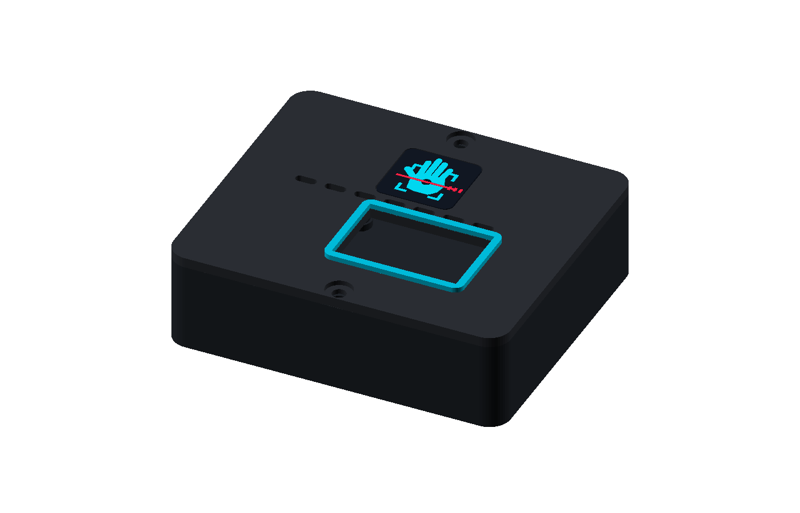

Choose the compact case when the Arduino hub will sit elsewhere in the arcade
panel. The case protects the UNO Q, exposes only its USB-C connection, keeps the
Matrix visible, and leaves airflow around the board.

- Outside size: approximately **90 x 76 x 27 mm** when assembled.
- Best for: a hidden Controller, short cable runs, or the smallest possible box.
- The USB-C hub, camera cable, power cable, and optional Ethernet cable remain
  outside the enclosure.

### Controller Dock V2 - enclosed hub and full port access

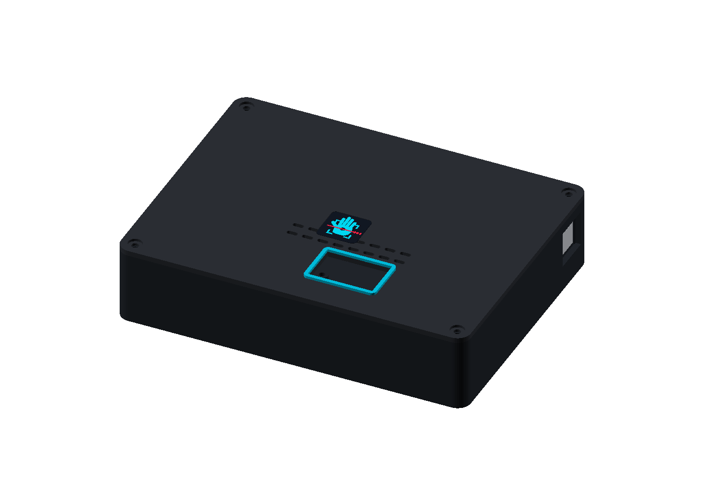

Choose V2 when the camera may use either USB-A or USB-C and the hub should be
hidden. The UNO Q and hub both sit inside the fully closed enclosure. The
rear-facing USB-C PD and data bank is reached through a generous rear opening.
The hub's Ethernet socket faces a dedicated right-side opening. USB-A or HDMI
cables connect inside and leave through rear routing openings without holding
the lid open.

- Outside size: approximately **160 x 122 x 35 mm** when assembled.
- Best for: a transferable Controller, changing cameras, or installations that
  need simultaneous power and peripheral access.
- The hub remains removable after the lid is opened, but is hidden during use.
- This is the most flexible Controller Dock for a new print.

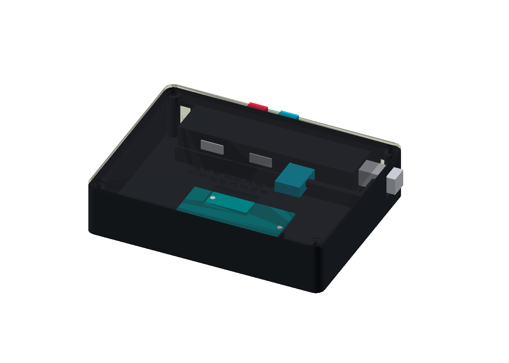

### Controller Dock V1 - original low-profile dock

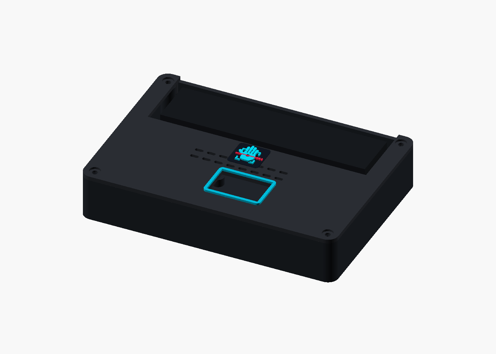

Choose V1 when the lower profile and open service bay suit a fixed installation.
Its hub sits low in the rear bay and remains visible and easy to remove. The
open top works well with a known cable arrangement, but it does not guarantee
normal plug-body clearance on both opposing long port faces at once.

- Outside size: approximately **148 x 104 x 31 mm** when assembled.
- Best for: fixed cable arrangements, pre-connected cables, or adapting an
  existing V1 print.
- The hub remains removable; it is not trapped inside a sealed hot box.

| Compare | UNO Q Case | Dock V1 | Dock V2 |
| --- | --- | --- | --- |
| Hub location | Outside the case | Open low rear service bay | Hidden inside the closed case |
| Port access | UNO Q USB-C only | Open top; cable-dependent | Rear USB-C, side Ethernet, plus internal cable routing |
| Overall height | Approximately 27 mm | Approximately 31 mm | Approximately 35 mm |
| Printed structure | Base and lid | Base and lid | Base and lid |
| Lid choices | Small emblem or full wordmark | Small emblem or full wordmark | Small emblem or full wordmark |
| Best fit | Hidden cabinet installation | Known, fixed cable arrangement | Flexible camera and network connections |

For assembly at the workbench, use the
[eight-page Enclosure Assembly Quick Reference](ENCLOSURE_QUICK_REFERENCE.md).
It provides one uninterrupted, model-accurate procedure for each enclosure.
This guide adds print settings, fit checks, the reason behind important steps,
and troubleshooting.

<!-- PAGEBREAK -->

## What you need

VirtualGlove supplies the digital print files. The UNO Q, hub, fasteners,
inserts, tools, cables, adhesive, and other physical parts are not included.

For the least ambiguous download, choose the complete bundle for the enclosure
you are printing. Existing individual STL and 3MF links remain available below:

- [UNO Q Case print-file bundle](../hardware/enclosures/bundles/VirtualGlove-UNO-Q-Case-Print-Files.zip)
- [Controller Dock V1 print-file bundle](../hardware/enclosures/bundles/VirtualGlove-Controller-Dock-V1-Print-Files.zip)
- [Controller Dock V2 print-file bundle](../hardware/enclosures/bundles/VirtualGlove-Controller-Dock-V2-Print-Files.zip)

Each bundle separates structural parts, matching branding, fit tests, finishing,
and parametric source. Read its `PARTS.txt` before slicing. The optional large
target badge is not included because it does not fit a lid recess.

### Shared hardware and tools

| Item | Quantity | Purpose |
| --- | ---: | --- |
| Arduino UNO Q | 1 | Runs VirtualGlove |
| Arduino USB-C Hub (8 in 1) | 1 | Camera, power, and optional Ethernet; external with the compact case |
| M3 x 8 mm board screws | 4 | Fasten the UNO Q to its standoffs |
| M3 x 8-12 mm case screws | 4 | Fasten the lid to the base |
| M3 heat-set inserts | 4 | Approximately 4.0-4.2 mm outside diameter; receive the case screws |
| Heat-set insert tool | 1 | Seats the inserts squarely |
| M3 driver | 1 | Installs the board and case screws |
| Adhesive rubber feet | 4 | Keeps the enclosure stable and allows bottom airflow |

### UNO Q Case print set

- [UNO Q base](../hardware/enclosures/stl/virtualglove-uno-base.stl)
- Choose one lid: [small-emblem inset](../hardware/enclosures/stl/virtualglove-uno-lid.stl)
  or [full-wordmark inset](../hardware/enclosures/stl/virtualglove-uno-lid-full-logo.stl)
- [USB-C fit coupon](../hardware/enclosures/stl/virtualglove-usb-c-fit-coupon.stl)

The hub is still required, but it remains outside this enclosure and connects
through the broad USB-C opening.

### Controller Dock V2 print set - enclosed hub

- [Dock V2 enclosed-hub base](../hardware/enclosures/stl/virtualglove-dock-v2-base.stl)
- Choose one lid: [small-emblem inset](../hardware/enclosures/stl/virtualglove-dock-v2-lid.stl)
  or [full-wordmark inset](../hardware/enclosures/stl/virtualglove-dock-v2-lid-full-logo.stl)
- [USB-C fit coupon](../hardware/enclosures/stl/virtualglove-usb-c-fit-coupon.stl)
- [Hub fit coupon](../hardware/enclosures/stl/virtualglove-hub-fit-coupon.stl)

V2 uses only two structural printed pieces. Its hub cradle and rear cable paths
are part of the base. The lid covers both the UNO Q and the hub completely.

### Controller Dock V1 print set - original low-profile dock

- [Dock V1 low-profile base](../hardware/enclosures/stl/virtualglove-dock-base.stl)
- Choose one lid: [small-emblem inset](../hardware/enclosures/stl/virtualglove-dock-lid.stl)
  or [full-wordmark inset](../hardware/enclosures/stl/virtualglove-dock-lid-full-logo.stl)
- [USB-C fit coupon](../hardware/enclosures/stl/virtualglove-usb-c-fit-coupon.stl)
- [Hub fit coupon](../hardware/enclosures/stl/virtualglove-hub-fit-coupon.stl)

### Shared finishing parts

The enclosure works without decorative pieces. The Matrix bezel is recommended
for a finished edge around the display; choose one emblem only if wanted.

| Finishing part | Downloads |
| --- | --- |
| Matrix bezel | [Cyan bezel](../hardware/enclosures/stl/virtualglove-matrix-bezel.stl) |
| Small lid emblem | Separate: [dark backing](../hardware/enclosures/stl/virtualglove-lid-logo-backing.stl), [cyan hand and target](../hardware/enclosures/stl/virtualglove-lid-logo-cyan.stl), [red target beam](../hardware/enclosures/stl/virtualglove-lid-logo-red.stl); ACE: [single multicolour 3MF](../hardware/enclosures/stl/virtualglove-lid-logo-multicolor.3mf) |
| Compact-case wordmark | For the UNO Q full-wordmark lid only. Separate: [inset backing](../hardware/enclosures/stl/virtualglove-compact-full-logo-backing.stl), [cyan hand and wordmark](../hardware/enclosures/stl/virtualglove-compact-full-logo-cyan.stl), [red accents](../hardware/enclosures/stl/virtualglove-compact-full-logo-red.stl); ACE: [single multicolour 3MF](../hardware/enclosures/stl/virtualglove-compact-full-logo-multicolor.3mf) |
| Full-size dock wordmark | Fits the full-wordmark lid for Dock V1 and Dock V2. Separate: [inset backing](../hardware/enclosures/stl/virtualglove-full-logo-backing.stl), [cyan hand and wordmark](../hardware/enclosures/stl/virtualglove-full-logo-cyan.stl), [red accents](../hardware/enclosures/stl/virtualglove-full-logo-red.stl); ACE: [single multicolour 3MF](../hardware/enclosures/stl/virtualglove-full-logo-multicolor.3mf) |
| Optional larger emblem | Separate: [inset backing](../hardware/enclosures/stl/virtualglove-target-badge-backing.stl), [cyan hand and target](../hardware/enclosures/stl/virtualglove-target-badge-cyan.stl), [red target beam](../hardware/enclosures/stl/virtualglove-target-badge-red.stl); ACE: [single multicolour 3MF](../hardware/enclosures/stl/virtualglove-target-badge-multicolor.3mf) |

Every backing now has shallow locating pockets for its cyan and red inserts.
The inserts sit nearly flush instead of relying on eye alignment on a flat
plate. The small-emblem lids and full-wordmark lids have matching outer
recesses, so the completed logo locates positively in the lid. On the compact
case and Dock V1, the full-wordmark lid moves its ventilation slots clear of
the larger recess; it does not simply cover the original vents.

#### Lid-branding assembly order

Choose exactly one lid style and its matching logo set:

1. Match the **small-emblem backing** to a small-emblem lid. For a wordmark
   lid, use the **compact wordmark** on the UNO Q Case or the **full-size
   wordmark** on Dock V1 and Dock V2.
2. Dry-fit the dark backing in the lid recess. It should sit flat without
   covering the Matrix opening or ventilation slots.
3. Dry-fit the cyan artwork and red accent in the backing's locating pockets.
   Each piece should sit nearly flush and must not require force.
4. Remove the pieces, apply only a small amount of adhesive, and assemble the
   cyan and red pieces into the backing.
5. Fit the completed logo set into the lid recess, then fit the separate Matrix
   bezel around the display opening.

The larger hand/target emblem is a separate decorative part and does not fit a
lid recess. The 100 x 30 mm full-size wordmark fits the matching Dock V1 and
Dock V2 lid recesses directly. It remains too wide for the compact UNO Q Case,
which uses the 76 x 22.8 mm compact wordmark.

The 3MF downloads contain the backing, cyan artwork, and red artwork in one
file with material colours assigned. In Anycubic Slicer, verify that those
three colours map to the intended ACE spools before slicing. The separate STL
sets remain available for single-colour printing and hand assembly.

The full-size plaque 3MF is also saved as an Anycubic Slicer Next project for
the four-spool order used during development: **1 black, 2 purple, 3 red, 4
cyan**. Black prints the backing, red prints the small accents, and cyan prints
the hand, target, and wordmark. Purple is intentionally loaded but unused.

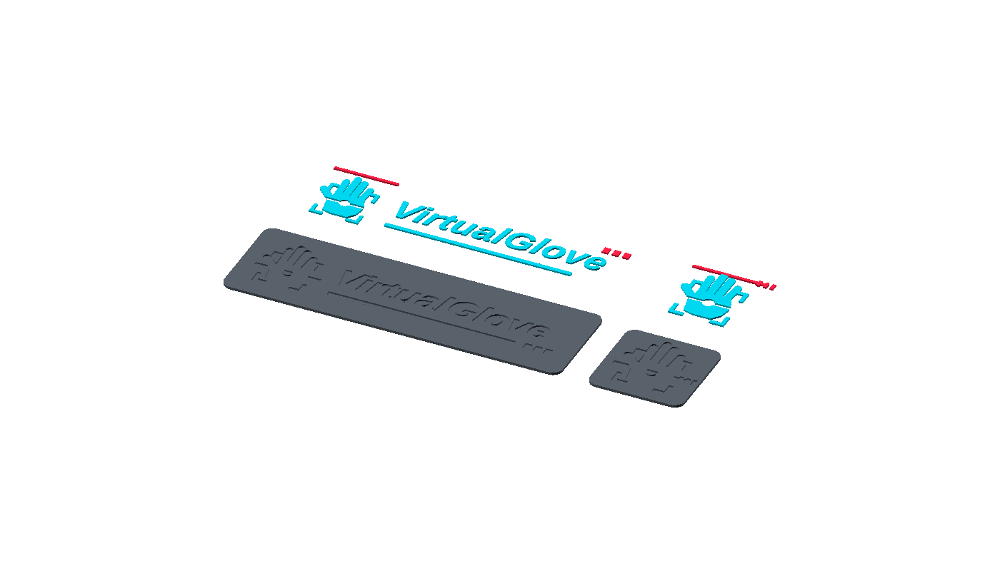

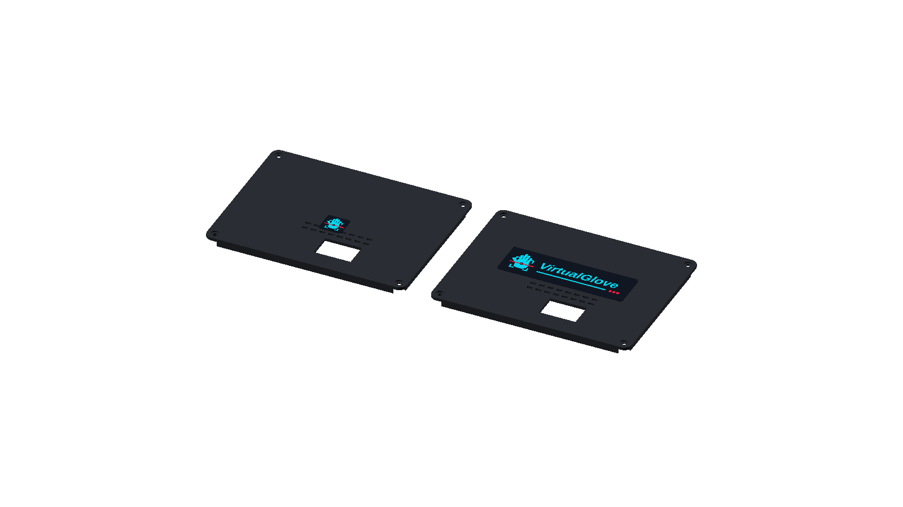

### Optional materials and connections

- Thin double-sided adhesive or plastic-safe glue for the branding layers.
- Approximately 1 mm foam or TPU strips beneath the Dock's hub if it needs a
  quieter or firmer fit.
- A camera connected to USB-A 3.0 or the USB-C data port on the hub.
- USB-C PD power connected to the hub.
- Ethernet connected through Dock V2's right-side opening, or directly to the
  external hub used with the compact case.

The hub's connector shape does not guarantee its speed. USB-A 3.0 provides up
to 5 Gbps, while this hub's USB-C data port provides 480 Mbps. A camera that
requires USB 3 bandwidth should use USB-A 3.0, with an appropriate cable or
adapter when the camera itself has a USB-C socket. Never connect the camera to
the USB-C PD power input.

The full-logo and hand/target pieces are printable adaptations of the project
artwork. They preserve the italic wordmark, hand, target, cyan linework, and red
accents while removing screen-only glow and details smaller than a dependable
0.4 mm nozzle can reproduce.

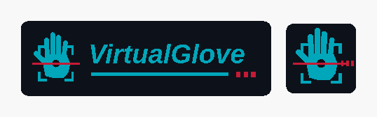

To change a dimension, download the
[parametric OpenSCAD source](../hardware/enclosures/virtualglove-controller.scad)
and the [STL export script](../hardware/enclosures/export-stl.sh).

## Prepare and print

### Current fit revision

Use the current base and lid files together. The September 20 fit revision
corrects three first-print problems found with the real UNO Q and the Arduino
hub cable:

- the four UNO Q supports now have narrow 5.4 mm tops, with wider feet only at
  the floor, so they clear the board's bottom high-speed connectors while
  retaining strength;
- the lid skirt is relieved around every corner screw boss and above the broad
  UNO Q USB-C opening, allowing the lid to sit on the case rim instead of
  stopping on a post or thick plug; and
- Dock V2 places the hub beside its right-side Ethernet opening, creating a
  substantially larger bend bay at the captive-cable end, and moves the UNO Q
  8 mm right to give the cable a gentler path into its USB-C socket.

If you printed a base or lid from an earlier download, replace both structural
pieces with the current matching files before judging the fit. Do not trim a
corner boss or force the lid over it.

### First check-in: print the coupons

Print the [USB-C fit coupon](../hardware/enclosures/stl/virtualglove-usb-c-fit-coupon.stl)
for either enclosure. If building the Dock, also print the
[hub fit coupon](../hardware/enclosures/stl/virtualglove-hub-fit-coupon.stl).

The USB-C plug should enter without scraping and should not have enough side
play to pull hard against the UNO Q socket. The hub should sit in its channel
without bowing the Dock coupon or rattling loosely.

For Dock V2, also place the real hub on the unpowered printed base before
installing electronics. Confirm that it rests in the low cradle, its USB-C
connectors align with the broad rear access opening, its Ethernet socket aligns
with the right-side opening, and the low rails remain below every connector.
Fit the intended USB-A camera cable internally and make
sure its cable—not its plug—can turn around the hub end and leave through a rear
routing opening while the lid closes without pressure.

Record the printer, material, nozzle, slicer profile, and any dimensional change
you make. In `virtualglove-controller.scad`, `fit` controls ordinary mating
clearance and `hub_fit` controls the hub cradle. Do not scale the entire model
to fix one opening; change the relevant clearance instead.

### Kobra 3 PLA starting profile

- 0.4 mm nozzle
- 0.20 mm layer height
- four walls
- five top and bottom layers
- 20–25% gyroid infill
- supports off initially
- brim only if the base corners lift
- base and lid in the supplied orientation

The lid's visible face lies on the bed for a clean finish. Dock V2's internal
hub cradle prints as part of the base and does not require support. PLA is
suitable inside a normal arcade cabinet. Do not leave the Controller in a hot
car or another high-temperature location, and never cover its ventilation
slots.

### Dimensions and reference drawings

The design follows Arduino's published **68.58 x 53.34 mm** UNO Q outline and
four mounting holes. The hub envelope is **119 x 27.8 x 16 mm** with a fixed
175 mm cable. Arduino does not publish every plug-body and overmould dimension,
which is why the fit coupons are part of the build rather than an optional
extra.

The UNO Q's bottom-side parts remain below 2 mm according to Arduino. The
mounted board has 4.6 mm of clear height above the enclosure floor. Each lid
has the same outside width and depth as its base; its skirt sits 2.75 mm in from
the outside wall with 0.35 mm mating clearance. Four 9.2 mm skirt reliefs pass
around the 8 mm corner bosses, leaving 0.6 mm radial clearance. These features
let the top panel land flat on the full case rim.

- [Arduino UNO Q datasheet](https://docs.arduino.cc/resources/datasheets/ABX00162-datasheet.pdf)
- [Arduino UNO Q STEP model](https://docs.arduino.cc/resources/models/ABX00162-step.zip)
- [Arduino USB-C Hub datasheet](https://docs.arduino.cc/resources/datasheets/TPX00241-datasheet.pdf)

### Printing the branding

The lid emblem is a compact version of the hand/target project mark. For the
closest match to the VirtualGlove artwork, use charcoal or black for the
backing, cyan for the hand and target corners, and red for the target beam. The
larger optional plaque combines the same mark with the full wordmark.

For an ACE multicolour print, open the matching 3MF and confirm the charcoal,
cyan, and red material assignments. For separate printing, use the three STL
files, test each insert in its backing pocket, and glue only after the fit is
correct. The pockets provide alignment; do not force an insert that has swollen
from first-layer expansion. Separate accents avoid wasting material on colour
changes through an entire enclosure.

Use a small amount of thin double-sided adhesive or plastic-safe glue. Dry-fit
the pieces first; the detailed layers are intentionally shallow and should not
be forced.

## Understand and assemble

### Rear and side views

Left and right are named while looking at the Controller from the front/Matrix
side. The coloured connector blocks in the V2 illustrations identify the
hidden hub; they are not additional printed parts. Red marks USB-C PD power,
cyan marks USB-C data or USB-A 3.0, and silver represents other hub connectors,
including Ethernet.

#### Controller Dock V2

The hub sits inside the rear of the closed case. The rear view shows direct
access to its outward-facing USB-C bank plus cable-routing openings at the
corners. The cutaway shows how a cable plugged into the inward-facing USB-A
bank turns around the hub and exits at the rear. The right view shows the
separate Ethernet opening.

| View | Controller Dock V2 | What to check |
| --- | --- | --- |
| Front |  | Lid closes over both the UNO Q and hub. |
| Rear | 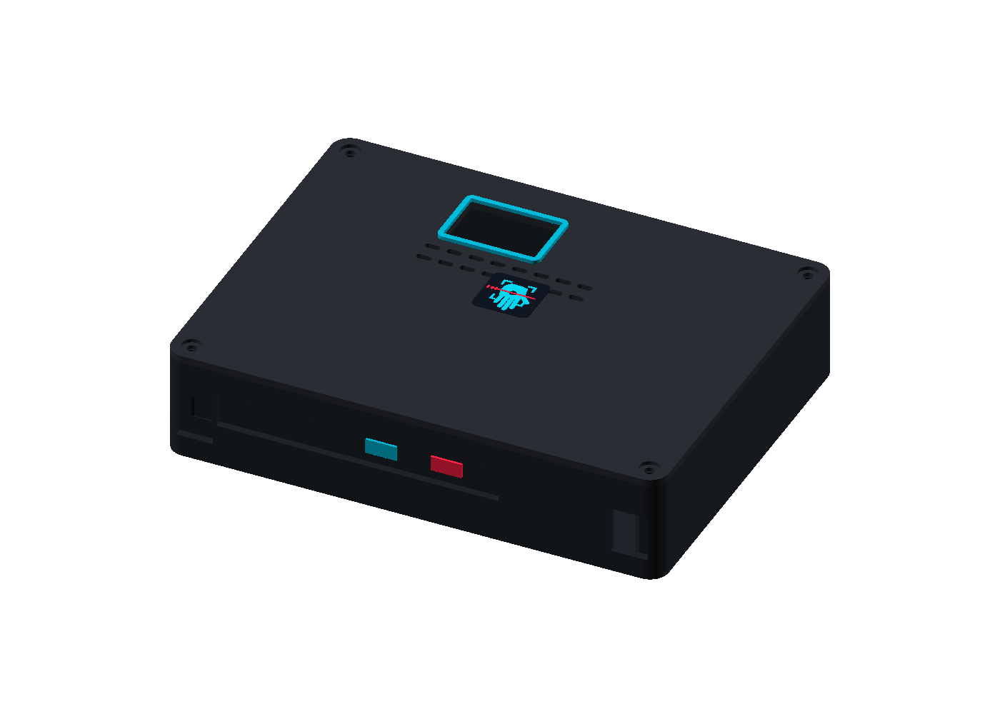 | USB-C PD and data remain directly pluggable; routed cables leave through the corner openings. |
| Left | 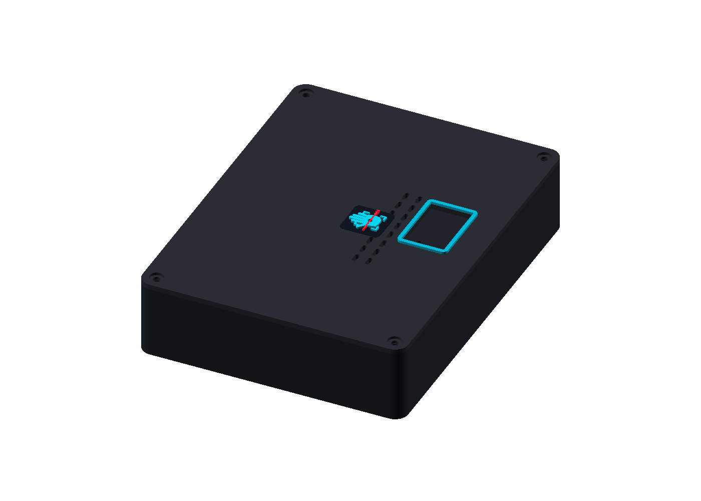 | No hub body or loose connector projects above the lid. |
| Right | 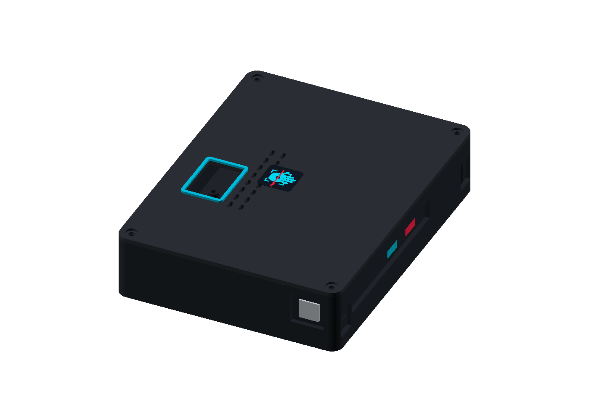 | Ethernet plugs directly into the hidden hub through the side opening. |

The V2 port-access view deliberately makes the lid translucent. It shows
representative USB-C plugs entering from the rear and a USB-A plug fitted
inside. It verifies the intended routing concept, not the exact shape or bend
radius of every third-party cable.


#### UNO Q Case and Controller Dock V1

The UNO Q Case exposes the broad USB-C opening. Dock V1 uses the original open,
low rear service bay. Both are complete, supported alternatives rather than
historical diagrams included only for reference.

| View | UNO Q Case | Controller Dock V1 |
| --- | --- | --- |
| Rear | 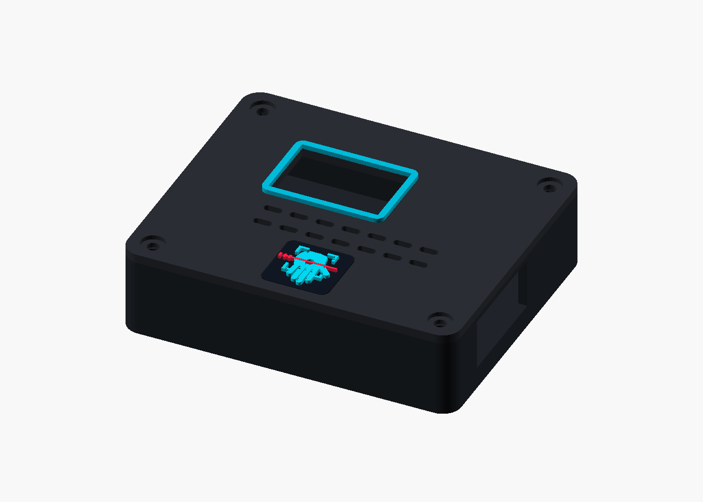 | 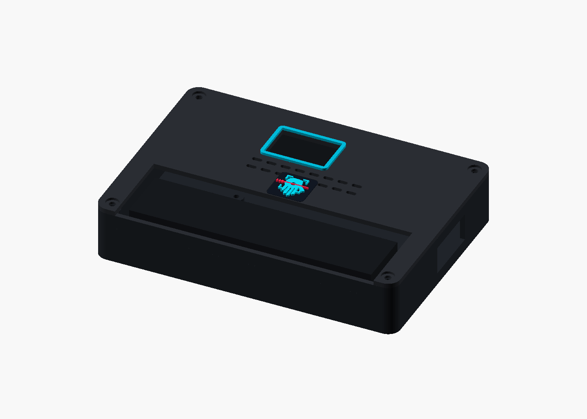 |
| Left | 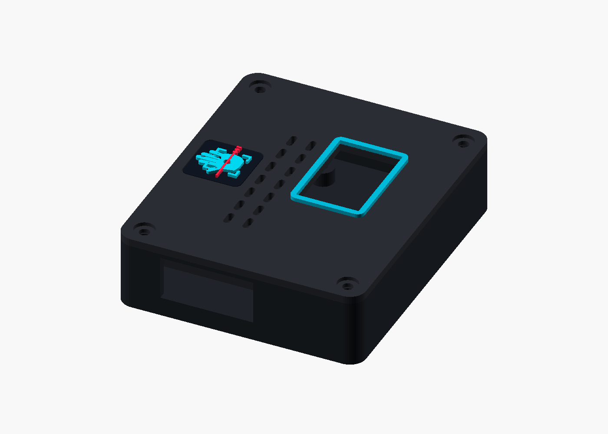 | 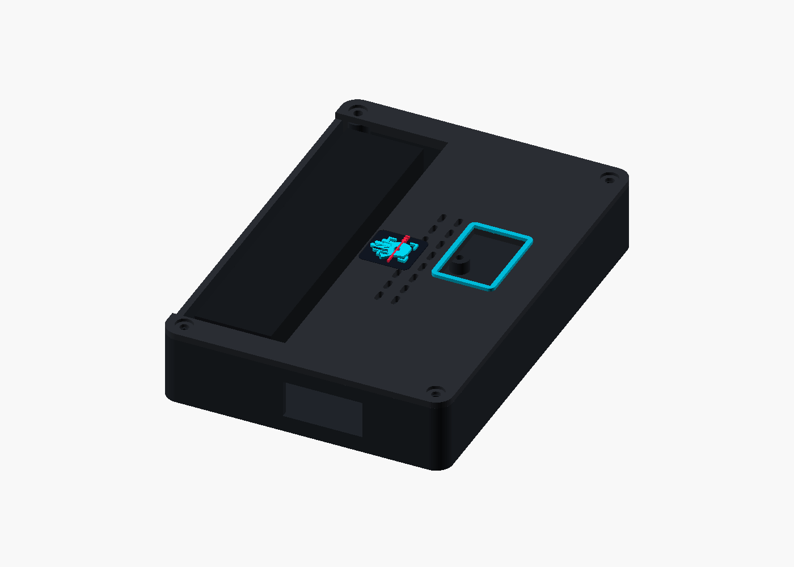 |
| Right | 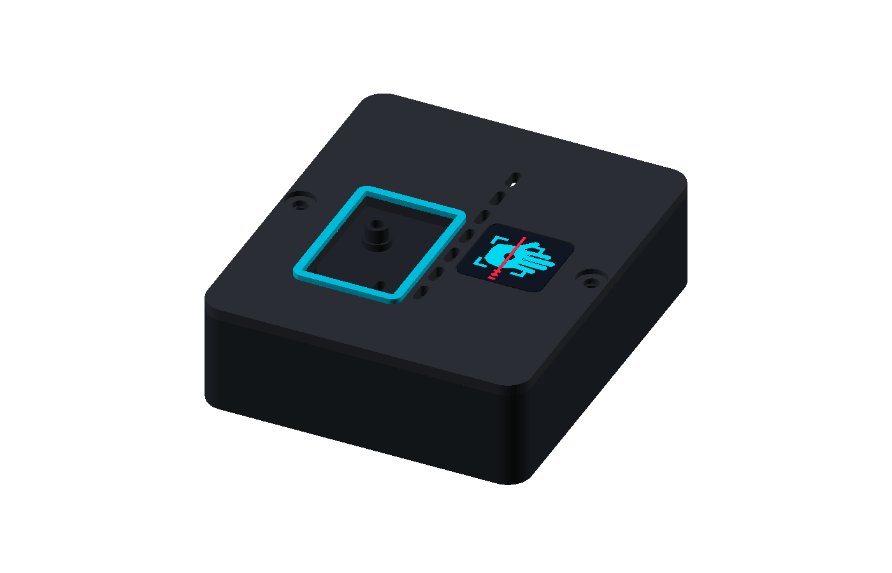 | 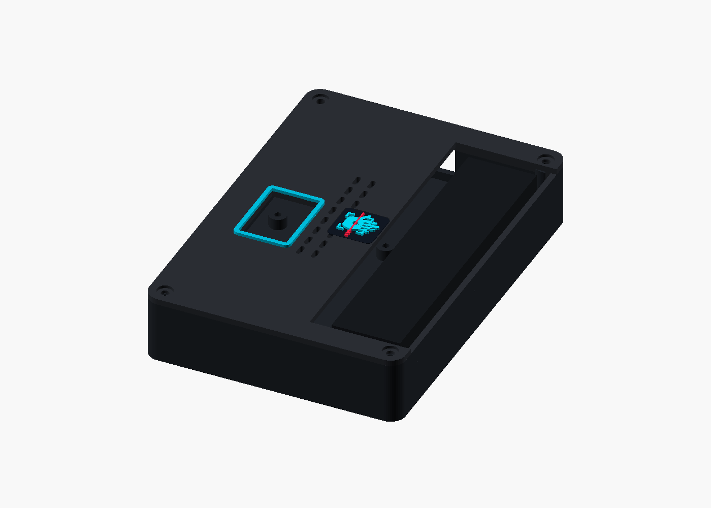 |

### Exploded assembly

These views show the assembly order rather than print orientation. Fasteners
and heat-set inserts are omitted so the main layers remain easy to see. In V2,
the UNO Q and hub both seat in the base before the lid closes over them. The
original V1 hub instead remains visible in its low open rear bay.

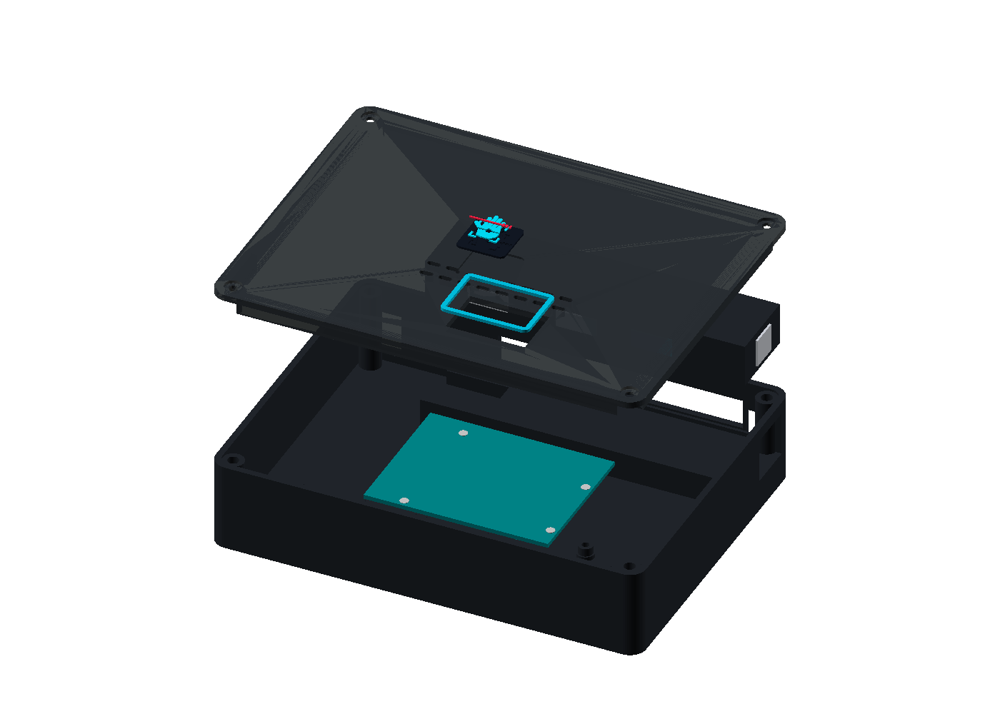

| UNO Q Case | Controller Dock V1 |
| --- | --- |
| 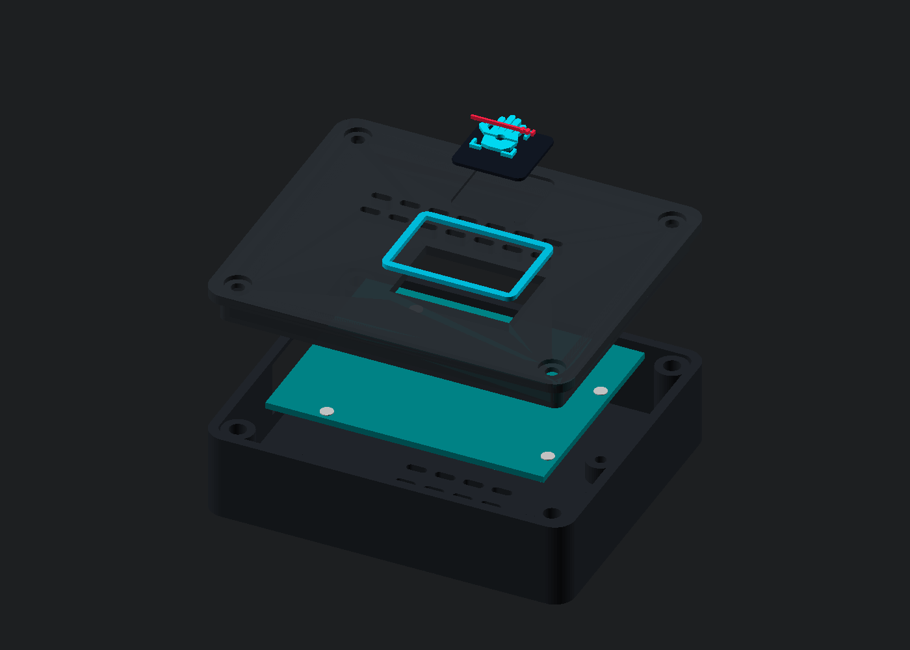 | 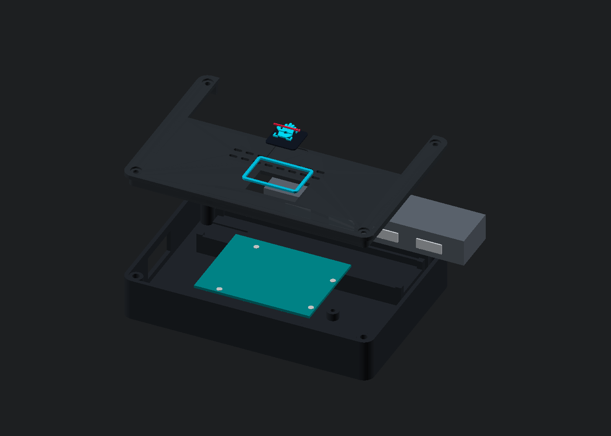 |

Keep the
[eight-page Enclosure Assembly Quick Reference](ENCLOSURE_QUICK_REFERENCE.md)
beside the workbench for the model-accurate sequence. Page 3 covers the UNO Q
Case, pages 4-5 cover Dock V1, pages 6-7 cover Dock V2, and page 8 is the shared
inspection. The detailed steps below use the same numbers and explain the fit
checks that accompany each action.

### Assemble the UNO Q Case

These six steps match page 3 of the Assembly Quick Reference.

1. **Seat the four inserts.** Heat the four inserts into the corner bosses. Keep them square and stop when
   they are flush; excess heat can soften the boss.
2. **Place the UNO Q.** Set it on the four standoffs with the USB-C socket facing the
   broad opening.
3. **Fasten the board.** Use four M3 x 8 mm screws. Tighten only until the board is secure and remains flat.
4. **Check USB-C clearance.** Connect the Arduino hub through the opening and confirm its plug does not press sideways on the socket.
5. **Choose and dry-fit the branding.** Match one lid logo set to the printed
   lid. Dry-fit its backing, cyan artwork, and red accent, and confirm that the
   Matrix opening, ventilation slots, and separate bezel remain clear.
6. **Close and add feet.** Fasten the lid and attach four rubber feet, then complete the shared pre-power inspection.

Only the UNO Q USB-C port is intentionally exposed. Do not force a thick plug
through the opening; adjust and reprint the coupon if necessary.

### Assemble Controller Dock V2

These eight steps match pages 6-7 of the Assembly Quick Reference.

1. **Seat the four inserts.** Heat them into the corner bosses, keeping them square and flush.
2. **Mount the UNO Q.** Place it with the USB-C socket facing the broad opening, then fasten it without bending the board.
3. **Orient the hidden hub.** Seat it in the rear cradle with its USB-C PD and data bank facing the
   broad rear opening. Route its captive cable internally to the UNO Q without
   twisting the socket. The Ethernet end sits beside the right wall; the open
   bay at the hub's left end is reserved for the thick captive cable.
4. **Connect the captive cable.** Route the hub lead through its internal channel to the UNO Q without pulling or twisting either connector.
5. **Choose the camera route.** If the camera uses USB-A, connect it to the inward-facing USB-A 3.0 port now.
   Turn the flexible cable—not the plug—around the left hub end and out a rear
   routing opening.
6. **Keep power and Ethernet clear.** If the camera uses USB-C, leave its data port accessible through the rear
   bank. Keep the neighbouring USB-C PD power input accessible as well. If
   using Ethernet, confirm the RJ45 socket faces the right-side opening.
7. **Dry-fit the lid.** Confirm it closes completely without touching the hub,
   plugs, cables, or board and that no cable is pinched at a routing opening.
   Look through the open base and confirm all four skirt reliefs surround their
   corner bosses rather than resting on them.
   Remove the lid, connect any remaining internal cable, and repeat the closure
   check. Plug rear-accessible USB-C cables in only after the lid is fastened.
8. **Close and finish.** Add the Matrix bezel and the matching assembled lid
   logo set, fasten the lid, and attach four rubber feet.

The rails locate the hub and are intentionally lower than its connector
openings. If a rail or rear opening obstructs a plug, or the lid presses on an
internally connected cable, stop and adjust the model rather than forcing it.

### Assemble Controller Dock V1

These eight steps match pages 4-5 of the Assembly Quick Reference.

1. **Seat the four inserts.** Heat them into the corner bosses, keeping them square and flush.
2. **Place the UNO Q.** Set it on its standoffs with the USB-C socket facing the broad opening.
3. **Fasten the board.** Use four M3 x 8 mm screws and keep the board flat.
4. **Add optional cradle padding.** Fit thin foam or TPU strips to the low hub cradle only if desired.
5. **Connect the captive cable.** Route it through the internal channel and connect it to
   the UNO Q.
6. **Seat the hub.** Lower it into the open rear bay without trapping the captive lead.
7. **Connect the fixed cable set.** Confirm the ports required by this arrangement, the Ethernet
   end, and the captive lead are free.
   Connect the camera to a USB-A 3.0 port, power to the hub's USB-C PD input, and
   optional Ethernet.
8. **Close and finish.** Fit the lid, Matrix bezel, and the matching assembled
   lid logo set, then add four rubber feet.

### Second check-in: inspect before power

Before switching on the Controller, confirm:

- the board is flat and no standoff is twisting it;
- screw heads and inserts cannot touch components or solder joints;
- the hub and USB-C cable are not pushing sideways on the UNO Q socket;
- the Matrix window and every ventilation opening are clear;
- no loose screw, wire strand, or printed debris remains inside; and
- the lid closes without pressure on the board, hub, or cables.

Power the assembled Controller for 30 minutes with the camera active. Check that
the case remains comfortable to touch, the camera stays connected, and the
Matrix and Dashboard behave normally. A warm board is expected; a softening PLA
case, repeated USB disconnect, or unusually hot enclosure is not.

## Customize and maintain

### Make a revision

Open `virtualglove-controller.scad` in OpenSCAD. The dimensions and clearances
that are most likely to need adjustment are grouped at the top of the file.
Choose a part from the `part` selector, preview it, and export it directly, or
regenerate the complete checked-in STL set with:

```bash
hardware/enclosures/export-stl.sh
```

Keep the source file, STL files, and this guide together in a check-in. Note the
printer and measured fit when changing a hardware dimension so the next person
can tell whether the change is universal or printer-specific.

### Safety and limits

- Disconnect power before opening the case.
- Handle the UNO Q with normal electrostatic-discharge care.
- Never force the board, hub, plug, insert, or lid into place.
- Keep metal fasteners and decorative foil away from antennas and electronics.
- Keep airflow paths open and inspect PLA periodically in a warm cabinet.
- Treat this as a first-fit printable design until it has been measured against
  the exact hub, plugs, inserts, and printer that will be used.

The enclosure protects and organizes the Controller; it does not make the UNO Q
or hub waterproof, impact-rated, or suitable for outdoor use.
