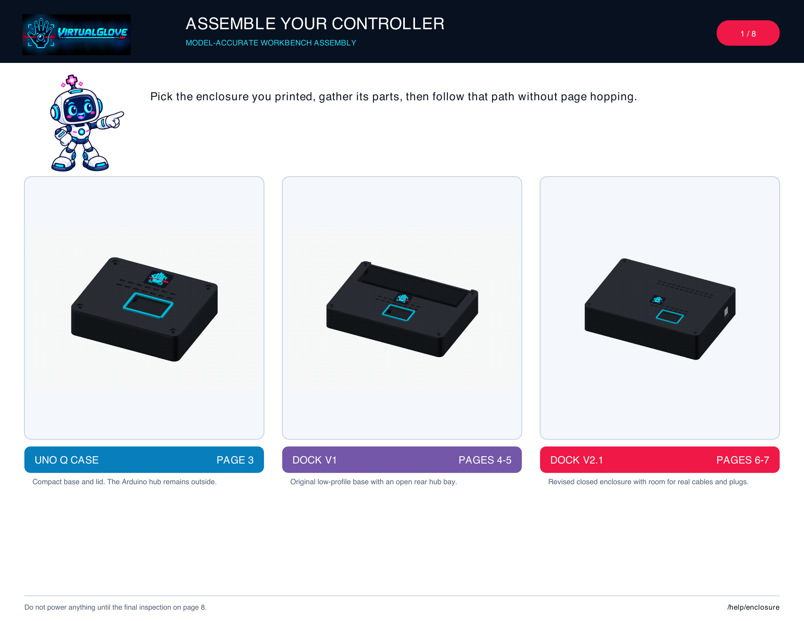
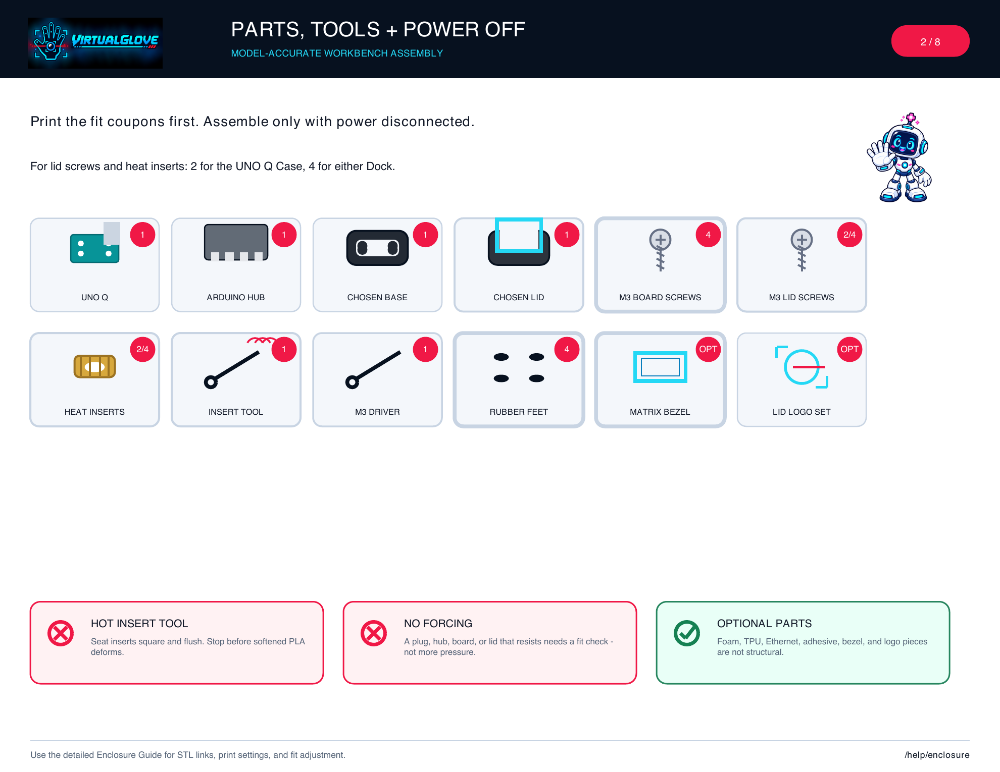
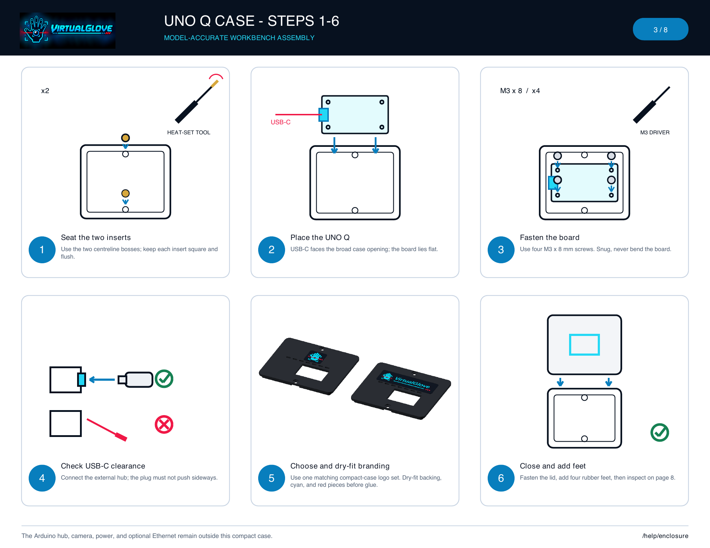
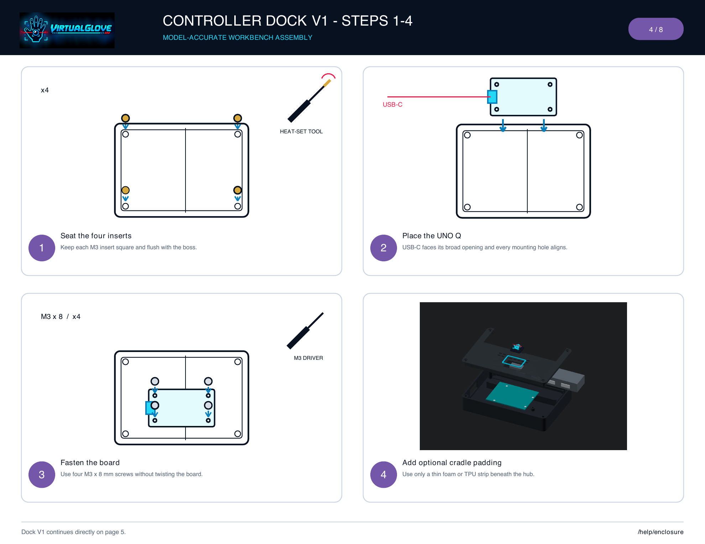
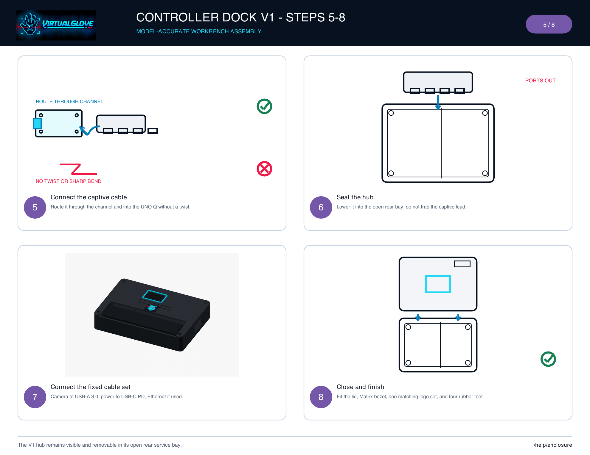
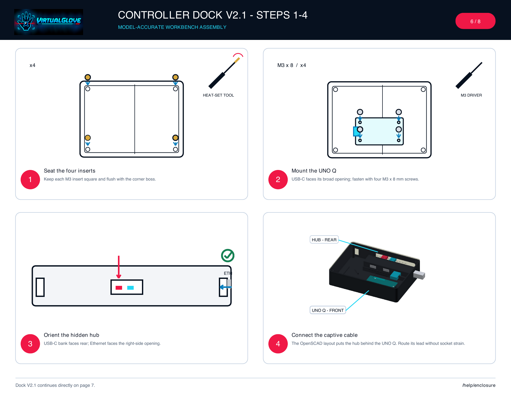
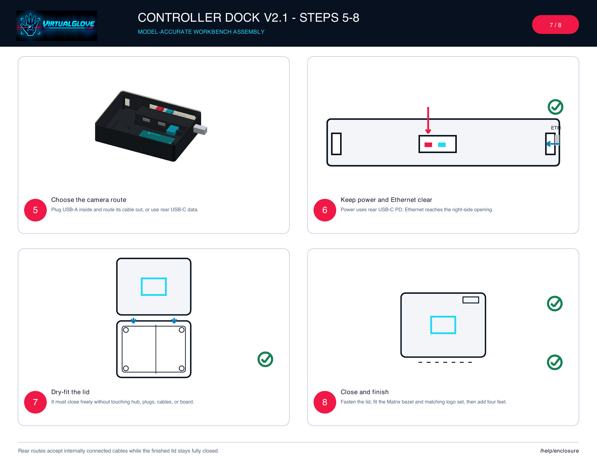
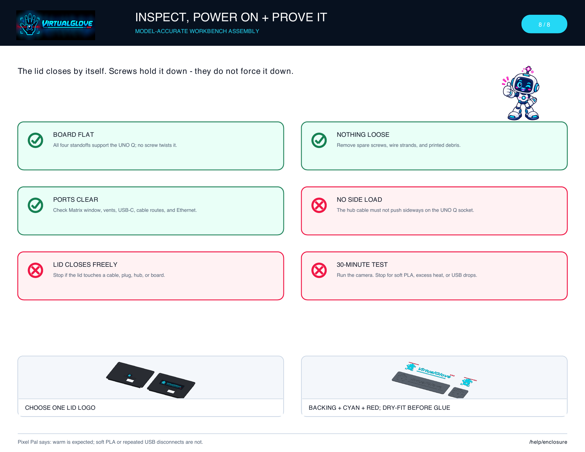

# VirtualGlove Enclosure Assembly Quick Reference

This is the on-screen edition of the eight-page workbench manual supplied as a
printable PDF. It is an assembly sequence, not a product catalogue: identify
the enclosure you printed, gather the parts on page 2, and follow that
enclosure's numbered path without skipping ahead.

Every enclosure drawing comes from the maintained OpenSCAD geometry. Arrows,
numbers, outlines, and captions carry the instructions even when the pages are
printed without colour. Pixel Pal appears only where a warning or milestone
benefits from a friendly second look.

## Page 1 - choose your assembly path

- **UNO Q Case:** page 3. The hub remains outside the compact case.
- **Controller Dock V1:** pages 4-5. The hub sits in the open rear service bay.
- **Controller Dock V2.1:** pages 6-7. The hub is hidden inside the closed case.
- **Final inspection:** page 8 for every enclosure.

## Page 2 - gather parts and disconnect power

Have the selected base and lid, UNO Q, Arduino hub, four board screws, four lid
screws, four heat-set inserts, insert tool, M3 driver, and four rubber feet on
the workbench. The Matrix bezel, one matching lid logo set, Ethernet cable, adhesive, foam,
and TPU are optional. Print and check the fit coupons before installing
electronics.

> **Stop:** Disconnect power before handling the board or hub. Heat-set inserts
> can soften PLA quickly; keep them square and stop when they are flush.

## Page 3 - assemble the UNO Q Case

1. Seat the four heat-set inserts square and flush.
2. Place the UNO Q with USB-C facing the broad opening.
3. Fasten the board with four M3 x 8 mm screws without bending it.
4. Connect the external hub and check that its plug does not push sideways.
5. Choose one lid logo style. Dry-fit its backing, cyan insert, and red insert
   in the matching lid recess before using adhesive.
6. Fasten the lid, attach four rubber feet, and continue to page 8.

## Pages 4-5 - assemble Controller Dock V1

1. Seat the four heat-set inserts square and flush.
2. Place the UNO Q with USB-C facing its broad opening.
3. Fasten the board without twisting it.
4. Add a thin foam or TPU hub pad only if wanted.

5. Route the captive hub cable through its channel and connect it to the UNO Q.
6. Lower the hub into the open rear bay without trapping the cable.
7. Connect camera, USB-C PD power, and optional Ethernet for the fixed layout.
8. Fit the lid, Matrix bezel, one matching logo set, and four rubber feet.

## Pages 6-7 - assemble Controller Dock V2.1

Before step 1, verify its slimmer board
posts with the mount-pattern coupon and verify the chosen 100 x 30 mm wordmark
with the recess coupon. V2.1 provides a wide cable bay, low cable guides, plug
headroom, and a short lid skirt that clears the screw bosses.

1. Seat the four heat-set inserts square and flush.
2. Mount the UNO Q with USB-C facing its broad opening.
3. Place the hub against the right-side Ethernet opening, with its USB-C bank
   facing rear and the captive-cable bend bay open on the left.
4. Route the captive lead through that open bay to the UNO Q without forcing a
   tight bend or straining the socket.

5. Connect a USB-A camera inside and route its flexible cable out, or leave the
   rear USB-C data port available for a USB-C camera.
6. Keep the rear USB-C PD power input and right-side Ethernet opening clear.
7. Dry-fit the lid. It must close without pressing on the board, hub, plugs, or
   cables and without pinching a routed cable. Its four skirt reliefs must pass
   around the corner screw bosses.
8. Fasten the lid and fit the Matrix bezel, one matching logo set, and rubber feet.

## Page 8 - inspect and test

Before power, confirm the board is flat, nothing conductive is loose, ports and
vents are clear, the USB-C connection has no side load, and the lid closes
freely. Then run VirtualGlove with the camera active for 30 minutes. Stop for
softening PLA, unusual heat, or repeated USB disconnects.

Lid branding always uses one complete set: dark backing, cyan artwork, and red
accent. The optional full-size plaque and larger emblem are separate decorative
parts and do not fit the lid recesses.

Download the matching print bundle before you begin:

- [UNO Q Case print files](../hardware/enclosures/bundles/VirtualGlove-UNO-Q-Case-Print-Files.zip)
- [Controller Dock V1 print files](../hardware/enclosures/bundles/VirtualGlove-Controller-Dock-V1-Print-Files.zip)
- [Controller Dock V2.1 print files](../hardware/enclosures/bundles/VirtualGlove-Controller-Dock-V2.1-Print-Files.zip)

Use the [Controller Enclosure Guide](ENCLOSURE_GUIDE.md) for printer settings,
fit adjustments, detailed explanations, and troubleshooting.
