# Play with VirtualGlove

The **VirtualGlove Controller (Arduino UNO Q)** watches your hand and sends
the recognized controls to RetroPie.

This guide provides game-specific play cards and explains how to use the
original Programs 1–14 and cartridge Programs A–I. It shows you which gestures to make, what controls
they produce, and how to try them with other games in your library.

Find your game below, check its profile, and try the first-round exercise.
If the system is not installed yet, start with the [Installation Guide](INSTALL_README.md).

## Play Rock Paper Scissors locally

Open **Play** at `http://UNO-Q-NAME.local:8088/play` for a first-to-three match
against Pixel Pal. This local game uses the Controller camera and pauses cabinet
input while the page is open, so RetroPie does not need to be connected.

| Your move | Make this pose | See it |
| --- | --- | --- |
| Rock | Close all five fingers into a comfortable fist. |  |
| Paper | Face an open, relaxed palm toward the camera. |  |
| Scissors | Extend the index and middle fingers in a V sign. |  |

Select **Start round**, follow the countdown, and hold the pose after **Shoot!**
until its button is highlighted. The first player to win three rounds takes the
match. Mouse and touch buttons remain available if the camera is unavailable.


## Get ready to play

Choose your player in **Active player** so practice and sensitivity changes belong
to you. Select a profile on Dashboard and wait for the camera view. Starting
straight after a reboot can take longer.

1. Stand where the camera can see your whole hand, with room to move on every side.
2. Face a relaxed open palm toward the camera. On first use, or after moving the camera or changing your playing position, select **Center hand** and hold still until it finishes. Otherwise use your saved resting position.
3. Select **Start controller** when ready. If the tracker is reconnecting, Start remains pending until it can be delivered; **Stop controller** cancels that request.
4. Launch a registered game and allow its short startup pause to finish. Check the selected profile on Dashboard against the play card below; the card also shows its matrix display.
5. Try one gesture at a time. Return to your resting position between attempts. In standard movement profiles this stops directional input; Nestopia (VirtualGlove) follows your hand's position continuously.

**Start controller** stays armed across Controller restarts, but sends controls
only while a registered game or a manually selected Dashboard profile is active.
Exiting the game or losing its session releases controls. **Stop controller**
keeps delivery stopped until you explicitly start it again. Use it before
repositioning yourself or the camera.

### Read the camera view

The overlay labels the detected hand **Right** or **Left** and shows the tracker's
confidence. Dashboard's D-pad, button, and axis readings show the controls your
hand produces. Keep your whole hand visible and use small, comfortable movements.
If your resting hand causes unwanted movement, recalibrate in that position.


> **Pixel Pal's Extra-Digit Hunt:** Some glove illustrations have five fingers
> plus a thumb. Count every six-digit hand once per appearance, including
> repeated artwork. Pixel Pal reveals the answer at the back of this guide.

## Practise with Glove Academy

Open **Glove Academy** from the main navigation to practise with Pixel Pal.
Cabinet controller output pauses while you learn. The sixteen lessons cover
showing your hand, finding your resting position, four movement directions,
index and thumb curls, Start and Select poses, forward and backward movement,
wrist rolls, a closed hand, and Menu guard.

Complete all sixteen lessons to earn **Glove Master**. The award replaces the
lesson card. Progress is saved for the selected player across browsers and
restarts; **Start again** clears that player's saved lesson progress and returns
to the lessons. It does not clear their hand settings.

Glove Academy practises recognition, not each game's button assignments.
Use the gesture reference next, then your game's play card. For a difficult
pose, see [Make the controls fit your hand](#make-the-controls-fit-your-hand).

<!-- PAGEBREAK -->

## Your gesture reference

Practice one movement at a time in **Glove Academy**. Your selected profile
decides what each gesture does in a game; the play cards below show the mapping.
This reference also includes game-specific finger poses and combinations beyond
the sixteen Academy lessons. The glove is an illustration: the Controller
tracks your bare hand.

### Resting position and movement

| Gesture | See it | Try it |
| --- | --- | --- |
| Show an open hand |  | Open your fingers comfortably and keep your whole palm visible. |
| Find your resting position |  | Hold a relaxed open hand at your saved centre and distance. |
| Move left |  | Slide your whole hand left. |
| Move right |  | Slide your whole hand right. |
| Move up |  | Raise your whole hand. |
| Move down |  | Lower your whole hand. |

With an ordinary FCEUmm joystick profile, combine horizontal and vertical movement
for diagonals. Your box is anchored to the hand center you saved during calibration;
inside it—or exactly on its boundary—all positional directions stop immediately.
Its effective size is never less than 1.5 times your saved hand size. Change its
chosen size in Setup.

### Wrist and depth movements

| Gesture | See it | Try it |
| --- | --- | --- |
| Roll wrist left |  | Tilt your hand left at the wrist. |
| Roll wrist right |  | Tilt your hand right at the wrist. |
| Push toward camera |  | Push deliberately, then return. Holding your hand nearby does not trigger a new Glove Zap. |
| Pull away from camera |  | Pull away deliberately, then return. Holding your hand far away does not trigger a new Pull Back. |

<!-- PAGEBREAK -->

### Finger and hand poses

| Gesture | See it | Try it |
| --- | --- | --- |
| Curl index finger |  | Bend your index finger toward your palm. |
| Curl thumb |  | Fold your thumb across your palm. |
| Curl middle finger |  | Bend your middle finger toward your palm; used in Bad Street Brawler and Joust. |
| Curl ring finger |  | Bend your ring finger toward your palm; used in Defender II. |
| Close your hand |  | Curl your thumb and all four fingers into a comfortable fist. |
| Keep index straight |  | Keep your index finger extended for Gyruss fire. |
| Point index |  | Extend index and curl middle, ring, and pinky for the native Super Glove Ball Robo-Bullet. |

### Menu poses

| Gesture | See it | Try it |
| --- | --- | --- |
| V sign |  | Extend index and middle, curl ring and pinky, and hold steadily for about half a second for Start or pause. |
| Thumbs-up |  | Extend your thumb, close all four fingers, and hold until Select is recognized. |
| Menu guard |  | Curl thumb and ring only; keep index, middle, and pinky extended. |

Start and Select send controller inputs; their effect depends on the game.
The V sign and thumbs-up suppress A/B actions while forming, but some profiles
can still produce movement. Keep your hand near its resting position. Use a
physical controller if a game requires Select and a direction together.

Menu guard suppresses D-pad, A/B, Start, and Select, and cancels a pending Start
press. It does **not** freeze native continuous hand positioning. For a dependable
pause in all controller delivery while you reposition, use **Stop controller**.

<!-- PAGEBREAK -->

## Original Programs 1–14

These profiles reproduce the built-in Power Glove programs with camera gestures
and ordinary NES controller output. Numeric programs pulse A and B by default,
except Program 9. Program 14 stops camera tracking and sends no VirtualGlove
input so a conventional controller can be used without ending the authenticated
game session.

| Program | Core controls | Games in Mattel's index |
| --- | --- | --- |
| 1 | Hand position is the D-pad; thumb is rapid A; index is rapid B; curling the last three fingers performs one bounded turn-and-B action. | Blades of Steel; Blaster Master; Bubble Bobble; Castlevania; Castlevania II: Simon's Quest; Contra; Deadly Towers; Donkey Kong Classics; Double Dribble; Gauntlet; Gradius; Jackal; Kid Icarus; Kung-Fu Heroes; Metal Gear; Metroid; Mickey Mousecapade; Operation Wolf; Platoon; Racket Attack; Rampage; RoboWarrior; Rygar; Seicross; Star Force; Superman; Xenophobe; Zelda II: The Adventure of Link |
| 2 | Program 1 movement and buttons, plus live **Centered** / **Return to centre** feedback in place of the physical glove's beeper. | Centering-practice alternative; no indexed title |
| 3 | Push / pull sends Up / Down; side movement sends Left / Right; thumb / index sends rapid A / B. | Ice Hockey; Top Gun. Gauntlet may also use this as an alternative top-view layout, although the index assigns it to Program 1. |
| 4 | Open or close all four fingers for Up / Down; index-versus-last-three poses steer the treads; thumb sends rapid A; wrist poses send held B or Up plus Left / Right. | Iron Tank |
| 5 | Push / pull and bank / side movement fly the craft; thumb / index sends rapid A / B. | Alpha Mission; Life Force; Xevious; 1943 |
| 6 | Position and depth move; index sends A; thumb sends B; last three sends A+B; forward fist holds Up; clockwise twist turns rapidly twice. | Double Dragon |
| 7 | Open-hand movement dodges and ducks; forward fists punch high or low; clockwise wrist blocks; pull-back fist sends Select; thumb sends rapid A. | Mike Tyson's Punch-Out!! |
| 8 | Position and depth select bases or fielding direction; thumb, index, counter-clockwise wrist, and pull-back produce the documented offense / defense A and B actions. | Baseball; Bases Loaded; R.B.I. Baseball |
| 9 | Make a fist to ready the profile. Wrist rotation steers; forward fist is turbo; raising the hand sends Down; lowering sends B; fist sends A. No rapid fire. | Rad Racer |
| 10 | Index / last-three curls steer Left / Right; thumb sends rapid A; B is held automatically until the hand is lowered. | R.C. Pro-Am |
| 11 | Program 1 controls, but the last-three-finger pose turns rapidly in both directions while firing B. | Fast-turn alternative; no indexed title |
| 12 | Position moves Mario; thumb / index sends rapid A / B; middle curl adds B for fast travel; last-three curl slows horizontal travel. | Super Mario Bros. |
| 13 | Thumb / index sends rapid A / B. Camera D-pad output is neutral, leaving movement and menus to a conventional controller. | No indexed title |
| 14 | VirtualGlove camera and output are paused while the selected profile and game session remain visible. | Anticipation; temporary manual menu or password entry |

The shipped exact-filename registry supplies `.nes`, `.zip`, and `.7z` entries.
It also applies Mattel's rapid-fire exceptions: rapid A is off for Alpha Mission
and Blaster Master; rapid B is off for Ice Hockey; both are off for Double
Dribble and Racket Attack.

<!-- PAGEBREAK -->

### How rapid fire behaves

Programs 1-8 and 10-14 use the original rapid-fire style for A and B: keep the
assigned finger pose held and VirtualGlove pulses that button. Program 9 holds
its controls normally and never pulses them. A registered game's exception is
part of its signed launch request, so the Dashboard's **Rapid fire** status is
the value actually applied for that game rather than a guess based on its
Program number.

| Game | Program | Automatic exception | Why it matters while playing |
| --- | --- | --- | --- |
| Blaster Master | 1 | Rapid A off | A can be held continuously while thumb curl remains active. |
| Double Dribble | 1 | Rapid A and B off | Both finger buttons behave as held controls. |
| Racket Attack | 1 | Rapid A and B off | Both finger buttons behave as held controls. |
| Ice Hockey | 3 | Rapid B off | Index curl holds B while thumb curl retains rapid A. |
| Alpha Mission | 5 | Rapid A off | Thumb curl holds A while index curl retains rapid B. |

Start, Select, Menu Guard, calibration, tracking-loss release, and the saved
joystick dead zone remain shared across every camera-active numeric Program.
Return to an open hand near the saved center between compound actions.

### Program 1 - positional control

| Profile | See it |
| --- | --- |
| `program_1` | 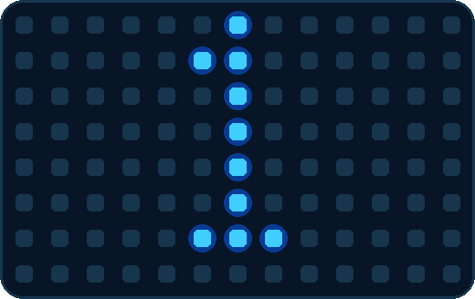 |

| Gesture | See it | Controller result |
| --- | --- | --- |
| Move the whole hand |  | Ordinary D-pad, including diagonals |
| Curl the thumb |  | A |
| Curl the index finger |  | B |
| Curl middle, ring, and pinky together |  | Briefly turns opposite the last horizontal direction and sends B |
| Return to the saved center |  | Releases positional movement |

The turn-and-B combination lasts about 0.18 seconds and triggers once per fresh
last-three-finger pose. Release those fingers before trying it again.

**Official Program 1 games:** Blades of Steel, Blaster Master, Bubble Bobble,
Castlevania, Castlevania II: Simon's Quest, Contra, Deadly Towers, Donkey Kong
Classics, Double Dribble, Gauntlet, Gradius, Jackal, Kid Icarus, Kung-Fu Heroes,
Metal Gear, Metroid, Mickey Mousecapade, Operation Wolf, Platoon, Racket Attack,
Rampage, RoboWarrior, Rygar, Seicross, Star Force, Superman, Xenophobe, and
Zelda II: The Adventure of Link.

### Program 2 - positional control with centering feedback

| Profile | See it |
| --- | --- |
| `program_2` | 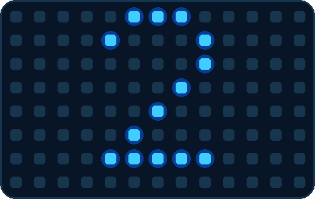 |

| Gesture | See it | Controller result |
| --- | --- | --- |
| Move the whole hand |  | Ordinary D-pad, including diagonals |
| Curl the thumb |  | A |
| Curl the index finger |  | B |
| Curl middle, ring, and pinky together |  | Briefly turns opposite the last horizontal direction and sends B |
| Return to the saved center |  | Releases movement and shows **Centered**; leaving the box shows **Return to centre** |

Program 2 has no indexed title and is the centering-practice alternative to
Program 1. It uses live Dashboard feedback instead of attempting to reproduce
the physical glove's beeper and stores no new centering measurement. Its bounded
turn-and-B action follows the same 0.18-second fresh-pose and release rules.

### Program 3 - depth and side movement

| Profile | See it |
| --- | --- |
| `program_3` | 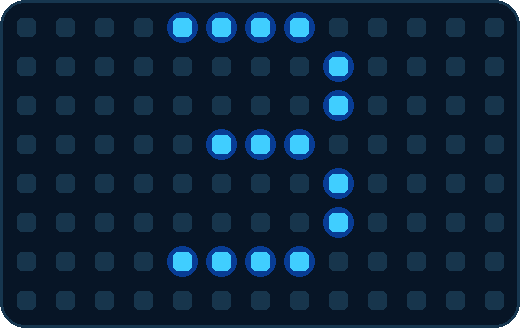 |

| Gesture | See it | Controller result |
| --- | --- | --- |
| Move left or right |  | Left or Right |
| Push toward the camera |  | Up |
| Pull away from the camera |  | Down |
| Curl the thumb |  | A |
| Curl the index finger |  | B |

Use Program 3 for **Ice Hockey** and **Top Gun**. Ice Hockey automatically
disables rapid B. Mattel also described Program 3 as an alternative top-view
scheme for Gauntlet, but the official index and shipped registry assign Gauntlet
to Program 1.

### Program 4 - Iron Tank tread control

| Profile | See it |
| --- | --- |
| `program_4` | 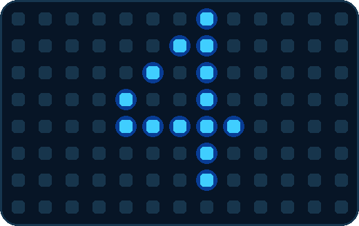 |

Program 4 does not use ordinary camera-position D-pad movement. Its finger and
wrist poses drive the tank directly, in the following priority order.

| Gesture | See it | Controller result |
| --- | --- | --- |
| Keep index, middle, ring, and pinky open |  | Up |
| Curl all four fingers |  | Down |
| Keep index open; curl middle, ring, and pinky |  | Right tread turn |
| Curl index; keep middle, ring, and pinky open |  | Left tread turn |
| Roll wrist right |  | Up+Right |
| Roll wrist left |  | Up+Left |
| Turn the wrist almost upside down |  | B |
| Curl the thumb |  | A alongside the active movement, except while pulling back |
| Pull away from the camera |  | Neutralizes the Program 4 action output |

Program 4 is assigned to **Iron Tank**. Release a wrist pose before changing to
a finger-tread pose so the higher-priority wrist action clears first.

### Program 5 - aircraft control

| Profile | See it |
| --- | --- |
| `program_5` | 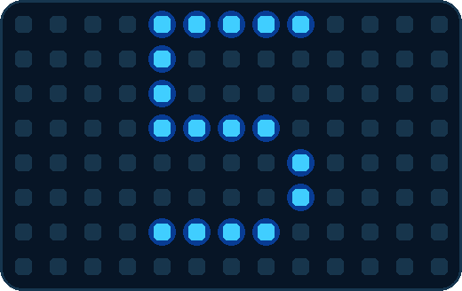 |

| Gesture | See it | Controller result |
| --- | --- | --- |
| Move or bank left/right |  | Left or Right; a wrist bank can add the same direction |
| Push toward the camera |  | Up |
| Pull away from the camera |  | Down |
| Curl the thumb |  | A |
| Curl the index finger |  | B |

Use Program 5 for **Alpha Mission**, **Life Force**, **Xevious**, and **1943:
The Battle of Midway**. Alpha Mission automatically disables rapid A.

<!-- PAGEBREAK -->

### Program 6 - Double Dragon combinations

| Profile | See it |
| --- | --- |
| `program_6` | 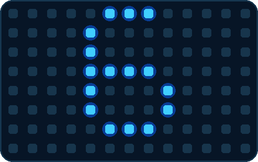 |

| Gesture | See it | Controller result |
| --- | --- | --- |
| Move left/right; push/pull |  | Left/Right; push is Up and pull is Down |
| Curl the index finger |  | A |
| Curl the thumb |  | B |
| Curl middle, ring, and pinky together |  | A+B |
| Make a fist and push |  | Up only; A and B release |
| Roll wrist right |  | A bounded four-phase Left/Right/Left/Right turn over about 0.32 seconds |

Program 6 is assigned to **Double Dragon**. The wrist combination begins on a
fresh right-roll hold; release the roll before repeating it.

### Program 7 - Punch-Out!! offense and defense

| Profile | See it |
| --- | --- |
| `program_7` | 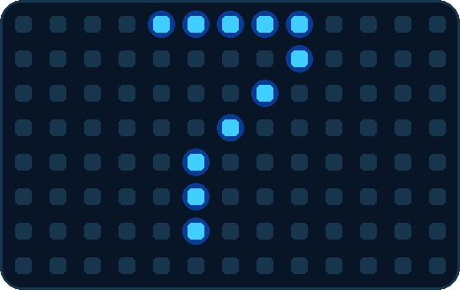 |

| Gesture | See it | Controller result |
| --- | --- | --- |
| With four fingers open, move left/right or lower the hand |  | Dodge Left/Right or duck Down |
| With four fingers open, curl the thumb |  | A |
| Make a fist, push, and hold it right of center |  | A punch; raising it above center adds Up for a high punch |
| Make a fist, push, and hold it left of center |  | B punch; raising it above center adds Up for a high punch |
| Roll wrist right |  | Down block |
| Make a fist and pull back |  | One Select pulse for the star-punch action |

Program 7 is assigned to **Mike Tyson's Punch-Out!!**. The pull-back Select is
edge-triggered: return from the pull before requesting another star punch.

### Program 8 - baseball offense and defense

| Profile | See it |
| --- | --- |
| `program_8` | 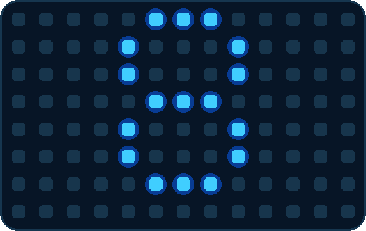 |

| Gesture | See it | Controller result |
| --- | --- | --- |
| Move left/right; push/pull |  | Left/Right; push is Up and pull is Down |
| Curl the thumb while stationary |  | B |
| Curl the thumb while moving |  | A alongside the active direction |
| Curl the index finger |  | B |
| Roll wrist left |  | B |
| Pull away from the camera |  | Down+B |

Use Program 8 for **Baseball**, **Bases Loaded**, and **R.B.I. Baseball**. The
same thumb pose intentionally changes button meaning depending on whether a
direction is active.

### Program 9 - Rad Racer

| Profile | See it |
| --- | --- |
| `program_9` | 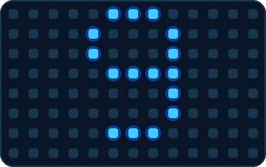 |

Program 9 begins unready. Make one fist to arm it; Dashboard then shows the
ready state for the remainder of that profile session. It has no rapid fire.

| Gesture | See it | Controller result after arming |
| --- | --- | --- |
| Roll wrist left/right |  | Steer Left/Right |
| Keep a fist closed |  | A |
| Push the closed fist |  | Up+A turbo combination |
| Raise the hand |  | Down |
| Lower the hand |  | B |

Program 9 is assigned to **Rad Racer**. Its unusual raise-to-Down mapping is
intentional and follows the documented program rather than the general movement
convention.

### Program 10 - R.C. Pro-Am

| Profile | See it |
| --- | --- |
| `program_10` | 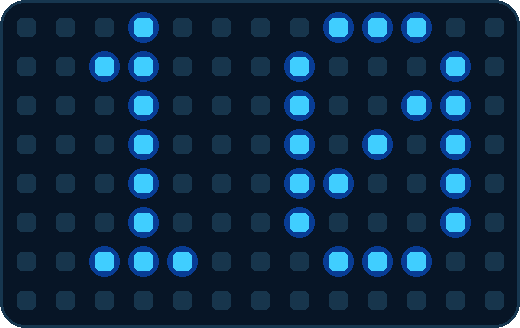 |

| Gesture | See it | Controller result |
| --- | --- | --- |
| Curl only the index finger |  | Left |
| Keep index open; curl middle, ring, and pinky |  | Right |
| Make both steering poses at once |  | Steering releases rather than pressing both directions |
| Curl the thumb |  | A |
| Keep the hand above the lower movement region |  | B is held automatically |
| Lower the hand outside the center box |  | Releases B |

Program 10 is assigned to **R.C. Pro-Am**. Hand position does not steer; use the
two mutually exclusive finger poses.

<!-- PAGEBREAK -->

### Program 11 - rapid turn alternative

| Profile | See it |
| --- | --- |
| `program_11` | 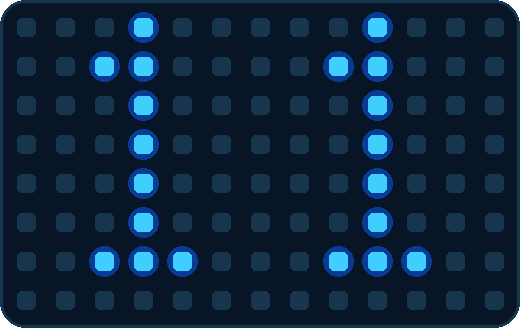 |

| Gesture | See it | Controller result |
| --- | --- | --- |
| Move the whole hand |  | Ordinary D-pad, including diagonals |
| Curl the thumb |  | A |
| Curl the index finger |  | B |
| Curl middle, ring, and pinky together |  | Overrides positional movement, alternates Left and Right, and sends B while held |

Program 11 has no indexed title. It is a Program 1-style alternative for games
where a sustained rapid-turn action is useful. Unlike Program 1's short turn,
the alternating turn continues until the last three fingers are released.

### Program 12 - Super Mario Bros.

| Profile | See it |
| --- | --- |
| `program_12` | 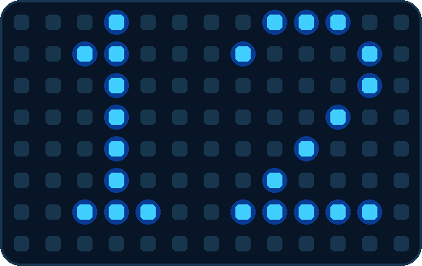 |

| Gesture | See it | Controller result |
| --- | --- | --- |
| Move the whole hand |  | Ordinary D-pad |
| Curl the thumb |  | A |
| Curl the index finger |  | B |
| Curl the middle finger without curling all three last fingers |  | B for fast travel |
| Curl middle, ring, and pinky together while moving sideways |  | Pulses only the active horizontal direction for slower travel; vertical movement is unchanged |

Program 12 is assigned to **Super Mario Bros.** Release the last-three pose to
return immediately to ordinary horizontal movement.

### Program 13 - finger buttons with physical movement

| Profile | See it |
| --- | --- |
| `program_13` | 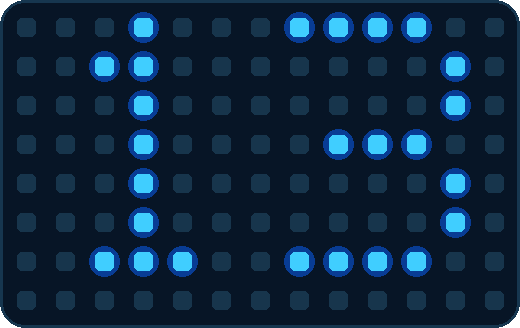 |

| Gesture | See it | Controller result |
| --- | --- | --- |
| Move the hand anywhere |  | No camera D-pad output |
| Curl the thumb |  | A |
| Curl the index finger |  | B |

Program 13 has no indexed title. Use it when VirtualGlove should provide the two
action buttons while the merged physical Player 1 controller supplies movement
or menu combinations. Shared Start, Select, and Menu Guard remain available.

### Program 14 - gestures off for the active game

| Profile | See it |
| --- | --- |
| `program_14` | 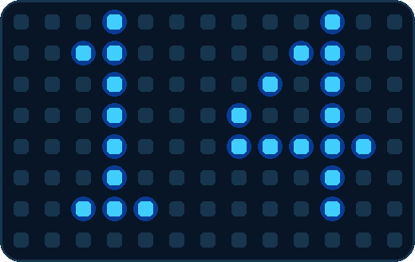 |

Program 14 is assigned to **Anticipation** and can be selected temporarily for
manual menu or password entry. It preserves the visible profile and authenticated
game session but closes the camera and neutralizes VirtualGlove D-pad, A, B,
Start, and Select. The physical Player 1 controller remains usable. Selecting a
camera-active profile later starts recognition again; no calibration or player
data is erased.

<!-- PAGEBREAK -->

## Bad Street Brawler

| Profile | See it |
| --- | --- |
| `bad_street_brawler` |  |

**Your mission:** Guide Duke Davis through each stage, discover that stage's
three fighting moves at the practice bag, and clear the street before time or
vitality runs out.

| Do this | See it | Duke does this |
| --- | --- | --- |
| Move hand left / right |  | Walk left / right |
| Raise / lower hand |  | Jump / crouch |
| Curl thumb |  | Pulsed B move |
| Curl middle finger |  | A+B force move |
| Roll wrist left / right |  | A plus that direction |
| Push toward camera |  | Glove Zap |

**Play smart:** The available force moves change with each stage. Test the
thumb curl, middle-finger curl, and wrist rolls on the punching bag before
leaving practice. Push toward the camera to trigger Glove Zap, then return to
your starting distance before another attempt. The game controls its
once-per-round availability. If Zap does not work, check the
[game-specific setup](CONFIGURATION_REFERENCE.md#bad-street-brawler-glove-zap).

**First round:**

1. At the practice bag, try a thumb curl, a middle-finger curl, and a wrist roll separately.
2. Notice which move each gesture produces in this stage.
3. Enter the street and use one familiar move before adding combinations.

<!-- PAGEBREAK -->

## Super Glove Ball

| Profile | See it |
| --- | --- |
| `super_glove_ball` |  |

**Your mission:** Control the Robo-Glove, keep the energy ball in play, break a
complete wall of tiles, and follow the revealed arrows through the maze.

**Nestopia (VirtualGlove)** means the custom `lr-nestopia-powerglove` core.
Use the controls below for the emulator that actually starts; FCEUmm is the
fallback. The RetroPie launch hook reports that running core automatically.
Only Super Glove Ball running in `lr-nestopia-powerglove` uses native input.
Starting the same ROM in FCEUmm—or in any other or unknown core—keeps joystick
output active for the whole session. The V sign sends Start in both modes.

| Do this | See it | Controller result |
| --- | --- | --- |
| Move whole hand |  | FCEUmm: eight-direction digital steering. Nestopia (VirtualGlove): continuous hand positioning. |
| Curl index finger |  | FCEUmm: A, move the glove into the room. |
| Curl thumb |  | FCEUmm: B, punch, grab, or launch a new ball. |
| Open hand |  | Nestopia (VirtualGlove): release or throw a held ball. |
| Close hand |  | Nestopia (VirtualGlove): grab or catch the ball. |
| Point index; curl middle, ring, and pinky |  | Nestopia (VirtualGlove): fire a Robo-Bullet. |
| Close hand and push forward |   | Nestopia (VirtualGlove): Power Punch. |

**Play smart:** Pick one wall and finish it, then follow the revealed arrow.
With FCEUmm, use Select to take the exit. Native gameplay has been completed
without Select; although the core can transmit its native button bit, no required
in-game action has been identified for it. **Latest coordinate** is the native
movement default. It follows each newest valid palm point directly
during continuous tracking and waits one fresh result only for a contradictory
or unusually distant non-forward reacquisition. Continuous native movement is
playable and has been
substantially tightened, although synchronized physical latency measurement is
still pending. The
[native compatibility record](super-glove-ball-native.md) contains the test
evidence and details about additional packet fields.

**First round:**

1. Move the Robo-Glove across the room with small hand movements.
2. With **Nestopia (VirtualGlove)**, practise closing to grab and opening to release. Try index-point fire and a fist-plus-forward Power Punch separately.
3. With **FCEUmm**, try the index-curl A action and thumb-curl B action separately.

<!-- PAGEBREAK -->

## Joust

| Profile | See it |
| --- | --- |
| `program_b` |  |

**Your mission:** Ride the ostrich, strike enemy riders from above, collect
their eggs before they hatch, and stay clear of the lava.

| Do this | See it | Result |
| --- | --- | --- |
| Move hand left / right |  | Steer left / right |
| Curl index or middle finger |  | Pulsed A: steady flap |
| Curl thumb |  | B: faster flap |
| Hold thumbs-up |  | Select game mode |

**Play smart:** Height wins jousts. Use the faster thumb flap to climb, then the
pulsed finger flap to hold position. Sweep up eggs quickly; every ignored egg is
an enemy preparing a return engagement.

**First round:**

1. Curl your index finger to practise a steady flap.
2. Move left and right while keeping your height.
3. Approach one rider from above, then collect the egg.

<!-- PAGEBREAK -->

## Gyruss

| Profile | See it |
| --- | --- |
| `program_c` |  |

**Your mission:** Circle the tunnel, destroy incoming formations, survive the
warp zones, and fight from planet to planet toward the Sun.

| Do this | See it | Result |
| --- | --- | --- |
| Roll wrist left / right |  | Orbit counter-clockwise / clockwise |
| Keep index finger straight |  | Continuous A fire |
| Pull hand away from camera |  | B bomb |
| Hold thumbs-up |  | Select control mode |

**Before launching:** Choose **Attack Control B** at the title screen. This
profile expects left/right rotation rather than eight-direction movement.

**First round:**

1. Select Attack Control B at the title screen.
2. Keep your index straight and practise small wrist rolls in both directions.
3. Clear one formation before trying the pull-back bomb.

<!-- PAGEBREAK -->

## Defender II

| Profile | See it |
| --- | --- |
| `program_e` |  |

**Your mission:** Patrol the planet, destroy alien raiders, and rescue the
humanoids before abductors carry them away and turn them into mutants.

| Do this | See it | Result |
| --- | --- | --- |
| Move whole hand |  | Fly up, down, left, or right |
| Curl thumb |  | A: fire |
| Roll wrist either way |  | B: smart bomb |
| Curl ring finger |  | Rapid left/right evasive thrash |

**Play smart:** Watch the scanner as much as the ship. Intercept abductors early;
if one lifts a humanoid, shoot the alien and catch the falling person. Wrist
rolls trigger the smart-bomb action, so make them deliberate.

**First round:**

1. Fly a short circuit with your wrist level.
2. Curl your thumb to fire while moving.
3. Track one abductor on the scanner; save deliberate wrist rolls for smart bombs.

<!-- PAGEBREAK -->

## Sesame Street 1-2-3

The same game may appear in your library as **Sesame Street 123**.

| Profile | See it |
| --- | --- |
| `program_f` |  |

**Your mission:** Play the counting activities by giving the game a simple,
physical Yes or No answer.

| Do this | See it | Result |
| --- | --- | --- |
| Move an open hand in any direction |  | A: Yes |
| Close every finger into a fist |  | B: No |

**Play smart:** Directional output is intentionally disabled in this profile.
Make the open-hand answer broad and obvious; make the fist complete. Return to a
relaxed open hand between questions so one answer does not run into the next.

**First round:**

1. Count the objects before making a gesture.
2. Move an open hand from the resting position for Yes, or close all fingers for No.
3. Return to a relaxed hand at the centre before the next question.

<!-- PAGEBREAK -->

## Gun Smoke

| Profile | See it |
| --- | --- |
| `program_g` |  |

**Your mission:** Walk the scrolling frontier, defeat the bandits, find or buy
each wanted poster, and collect the bounty by beating the stage boss.

| Do this | See it | Result |
| --- | --- | --- |
| Move whole hand |  | Walk in that direction |
| Curl index finger |  | A: shoot diagonally right |
| Push toward camera |  | B: shoot diagonally left |
| Curl index while pushing |  | A+B: shoot straight ahead |
| Curl thumb and ring finger |  | Suppress D-pad, A/B, Start, and Select |

**Play smart:** A stage keeps looping until you obtain its wanted poster. Keep
your palm level while walking; wrist roll can add a left/right movement command.
Use index-plus-push when you need the straight-ahead shot.

**First round:**

1. Try an index curl for the right shot and a forward push for the left shot.
2. Combine them to fire straight ahead.
3. Walk while firing, then look for the wanted poster.

<!-- PAGEBREAK -->

## Knight Rider

| Profile | See it |
| --- | --- |
| `program_i` |  |

**Your mission:** Drive KITT from city to city, avoid roadside hazards, destroy
the criminals ahead, and reach each destination before the timer expires.

| Do this | See it | Result |
| --- | --- | --- |
| Roll wrist left / right |  | Steer left / right |
| Curl index finger |  | Accelerate |
| Lower hand |  | Brake |
| Push toward camera |  | Accelerate plus turbo boost |
| Curl thumb |  | Fire weapons |

**Play smart:** Keep the wrist near center on straight roads; large steering
rolls are for real turns. Keep your index finger curled for normal speed and reserve the
forward push for a clean burst when the road opens.

**First round:**

1. Curl your index finger to accelerate and make small wrist rolls to steer.
2. Lower your hand to practise braking.
3. Use a forward push for turbo only when the road ahead is clear.

<!-- PAGEBREAK -->

## Make the controls fit your hand

### Choose a player and save your setup

Choose a player in **Active player** before practising or tuning. Each player keeps
separate sensitivity, lesson progress, and a saved centre. Selecting a player
loads all three automatically and pauses controller output. Use **Center hand**
for players without a saved centre or after moving the camera or changing playing position.

Use **Setup → Players → Players and hand-setup backups → Back up hand setup** to save the player's
name, center-box size, personal and complete gesture sensitivity, software identity, and calibration.
During restore, choose whether to keep the complete saved sensitivity, including
the defaults used when the backup was made, or just personal adjustments. Reuse
calibration only with the same camera and playing position; otherwise set a fresh
centre. Backups do not include credentials or Academy progress. New exports use
the `virtualglove-hand-setup` format at version 4. Legacy version-2 and
version-3 backups remain importable; version 2 migrates its largest directional
activation value into the center box. Older version-1 sensitivity-only files are rejected.

Choose each player in turn and select **Back up hand setup** to download a
separate file named for that player, such as
`alex-virtualglove-hand-setup.json`. Your browser saves it on the computer, phone,
or tablet you are using, usually in **Downloads** or the folder you choose. To restore, select
the player you want to update, choose **Restore hand setup**, and pick that
player's saved file from your device. Review it before confirming; restore
updates the selected player, rather than adding a new one.


### Tune a difficult gesture

Tuning is optional. In **Glove Academy**, switch on **Tune gestures**. Pixel Pal
helps with a new hand setup, a difficult or accidental gesture, or movement that
feels off-centre. This adjusts recognition thresholds, not a personal camera
model. It does not change the game's button assignments.

1. Choose what you want to improve and follow the framing advice.
2. When your whole hand is tracked clearly, select **I'm ready**.
3. Follow the countdown and prompts. Finger poses use open hand, performed pose, then open hand again. Movement uses your starting position, the motion, then a return. Forward and backward movements are repeated three times.
4. Test the result with two clean activations and releases, then hold neutral for three seconds. Save when the check passes, or retry the indicated pose.


Cabinet output stays paused during practice and tuning. The live camera area is
excluded from these screenshots for privacy. Tune one difficult gesture without
repeating the whole hand setup. Pixel Pal may suggest better framing or lighting;
it does not change camera exposure automatically.

Use the separate **Movement reach** section when native Super Glove Ball needs
more or less physical travel. Left, right, up, and down are normalized distances
from the saved center; smaller values reach the corresponding screen edge sooner.
The summary shows the tracking area's width, height, and aspect ratio. Saving
changes only those four reach spans. **Restore full camera field** returns to the
camera-boundary mapping without changing the center or gesture sensitivity.

Setup's advanced camera settings offer Automatic, 30 fps, and 60 fps. Automatic
prefers the tested 30-fps path and falls back safely to a camera-supported rate;
the active rate is shown while tracking runs. Leave it on Automatic unless a
specific camera comparison is needed.

Exposure is also Automatic by default. If a compatible Linux UVC camera looks
too dark or loses the hand during fast movement, Setup offers exposure controls.
Direct V4L2 remains an engineering comparison with Manual exposure and gain.
The page shows whether manual control was supported
and which values were actually applied. The project's Kiyo Pro tested well at
exposure `78` and gain `96`, but lighting and camera models differ. Manual mode
returns the camera to automatic exposure when tracking closes.

Leave **Advanced thresholds and diagnostics** closed unless you need numerical
controls or a diagnostic run. The [Configuration Reference](CONFIGURATION_REFERENCE.md)
explains the threshold checks and targeted restore options.

### Check the result in a game

Return to Dashboard, select **Start controller**, and try the same gesture in a
short game session. Check that it activates reliably and releases when you return
to rest. If another gesture activates accidentally, stop delivery and revisit
that pose in Glove Academy. Saved sensitivity is shared across your selected
player's games; each game profile still decides the resulting actions.

## Understand the matrix display

The matrix shows the active game or practice mode. Each play card includes its
game display; the images below identify Academy and tuning.

| Mode | See it | Controller output |
| --- | --- | --- |
| Glove Academy lessons |  | Paused while you practise |
| Tune gestures |  | Paused while you record or preview thresholds |

For the idle display, choose **Setup → Matrix attract mode**: **On**, **Dim**, or
**Off** with faint connection pixels. This affects only the idle animation, not
game displays, Academy, tuning, or gesture recognition. The setting saves without
restarting tracking. See the [Matrix display guide](MATRIX_GUIDE.md) for connection
pixels, startup animations, and the full display reference.

<!-- PAGEBREAK -->

## Programs A-I

The original Power Glove could load nine reusable mappings from Bad Street
Brawler and retain one while the player changed cartridges. VirtualGlove
keeps all nine available at once: choose one on Dashboard or let RetroPie select
one from the registered ROM filename. These mappings produce ordinary NES
controller inputs, so they can be tried with games beyond the tested play cards.

## Where the programs came from

Bad Street Brawler contained nine configuration programs labelled A through I.
The player loaded one into the Power Glove, switched off the NES, swapped to a
different cartridge within roughly 30 seconds, and kept using the downloaded
mapping.

These programs were not replacement firmware. They were small configurations
for the glove's resident gesture interpreter. Each program mapped hand position, depth, wrist angle, and finger bends to
ordinary NES controller inputs. The
next game therefore did not need special Power Glove support.

VirtualGlove keeps all nine profiles ready at once. Select one on
Dashboard or let RetroPie choose it when a game launches. You do not need to
open Bad Street Brawler first.

## Quick selector

| Program | See it | Best fit | Main controls |
| --- | --- | --- | --- |
| **A** |  | Pinball | Two finger flippers, wrist tilt, combined-flipper mode |
| **B** |  | Joust | Steer by position; curl a finger to flap |
| **C** |  | Gyruss | Rotate by wrist angle; fire and bomb gestures |
| **D** |  | Challenge mode | Reversed directions with thumb/index buttons |
| **E** |  | Defender II | Ship movement, fire, smart bomb, evasive movement |
| **F** |  | Sesame Street 1-2-3 | Open-hand Yes and closed-hand No |
| **G** |  | Gun Smoke | Walk by position; combine index curl and a forward push to fire |
| **H** |  | Training / general play | Familiar controls with pulsed buttons |
| **I** |  | Knight Rider / driving | Wrist steering, throttle, brake, and turbo |

<!-- PAGEBREAK -->

## Program cards

### A - Pinball rig

| Profile | See it |
| --- | --- |
| `program_a` |  |

| Gesture | See it | Controller result |
| --- | --- | --- |
| Curl the index finger |  | Right flipper / A |
| Curl the thumb |  | Left flipper / Up |
| Roll the wrist left or right |  | Tilt / B |
| Pull the hand away from the camera |  | Toggle combined-flipper behaviour |

Use this profile for pinball tables and games that benefit from two independent
finger actions.

### B - Joust rig

| Profile | See it |
| --- | --- |
| `program_b` |  |

| Gesture | See it | Controller result |
| --- | --- | --- |
| Move the hand left or right |  | Steer left or right |
| Curl the thumb |  | B button; see the [Joust play card](GAMEPLAY_GUIDE.md#joust) for its in-game use |
| Curl the index or middle finger |  | Pulsed flap input |

Use this profile for Joust and any game where rhythmic, repeated presses matter.

### C - Gyruss rig

| Profile | See it |
| --- | --- |
| `program_c` |  |

| Gesture | See it | Controller result |
| --- | --- | --- |
| Roll the wrist left or right |  | Rotate counter-clockwise or clockwise |
| Keep the index finger straight |  | Continuous fire |
| Pull the hand away from the camera |  | Launch a bomb |

Use this profile for circular shooters and games with rotation plus rapid fire.

### D - Mirror-world rig

| Profile | See it |
| --- | --- |
| `program_d` |  |

| Gesture | See it | Controller result |
| --- | --- | --- |
| Move the hand left or right |  | Reversed right or left direction |
| Raise or lower the hand |  | Reversed down or up direction |
| Curl the thumb |  | First action button |
| Curl the index finger |  | Second action button |

Use this profile for deliberate chaos, party challenges, or accessibility
experiments that need inverted direction mappings.

### E - Defender rig

| Profile | See it |
| --- | --- |
| `program_e` |  |

| Gesture | See it | Controller result |
| --- | --- | --- |
| Move the whole hand |  | Move the ship |
| Curl the thumb |  | Fire |
| Roll the wrist left or right |  | Smart bomb |
| Curl the ring finger |  | Rapid horizontal movement |

Use this profile for Defender II and multi-action shooters.

### F - Yes / No rig

| Profile | See it |
| --- | --- |
| `program_f` |  |

| Gesture | See it | Controller result |
| --- | --- | --- |
| Close every finger into a fist |  | No |
| Move an open hand in any direction |  | Yes |

Use this profile for Sesame Street 1-2-3 and simple choice-driven games.

### G - Gun Smoke rig

| Profile | See it |
| --- | --- |
| `program_g` |  |

| Gesture | See it | Controller result |
| --- | --- | --- |
| Move the whole hand |  | Walk using horizontal and vertical hand movement |
| Curl the index finger |  | Fire |
| Roll the wrist |  | Add left or right movement |
| Curl the thumb and ring finger |  | Suppress all ordinary controller output |

A forward push sends B. Combine it with index curl (A) to send A+B.

Use this profile for Gun Smoke and shooters with movement plus directional fire.

### H - Training rig

| Profile | See it |
| --- | --- |
| `program_h` |  |

| Gesture | See it | Controller result |
| --- | --- | --- |
| Move the whole hand |  | Conventional directions |
| Curl the thumb |  | Pulsed B |
| Curl the index finger |  | Pulsed A |
| Return the hand to center |  | Release directional input |

Use this profile for learning the system or giving an unmapped game a sensible
general-purpose starting point.

### I - Driving rig

| Profile | See it |
| --- | --- |
| `program_i` |  |

| Gesture | See it | Controller result |
| --- | --- | --- |
| Roll the wrist left or right |  | Steer |
| Curl the index finger |  | Throttle |
| Lower the hand |  | Brake |
| Push the hand toward the camera |  | Turbo |
| Curl the thumb |  | Auxiliary action |

Use this profile for Knight Rider and driving games that need steering, speed, and
one extra action.

## How VirtualGlove selects a program

Choose the current profile on Dashboard; choose the saved startup profile on
Setup. Automatic selection matches the complete ROM filename, including its
extension but excluding its folder path, against `/etc/virtualglove/games.json`
on RetroPie. Matching ignores letter case.

The launch hook sends an authenticated profile request. The VirtualGlove Controller releases held
controls, changes the mapping, reuses the saved calibration, and acknowledges
the new profile on its blue matrix. If no valid calibration is saved, it collects
an initial reference while you hold your open hand still in a comfortable
resting position. It uses 24 geometrically valid observations; repeating
the same center, distance, and wrist pose produces a similar rather than
bit-for-bit identical reference.

```json
{
  "games": {
    "Joust (USA).zip": "program_b",
    "Gyruss (USA).nes": "program_c",
    "Gun.Smoke (USA).7z": "program_g"
  }
}
```

Merge entries into the existing `games` object; do not replace other registered
games. The matrix displays `1` through `14` or `A` through `I` for those
profiles. When an unknown game starts, the launch hook turns gesture control off so
the previous game's mapping does not remain active.


<!-- PAGEBREAK -->

## Take VirtualGlove off-script

You can use the included profiles with games beyond Mattel's indexed titles and
the dedicated play cards in this guide. Programs 1–13 and A–I send ordinary NES
controller inputs, so try matching their gestures to games with similar
controls. Programs 2, 11, 13, A, D, and H have no default ROM assignment and
are useful starting points for these experiments. Program 14 is the deliberate
camera-and-output-off choice rather than a general gesture mapping.

### Start with A, D, and H

| Program | See it | Try it with | Know before playing |
| --- | --- | --- | --- |
| **A - Pinball** |  | Pinball and games driven by two independent actions | Index curl is A, thumb curl is Up, wrist tilt is B, and pulling back toggles combined flippers. Ordinary directional movement is disabled. |
| **D - Mirror world** |  | A game you already know well, a party challenge, or an inverted-direction accessibility experiment | Every direction is reversed. Thumb and index provide A and B. Expect your muscle memory to complain loudly. |
| **H - General play** |  | Two-button platform, maze, puzzle, and action games | Hand movement supplies the D-pad. Index and thumb pulse A and B, so games that require a long held button may be a poor fit. |

Try Program H first for general play, or Program A for pinball controls.
Program D turns a familiar game into a new coordination challenge without
changing the ROM or emulator.

### Try a combination

1. Launch the NES or Famicom game normally. An unregistered game safely turns gesture output off instead of inheriting the previous game's controls.
2. Open the VirtualGlove Controller **Dashboard** and choose **A: Pinball**, **D: Challenge**, **H: General**, or another Program A-I profile from **Active profile**.
3. Use **Center hand** if your resting hand position produces unwanted movement or your physical setup has changed. Hold a relaxed open hand still at your intended centre and distance until calibration finishes, then select **Start controller** and return to the game.
4. Test movement, both action gestures, Start, and Select before committing to a long session. Stop the controller immediately if a gesture remains active.

The selection is temporary. Starting or ending a game sends a new command
that changes the profile or turns gestures off.

### Keep a discovery

Open **Setup → Games** and map the game's exact ROM filename to the profile
that worked. Include its `.nes`, `.zip`, or `.7z` extension, validate, and save.
Restart the game to use the new mapping. Automatic selection is currently limited
to NES and Famicom; other systems turn gesture control off until their mappings
and launch behaviour are validated.


Do not stop at A, D, and H. Try B when rhythmic button pulses suit the action,
C when wrist rotation can replace horizontal movement, F for simple Yes/No
choices, or I when steering and throttle are the heart of the game. Match the
profile to the game's mechanics, not to the title printed on the cartridge.

> **GLOVE LAB RULE**  A strange pairing that is controllable, repeatable, and
> fun is a successful experiment. Record the exact ROM filename and profile so
> somebody else can reproduce it.

For registry validation and manual profile commands, see the
[Configuration Reference](CONFIGURATION_REFERENCE.md).

<!-- PAGEBREAK -->

## Sources, artwork, and fair play

The profile descriptions are checked against the project's implemented gesture
engine and tests. Game objectives and original control intent were summarized
from the following historical instruction sources:

- Mattel, *Power Glove Instruction Manual* (complete manual; Program 4 and the
  official game index), supplied for this release's documentation review
- Mattel, *Power Glove Program Guide* (1988 US; program illustrations and the
  1943 workflow), supplied for this release's documentation review
- [Mattel Power Glove instructions and Programs A-I](https://home.hiwaay.net/~lkseitz/cvg/power_glove.shtml)
- [Bad Street Brawler NES instruction transcription](https://www.world-of-nintendo.com/manuals/nes/bad_street_brawler.shtml)
- [Super Glove Ball NES instruction manual](https://www.digitpress.com/library/manuals/nes/Super%20Glove%20Ball.pdf)
- [Joust NES instruction transcription](https://www.world-of-nintendo.com/manuals/nes/joust.shtml)
- [Gyruss NES instruction transcription](https://www.world-of-nintendo.com/manuals/nes/gyruss.shtml)
- [Defender II NES instruction transcription](https://www.world-of-nintendo.com/manuals/nes/defender_2.shtml)
- [Gun Smoke NES gameplay reference](https://strategywiki.org/wiki/Gun.Smoke_%28NES%29/Gameplay)
- [Knight Rider NES instruction manual](https://www.retrogames.cz/manualy/NES/Knight_Rider_-_NES_-_Manual.pdf)

The gesture drawings are original VirtualGlove project illustrations made
for this guide. They deliberately avoid game screenshots, box art, characters,
and publisher logos.

VirtualGlove is an independent MIT-licensed hobbyist project by Iain
Bennett. Nintendo, NES, Power Glove, and all game titles and marks belong to
their respective owners. No ROM images or original game artwork are distributed.

<!-- PAGEBREAK -->

## Pixel Pal's Extra-Digit Hunt answer


**Pixel Pal's answer: 24 six-digit hands.**

One appears in the opening Rock, Paper, Scissors table. Eight appear in the new
numeric Program cards: Programs 1, 4, 6, 9, 10, 11, and twice in Program 12.
The remaining fourteen appear in the shared gesture reference, dedicated game
cards, Programs B, E, and F, and the **Start with A, D, and H** table. Every
appearance counts, even when the same artwork returns.
