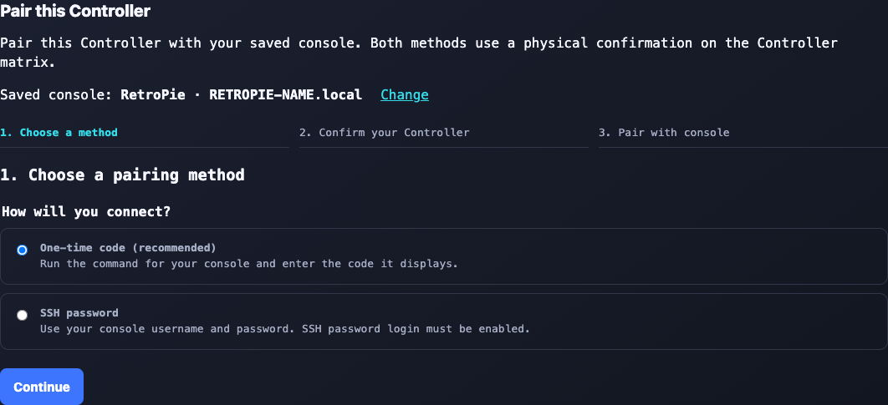
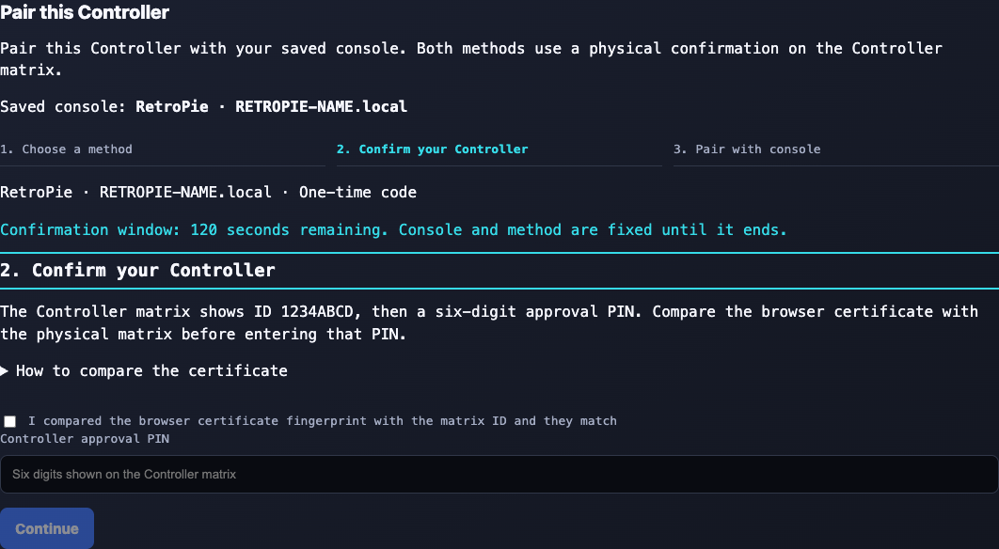
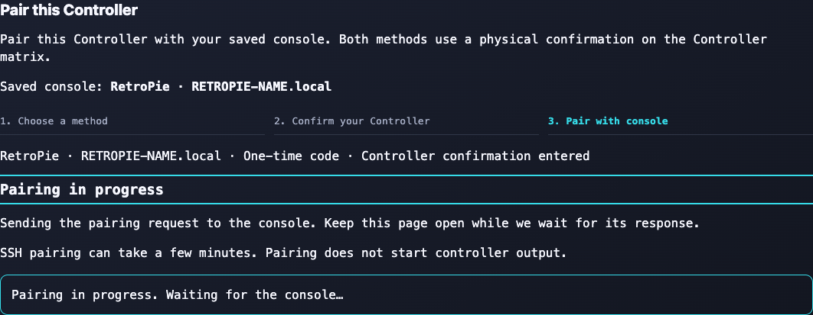
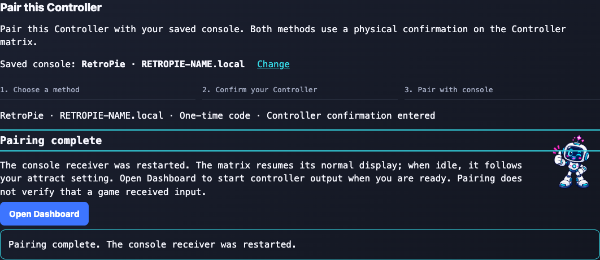

# VirtualGlove Installation Guide

Install VirtualGlove with one script on the **VirtualGlove Controller
(Arduino UNO Q)** and one on RetroPie.
The scripts prepare the software and startup helpers; you finish by pairing the
devices, positioning the camera, and testing a game.

Choose **Setup → Matrix attract mode** to keep the idle animation On, Dim it,
or turn it Off except for faint connection pixels. This does not change game
displays, T, L, or gesture recognition. The setting saves without a tracker restart.

For an existing installation, this update changes controller transport on both computers. Stop controller output, update both to matching software, then start and test input. Mixed old/new versions do not deliver input with the default settings. See [signed controller transport and upgrades](CONFIGURATION_REFERENCE.md#signed-controller-transport-and-upgrades) for staged upgrades and rollback.

## Try release candidate v0.4.1-rc.2

Release candidate **v0.4.1-rc.2** adds Programs 1–14 and their official game
mappings, the Ready-to-Play guide, the live joystick dead-zone camera grid, and
the complete `virtualglove-*` runtime-name migration. Close games and stop
controller output, then run the matching command on each device. These explicit
commands select the prerelease; the normal commands later in this guide continue
to select the latest stable release.

On the VirtualGlove Controller:

```sh
cd /home/arduino
curl -fLO https://github.com/mathan416/VirtualGlove/releases/download/v0.4.1-rc.2/install-uno-q.sh
bash install-uno-q.sh --development v0.4.1-rc.2
```

On RetroPie:

```sh
curl -fLO https://github.com/mathan416/VirtualGlove/releases/download/v0.4.1-rc.2/install-retropie.sh && bash install-retropie.sh --development v0.4.1-rc.2
```

Verify both report `v0.4.1-rc.2`, then follow the pairing/first-game checks below.
Existing hand settings and pairing files are preserved. The Controller installer
also updates the matrix firmware. Review [coordinated transport upgrades and
rollback](CONFIGURATION_REFERENCE.md#signed-controller-transport-and-upgrades)
before replacing an older installation.

An upgrade accepts either the current `/etc/virtualglove` settings or the
pre-0.4.1 `/etc/powerglove` settings. It moves the existing pairing token, game
registry, and Controller destination forward without asking for replacements,
then retires old services and directories into `/var/backups/virtualglove` only
after their replacements are ready. A fresh installation creates only
`virtualglove-*` runtime names. Install both devices from the same candidate;
the renamed protocol does not intentionally fall back to the retired runtime.

## 1. Prepare your devices

You need a provisioned VirtualGlove Controller, a working RetroPie system, a UVC USB camera,
a powered USB hub, and a physical controller for RetroArch setup. Put both devices
on the same trusted local network with internet access. Supply your own games;
no ROMs or BIOS files are included.

For a new Controller, use Arduino App Lab to complete board setup and networking.
Record the RetroPie's hostname and the UNO Q's current App Lab address. The
VirtualGlove installer will offer the Controller's permanent friendly name.
Connect the camera through the powered hub.
You do not need to import VirtualGlove through App Lab, install Arduino build
tools, or build a ZIP. The release contains a verified precompiled Matrix image;
the installer checks it and loads it using the UNO Q's factory flashing tools.

Open a terminal on each device, either locally or over SSH. For the Controller:

```sh
ssh arduino@UNO-Q-NAME.local
```

For this initial connection, use the UNO Q name or IP address shown by App Lab.
It may still have its factory name. Use your normal account;
the scripts request your sudo password when administrator access is needed.
They do not store it. Close games before installing. Leave the devices powered
and connected while installation runs; first setup can take several minutes.

The commands below automatically select the latest published stable release from
GitHub. You do not need to enter a release tag or set shell variables. Run both
installers during the same setup session and compare the reported release names;
if a new release appeared between runs, rerun the older installation.
Development prereleases are available separately in the technical reference.
The latest release must include the installer assets before these commands work.

## 2. Run the VirtualGlove Controller installer

Run this single line in the Controller terminal:

```sh
cd /home/arduino
curl -fLO https://github.com/mathan416/VirtualGlove/releases/latest/download/install-uno-q.sh
bash install-uno-q.sh
```

The Controller terminal may open in `/`, where a normal user cannot save files.
The command first moves to the Arduino user's writable home directory so the
installer can be downloaded safely.

The script verifies its download, installs VirtualGlove, and configures automatic
startup. It also installs:

- the precompiled Matrix firmware and early-start hourglass;
- the Shutdown button's system helper;
- guarded camera recovery;
- `uhubctl` for hubs that advertise safe per-port power control.

On a fresh Controller, the installer shows the current board name and suggests
**virtualglove**. Press Enter to use `virtualglove.local`, or enter a different
short name such as `games-room`. Confirm the displayed `.local` address before
installation continues. The installer checks for a visible name conflict on
the current LAN and stops safely if another device is already using it.

This question appears only for a first installation. An update never changes an
established hostname. A non-interactive installation also keeps the existing
board name unless `--hostname NAME` is supplied explicitly.

The terminal connection used for installation can remain open after the rename.
For future browser and SSH connections, use the chosen `.local` name or one of
the IP addresses printed at the end of installation.

Camera recovery is standard and is not presented as an optional prompt. The
camera may be connected after installation, and no separate helper command is
needed. Updates preserve pairing, calibration, and personal tuning. They back up
and replace the supplied `config/profiles.json` baseline so current shared
recognition defaults take effect. The installer never copies a maintainer's
neutral-hand coordinates because those measurements depend on the player's
camera, distance, and position.

During an update, a pending Dashboard shutdown request stops setup before any
renamed path watcher is enabled. Complete or clear that shutdown request, bring
the Controller back online, and rerun the same installer. Legacy path and timer
watchers are stopped before their services, so old and new helpers never process
the same request concurrently.

If the script reports a failure, stop and follow its message. If `curl` is missing,
install it with `sudo apt-get install curl ca-certificates`, then retry. The
installer checks compatibility before changing the application.

The ordinary installer also includes first-setup and maintenance support:
camera recovery, pairing and health checks, the optional calibration dot and its
read-only report, aggregate vision status, movement-reach tools, and emulator
configuration. Research replays, protocol traces, soak tests, GPU experiments,
and benchmark drivers remain in the source repository and separate Engineering
Tools download. They are not needed to install, calibrate, play, back up a hand
setup, or update the system.

**Checkpoint:** Open the Dashboard address printed by the installer, normally
`http://virtualglove.local:8088/dashboard`, in your browser.
Dashboard should load. With gestures off, a closed camera is normal. Open
**Play** or **Glove Academy** to check that your camera view and whole hand
appear, then return to Dashboard with controller transmission stopped.

For a first setup, keep the camera choices simple:

- Leave **Camera** on Automatic unless more than one camera is connected.
- Leave **Camera reader** on Recommended — OpenCV.
- Leave frame rate and exposure on Automatic.
- If movement is delayed or tracking drops, run **Find the best camera
  settings** in Setup. Pixel Pal compares only choices supported by that camera
  and does not save a recommendation until you accept it.

Direct V4L2, manual exposure, gain, and buffer comparisons are advanced tools,
not required setup steps. The [Camera Guide](CAMERA_GUIDE.md) explains what they
change in plain language and how to stop or recover a camera test safely.


## 3. Run the RetroPie installer

Run this single line in the RetroPie terminal:

```sh
curl -fLO https://github.com/mathan416/VirtualGlove/releases/latest/download/install-retropie.sh && bash install-retropie.sh
```

**Older RetroPie images:** Raspberry Pi OS Buster's Raspbian packages moved to
the legacy archive. The installer detects the obsolete repository and stops
before changing VirtualGlove. Follow [Buster package source moved](TROUBLESHOOTING.md#buster-package-source-moved),
run `sudo apt-get update`, then rerun the same installer. A current RetroPie
image is preferable because Buster no longer receives normal security support.

For a new installation, the script asks for your Controller hostname or IP
address. Enter the `.local` name printed by the Controller installer—normally
`virtualglove.local`. There are no placeholders to replace in the command. An
upgrade that finds either `/etc/virtualglove/launcher.json` or the pre-0.4.1
`/etc/powerglove/launcher.json` preserves that destination and does not ask for
it again.

The script installs the receiver, controller mapping, game-launch integration,
and automatic startup. Existing cabinet hooks and controller assignments remain.
It offers missing emulator installation through RetroPie Setup and checks
registered games, including Bad Street Brawler's Glove Zap configuration.

Follow any emulator or game ACTION messages. Missing games do not prevent the
base installation. If asked to launch and exit FCEUmm once, do that and rerun the
installer. If you use another emulator, the installer asks before selecting
FCEUmm for Bad Street Brawler.

If a registered Super Glove Ball ROM is present, the installer also offers the
optional `lr-nestopia-powerglove` core. Accepting installs Git and the standard
build tools, downloads the pinned GPLv2 Nestopia source, applies the included
patch, builds on that RetroPie, and registers a second emulator entry. It does
not change the ROM's saved emulator: FCEUmm remains selected until you choose
`lr-nestopia-powerglove` from RetroPie's per-ROM launch menu. Declining is safe
and leaves the tested joystick fallback unchanged. The build needs internet
access and may take several minutes; no ROM is read or copied by the build.

The installer separately offers **VirtualGlove Calibration Test**. Accept it to
build the small project-owned `lr-powerglove-dot` core and add a ROM-free entry
to RetroPie's **Ports** list. This choice is optional and can be accepted on a
later installer run. It does not select an emulator for any NES game.

**Checkpoint:** The report confirms that receiver startup is configured.
Pairing and live gameplay checks will still be listed as actions.

## 4. Pair the devices

The **Controller status** panel at the top of Setup shows the four Off-mode checks in pixel order: app, console service, authenticated response, and Networking. Green means confirmed, red means disconnected or not confirmed, and grey means unknown. Networking reflects a physical Wi-Fi or Ethernet link, including USB dock Ethernet; it is independent of the console checks. These checks do not prove that the game received input.

Both pairing methods below require the six-digit approval PIN shown on the Controller matrix and the certificate-ID comparison. The RetroPie one-time code or SSH password is an additional credential. A first visit may show a privacy warning because this is a private local Controller, not a public website.

Pairing gives both devices the same private token. Use the recommended
one-time-code method after both installers finish.

1. Open the secure Setup address printed by the Controller installer, normally `https://virtualglove.local:8443/setup`. Under **Connect to RetroPie**, enter your console address and select **Save connection**. Pairing uses this saved address; unsaved edits must be saved first.
2. Continue to **Pair this Controller** in the same card, choose **One-time code (recommended)**, and select **Continue**. Use **Change** beside the saved console to edit its address before starting.
3. In **Confirm your Controller**, compare the `ID` on the physical matrix with the beginning of the browser certificate's SHA-256 fingerprint. Expand **How to compare the certificate** for guidance. If they differ, stop pairing.
4. If they match, check the confirmation box, enter the six-digit **Controller approval PIN** shown after `PN` on the matrix, and select **Continue**.
5. On the RetroPie console shown in Setup, run `sudo /opt/virtualglove/bin/virtualglove-pair` and leave it running. Enter its 20-character code in **RetroPie one-time code**, then select **Pair with RetroPie** within five minutes. This single-use code is separate from the Controller approval PIN. If you have more than one RetroPie, confirm the terminal prompt belongs to the console named in Setup.
6. Selecting **Pair with RetroPie** brings **Pairing in progress** into view while the request runs, followed by **Pairing complete** or an error with retry instructions. On success, the receiver was restarted and answered an authenticated controller handshake using the newly installed token; you can open Dashboard when ready. On RetroPie, `sudo systemctl status virtualglove-receiver.service` should report active. Pairing does not arm controller output or prove that a game received input.

### Optional: remove the browser privacy warning

After the Matrix ID matches the browser certificate, return to **Trust this
Controller** and download the trust certificate. Install it as a trusted root on
that phone or computer, then close and reopen the browser. This is required only
once per browser device and survives ordinary VirtualGlove upgrades and website
certificate renewals. Setup contains current instructions for Apple, Windows,
and Android devices. Never install the certificate if the Matrix comparison
does not match.

After pairing, always complete the game check below. **Pairing complete** proves
that the receiver accepted the shared key; the game check proves that your own
camera, Controller, network, receiver, emulator, and game work together.









The Controller confirmation window lasts two minutes. The console address and
pairing method stay fixed during that window. If it expires, the PIN and password
are cleared; select **Start a new confirmation**. You can change methods after
the window ends. A submitted failure also requires fresh confirmation before
retrying. Existing server PIN attempt limits still apply. If the window expires
while you obtain a RetroPie code, repeat confirmation and obtain a new code if
needed; neither credential has an unlimited lifetime.

<!-- PAGEBREAK -->

### Alternative: pair with your RetroPie password

Use this route only if RetroPie accepts SSH password login and your account
can run `sudo` with that password.

1. Save the console address in **Connect to RetroPie**.
2. In **Choose a pairing method**, select **SSH password**, then **Continue**.
3. Complete the same certificate comparison and Controller approval PIN step.
4. In **Pair with RetroPie**, enter your RetroPie username and password, then select **Pair with RetroPie**.
5. **Pairing in progress** stays visible while the request runs; SSH pairing can take a few minutes. Wait for **Pairing complete**, which includes an authenticated receiver-token check, then check the receiver service or open Dashboard. Errors are brought into view with retry instructions.

The password field is unavailable until certificate confirmation is complete.
The password is used for pairing and is not saved by the Controller. Returning
to **Review Controller confirmation**, a failure, expiry, or leaving the page
clears it. If neither route works, use the
[token-management reference](CONFIGURATION_REFERENCE.md#pairing-and-token-management).

When a submitted pairing attempt finishes, the matrix releases the approval PIN and resumes its normal display. When idle, the glove animation follows your On, Dim, or Off attract setting; active game and status displays still take priority.

### Optional first-game check

Select **Get ready to play** on Setup or Dashboard. The guide helps you confirm
the active player and console, practice safely, center the hand, and try the ten
essential controls before launching a registered game. It saves progress per
player without changing Glove Academy lessons. Each visit checks live readiness
again. Finish practice explicitly before enabling game controls; **Ready to play**
confirms the reported connection and game mode, not game-side input receipt.
If you close the guide early, reopen it to resume or use **Leave guide — keep
controls stopped** to exit the output pause explicitly.

### Connection settings and recovery

**Connect to RetroPie** saves the console address and startup game profile, then
continues directly into secure pairing.
Port, camera, and pairing-key replacement are under **Advanced connection settings**.
**Check console address** only checks name resolution. If loading fails, use
**Reload saved settings**; if a save fails, correct or retry it without losing
fields. Controller Start/Stop and shutdown are on **Dashboard**; Setup keeps
the read-only tracking and output status indicators.

Use your console's `.local` name when possible. If that name stops resolving—or
if DHCP changes a saved numeric address—VirtualGlove can look for the already
paired console on the same local network. Only the secure greeting is broadcast;
hand movements and button states are not. The console must prove that it has the
existing pairing key before delivery resumes. Networks that isolate devices,
separate them into VLANs, or block local broadcasts still require a working name,
a current address, or a router DHCP reservation.

Connection saves restart tracking. The separate **Save attract mode** action
changes only the idle matrix display. Hand setup, players, and backups are in
**Glove Academy**. Existing private settings and calibration remain preserved
through the normal installation/upgrade process; the four-pixel display needs its matching matrix firmware. Extending the fourth pixel to Ethernet only needs the updated Controller app and host sampler. Normal installation
and Wi-Fi deployment also install its unprivileged host status sampler. The receiver timeout correction takes effect after updating
RetroPie as well as the Controller application.

## 5. Calibrate and test a game

1. On Dashboard, select a profile, wait for the camera, and show your hand. On first use, the app collects a neutral reference automatically. Use **Center hand** if your resting position produces unwanted movement or your camera/playing position changed. Hold a relaxed, open hand still at the intended center and distance until the button reports completion.
2. Select **Start controller**. This allows controller packets to reach RetroPie and creates the virtual input device.
3. On RetroPie, run `grep -A8 -B2 'VirtualGlove' /proc/bus/input/devices`. Look for the device name **VirtualGlove**. If it is missing, check pairing and the receiver service before changing emulator settings.

For a visual calibration check, open **Ports → VirtualGlove Calibration Test**.
The utility selects native coordinate delivery only while it is open. The
yellow dot should follow the hand; the green marker means the receiver has a
fresh calibrated sample. A red X means tracking, calibration, pairing, or the
sample's freshness is not ready. Adjust center or **Movement reach** on the
Controller, then reopen or return to the test. Exit normally to release the
test profile.
4. Use your physical controller to open RetroArch. Go to **Settings > Input > RetroPad Binds > Port 1 Controls** and select **VirtualGlove**. Menu labels can vary with the RetroArch version.
5. Check the D-pad, A, B, Start, and Select assignments. The installer provides an automatic mapping; adjust bindings only if needed, then save the controller profile or RetroArch configuration.
6. Test movement and buttons in a game. If your cabinet merges multiple controllers, also configure that merger to accept the virtual device.

For the first test, confirm the selected Program's control style rather than
assuming every numeric profile uses ordinary hand-position movement:

| Programs | What to expect |
| --- | --- |
| 1, 2, 11, 12 | Position-based D-pad with additional finger combinations; Program 2 also reports centering. |
| 3, 5, 6, 8 | Side movement plus push/pull depth controls. |
| 4, 10 | Finger and wrist poses replace ordinary positional steering. |
| 7 | Open-hand dodging/ducking plus positioned fist punches. |
| 9 | Make a fist once to arm Rad Racer controls; this Program has no rapid fire. |
| 13 | VirtualGlove supplies A/B while the merged physical Player 1 controller supplies movement. |
| 14 | Camera and VirtualGlove output intentionally stay off; use the physical Player 1 controller. |

Programs 1–8 and 10–13 normally pulse A and B. Programs 9 and 14 report rapid
fire off. Registered exceptions are
applied automatically for Blaster Master, Double Dribble, Racket Attack, Ice
Hockey, and Alpha Mission. Use the [complete Programs 1-14 gesture cards and
official game index](GAMEPLAY_GUIDE.md#quick-selector-programs-1-14) when confirming a
compound action.

**Checkpoint:** A gesture changes the intended control in the running game.
Seeing the device name or a running service alone is not an end-to-end test.
Bad Street Brawler's Glove Zap uses simultaneous Left + Right through the
standard gamepad path. The RetroPie installer checks the game-specific FCEUmm option. Follow any
remaining ACTION message and rerun the installer after resolving it. See [Glove Zap setup](CONFIGURATION_REFERENCE.md#bad-street-brawler-glove-zap).
No extra-trigger assignment or receiver change is required.

A calibration uses 24 geometrically valid hand observations. The Controller
installer includes the validated MediaPipe Hands 0.10.35 ARM64 runtime and
headless OpenCV 4.11; it does not download an older fallback or unused JAX
components. MediaPipe's
displayed score describes handedness certainty rather than position confidence,
so it is not used as a false quality gate. Repeating calibration from the same
position should give closely comparable center, scale, wrist, and jitter values,
but natural landmark variation prevents an exact numeric match. Calibration is
shared by every profile. Closing Dashboard
after this check stops its 5 fps diagnostic preview work without stopping hand
tracking or controller delivery.

For Super Glove Ball testing, enter RetroPie's launch menu while starting the
ROM and choose either `lr-fceumm` or `lr-nestopia-powerglove`. FCEUmm uses the
ordinary D-pad and buttons for the whole session. The native core uses absolute
X/Y/Z plus open-hand, fist, and index-point packets. Native movement uses
**Latest coordinate** with MediaPipe Hands and the same saved center and reach.
It validates the palm geometry and clamps it to
that reach before mapping, so movement beyond an edge stays at the edge and a
recovered hand normally starts from its first fresh coordinate. Latest holds
only a contradictory or unusually distant non-forward reacquisition for one
additional fresh result. Adjust native travel separately under **Glove
Academy → Tune gestures → Movement reach**. Full-game cabinet play has
confirmed grab/throw, index fire, and fist-plus-forward Power Punch. Continuous
movement is playable, with further latency refinement still planned. Wrist
rotation and remaining unused native packet fields stay neutral. Shared recognition remains
available to every FCEUmm profile. A per-ROM selection
is remembered, so choose FCEUmm again whenever you want the complete fallback.

Setup → **Camera** offers Automatic, 30 fps, and 60 fps. Automatic is the 0.4.0
default: it tries the tested 30-fps path and then accepts the camera driver's
usable rate if necessary. The active rate is shown while tracking runs. Other UVC
cameras do not need to support both explicit rates. See the
[Camera guide](CAMERA_GUIDE.md) before changing the reader, exposure, or gain.
Dashboard's optional **Show statistics** switch is off by default; leave it off
for the lightest gameplay page and enable it only when reading diagnostics.
Controller transmission remains ahead of Dashboard housekeeping either way;
opening the preview does not select a different MediaPipe preparation path.


## 6. Confirm startup and finish

- Launch a registered game and check the expected profile on Dashboard and the matrix.
- Exit the game and confirm that gestures turn off.
- Reboot both devices normally. Confirm that Dashboard returns and the matrix
  progresses through startup to the selected mode. The early-start helper is
  enabled automatically for this boot.
- Check that your saved tuning and calibration remain available.
- Select **Start controller** when ready and verify movement and buttons in the game.

The installers never reboot or request a shutdown automatically. They check
that the Controller shutdown helper is ready. The tested Arduino UNO Q hardware restarts after a halt;
a disconnected website or blank matrix is not proof that power can be removed.

## Updates and checks

Updates keep an inventory of installed application files. After the first inventory
is created, unchanged obsolete files are backed up and removed; your own changes
are kept and reported. If an update is interrupted, follow its recovery instructions
before trying again.

To update, repeat the same single-line commands on both machines. Each selects
the latest published stable release. Changed managed files are backed up, and the installer prints their
location. It asks before interrupting an active Controller session. Close RetroArch
before updating RetroPie. `config/profiles.json` is intentionally replaced;
saved personal tuning remains in `data/gesture-tuning.json`.

For checks only, use the script you already downloaded:

```sh
# On the VirtualGlove Controller:
bash install-uno-q.sh --check
# On RetroPie:
bash install-retropie.sh --check
```

Checks do not download, install, restart, or change anything. They may request
sudo access to inspect protected settings.

| Report | Meaning |
| --- | --- |
| PASS | The named check succeeded. |
| FAIL | Resolve the problem before proceeding, then rerun the installer or checks. |
| ACTION | Complete the named step, such as pairing, adding games, or checking gameplay. |

A successful technical installation can still report ACTION for the physical
checks. Those checks need you and your cabinet.

If movement feels delayed after installation, use the
[read-only latency baseline](direction-response-benchmark.md#collect-a-live-status-baseline)
before changing sensitivity or video settings. It separates Controller timing
from the receiver, emulator, and display checks and does not enable controls.

For a specific version or a development prerelease, use the
[technical installation reference](CONFIGURATION_REFERENCE.md#versioned-two-script-installation).
It also explains compatibility, package building, backups, and recovery.

## If something does not work

- **Download fails:** confirm that the latest stable release includes installer assets,
  check internet access, and retry. A failed verification installs nothing.
- **Unsupported board software:** complete App Lab provisioning or use a compatible
  project release. Do not bypass the installer's compatibility check.
- **Website does not open:** try the Controller's current IP address instead of its
  hostname. Use HTTP on port 8088 and HTTPS on port 8443.
- **Camera missing:** open Glove Academy and wait for the camera view. The Controller
  host helper automatically enrolls the single UVC camera and its parent hub on
  first successful use, even if no camera was connected during installation.
  After enrollment it makes one guarded recovery attempt during a sustained
  outage. Supported hubs power-cycle only the camera port; non-networking hubs
  may use the identity-checked whole-hub fallback. Success requires a real camera frame, not
  merely a device returning to USB.
  If it remains missing, reconnect or power-cycle the camera and check the powered
  hub and cable. A network-bearing hub is never reset as a unit.
- **No controller in RetroArch:** finish pairing, select Start controller, and
  select VirtualGlove for Port 1 using your physical controller.
- **Partial installation:** correct the reported problem and rerun the same
  release. Keep the printed backup location for recovery.

For diagnostic commands or manual repair, use the
[configuration reference](CONFIGURATION_REFERENCE.md#installation-troubleshooting-commands).

## Read the matrix and open the web pages

| Display | See it | Meaning |
| --- | --- | --- |
| Arduino boot logo |  | System startup, before the app display. |
| System heart |  | System startup is progressing. |
| Pulsing hourglass |  | VirtualGlove is starting. |
| Lightning and animated glove |  | Gestures are off. The revised animation requires updated matrix firmware. |
| Scanning `L` |  | Play or Glove Academy practice is active; controller output is paused. |
| Scanning `T` |  | Tune gestures is active; controller output is paused. |
| `1`–`14` | Numeric program code | The corresponding original Programs 1–14 profile is selected. Older firmware safely leaves this display blank. |
| `A`–`I` |  | The corresponding profile is selected; Program A is shown. |
| `BS` |  | Bad Street Brawler is selected. |
| `GB` |  | Super Glove Ball is selected. |
| Blank matrix |  | No LEDs are illuminated. Check board power and Dashboard; blank does not confirm shutdown. |
| Pulsing profile code |  | A calibrated hand is being tracked. Confirm controller output separately. |
| Blinking X |  | The app has requested an error display. Check Dashboard for the cause. |

See the [Matrix display guide](MATRIX_GUIDE.md) for the complete animations and
startup sequence. An animation does not prove that shutdown has finished.

| Page | Address |
| --- | --- |
| Dashboard | `http://UNO-Q-NAME.local:8088/dashboard` |
| Play | `http://UNO-Q-NAME.local:8088/play` |
| Glove Academy | `http://UNO-Q-NAME.local:8088/learn` |
| Games (lower Setup section) | `http://UNO-Q-NAME.local:8088/setup#games-section` |
| Help and printable manuals | `http://UNO-Q-NAME.local:8088/help` |
| Connection settings | `http://UNO-Q-NAME.local:8088/setup` |
| Secure pairing | `https://UNO-Q-NAME.local:8443/setup` |

Add and manage players in **Setup → Players**. Choose the active player on Dashboard or in Glove Academy before practicing or playing. Progress and hand
sensitivity persist across restarts and normal upgrades. Selecting a player immediately loads their sensitivity, progress, and saved center. Use **Center hand** for a new player or after moving the camera or changing playing position. Restoring a hand-setup backup requires centering unless you explicitly
reuse its calibration with the same camera and playing positions. Backups include
name, center-box size, personal and effective gesture sensitivity, source software
identity, and calibration. New exports use VirtualGlove backup version 4;
legacy version-2 and version-3 backups remain importable, and version-1
sensitivity-only files are rejected. The web footer reports
exact software and running firmware identities; older firmware may report unavailable.

Choose each player in turn and select **Back up hand setup** to download a
separate file named for that player, such as
`alex-virtualglove-hand-setup.json`. Your browser saves it on the computer, phone,
or tablet you are using, usually in **Downloads** or the folder you choose. To restore, select
the player you want to update, choose **Restore hand setup**, and pick that
player's saved file from your device. Review it before confirming; restore
updates the selected player, rather than adding a new one.

Completing all sixteen lessons replaces the lesson panel with
the **Glove Master** award. **Start again** restores the lessons.


Help serves the public manuals, illustrations, and PDFs locally. **This console**
shows addresses derived from your current browser connection and public device
settings. It never displays the token. The standalone Quick Reference is
excluded from the public package; the live cabinet page supplies local details.


## Play Checklist

1. Power the RetroPie and VirtualGlove Controller; leave the camera connected to the powered hub.
2. Open `http://UNO-Q-NAME.local:8088/dashboard`.
3. Select the active profile on the Dashboard, then confirm the expected profile and a detected hand. The saved startup profile remains on Setup.
4. On first use, or after changing your camera or playing position, select **Center hand** while holding a comfortable neutral pose. Otherwise reuse the saved calibration.
5. Select **Start controller** when you are ready to arm gesture control.
6. Launch a registered game and confirm its profile code on the matrix. Delivery
   begins only after RetroArch is running and its short initialization guard ends.
7. Select **Stop controller** before adjusting the camera or leaving the cabinet.
8. Read the shutdown limitation before disconnecting power. **Shutdown** requests a graceful halt, but the tested board restarts; an offline website is not proof that it is safe to unplug.

VirtualGlove remembers the player's explicit **Start controller** or **Stop
controller** choice across Controller application and system restarts. A remembered
Start means **armed**, not unconditional output: controls are sent only during a
live registered RetroArch session or after an intentional manual Dashboard profile
selection. A registered game renews its session while RetroArch is running, so an
Controller application restart can reconnect automatically. Game exit, an unknown game,
or an expired session releases all controls and stops delivery without changing the
armed preference. **Stop controller** remains sticky until explicitly started again.
Install the same release on both devices because this behavior uses a matching Controller
worker and RetroPie launch hook.

Vision and the dashboard keep running while output is unarmed or waiting for a game,
so setup never generates surprise game inputs.
**Shutdown** is different: it halts Linux on the Controller. The tested board automatically restarts; remaining halted is not guaranteed.

## Fresh hardware acceptance test

Use this checklist for a new Controller and a newly imaged RetroPie. It deliberately
starts without relying on settings from the development machines.

1. Install the same release on both devices. The Controller camera may be absent
   during installation; connect it afterward if needed.
2. Run each installer's final checks. Confirm the Controller website opens and
   RetroPie's receiver timer and game-profile hook are installed.
3. Pair once from Setup. Confirm **Saved console**, **Console service**, and
   **Authenticated response**, then download the privacy-safe system report.
4. Create or rename Player 1, center the hand, set movement reach if desired, and
   complete a few Academy lessons. Restart the Controller and confirm those choices
   remain while controller output stays safely gated.
5. Launch one registered FCEUmm game and Super Glove Ball with the native core.
   Confirm Setup shows an active authenticated link; game play remains the final proof.
6. Restart the RetroPie receiver while the devices remain paired. Confirm the input
   link repairs without pairing again and stale input releases during the gap.
7. Change one device's DHCP address, or temporarily make its saved name unavailable,
   while both remain on the same ordinary LAN. Confirm signed discovery restores both
   controller delivery and the registered-game profile without changing the saved name.
8. Disconnect and reconnect the camera. Confirm the helper declares recovery only
   after the worker receives a frame; USB enumeration alone is insufficient.
9. Upgrade both devices with the same release again. Confirm the player, center,
   reach, personalization, camera choices, Academy progress, pairing, and game registry
   remain. Keep the printed installation backup until the next play session succeeds.

Setup's **Download system report** contains versions, camera/runtime choices,
controller/profile state, and connection-check results. It contains no video,
pairing key, player calibration, ROM name, or network address, so it is the preferred
starting attachment when asking for help.

## Optional latency diagnostics

Normal installation leaves timing traces off and does not install or select the
separate diagnostic core. The [native test procedure](direction-response-benchmark.md#native-latency-and-stationary-jitter-session)
explains temporary process environments, same-architecture diagnostic builds,
private local evidence, and restoration of the normal launch configuration.
Video analysis dependencies belong in a temporary Mac environment. Capture the
physical hand and cabinet screen together; deployment alone is not a latency test.

For a guided symptom check, see [Troubleshooting by symptom](TROUBLESHOOTING.md).
