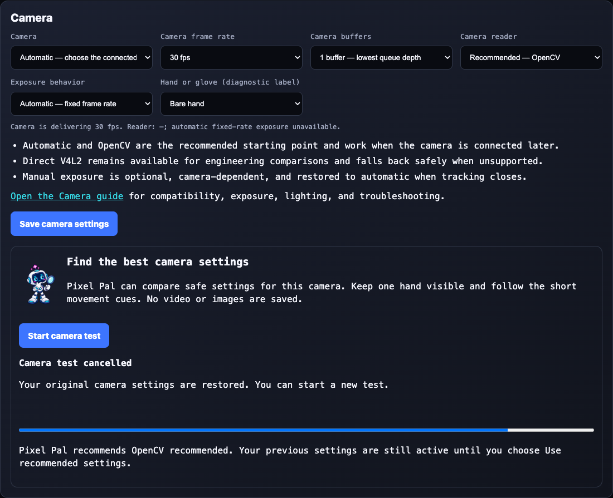

# Installation and Setup

This guide takes you from a prepared Arduino UNO Q and game system to your
first working VirtualGlove game. You will install VirtualGlove on both devices,
pair them securely, centre your hand, and test the controls.

VirtualGlove 0.6.0 supports RetroPie, Recalbox, Batocera, and LaunchBox on
Windows. The normal commands below install the latest stable release. If you
need a specific version or a development build, use the
[technical installation reference](CONFIGURATION_REFERENCE.md#versioned-multi-platform-installation).

VirtualGlove `v0.6.0` is the current stable release. The unversioned commands
in this guide select it through GitHub's latest stable release. Use the
pinned-version procedure in the technical reference when you need to reproduce
one exact version later.

The same command installs or upgrades each device. Close games first and keep the backup locations printed by the installer.

Controller Router is included with the controller. Open its address to visit VirtualGlove, or choose an app if R.O.B. Vision is installed too. Starting a registered game selects its app automatically. You do not need a browser open to play.

The first shared Matrix setup can take several minutes. Leave the installer open until it finishes. Upgrades keep your pairing, players, and game registrations.

## 1. Before you begin

You need:

- a provisioned **VirtualGlove Controller** running on an Arduino UNO Q;
- a UVC USB camera connected through a powered USB hub;
- a supported game system: RetroPie, Recalbox, Batocera, or LaunchBox;
- a physical controller already working with that game system;
- both devices on the same trusted local network with internet access; and
- your own legally obtained NES games. VirtualGlove includes no ROMs or BIOS files.

Close RetroArch and any running game before installation. Keep both devices
powered and connected while the installers run. First installation can take
several minutes.

### If a console upgrade fails

If an upgrade fails, the console installer restores the previous controller software and settings. Your pairing and game registrations are kept. Keep the printed backup folder until you have tested a game.

If power is lost or the installer is terminated abruptly, rerun the same installation command. It recovers the interrupted installation before attempting the upgrade again. If recovery reports a checksum or service error, keep the backup directory and pending journal; do not delete them to bypass the error.

Recovery covers the controller installation. It does not undo operating-system package updates or packages installed through RetroPie Setup.

### Choose your console section

| Platform | Where you install | How Player 1 works |
| --- | --- | --- |
| RetroPie | Raspberry Pi terminal | VirtualGlove normally appears beside your physical controller. Optional Controller Router can combine and assign physical controllers and VirtualGlove. |
| Recalbox 10.x | Recalbox terminal as `root` | Controller Router initially preserves your selected physical controller and VirtualGlove as merged Player 1; Setup can later assign Players 1–4. |
| Batocera 38 or newer | Batocera terminal as `root` | Controller Router initially preserves your selected physical controller and VirtualGlove as merged Player 1; Setup can later assign Players 1–4. |
| LaunchBox | Windows PowerShell | Your physical XInput controller remains available while VirtualGlove supplies a managed RetroArch controller. |

Ordinary NES games can use FCEUmm or the platform's stock Nestopia core. Super Glove Ball also supports the
special **Nestopia (VirtualGlove)** core, which provides its native three-axis
movement and glove actions. FCEUmm remains a complete joystick-mode fallback.

### Check your player choices after pairing

1. Open **Setup** from the Controller Router page at your controller address.
2. Select the console under **Console connection**.
3. Under **Players**, check that the pad you use is assigned to Player 1.
4. Under **Systems**, keep NES enabled for Buddy and VirtualGlove. Choose **My existing setup** for systems where you want your normal controls.
5. With the game closed, choose **Save assignments**.

New Router setups enable NES only. Upgrades keep your previous choices. For input tests, other players, and recovery, see the [Controller Router Guide](CONTROLLER_ROUTER.md).

A standard RetroPie installation can use its separate VirtualGlove gamepad; enabling console routing is optional there. Recalbox and Batocera use Router for their shared player controls.

### Open a Controller terminal

For a new UNO Q, first complete Arduino App Lab setup and connect it to your
network. App Lab shows its current name or IP address. From another computer,
open a terminal and connect with:

```sh
ssh arduino@UNO-Q-NAME.local
```

Use the password you created during board setup. The installer may request it
again when administrator access is needed, but it does not save the password.

## 2. Install the VirtualGlove Controller

In the UNO Q terminal, copy and run these two lines:

```sh
cd /home/arduino
curl -fLO https://github.com/mathan416/VirtualGlove/releases/latest/download/install-uno-q.sh && bash install-uno-q.sh
```

The installer verifies the release, installs VirtualGlove’s Linux service, and installs or upgrades Controller Router as the startup app and sole Matrix owner. It does not flash VirtualGlove’s separate sketch. Both product services remain running when R.O.B. Vision is installed. It also installs the guarded
camera-recovery and shutdown helpers used by the Controller.

### Questions the installer asks

On a first installation, the installer shows the UNO Q's current name and
suggests **virtualglove**. Press Enter to use `virtualglove.local`, or enter a
different short name such as `games-room`. Confirm the displayed address before
continuing. Updates keep the established name and do not ask again.

The camera can be connected before or after installation. Camera recovery is
configured automatically when a supported camera is available.

### What is preserved

Rerunning the installer updates VirtualGlove without erasing players,
calibration, gesture tuning, dead-zone settings, camera choices, pairing, or
device configuration. The installer prints the location of any backup it
creates.

### Controller checkpoint

Open the Dashboard address printed by the installer, normally:

`http://virtualglove.local:8100/dashboard`

The Dashboard should load. With gestures off, a closed camera is normal. Open
**Play** or **Glove Academy** to confirm that the camera can show your whole
hand, then return to Dashboard with controller output stopped.

For the simplest first setup, leave **Camera**, frame rate, exposure, and camera
reader on their recommended automatic settings. If tracking is delayed or
unstable, use **Find the best camera settings** in Setup. The
[Camera Guide](CAMERA_GUIDE.md) explains the advanced choices.



## 3. Install the console

Choose only the section for your game system. Close RetroArch first. On a new
installation, the console installer asks for the Controller name or IP address;
enter the name selected above, normally `virtualglove.local`.

Each section uses the same latest-release installer as future updates. The
installer preserves ROMs, saves, pairing, game registrations, and unrelated
controller settings.

### RetroPie

#### Before you start

Confirm that a physical controller works in EmulationStation and that RetroPie
has internet access. Connect to RetroPie as its normal user, without starting a
root shell.

#### Install

Run this command in the RetroPie terminal:

```sh
cd "$HOME"
curl -fLO https://github.com/mathan416/VirtualGlove/releases/latest/download/install-retropie.sh && bash install-retropie.sh
```

#### Questions the installer asks

- Enter the Controller name or address on a first installation.
- If a required emulator is missing, the installer offers to add it through
  RetroPie Setup.
- If Super Glove Ball is registered, the installer can add the optional
  `lr-nestopia-powerglove` core packaged for RetroArch's actual processor ABI.
  It verifies and load-checks the core first; declining or an incompatible core
  leaves FCEUmm available.
- The optional **VirtualGlove Calibration Test** can be added to the Ports menu
  now or on a later installer run.

If an older Buster-based RetroPie reports that its Raspbian repository has no
Release file, stop and follow
[Buster package source moved](TROUBLESHOOTING.md#buster-package-source-moved),
then run the installer again.

#### What the installer configures

VirtualGlove appears as a separate game controller. Your physical controller
remains available for menus and gameplay. Registered games tell VirtualGlove
which profile to use, and game exit safely releases all controls.

The VirtualGlove development arcade cabinet uses optional Controller Router to
combine its two I-PAC interfaces, supported 8BitDo controllers, and
VirtualGlove into shared arcade-player devices. Its original cabinet merger is
retained as a tested rollback reference, but is no longer the active path.
Router is not enabled by the normal RetroPie installer. Most RetroPie systems
should keep the separate-controller arrangement above. See [VirtualGlove Input
Modes](CONTROLLER_ROUTER.md)
for the two designs and when each is appropriate.

For Super Glove Ball, FCEUmm is the safe fallback. To use native glove control,
choose `lr-nestopia-powerglove` for that ROM from RetroPie's launch menu.

#### Checkpoint

The final report should confirm that the receiver starts automatically. It is
normal to see `ACTION` for pairing or physical gameplay checks that still need
you.

#### First game and updates

After pairing, test an ordinary registered game with FCEUmm. If Router is
enabled, confirm the physical controller works immediately, rest the hand at
neutral once, and then confirm VirtualGlove works without stopping or restarting
it. Test Super Glove Ball separately
if you installed its native core. To update later, close the game and rerun the
same install command.

<!-- PAGEBREAK -->

### Recalbox 10.x

#### Before you start

Confirm that your intended physical Player 1 controller works in
EmulationStation. Connect to Recalbox over SSH as `root`; do not add `sudo` to
the commands below.

#### Install

Run this command in the Recalbox terminal:

```sh
cd /recalbox/share/system
curl -fLO https://github.com/mathan416/VirtualGlove/releases/latest/download/install-recalbox.sh && bash install-recalbox.sh
```

#### Questions the installer asks

- Enter the Controller name or address on a first installation.
- If exactly one configured controller is available, it is selected as physical
  Player 1 automatically.
- If several controllers are available, choose the one you want VirtualGlove
  to share with. The installer displays the available choices.

#### What the installer configures

Recalbox initially enables **VirtualGlove Merged Player 1**, preserving the
selected physical controller and VirtualGlove arrangement. After pairing, the
**Controller Router** card in Setup can enable merged Players 1–4, assign
several configured physical controllers to one player, or move the one
VirtualGlove to another player. Original controllers continue to operate
EmulationStation without duplicate menu movement. During any Libretro game,
assigned physical controllers use the merged players. VirtualGlove gestures
join only compatible NES joystick games or the separate native Super Glove
Ball path. Unrelated settings are preserved.

Registered Super Glove Ball filenames use the packaged Nestopia (VirtualGlove)
core when a compatible core is available and you have not already made an
explicit per-game choice. FCEUmm remains available if the native core cannot be
used.

#### Checkpoint

The final report should confirm automatic startup, the initial physical Player
1 controller, and the Controller Router output. Pairing, extra player
assignments, and live gameplay may still appear as `ACTION` items.

#### First game and updates

After pairing, test an ordinary registered game with FCEUmm. Confirm that hand
controls and the physical controller both operate Player 1. Then test one
non-NES Libretro game with the physical controller; VirtualGlove gestures are
not expected in that game. Finally, test Super Glove Ball if it is installed.
To update later, close the game and rerun the same install command.

<!-- PAGEBREAK -->

### Batocera 38 and newer

#### Before you start

Confirm that your intended physical Player 1 controller works in
EmulationStation. Connect to Batocera over SSH as `root`; do not add `sudo` to
the commands below.

#### Install

Run this command in the Batocera terminal:

```sh
cd /userdata/system
curl -fLO https://github.com/mathan416/VirtualGlove/releases/latest/download/install-batocera.sh && bash install-batocera.sh
```

#### Questions the installer asks

- Enter the Controller name or address on a first installation.
- If exactly one configured controller is available, it is selected as physical
  Player 1 automatically.
- If several controllers are available, choose the one you want VirtualGlove
  to share with. The installer displays the available choices.

#### What the installer configures

Batocera initially enables **VirtualGlove Merged Player 1**, preserving the
selected physical controller and VirtualGlove arrangement. After pairing, the
**Controller Router** card in Setup can enable merged Players 1–4, assign
several configured physical controllers to one player, or move the one
VirtualGlove to another player. Original controllers continue to operate
EmulationStation without duplicate menu movement. During any Libretro game,
assigned physical controllers use the merged players. VirtualGlove gestures
join only compatible NES joystick games or the separate native Super Glove
Ball path. Unrelated settings are preserved.

Registered Super Glove Ball filenames use the packaged Nestopia (VirtualGlove)
core when a compatible core is available and you have not already made an
explicit per-game choice. FCEUmm remains available if the native core cannot be
used.

#### Checkpoint

The final report should confirm automatic startup, the initial physical Player
1 controller, and the Controller Router output. Pairing, extra player
assignments, and live gameplay may still appear as `ACTION` items.

#### First game and updates

After pairing, test an ordinary registered game with FCEUmm. Confirm that hand
controls and the physical controller both operate Player 1. Then test one
non-NES Libretro game with the physical controller; VirtualGlove gestures are
not expected in that game. Finally, test Super Glove Ball if it is installed.
To update later, close the game and rerun the same install command.

<!-- PAGEBREAK -->

### LaunchBox on Windows x86-64

#### Before you start

Install 64-bit Python with its `py` launcher and 64-bit RetroArch with FCEUmm.
Confirm that your physical XInput controller works in RetroArch. Close
LaunchBox, Big Box, and RetroArch before installation.

Download `VirtualGlove-LaunchBox.zip` from the latest VirtualGlove release and
extract it to a temporary folder. The archive contains a folder named
`VirtualGlove`. Open PowerShell as Administrator, using the same Windows
account that runs LaunchBox.

#### Install

Move into the extracted `VirtualGlove` folder, then run the installer. Replace
the example extraction, LaunchBox, RetroArch, and Controller locations with
the locations on your computer:

```powershell
Set-Location "$env:USERPROFILE\Downloads\VirtualGlove"
powershell -ExecutionPolicy Bypass -File .\launchbox\install-launchbox.ps1 `
  -LaunchBoxRoot "C:\LaunchBox" -RetroArchRoot "C:\RetroArch" `
  -ControllerHost "virtualglove.local"
```

Change the two folders and Controller name to match your system.

#### Questions the installer asks

- Confirm the LaunchBox and RetroArch folders if your installation uses
  different locations.
- Allow the authenticated VirtualGlove receiver on Private networks if Windows
  asks. Do not enable it for Public networks.

#### What the installer configures

LaunchBox gains a **VirtualGlove RetroArch** emulator for NES games. Ordinary
games use FCEUmm with VirtualGlove's managed RetroArch controller. Your physical
XInput controller and real keyboard remain available. Super Glove Ball uses
Nestopia (VirtualGlove) when its exact filename is registered.

Existing NES games assigned to standard RetroArch are moved to VirtualGlove
RetroArch. Games explicitly assigned to another emulator remain unchanged.
ROMs, saves, pairing, and unrelated LaunchBox settings are preserved.

#### Checkpoint

The installer should confirm the VirtualGlove RetroArch entry and its managed
receiver. LaunchBox does not have a separate check-only command, so the first
registered game is the final test.

#### First game and updates

After pairing, launch an ordinary registered game from LaunchBox. Confirm that
VirtualGlove directions and buttons work while the physical XInput controller
still controls Player 1. Test Super Glove Ball separately. To update later,
close LaunchBox, Big Box, and RetroArch, extract the new package, and rerun the
same installer.

<!-- PAGEBREAK -->

### Add NES ROMs after VirtualGlove is installed

Adding a ROM does not require reinstalling VirtualGlove:

1. Copy or import the `.nes`, `.zip`, or `.7z` game and refresh the platform's
   game list.
2. Open **Setup -> Games** on the Controller. Add the exact filename and choose
   its profile if it is not already listed, then select **Validate** and
   **Save**. Matching is exact and case-insensitive, and includes the extension.
3. Follow the platform note below.

| Platform | After adding the ROM |
| --- | --- |
| RetroPie | Copy games into `~/RetroPie/roms/nes` and restart EmulationStation or refresh its game list. Select `lr-nestopia-powerglove` from the per-ROM launch menu only when you want native Super Glove Ball. |
| Recalbox | Copy games into `/recalbox/share/roms/nes` and update the game list. Restart the VirtualGlove service or reboot after registering Super Glove Ball so its automatic core choice is refreshed. |
| Batocera | Copy games into `/userdata/roms/nes` and update the game list. Restart the VirtualGlove service or reboot after registering Super Glove Ball so its automatic core choice is refreshed. |
| LaunchBox | Import the game into **Nintendo Entertainment System**. New games inherit **VirtualGlove RetroArch**. The launcher checks the registry on every start, so no service restart is needed. |

An existing explicit per-game emulator choice is preserved. Registering a game
changes only VirtualGlove's profile and launch behaviour; it does not copy,
rename, or modify the ROM.

<!-- PAGEBREAK -->

## 4. Pair the devices

Pair your console once through Controller Router. VirtualGlove and R.O.B. Vision receive their own private credentials automatically when installed on both devices. Installing the other app later adds its access without another pairing. No SSH username or password is required.

Finish the game before pairing, changing app access, or removing a connection. Each console connects to one Controller Router installation at a time. Connecting it to another requires a new console code and Matrix confirmation.

1. Open **Apps > Setup > Pair console**. Both product Setup pages have an **Open Pair console** link to this same page.
2. Open the secure address printed by the controller installer, using its `.local` name or LAN IP. Pairing uses HTTPS port **8444**.
3. Before accepting the local certificate, compare the browser's SHA-256 fingerprint with the fingerprint printed by the controller installer. During confirmation, its beginning also appears after **ID** on the Matrix. Stop if they differ.
4. Enter the console hostname or IP address and paste its complete **CR1 connection code**. The console installer prints this single-use code; it lasts five minutes.
5. Choose **Continue**, read the six Matrix digits after **PN**, and enter them within two minutes.
6. Choose **Connect**. Wait for **Connected** and check each app's readiness below it.

### Check or repair a connection

Open **Pair console > Your consoles**. **Connected** means Router has verified the console connection. **Unavailable** means it could not reach the console. **Needs attention** means the certificate, identity, or app setup needs review. App readiness is shown separately.

Choose **Check and repair connections** after reconnecting a device or installing another app. Use **Disable** beside an app to remove only its access, or **Remove console** to remove the whole connection. Finish any game first. A certificate change requires a fresh pairing; do not ignore the mismatch.

For another code, rerun the console installer or its pairing command. Existing game filenames and player assignments remain saved. Incorrect, expired, or already-used codes require a new window; five incorrect Matrix confirmations lock the current window.

## 5. Calibrate and test a game

### Centre your hand

1. Open Dashboard and choose the correct player.
2. Position the camera so your whole hand remains visible throughout the area
   where you intend to move.
3. Hold a relaxed open hand at a comfortable centre and distance.
4. Select **Centre hand** and remain still until it reports completion.

Centre again after moving the camera, changing playing position, or switching
to a player who has not been calibrated. The saved centre belongs to the player
and does not chase the hand during play.

### Test an ordinary game

1. On Dashboard, select **Start controller**.
2. Launch a registered NES game that uses FCEUmm.
3. Confirm the expected profile appears on Dashboard and the Matrix.
4. Test Left, Right, Up, Down, A, B, Start, and Select.
5. Confirm the physical controller still works for Player 1.
6. Return the hand to centre and confirm movement stops.
7. Exit the game and confirm gesture output stops.

If Controller Router is enabled, also test every assigned physical controller.
On Recalbox and Batocera, or a routed RetroPie system, launch a non-NES Libretro
game and confirm the physical assignments still work. This proves the Router's
all-Libretro physical path. It does not mean VirtualGlove gestures are expected
outside their supported NES and native Super Glove Ball paths.

Different Programs deliberately use different gestures. If a control does not
behave as expected, check the selected Program in the
[Gameplay Guide](GAMEPLAY_GUIDE.md) before changing calibration.

**Checkpoint:** A gesture must change the intended control inside the running
game. A running service or visible controller name alone is not an end-to-end
test.

### Test Super Glove Ball

- With FCEUmm, test the ordinary joystick profile first.
- With Nestopia (VirtualGlove), test Start, hand movement, forward and backward
  depth, grab and throw, index-point fire, and Power Punch.
- On RetroPie, choose the native core from the ROM's launch menu. Recalbox,
  Batocera, and LaunchBox select it automatically for an exact registered ROM
  unless you have made another explicit choice.

If the native core is unavailable or unsuitable, return that ROM to FCEUmm;
the rest of VirtualGlove remains installed.

## 6. Confirm startup and finish

1. Reboot the Controller and console normally.
2. Confirm that Dashboard returns and the console reconnects without pairing
   again.
3. Confirm the selected player, centre, tuning, camera choices, and game
   registrations remain available.
4. Launch the ordinary FCEUmm test game again and confirm both VirtualGlove and
   the physical controller work.
5. If installed, test Super Glove Ball again.

The Controller remembers whether you selected **Start controller** or **Stop
controller**, but controls are delivered only during a recognised game session
or an intentional manual profile. Unknown games and game exit release all
controls safely.

## Updates and checks

To update, close running games and repeat the same install command on the
Controller and console. Use the same release on both devices. The installers
stop managed VirtualGlove processes before replacing application files and
preserve private settings and user data.

### Fresh installation checklist

1. Install the Controller from `/home/arduino`, then open the controller address
   printed by the installer.
2. Confirm a physical controller already works on the console before installing
   its VirtualGlove integration.
3. Install the same VirtualGlove release on the selected console platform.
4. In Controller Router, choose **Pair console**, enter the console's one-time
   code, and confirm the code shown on the Matrix display. Check Player 1 and
   NES in **Players and Systems**.
5. Centre the selected player and test one ordinary registered NES game with
   both VirtualGlove and the physical controller.
6. If installed, test native Super Glove Ball separately, then reboot both
   devices and repeat the game and exit checks.

### Upgrade from v0.4.2 or later to v0.6.0

Version 0.6.0 includes a managed upgrade from the released v0.4.2 installation.
Update the Controller and console from the same v0.6.0 release. The installers
back up and remove retired application files while preserving:

- players, calibration, tuning, and dead-zone settings;
- camera and device configuration;
- pairing and the saved console address;
- game registrations and rapid-fire choices;
- ROMs, saves, controller assignments, and installed native cores.

Keep the printed backup location until you have completed the reboot and game
checks above. If the installer reports an unknown or locally modified retired
file, follow its message rather than deleting the installation manifest or
forcing the upgrade. The
[technical installation reference](CONFIGURATION_REFERENCE.md#versioned-multi-platform-installation)
describes staged upgrades and recovery.

Use this order for the release upgrade:

1. Close every running game. On LaunchBox, also close LaunchBox, Big Box, and
   RetroArch.
2. Install v0.6.0 on the Controller, then install the same release on the
   console. Run each command from the writable folder shown in its platform
   section; do not mix stable and release-candidate files.
3. Keep every backup location printed by the installers until acceptance is
   complete.
4. Reboot the Controller and console. Confirm pairing, players, calibration,
   game registrations, and Controller Router assignments were retained.
5. Test physical controls, VirtualGlove controls, the platform exit hotkey, and
   native Super Glove Ball when its core is installed.

### Read the installer report

| Result | What it means |
| --- | --- |
| `PASS` | That check succeeded. |
| `ACTION` | Installation succeeded, but you still need to complete the named step, such as pairing or testing a game. |
| `FAIL` | Resolve the reported problem before continuing, then run the installer again. |

A technical `PASS` cannot prove that your camera sees your hand or that a game
responded. Complete the physical game checks before considering installation
finished.

## If something does not work

### The download fails

Confirm internet access and retry the same command. A failed download or
checksum installs nothing. If the latest stable release does not contain the
required installer asset, wait for the completed release rather than using a
file from a different version.

### Dashboard or Setup does not open

Try the Controller's IP address instead of its `.local` name:

- Dashboard: `http://CONTROLLER-IP:8100/dashboard`
- app settings: `https://CONTROLLER-IP:8443/setup`
- Pair console: `https://CONTROLLER-IP:8444/setup`

Confirm the Controller and browser are on the same local network. The Matrix
hourglass means VirtualGlove is still starting; a blinking X means Dashboard
has an error to report.

### The camera is unavailable

Open **Play** or **Glove Academy** and wait for the camera view. Reconnect the
camera, powered hub, and cable if it remains unavailable. The recovery helper
enrolls a supported camera after its first successful frame, even when no camera
was connected during installation. Do not change advanced camera settings until
the automatic configuration has been tested.

### Pairing fails or expires

Open Controller Router **Pair console**, check the console hostname or IP address, and obtain a new connection code by rerunning the console installer. Read the current Matrix PIN; expired or used codes cannot be reused. Never copy pairing credentials between consoles manually.

### The game launches but hand controls do not work

Check these in order:

1. Dashboard shows **Start controller** as active.
2. The game filename is registered under **Setup -> Games**.
3. Dashboard shows the expected active game and profile.
4. The camera sees a calibrated hand.
5. The platform uses the VirtualGlove controller arrangement described in its
   install section.

If Controller Router is enabled, rest the hand at its saved neutral position
once after launch. Physical controls should work immediately; you must not need
to stop VirtualGlove to make a physical Start press work. If stopping
VirtualGlove is required, close the game and rerun the current console installer
to update Router. Do not replace the entire RetroArch configuration to repair
one binding.

### The wrong physical controller is Player 1

On RetroPie, Recalbox, or Batocera with Controller Router enabled, close every
RetroArch game and use Setup's **Controller Router** card. Assign the controller
to the intended player, save, and run the ten-second controller check. A red
Player 1 warning means no physical Player 1 controller can carry the platform
hotkey. On ordinary RetroPie without Router, or on LaunchBox, use the platform's
normal controller assignment while keeping VirtualGlove's managed entry intact.

### Super Glove Ball uses the wrong core

Confirm that the exact ROM filename is registered for Super Glove Ball. On
RetroPie, choose `lr-nestopia-powerglove` from the per-ROM launch menu. On
Recalbox, Batocera, or LaunchBox, restart the platform integration after adding
the ROM and confirm that no explicit per-game emulator choice overrides the
automatic selection. FCEUmm remains a safe fallback.

### Installation stops partway through

Correct the reported problem and rerun the same installer. Keep the backup path
printed by the installer. For service commands, logs, manual repairs, or package
details, use the [Troubleshooting Guide](TROUBLESHOOTING.md) and
[installation troubleshooting commands](CONFIGURATION_REFERENCE.md#installation-troubleshooting-commands).

## Matrix and web-page quick reference

These are the Matrix states most useful during installation:

| Display | Meaning |
| --- | --- |
| System heart or pulsing hourglass | The Controller is starting. |
| Animated glove | Gestures are off and the Controller is idle. |
| Scanning `L` | Play or Glove Academy practice is active; game output is paused. |
| `1`-`14`, `A`-`I`, `BS`, or `GB` | The corresponding game profile is selected. |
| Pulsing profile code | A calibrated hand is being tracked. |
| Blinking X | Open Dashboard to read the reported problem. |
| Blank | Check Controller power and Dashboard; blank does not confirm shutdown. |

See the [Matrix Guide](MATRIX_GUIDE.md) for every animation and display state.

| Page | Normal address |
| --- | --- |
| Dashboard | `http://UNO-Q-NAME.local:8100/dashboard` |
| Play | `http://UNO-Q-NAME.local:8100/play` |
| Glove Academy | `http://UNO-Q-NAME.local:8100/learn` |
| Setup and Games | `http://UNO-Q-NAME.local:8100/setup` |
| Pair console | `https://UNO-Q-NAME.local:8444/setup` |
| Help and printable manuals | `http://UNO-Q-NAME.local:8100/help` |

For gestures and game controls, use the [Gameplay Guide](GAMEPLAY_GUIDE.md).
Technical details are in [Architecture](ARCHITECTURE.md),
[VirtualGlove Input Modes](INPUT_MODES.md), and the
[Configuration Reference](CONFIGURATION_REFERENCE.md).
