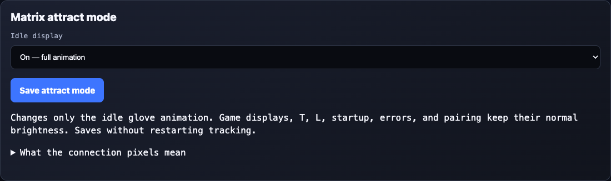

# Matrix Display Guide

The blue LED matrix on the **VirtualGlove Controller (Arduino UNO Q)** is
VirtualGlove's status display. It tells
you which mode is active and helps distinguish startup, practice, tracking, and
pairing. It does not show a game's score or confirm that a game accepted a button.

Use the photographs and descriptions below to recognise the display and decide
what to do next.

## Recognise the display

| What you see | See it | What it means | What to do |
| --- | --- | --- | --- |
| Arduino boot logo |  | The VirtualGlove Controller's system software is starting, before VirtualGlove controls the display. | Wait for the app's hourglass or normal display. |
| System heart animation |  | The board is progressing through system startup. | Wait for the app display. |
| Pulsing hourglass |  | VirtualGlove is starting. | Allow startup to finish. If it persists, check Dashboard. |
| Lightning flash, moving cuff, curling glove, and a spark |  | Gestures are off; the app is in its idle mode. | Open Glove Academy to practice, or choose a game profile on Dashboard. |
| A large scanning **L** |  | Play or Glove Academy lessons are active. L stands for local play or lessons. | Follow the game or practice moves shown in your browser; controller output is paused. |
| A large scanning **T** |  | Gesture tuning is active, including hand setup. | Follow the recording, preview, and save instructions in Glove Academy. Controller output is paused. |
| A steady **1-14**, **A-I**, **BS**, or **GB** |  | A game profile is selected, but a calibrated hand is not currently being reported as tracked. | Show your hand and check tracking/calibration on Dashboard. Program 14 intentionally keeps the camera off. |
| **1-13**, **A-I**, **BS**, or **GB** gently changing brightness |  | The app reports a detected, calibrated hand for that profile. | Check Dashboard's controller status before playing. This pulse alone does not mean controls are enabled. |
| **ID**, characters, **PN**, and digits repeating | — | Secure pairing is showing the device identity and temporary PIN. | Follow the Setup page; read each group in order. |
| A flashing **X** |  | The app has requested an error display. | Read Dashboard's error message before deciding whether to reconnect the camera or restart. |
| A blank matrix |  | The display has been turned off, the app is stopping, or the board is still starting. It may also have lost power. | Use the browser and board power indicators to distinguish these cases. Blank does not prove shutdown is complete. |

## Startup: logo, hourglass, then your mode

A typical startup with **Gestures off** selected is:

1. The board shows its Arduino boot logo and system heart animation.
2. The hourglass appears while VirtualGlove starts.
3. Once startup finishes, gestures-off mode shows the selected attract animation or connection pixels.

| Arduino boot logo | System heart | VirtualGlove hourglass |
| --- | --- | --- |
|  |  |  |

With an active startup profile, the later display can instead be its profile
letters. Opening Play or Glove Academy selects **L**; enabling tuning selects **T**.
Wait for the camera view and startup message in your browser before practicing
or playing.

The hourglass means startup is in progress. If it stays on the display, open
Dashboard and check the startup or error message.

Public releases include the Matrix firmware already compiled for the UNO Q.
Installation verifies its checksum and the board model, then uses the board's
factory flashing support. It does not download the large Zephyr compiler on the
Controller. Developers can still rebuild the same pinned source through the
repository engineering workflow.

## Attract brightness and connection pixels

In **Setup → Matrix attract mode**, select **On**, **Dim**, or **Off** and choose
**Save attract mode**. The preference survives upgrades and restarts. On is the
default and preserves all eight brightness levels; Dim retains the animation
with lit pixels mapped to levels 1–2. Off suppresses the animation.

Off keeps four faint pixels along the bottom-left edge, with a dark pixel
between each indicator. From left to right: app running; console Games service
reachable; authenticated console response; and **Networking**, meaning a physical
Wi-Fi or Ethernet link is up. Ethernet through a USB dock counts when Linux
recognises it as a physical Ethernet interface. Docker bridges and loopback do not.

A dark fourth pixel can mean disconnected or unavailable telemetry; Setup uses
red and grey to distinguish them. A green link does not prove an IP address,
Internet access, or game delivery. Update the host sampler for Ethernet support;
its script, service, and `wifi-status.json` filenames are retained for upgrades.
The existing four-pixel firmware needs no new format or flash for this change.

Setup repeats these four checks in a labelled **Controller status** panel at the top of the page, alongside tracking, controller output, and the saved console. Green means confirmed, red means disconnected or not confirmed, and grey means unknown. The physical pixels remain faint and monochrome.

Connection checks run in the background while Off is selected and the display
is idle, or while a visible Setup page requests status, at most once every ten seconds. Results expire after thirty seconds.
They never send gameplay input. This uses the selected console's Games service
on TCP port `55358`; no receiver change is required.

The setting affects only the gestures-off attract display. Game/profile artwork,
T, L, startup, errors, pairing, and application shutdown retain their normal
brightness and behaviour. Saving does not restart the tracker. Install updated
matrix firmware before using these controls; the footer identifies older firmware.

## The idle glove show

The roughly four-second loop opens with a lightning bolt flashing twice. The
cuff slides in from the right and the hand rises above it, curls into a fist,
and reopens. A small spark climbs toward the fingertips, then the glove gently
brightens and settles. Separated fingers and a distinct thumb keep the silhouette
readable; a dim palm, highlighted edges, and a wrist buckle use the matrix's
eight brightness levels (0 is off, 1–7 are lit). The bottom two wrist rows sit one
pixel farther right, with the cuff entrance and wrist spark aligned to match.

The illustration above simulates the LED levels; actual brightness and glow
depend on the physical display. Open Glove Academy to practice, or choose a game
profile on Dashboard when ready to play. Existing installations need a
[matrix firmware update](CONFIGURATION_REFERENCE.md#build-and-install-matrix-firmware)
to show the revised animation; copying website files alone does not update it.

A flashing spark here does **not** mean you performed Glove Zap. This animation
means gestures are off. It is different from selecting a game profile and merely
pressing **Stop controller**: that keeps the camera/profile active and can leave
profile letters visible.

## Local play and Glove Academy: L and T

| L: Local play or Glove Academy lessons | T: Gesture tuning |
| --- | --- |
|  |  |

**L** means local Play or Glove Academy lessons are active. **T** means gesture tuning is
active, including **Set up my hand**, individual adjustments, and previews.
Follow the browser's instructions to practice or complete your recordings.

Both modes pause controller output. After practice, use Dashboard to check the
selected profile and controller state; after tuning, explicitly start controller
delivery when ready to play. A pairing display can temporarily cover either
letter. Tracking details and pose failures remain in the browser rather than
being spelled out on the matrix.

## Game profile codes

| Code | See it | Selected profile |
| --- | --- | --- |
| **1** through **13** | Numeric program code | The corresponding original camera-active numeric profile; older firmware safely shows blank |
| **14** | Numeric program code | Program 14 is selected; camera and VirtualGlove output intentionally stay off while the game session remains visible |
| **A** through **I** |  | The corresponding reusable Program A-I profile; A is shown |
| **BS** |  | Bad Street Brawler |
| **GB** |  | Super Glove Ball |

For example, **GB** is what you should expect with Super Glove Ball selected.
It stays steady until a calibrated hand is being tracked, then gently pulses. The characters remain the same: the animation does not
identify individual finger curls, movements, or button presses.

The important distinction is **tracking versus delivery**. A pulsing **GB** can
appear while controller output is stopped. Confirm **Start controller** has been
used and Dashboard shows output enabled, then confirm the action in the game.
The matrix does not acknowledge console receipt or the game's response.

A generic **PG** ready symbol or a small pulsing tracking symbol can appear when
no recognised profile identifier is available. These are fallback displays;
normal named game profiles use their numeric, letter, or dedicated two-character
codes. They do not represent extra games
or new gesture commands. If you expected **GB** or **BS**, check the selected
profile on Dashboard.

## Pairing: ID and PN

When a submitted pairing attempt finishes, the matrix releases the approval PIN and resumes its normal display. When idle, the glove animation follows your On, Dim, or Off attract setting; active game and status displays still take priority.

During secure pairing, the small display presents the information in pieces:

1. **ID** announces the device certificate identity.
2. Seven hexadecimal characters follow in groups of two, with the last character shown alone.
3. **PN** announces the temporary six-digit PIN.
4. Three pairs of digits follow, preserving leading zeroes.
5. The sequence repeats so you can read it again.

Read each pair from left to right and join the groups in the order shown. Do not
mistake **PN** for a game program or use the certificate identity as the PIN.

Follow the Setup page to compare the identifier and enter the PIN. Pairing
information temporarily replaces the usual display. If it expires before you
finish, prepare a new pairing attempt. Check the page for confirmation that
pairing succeeded.

For public photographs, use a clearly marked demonstration sequence or obscure
live pairing digits. Never publish an active PIN or connection credentials. See
[secure pairing](INSTALL_README.md) for the full procedure.

## Errors, pauses, and a blank display

| Flashing X | Blank matrix |
| --- | --- |
|  |  |

A blinking **X** means the app needs attention. Read Dashboard's error message
for the cause and the next step. Check Dashboard whenever something is not
working, even if the matrix still shows a normal mode.

A blank display alone does not prove the board is safe to unplug. Use the normal
Shutdown procedure and its completion guidance. If the board should be running,
check its power, wait for boot to finish, and try Dashboard. If the web app works
but the display stays blank, record what appeared immediately before it went
blank and whether restarting the app changes it.
