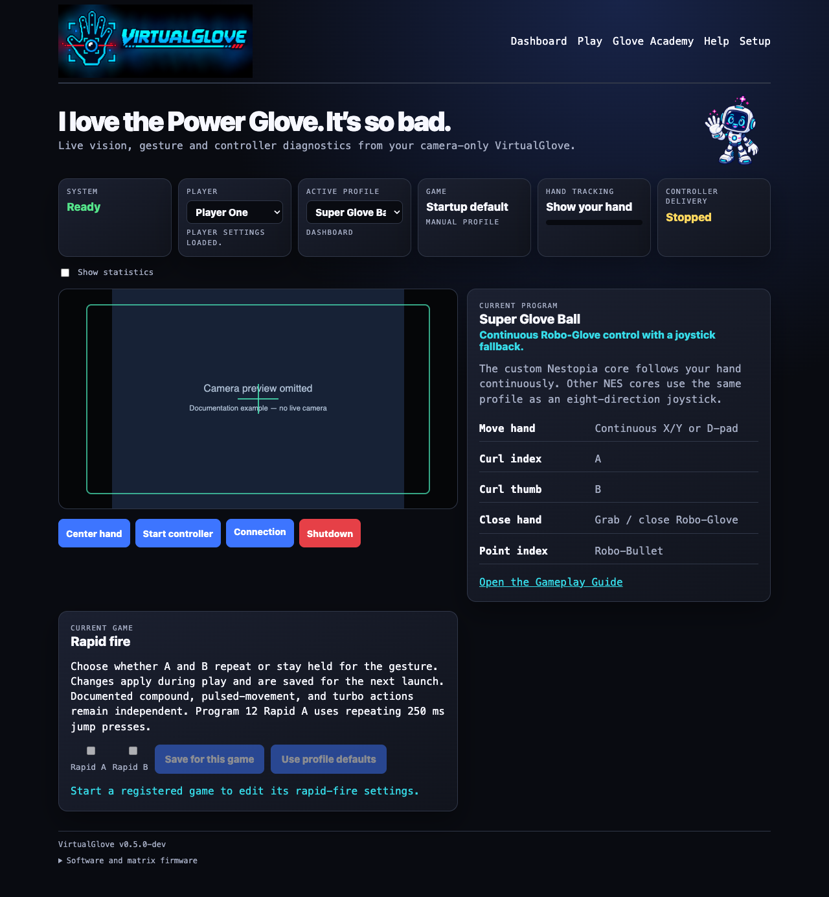
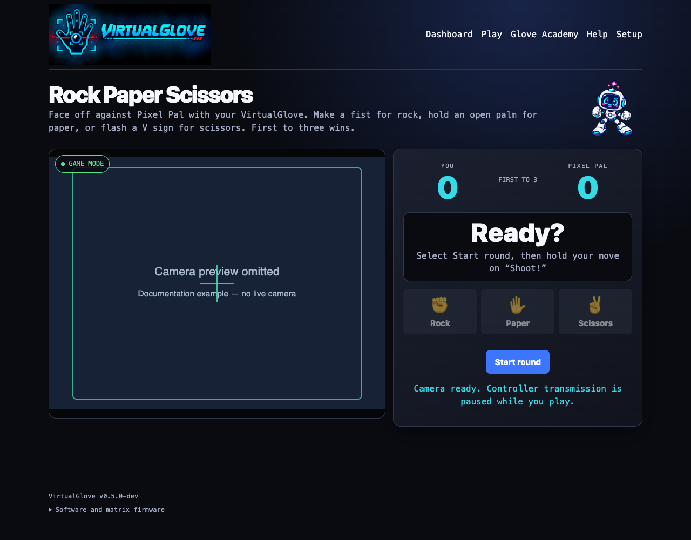
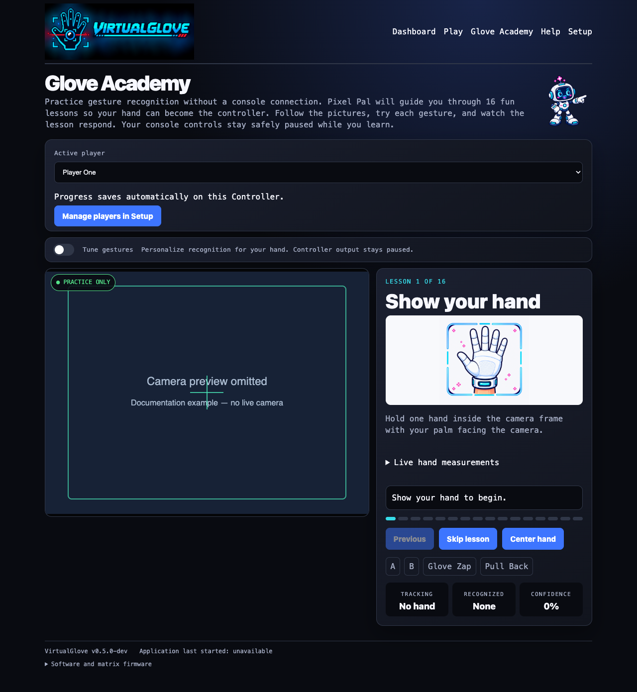
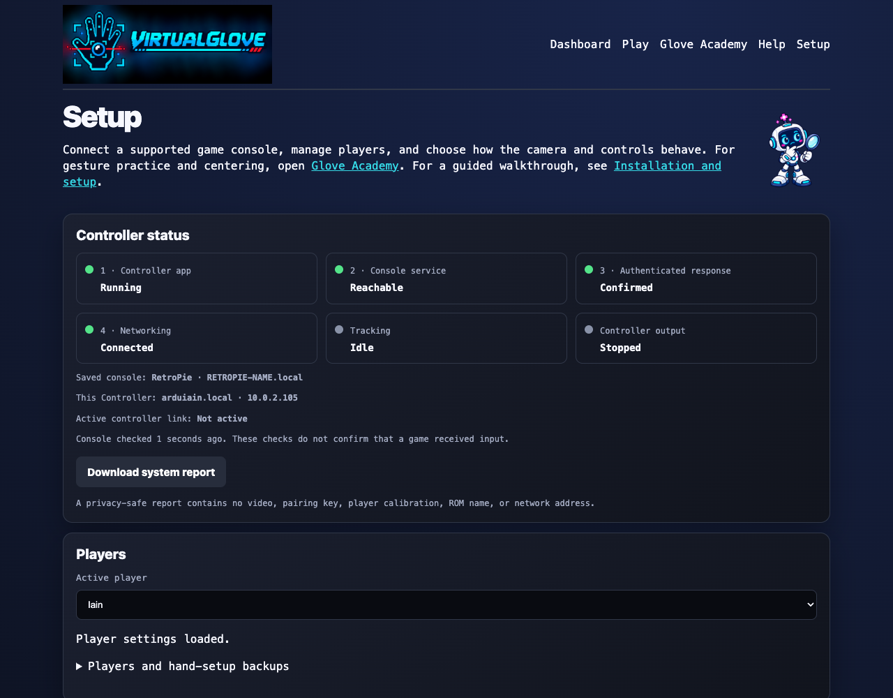
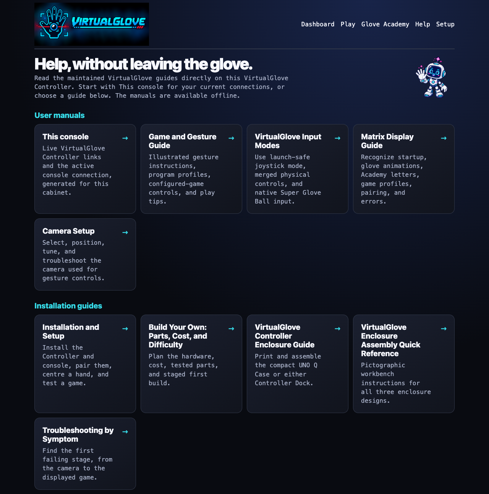
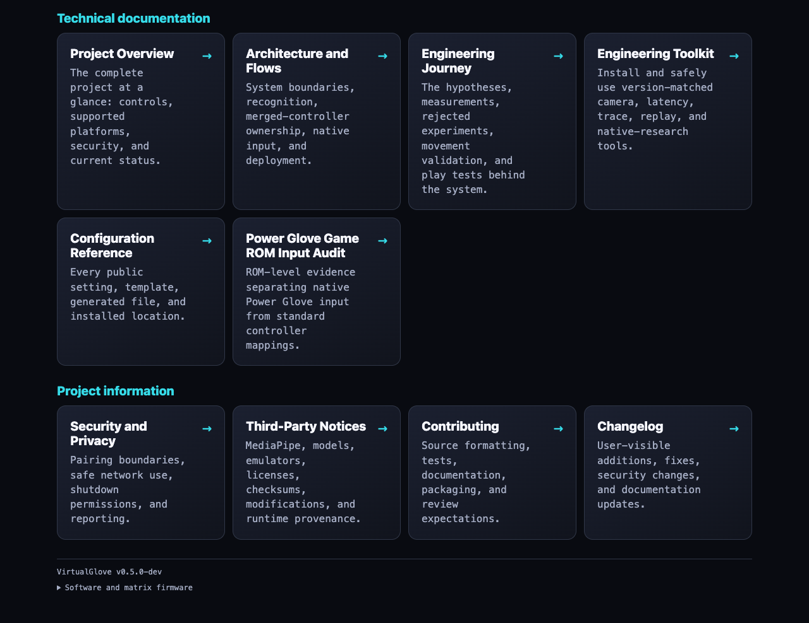

<p align="center">
  
</p>

# VirtualGlove — Quick Reference

Use this guide to install, pair, check, and operate your VirtualGlove system.
The **VirtualGlove Controller** is the project's camera and recognition
device, built on an Arduino UNO Q. Replace `UNO-Q-NAME.local` with your
VirtualGlove Controller hostname and `CONSOLE-NAME.local`
with your RetroPie, Recalbox, Batocera, or LaunchBox host name. Each command section identifies the machine
on which to run it. Keep passwords and pairing tokens out of this document.

## Your installation

| Item | Value |
| --- | --- |
| VirtualGlove Controller network address | `UNO-Q-NAME.local` |
| Console platform | RetroPie / Recalbox / Batocera / LaunchBox |
| Console network address | `CONSOLE-NAME.local` |
| VirtualGlove Controller App Lab application | VirtualGlove |
| VirtualGlove Controller application directory | `/home/arduino/ArduinoApps/virtualglove` |
| Camera | UVC-compatible USB camera; select **Automatic — choose the connected camera** in Setup |
| Startup profile | Choose in Setup |

Prefer `.local` names in bookmarks and settings. If a name does not resolve,
check the device's current IP address in your router and use that address
temporarily. A router reservation prevents the fallback address from changing.

## Browser URLs

Open these pages on a computer or phone connected to the same trusted network.

| Page | Address |
| --- | --- |
| Dashboard: camera and controller output | [Open Dashboard](http://UNO-Q-NAME.local:8088/dashboard) |
| Play: Rock Paper Scissors | [Open Play](http://UNO-Q-NAME.local:8088/play) |
| Learn: practice and tune gestures | [Open Learn](http://UNO-Q-NAME.local:8088/learn) |
| Games: edit game mappings | [Open Games](http://UNO-Q-NAME.local:8088/setup#games-section) |
| Help: manuals and live cabinet reference | [Open Help](http://UNO-Q-NAME.local:8088/help) |
| Setup: connection and startup settings | [Open Setup](http://UNO-Q-NAME.local:8088/setup) |
| Secure Setup: pairing | [Open secure Setup](https://UNO-Q-NAME.local:8443/setup) |
| Status: diagnostic readings | [Open status](http://UNO-Q-NAME.local:8088/status) |
| Camera stream | [Open camera stream](http://UNO-Q-NAME.local:8088/stream) |
| Project repository | [VirtualGlove on GitHub](https://github.com/mathan416/VirtualGlove) |

The links above contain example hostnames. Replace them in the browser's address
bar. The live **Help > This console** page builds links using the VirtualGlove Controller address
you used to open it.

## Install and deploy over Wi-Fi

For a first installation, follow these sections in order, then pair the devices
and complete the [Installation Guide's gameplay checks](INSTALL_README.md#5-calibrate-and-test-a-game).
All flags are explained in the [command reference](CONFIGURATION_REFERENCE.md#command-line-reference).

### Download and package on your computer

1. Install Arduino App Lab on your development computer. Run `command -v git python3 bash rsync zip` and install any missing tools.
2. In a macOS or Linux terminal, choose your projects folder and run the commands below. They download the current `main` branch and build its VirtualGlove Controller installation ZIP.
3. Confirm that verification reports **App Lab installation ZIP verified**.

```sh
git clone --branch main https://github.com/mathan416/VirtualGlove.git
cd VirtualGlove
scripts/build-app-lab-package.sh
python3 scripts/verify-app-lab-package.py
```

### Prepare the VirtualGlove Controller

1. Connect the VirtualGlove Controller by USB and complete its setup in App Lab. Join the same trusted network as the console and record the board's hostname.
2. Import `output/app-lab/VirtualGlove-Uno-Q.zip` from your computer's checkout. Open **VirtualGlove** and select **Run** to transfer and start the app and matrix sketch.
3. Connect the camera through the powered USB hub. Follow the [Installation Guide](INSTALL_README.md) if you need help with the initial board setup.

Open a terminal on the VirtualGlove Controller, or connect from your computer:

```sh
ssh arduino@UNO-Q-NAME.local
```

Run these commands **on the VirtualGlove Controller** after importing and running the app once:

```sh
cd /home/arduino/ArduinoApps/virtualglove
sudo python3 scripts/setup-machine.py uno-q
```

This installs host support for local names, shutdown, and guarded USB-camera recovery, sets the app
to start at boot, and restarts it. Review every **FAIL** or **ACTION** result.
The installer requires the application directory shown above. Run `exit` after
setup to leave the VirtualGlove Controller terminal. Check Dashboard, Play, and Learn before pairing.

### Install the console receiver before pairing

The console needs its receiver, pairing command, game registry, and game-session
integration before it can pair with the Controller. For a published release,
use the platform installer from the same release as the Controller:

| Console | Command and account |
| --- | --- |
| RetroPie | `bash install-retropie.sh --version VERSION --peer UNO-Q-NAME.local` as the normal RetroPie user |
| Recalbox 10.x | `bash install-recalbox.sh --version VERSION --peer UNO-Q-NAME.local` as `root` |
| Batocera 38+ | `bash install-batocera.sh --version VERSION --peer UNO-Q-NAME.local` as `root` |
| LaunchBox x86-64 | Run `launchbox\install-launchbox.ps1` as the Windows user who runs LaunchBox |

Replace `VERSION` with the same published v0.5.0 tag on both machines. The
[Installation Guide](INSTALL_README.md#3-install-the-console) gives full commands,
persistent paths, prerequisites, and checks.

Recalbox and Batocera select one configured physical Player 1 controller. One
connected pad is automatic; with several, run the matching installer with
`--list-player1-devices`, then repeat it with `--player1-device DEVICE-ID`.
Their NES gamepad is named **VirtualGlove Merged Player 1**.

The following source-checkout path is specifically for RetroPie developers. Run
it in a local terminal or SSH session with the normal RetroPie account.

For a new installation, download the same `main` branch used on the VirtualGlove Controller:

```sh
sudo apt update
sudo apt install -y git
cd ~
git clone --branch main https://github.com/mathan416/VirtualGlove.git
cd VirtualGlove
```

If you already have a checkout, open that directory instead of cloning again.
Then install the RetroPie components, substituting the Controller hostname:

```sh
sudo python3 scripts/setup-machine.py retropie --peer UNO-Q-NAME.local
```

The installer preserves existing tokens and settings, installs the receiver
and pairing commands under `/opt/virtualglove/bin/`, and adds the game-launch
hooks. It also installs the controller mapping and the 45-second startup timer.
An **ACTION** result asking you to pair or verify gameplay is expected on first
installation. Correct any **FAIL** result before continuing to pairing.

If a registered Super Glove Ball ROM is present, the installer offers to build
the optional `lr-nestopia-powerglove` core from its pinned Nestopia source. It
installs under a separate name and leaves stock Nestopia untouched. The ROM's
saved emulator remains FCEUmm until you explicitly choose the native core from
RetroPie's per-ROM launch menu. Declining the optional build leaves the complete
FCEUmm fallback available.

For an existing installation, `--peer` does not replace the saved VirtualGlove Controller address.
If that address has changed, update `/etc/virtualglove/launcher.json` on RetroPie.

### Update the VirtualGlove Controller from your computer

Complete the [SSH key setup](CONFIGURATION_REFERENCE.md#set-up-ssh-key-access-once) first. From the full project
checkout **on your development computer**, verify access and deploy:

```sh
ssh -o BatchMode=yes arduino@UNO-Q-NAME.local hostname
scripts/deploy-uno-q-wifi.sh arduino@UNO-Q-NAME.local
```

The deployment preserves the VirtualGlove Controller's private `data/` directory and restarts the
application. It updates the VirtualGlove Controller only. To update RetroPie, update its source
checkout and rerun the RetroPie installer above; it preserves local settings.

The VirtualGlove Controller installer includes the shutdown and camera-recovery helpers. To update
or repair them separately, run this from your development computer's project checkout:

```sh
scripts/install-uno-q-shutdown-helper.sh arduino@UNO-Q-NAME.local
```

To install or repair only camera recovery without touching shutdown support:

```sh
scripts/install-uno-q-camera-recovery-helper.sh arduino@UNO-Q-NAME.local
```

The camera does not need to be connected during installation. The first healthy
camera sighting enrolls the one UVC camera and its actual parent hub. Moving the
camera to another hub updates the association automatically the next time vision
sees it. The installer adds `uhubctl`; when the enrolled hub advertises genuine
per-port switching, only the saved camera port is power-cycled. Otherwise the
identity-checked whole-hub rebind remains a fallback only for hubs without a
network interface. Recovery is confirmed
only after a worker test frame, not USB enumeration. Until that first sighting,
recovery intentionally has no hub or port to operate.

The terminal prompts for the VirtualGlove Controller account password if needed. The helper
requests a Linux halt; the tested board restarts afterward. See the shutdown
limitation below.

## Pair your console

Complete both machine installations above, then use the one-time-code method:

1. Open `https://UNO-Q-NAME.local:8443/setup`. In **Connection and startup**, choose RetroPie, Recalbox, Batocera, or LaunchBox, enter the console address, and select **Save connection**.
2. Continue to **Pair this Controller**, choose **One-time code (recommended)**, and select **Continue**. Pairing uses the saved platform and address.
3. Compare the matrix `ID` with the beginning of the browser certificate's SHA-256 fingerprint. If they match, check the confirmation box, enter the six-digit **Controller approval PIN**, and select **Continue**.
4. On the console, run the one command displayed by Setup and leave it running. Enter its 20-character **Console one-time code**, then select **Pair with console**. This is not the Controller PIN.
5. Wait for **Pairing complete**. This includes platform verification and a signed receiver-token check. Open Dashboard for controller Start/Stop and shutdown.

For SSH, choose **SSH password** in the first step, complete the same Controller
confirmation, then enter the console username and password in the final step.
The console must accept SSH password login. RetroPie normally uses `pi` with
`sudo`; Recalbox and Batocera normally use `root`. LaunchBox uses one-time-code
pairing only; run its displayed PowerShell command as the Windows user who runs LaunchBox.
The Controller does not save the password. Confirmation expires after two
minutes; use **Start a new confirmation** after expiry or a submitted failure.
Console and method changes are locked during the active window. Pairing alone
does not arm output or verify game delivery.

## Quick health checks

From your computer, open the status URL above or run:

```sh
curl -sS http://UNO-Q-NAME.local:8088/status
```

Once you have selected an active profile and completed calibration, the
status readings should show the following while your hand is visible:

```json
{
  "camera_available": true,
  "worker_running": true,
  "detected": true,
  "calibrated": true
}
```

With **Gestures off**, an inactive camera is normal. Select a profile on
Dashboard or open Glove Academy to check tracking.

Run the matching check **on the console**:

```sh
# RetroPie
sudo systemctl status virtualglove-receiver.service
sudo systemctl status virtualglove-receiver.timer
sudo journalctl -u virtualglove-receiver.service -n 100 --no-pager
grep -A8 -B2 'VirtualGlove' /proc/bus/input/devices
# Recalbox
sh /recalbox/share/system/virtualglove/recalbox/virtualglove-service status
# Batocera
batocera-services is-enabled VirtualGlove
/userdata/system/services/VirtualGlove status
python3 /userdata/system/virtualglove/scripts/verify-batocera-native-core.py \
  --manifest /userdata/system/virtualglove/native/batocera/manifest.json \
  --arch "$(cat /usr/share/batocera/batocera.arch)" \
  --version "$(cat /usr/share/batocera/batocera.version)" --resolve-core
```

RetroPie's separate virtual controller appears after the first authenticated
packet. Recalbox and Batocera keep **VirtualGlove Merged Player 1** present from
service startup; their checks confirm the selected physical pad, merged device,
and NES joypad index. LaunchBox retains physical XInput and audits its VirtualGlove
keys for RetroArch command/hotkey conflicts before every FCEUmm launch. Native
Super Glove Ball sends recognized hand controls only through the guarded native
record and does not duplicate them as keyboard input.
Batocera resolves a packaged native core for its exact architecture and
load-tests it before exposure; exact registered Super Glove Ball ROMs are
selected only when they have no explicit core choice. LaunchBox verifies its
Windows DLL during installation and falls back to FCEUmm joystick mode if that
DLL is later missing or changed.
Select **Start controller** on Dashboard when ready, launch a registered game,
and verify gameplay with both VirtualGlove and the physical joypad.

### Run the local software tests

This is a developer check. Run it from the **root of the full Git checkout**,
where the `src/` and `tests/` directories are present:

```sh
PYTHONPATH=src python3 -m unittest discover -s tests -v
```

The command is correct for macOS and Linux. `PYTHONPATH=src` lets the tests
import the local source without installing the package. The tests do not
require a camera, MediaPipe, or either physical device, but some open temporary
local network listeners. The App Lab ZIP and the installed receiver files do not include the full
test suite. Successful completion ends with `OK`; these tests do not
replace a check of the controls in a running game.

## Camera troubleshooting

Connect the camera to the **VirtualGlove Controller** through a powered USB hub. A camera attached
to your computer is not available to the VirtualGlove Controller application.

Open a terminal on the VirtualGlove Controller, using SSH if necessary:

```sh
ssh arduino@UNO-Q-NAME.local
```

Run the following **on the VirtualGlove Controller** to see each Linux video device and its name:

```sh
for device in /sys/class/video4linux/video*; do
  [ -r "$device/name" ] || continue
  printf '%s: ' "/dev/${device##*/}"
  cat "$device/name"
done
```

Entries named `qcom-venus-encoder` or `qcom-venus-decoder` are the board's
internal video codecs, not the webcam. Look for an additional device whose name
matches your USB camera. If only codec entries appear, or no entries appear,
Linux has not exposed a webcam video device. Check hub power, reconnect the
camera, and run the command again.

You can also check for persistent USB-camera links:

```sh
ls -l /dev/v4l/by-id/
```

That directory may be absent on some systems; its absence alone does not prove
that the camera is missing. Use the device-name listing above as well.

Return to Dashboard, select an active profile, and watch for the camera view.
The app retries camera initialization automatically. Keep **Camera** set to
`auto` unless you have identified a specific capture device to select.

### Place the camera before calibrating

1. Put the camera in its normal cabinet position before calibration.
2. Stand or sit at your normal playing distance. Keep your comfortable center and the full area you intend to reach inside the camera view, with room at every edge.
3. Hold a relaxed open hand at that center and select **Center hand**. Direction thresholds are shared across games and automatically rise above measured resting-hand jitter; separate left, right, up, and down calibration is not normally needed.
4. After checking the live view, close Dashboard or the direct camera stream while playing. Tracking and controller delivery continue, while closing the 5 fps preview reduces avoidable VirtualGlove Controller work and game stutter.

Recalibrate after moving the camera, changing your playing distance, or changing
your normal center. Returning to the same position produces a similar reference,
although normal camera variation means the saved numbers will not be identical.

## Website screenshots

These are reference screenshots, not live views. Open the browser URLs above
to see your own camera and controller status. The camera preview is replaced with an explicit documentation placeholder.
All application screenshots were refreshed from the current source on September 6, 2026 using isolated sample data.

### Dashboard



### Local Play



### Glove Academy



Glove Academy teaches sixteen lessons with camera feedback and saved progress
for each player. Complete every lesson to earn **Glove Master**. Learning shows
**L** on the matrix; optional personalization shows **T**. Both pause cabinet input.

Use **Setup → Players → Players and hand-setup backups** to export the selected player. Your browser
saves a named file such as `iain-virtualglove-hand-setup.json` on the computer,
phone, or tablet you are using, usually in Downloads. Restore selects a file from that device and updates the selected
player after review. Downloads exclude Academy progress; all players' live
settings and progress remain on the Controller in `data/gesture-tuning.json`.
See [backup file locations](CONFIGURATION_REFERENCE.md#where-player-settings-and-backup-files-live).

### Tune gestures


The matrix shows **T** while tuning. Pixel Pal's instruction and primary action sit
beside the camera on a wide screen. **Movement reach** separately adjusts the
active player's left, right, up, and down native spans; smaller values need less
hand travel. Numerical values and diagnostics remain collapsed under **Advanced**.

### Setup



When a submitted pairing attempt finishes, the matrix releases the approval PIN and resumes its normal display. When idle, the glove animation follows your On, Dim, or Off attract setting; active game and status displays still take priority.

Setup begins with four status markers in Off-mode pixel order: app, console service, authenticated response, and Networking. Green means confirmed, red disconnected or not confirmed, and grey unknown. Networking reflects physical Wi-Fi or Ethernet connectivity, independently of the selected console. These checks do not prove game delivery. Open secure Setup on port 8443 to pair; both pairing methods require the Controller matrix PIN and certificate-ID comparison.

### Games within Setup


Scroll down Setup to edit mappings. Saving affects the next game launch.

### Help





## Choose a profile

Use **Active profile** on Dashboard to choose the controls for your current
session. Use **Startup profile** on Setup to choose the profile the app loads
when it starts. Available choices are:

- Bad Street Brawler
- Super Glove Ball
- Original Programs 1–14
- Programs A–I
- Gestures off

### Wait for the camera to start

When you select an active profile or open Glove Academy, the app may display
**Starting camera and gesture tracking** while it opens the camera and loads
the tracker. The elapsed time shows how long initialization has been running.
Wait for the live camera view before calibrating.

**Gestures off — no active profile** closes the camera and stops only
VirtualGlove-generated input. Recalbox/Batocera's merged physical source and
LaunchBox's physical XInput controller remain available. Generic RetroPie keeps
its separate physical pad only according to that system's controller assignment.
Glove Academy temporarily opens the camera for practice and suppresses game input.
Leaving Glove Academy restores the selected profile. **Program 14 — Physical
controller only** also closes the camera, but retains the numbered profile and
authenticated registered-game session.

RetroPie launch hooks select the registered profile when a recognized game
starts. A detached monitor waits until RetroArch is running, then renews a bounded
game session every two seconds. If you launch an unregistered game or a game for a
system other than NES or Famicom, the launch hook selects **Gestures off**. Ending a
game, RetroArch stopping, or a session becoming stale also turns gestures off.
For a registered game, a one-second post-RetroArch guard pauses controller output so
hand movement cannot operate RetroPie's pre-emulator runcommand menu. Output
resumes automatically when the guard ends, provided the controller was already
armed. A VirtualGlove Controller application restart can reconnect on the next renewal while that
game remains open. The guard and game session never start a controller that the
player explicitly stopped.

### Shared recognition and safety gestures

| Gesture | See it | Result |
| --- | --- | --- |
| Hold a clear V sign steadily for 0.50 seconds |  | Sends one short Start pulse. Keep a clearly non-V pose visible for 0.30 seconds before Start can trigger again. This prevents an accidental pause while moving or firing. |
| Briefly show a thumbs-up with the other fingers closed |  | Sends Select. |
| Close your hand |  | Produces the shared closed-hand recognition state; a game profile decides whether it has controller output. |
| Curl the thumb and ring finger together |  | Menu guard suppresses D-pad, A, B, Start, and Select. Native Super Glove Ball continuous positioning remains active; use Stop controller to reposition without sending controls. |

Start and Select poses suppress A/B while they form. Keep your hand near its
calibrated center because some profiles can still produce auxiliary output from
wrist, depth, or other finger states.

### Original Programs 1-14 at a glance

| Program | Games or purpose | Essential controls |
| --- | --- | --- |
| 1 | 28 indexed general-action games | Position is D-pad; thumb A; index B; last three fingers trigger a short opposite-turn+B action. |
| 2 | Centering practice | Program 1 controls plus live **Centered** / **Return to centre** feedback. |
| 3 | Ice Hockey; Top Gun | Side movement Left/Right; push/pull Up/Down; thumb A; index B. |
| 4 | Iron Tank | Four-finger and wrist poses drive treads; thumb A; near-inverted wrist B. |
| 5 | Alpha Mission; Life Force; Xevious; 1943 | Side movement or wrist bank Left/Right; push/pull Up/Down; thumb A; index B. |
| 6 | Double Dragon | Movement plus index A, thumb B, last-three A+B, fist-push Up, and bounded wrist turn. |
| 7 | Mike Tyson's Punch-Out!! | Open-hand dodge/duck, positioned fist punches, wrist block, fist-pull Select. |
| 8 | Baseball; Bases Loaded; R.B.I. Baseball | Position/depth selects direction; thumb changes between stationary B and moving A. |
| 9 | Rad Racer | Make a fist to arm; wrist steers; fist A; fist-push Up+A; raise Down; lower B. No rapid fire. |
| 10 | R.C. Pro-Am | Index Left; last-three Right; thumb A; B stays held until the hand is lowered. |
| 11 | Fast-turn alternative | Program 1 controls; last-three hold alternates Left/Right while sending B. |
| 12 | Super Mario Bros. | Position moves; thumb A; index or middle B; last-three slows horizontal travel. |
| 13 | Mixed physical control | Thumb A and index B; camera D-pad stays neutral for the merged physical controller. |
| 14 | Anticipation; manual menus/passwords | Camera and all VirtualGlove output off; game session and physical controller remain active. |

Rapid fire defaults on only where an individual program description explicitly
calls for a rapid or pulsed button: Program 7 A, Program B A, Program H A/B, and
Bad Street Brawler B. Every other profile defaults both switches off. The
registry retains Mattel's explicit off entries for Blaster Master, Alpha Mission,
Ice Hockey, Double Dribble, and Racket Attack. See the
[full gesture cards and official index](GAMEPLAY_GUIDE.md#program-cards-1-14)
before playing a compound-action Program.

Rapid A/B changes only button repetition. Profile-owned pulsed movement, fast
turns, turbo movement, and compound actions keep their documented timing. Saved
per-game overrides survive an upgrade; use **Use profile defaults** on Dashboard
to remove them and follow the corrected defaults.

### Start with these reusable profiles

| Program | Useful for | Controls |
| --- | --- | --- |
| A | Pinball and games with two independent actions | Index curl sends A; thumb curl sends Up; wrist roll sends B. Pulling back toggles combined flippers. Ordinary hand movement does not control the D-pad. |
| D | A reversed-direction challenge | Hand movement sends the opposite direction. Thumb curl sends A; index curl sends B. |
| H | General NES and Famicom experiments | Hand movement controls the D-pad. Thumb curl pulses A; index curl pulses B. Avoid this profile when a game needs a continuously held action button. |

### Registered Power Glove games

These assignments select recognition output only; calibration and gesture
thresholds remain shared. Except for Super Glove Ball's optional native path,
the games use standard NES controller input through FCEUmm.

The shipped registry also maps Mattel's full index to Programs 1, 3–10, 12,
and 14, with exact `.nes`, `.zip`, and `.7z` filenames. Programs 2, 11, and 13
remain selectable alternatives without an indexed game. See the
[Gameplay Guide](GAMEPLAY_GUIDE.md#program-cards-1-14) for the complete
game list and gesture mappings. The five documented rapid-fire exceptions are
selected automatically from structured registry entries.

| Game | Profile | Emulator path |
| --- | --- | --- |
| Bad Street Brawler | `bad_street_brawler` | FCEUmm |
| Super Glove Ball | `super_glove_ball` | `lr-nestopia-powerglove` native X/Y, or FCEUmm fallback |
| Joust | `program_b` | FCEUmm |
| Gyruss | `program_c` | FCEUmm |
| Defender II | `program_e` | FCEUmm |
| Sesame Street 1-2-3 | `program_f` | FCEUmm |
| Gun Smoke | `program_g` | FCEUmm |
| Knight Rider | `program_i` | FCEUmm |

### Super Glove Ball: choose native or FCEUmm

Open RetroPie's launch menu while starting Super Glove Ball and choose the
emulator for that ROM. RetroPie remembers the per-ROM choice. The launch hook
reports the core that actually started, so only
`super_glove_ball` + `lr-nestopia-powerglove` selects native input. FCEUmm and
any other or unknown core select joystick output.

- **`lr-nestopia-powerglove`** is the native path. It uses the shared camera center and safety behavior, but bypasses D-pad thresholds and sends continuous absolute X/Y across the saved reach. **Latest coordinate** uses MediaPipe Hands directly during continuous tracking and holds only one contradictory or unusually distant non-forward reacquisition for confirmation. Exact-ROM tests confirm controller detection, native Start, X/Y, signed Z, and open/fist/index packet values. Full-game cabinet play confirms grab/throw, index fire, and fist-plus-forward Power Punch. Wrist rotation and remaining unused native packet fields stay neutral.
- **`lr-fceumm`** remains the complete fallback. It stays in standard joystick mode for the whole session and uses the same responsive movement, finger gestures, and buttons as other FCEUmm games.

Choose FCEUmm again from the same launch menu whenever you want to compare the
fallback. A failed or incomplete native setup does not remove it.

### Gun Smoke: tested FCEUmm controls

The `program_g` path was tested end to end from the VirtualGlove Controller through RetroPie and
FCEUmm. Use these controls:

| Gesture | Gun Smoke action |
| --- | --- |
| Move the whole hand | Walk left, right, up, or down. Returning toward center releases promptly. |
| Roll wrist left or right | Add left or right movement. |
| Curl index finger | A: shoot diagonally right. |
| Push toward camera | B: shoot diagonally left. |
| Curl index while pushing | A+B: shoot straight ahead. |
| Curl thumb and ring finger | Menu guard: suppress movement and firing while repositioning. |

Use the deliberate V-sign hold for Start or pause. Camera height and distance
strongly affect comfort: place the camera first, use a position that leaves the
full movement region visible, and then calibrate.

### Try a profile in a game

1. Launch an unregistered NES or Famicom game. VirtualGlove should show **Gestures off**.
2. Open Dashboard and choose **A: Pinball**, **D: Challenge**, **H: General**, or another profile.
3. Wait for the camera view. Hold your open hand in your comfortable resting position. This is your **neutral position**: the position the app treats as the center for movement.
4. If a direction remains active while your hand is at rest, select **Center hand** and hold still. Also recalibrate after moving the camera or changing your playing position.
5. Select **Start controller** and test movement, actions, Start, and Select in the game.
6. Select **Stop controller** before adjusting the camera or testing another mapping.

This Dashboard choice is temporary. It does not change the saved startup profile
or the game's automatic profile assignment.

### Make a game use your chosen profile automatically

Once a profile works well, register the game through **Setup → Games**. The
console's game-session integration reads its protected registry and chooses the
profile each time the exact game filename starts.

1. Find the game in the selected console's NES ROM folder and record its complete filename, including the extension. Use the archive filename when launching an archive, not the filename inside it.
2. Open **Setup → Games** on the VirtualGlove Controller website and select **Download backup**.
3. Edit the loaded JSON in the Games section.
4. Add the filename and your chosen profile inside the existing `games` object. Keep all existing entries, separate entries with commas, and leave no comma after the last entry.
5. Select **Validate**, then **Save**. Wait for verified save confirmation and restart the game. **Restore previous save** reverses the last saved edit.

For a ROM copied after installation, refresh the frontend library first.
RetroPie uses the registered profile immediately but needs a per-ROM runcommand
choice for native Super Glove Ball. Recalbox and Batocera need a VirtualGlove
service restart or reboot to create a missing exact-ROM native selection.
LaunchBox imports the game into **Nintendo Entertainment System** and inherits
**VirtualGlove RetroArch**. Installation also migrates existing NES games that
use standard RetroArch while retaining genuinely different emulator overrides.
Its bridge checks the registry every time.

This example shows the required structure. Replace the example filename with
your actual filename and merge the entry into your existing file:

```json
{
  "games": {
    "My Game (USA).zip": "program_h"
  }
}
```

For a manual file edit outside the website, use the platform path listed below
and validate it with `python3 -m json.tool PATH`. Prefer Setup because it
provides revision checks, validation, and a recoverable previous save.

```sh
python3 -m json.tool /etc/virtualglove/games.json >/dev/null
```

If the command finishes without reporting an error, the JSON syntax is valid; it does not verify that the filename
or profile is correct. Matching ignores letter case but otherwise requires the
same filename, including spaces, punctuation, and `.nes`, `.zip`, or `.7z`.
Confirm the selected profile on Dashboard after restarting the game.

See the [Gameplay Guide](GAMEPLAY_GUIDE.md) for game-specific instructions and
the [Gameplay Guide](GAMEPLAY_GUIDE.md#programs-a-i) for all reusable mappings.

A **profile queued** launch message means the VirtualGlove Controller accepted the request for
processing. Confirm the active profile and game name on Dashboard. For timeouts,
see [Check a queued profile change](CONFIGURATION_REFERENCE.md#check-a-queued-profile-change);
the VirtualGlove Controller must publish UDP `55356`, and the registry must match the exact archive filename.

### Tune a gesture

1. Open Learn, show your whole hand, and switch on **Tune gestures**.
2. Tell Pixel Pal whether this is a new hand, a hard gesture, an accidental gesture, or an off-centre play area.
3. Follow one prompt at a time. When tracking has been clear and steady for one second, select **I'm ready** and follow the countdown.
4. Try the preview twice, release it twice, and remain neutral for three seconds.
5. Save the personalization when the guided check passes. Manual values and selective reset are under **Advanced**.

Controller delivery stays paused during tuning. Start it explicitly from Dashboard
when ready to play. See [Tune gesture sensitivity](CONFIGURATION_REFERENCE.md#tune-gesture-sensitivity)
for the recording recipes, neutral calibration, image-quality advice, and shared recognition settings.

## Service and configuration reference

| Item | Location or name |
| --- | --- |
| RetroPie virtual controller | `VirtualGlove` |
| RetroPie private data | `/etc/virtualglove/` |
| Recalbox installation and private data | `/recalbox/share/system/virtualglove/` |
| Batocera installation and private data | `/userdata/system/virtualglove/` |
| LaunchBox installation and private data | `%LOCALAPPDATA%\VirtualGlove\` |
| Receiver service | `virtualglove-receiver.service` |
| Receiver startup timer | `virtualglove-receiver.timer`; starts 45 seconds after boot |
| VirtualGlove Controller shutdown watcher | `virtualglove-system-shutdown.path` |
| VirtualGlove Controller shutdown action | `virtualglove-system-shutdown.service`; requests a Linux halt |
| VirtualGlove Controller readiness marker | `/home/arduino/ArduinoApps/virtualglove/data/.shutdown-enabled` |
| VirtualGlove Controller boot rule that creates the marker | `/etc/tmpfiles.d/virtualglove-system-shutdown.conf`; installed from `uno-q/virtualglove-system-shutdown.conf` |
| VirtualGlove Controller camera recovery watcher | `virtualglove-camera-recovery.path` |
| VirtualGlove Controller camera recovery action | `virtualglove-camera-recovery.service`; power-cycles the enrolled camera port on a capability-confirmed hub, otherwise rebinds the allowlisted hub only when it does not carry networking |
| VirtualGlove Controller camera recovery helper | `/usr/local/libexec/virtualglove-camera-recovery`; enrolls the single healthy UVC camera on first use and reports USB action separately from stream verification |
| VirtualGlove Controller camera recovery allowlist | `/etc/virtualglove-camera-recovery.json`; root-owned camera identity plus hub identity/path and learned camera port |

The boot rule creates the readiness marker; it does not initiate shutdown or
prove that shutdown has completed. The watcher responds to a separate
`data/shutdown-request` file created after you confirm **Shutdown** in the browser.
Update the rule and its matching service files together using the helper
installation command under **Install and deploy over Wi-Fi**.

Verify the helper **on the VirtualGlove Controller** without requesting a shutdown:

```sh
systemctl is-enabled virtualglove-system-shutdown.path
systemctl is-active virtualglove-system-shutdown.path
systemctl is-enabled virtualglove-camera-recovery.path
systemctl is-active virtualglove-camera-recovery.path
ls -l /home/arduino/ArduinoApps/virtualglove/data/.shutdown-enabled
```

Expect `enabled`, `active`, and an existing marker file. On RetroPie, keep the
receiver timer enabled and the receiver service disabled for direct boot
activation. The timer starts the service after EmulationStation initializes.
Recalbox starts through its persistent `custom.sh`; Batocera uses its enabled
user service; LaunchBox starts the receiver in the signed-in desktop session.

## Network ports

| Port | Direction | Purpose |
| --- | --- | --- |
| TCP `8088` | Browser → VirtualGlove Controller | Dashboard, Play, Learn, Help, Setup, status, and camera stream |
| TCP `8443` | Browser → VirtualGlove Controller | Secure Setup and pairing |
| UDP `55355` | VirtualGlove Controller → console | Controller-state packets |
| UDP `55356` | Console → VirtualGlove Controller | Profile requests and acknowledgements |
| TCP `55357` | VirtualGlove Controller → console | Temporary one-time-code pairing server |
| TCP `55358` | VirtualGlove Controller → console | Authenticated game-registry service |

Keep these ports on your trusted local network. Do not expose them to the internet.

## Saved calibration and startup

Calibration records your resting hand position, apparent size, and wrist angle
in the VirtualGlove Controller's `data/calibration.json`. It survives profile changes, Learn
sessions, and restarts. Include it in private backups. Recalibrate when your
physical setup changes or the resting hand position produces unwanted movement.
The app uses 24 geometrically valid observations. MediaPipe's displayed score
describes handedness certainty, not position confidence, so it is not used as a
false calibration-quality gate. Returning to the same center, distance, and wrist pose produces a similar reference, although
normal camera variation means the saved values will not be exactly equal.
Installers preserve this private reference while replacing the shared tested
recognition baseline in `config/profiles.json`.
The camera overlay's **Right** or **Left** label identifies the hand; its score
is confidence in that identification, not confidence in a movement command.

Keep one VirtualGlove installation active in App Lab and set it as the
default startup app. OpenCV and MediaPipe preload in the background while the
website is available. **Gestures off** keeps the camera closed; select an active
profile or open Glove Academy to begin capture. An early request waits for preloading
to finish. The last explicit Start/Stop choice is restored. An armed controller
waits safely for a registered game or intentional manual profile; select **Start
controller** when ready to play or **Stop controller** to keep it disarmed.

With preloading complete, the first activation after a tested reboot took
1.21 seconds; actual times vary. For a slow start, inspect the
[startup stage logs](CONFIGURATION_REFERENCE.md#vision-startup-and-timing).
If the camera disappears after reboot, check `lsusb` and `/dev/v4l/by-id/` on
the VirtualGlove Controller and reconnect the camera or hub if it is missing.

## Known limitation: VirtualGlove Controller restarts after Shutdown

**Stop controller** leaves Linux and the website running. **Shutdown** requests
a graceful Linux halt. The tested VirtualGlove Controller automatically restarts after halt, both
with a powered hub and with a direct Mac USB connection. A disappearing website,
matrix animation, or fixed waiting period does not confirm that power can safely
be removed. See the [Installation Guide](INSTALL_README.md) for the recorded
investigation and shutdown guidance.

## Player centers, backups, and Wi-Fi status

Each player retains a separate center. Selecting a player in Glove Academy immediately
loads their sensitivity, progress, and saved center. Use **Center hand** for a new
player or after moving the camera or changing playing position. Controller output remains paused until Start.

Portable backups now use VirtualGlove version 4. New exports include the center-box size,
personal and complete gesture sensitivity, software identity, and the player's saved calibration. Restore
separately confirms complete sensitivity and calibration reuse. Version 4 is the
only supported portable backup format. Current version-6 player stores are
preserved across upgrades from VirtualGlove 0.4.1 and later.

Off attract mode shows four faint pixels: app, console service, authenticated
console, and independent Wi-Fi link. Setup distinguishes disconnected Wi-Fi from
unavailable telemetry. Normal installation/deployment installs the unprivileged
five-second sampler; repair it with
`sudo python3 scripts/setup-machine.py uno-q --wifi-status-only` on the host.
The fourth pixel requires the matching matrix firmware.

For a guided symptom check, see [Troubleshooting by symptom](TROUBLESHOOTING.md).
